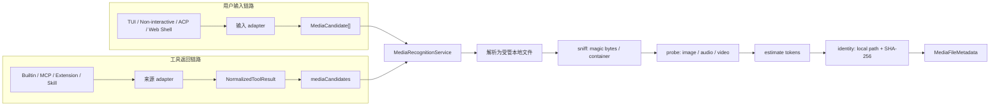

# 多模态文件识别与元数据提取架构设计

> **Transport revision (2026-08-12):** 识别、本地化、内容身份和 metadata
> 继续以本文为准；“投递层统一采用 DashScope”的范围已由
> [Provider-neutral Omni ingestion and multimodal delivery](./omni/2026-08-12-provider-neutral-multimodal-delivery.md)
> 扩展为 provider-neutral managed resource 加显式 delivery adapter。同一
> FileVersion 的识别结果不再是单一可变字段，而是按 detector、ingestion config
> 与 probe identity 区分的不可变 assertion；PATH-based probe 每次运行使用独立
> identity。持久 delivery group 记录历史 assertion 作为 provenance，但每次新的
> 物理投递必须对固定 bytes 生成当前 assertion，并仅用当前结果执行 guard。
>
> **Audit status (2026-08-14):** 审计已按请求停止。最后完成的三方审计是
> Round 26，结果不 clean；Revision 27 已记录拟议修订，但 Round 27 未形成有效的
> 三方结论。详见新设计的 [§12 Audit record](./omni/2026-08-12-provider-neutral-multimodal-delivery.md#12-audit-record)。

## 状态

- 状态：Draft
- 范围：Qwen Code 内部的多模态文件识别与元数据提取
- 基线：`origin/main`（包含 PR #7484 的工具结果统一处理链路）
- 后续设计：
  [Omni 多模态数据处理 Policy 编排架构设计](./2026-07-29-omni-multimodal-policy-orchestration.md)、
  [Omni 多模态 Memory 架构设计](./2026-07-29-omni-multimodal-memory.md)、
  [Omni 受管媒体存储设计](./2026-07-30-omni-managed-media-storage.md)

## 1. 背景

Qwen Code 当前已经可以从多个入口接触媒体数据：用户可以附加本地文件，
ACP 可以传入 image、audio 或 resource，内置工具、MCP、Extension 和 Skill
也可能返回 inline data、本地路径、URL 或资源链接。

这些入口目前没有共享一套文件身份与元数据语义：

- 本地文件识别主要依赖文件名扩展名和声明的 MIME；
- MCP 的 image、audio 和 blob 主要信任返回方声明的 MIME，`resource_link`
  仍可能退化为文本；
- 工具结果虽然已经通过 PR #7484 汇入统一的 `FunctionResponse`
  处理点，但媒体引用尚未形成独立、结构化的候选集合；
- 图片尺寸提取、二进制 magic bytes 判断等能力散落在不同用途的工具函数中，
  还不能形成一致的音频、视频和图片元数据结果；
- URL、base64、data URI 和 bytes 没有先统一成本地文件再识别的共同规则。

因此，本设计在现有 Qwen Code 输入和工具执行链路上增加一个统一的
`MediaRecognitionService`。它只负责回答两个问题：

1. 一个显式提供的资源是否是图片、音频或视频；
2. 如果是，它的统一元数据和稳定内容身份是什么。

## 2. 目标与非目标

### 2.1 目标

- 支持本地路径、HTTP(S) URL、base64、data URI、bytes 和 MCP resource
  等明确结构化的资源表示；
- 不信任扩展名或声明 MIME，以文件内容作为最终类型判断依据；
- 将 URL 和内存数据在受控条件下落为 Qwen Code 管理的本地文件，之后统一走
  本地识别链路；
- 为图片、音频和视频输出统一的公共元数据与各模态技术元数据；
- 按统一、可追溯的公式，基于原始资源的技术 metadata 估算每个媒体资源进入
  模型时占用的 token 数；
- 以本地路径和内容哈希登记资源身份，并保留原始来源；
- 在用户输入和工具返回两条现有主链路中各设置一个逻辑识别触发点；
- 延续 PR #7484 的原则：各来源先归一化，再在公共漏斗中处理一次。
- 通过顶层 `omni.ingestion` 配置 URL 本地化、sniff 预算、probe 预算和模型可见
  metadata 投影；
- 为每次识别记录 resolved ingestion 配置哈希和 probe 后端信息，支持实验复现。

### 2.2 非目标

本文不设计：

- 文件是否能够上传给某个模型；
- 模型路由、Vision Bridge、媒体 payload 拼装或 provider 限制；
- 压缩、切分、抽帧、转码等预处理 policy；
- 衍生物管理和 memory；
- computation 调度；
- 面向第三方的通用媒体平台或新的独立产品。

识别结果以后可以被这些能力消费，但本设计不为它们预先引入抽象。
本文只定义 metadata 的模型可见字段投影，不负责把投影插入具体 Provider 请求。

## 3. 核心决策

### 3.1 一个服务，两处逻辑触发

识别器只有一个实现，位于 `packages/core`。调用它的逻辑时机只有两处：

1. **用户输入完成结构化归一化之后**：TUI、非交互模式、ACP、Web Shell
   等入口先把附件或明确资源引用转为 `MediaCandidate`，再统一识别；
2. **工具输出完成统一归一化之后**：内置工具、MCP、Extension 和 Skill
   先汇入同一个 normalized tool result，再对其中的 `mediaCandidates`
   统一识别。唯一例外是内部 `fixed_policy` 调用：它的结果由发起调用的 policy
   orchestrator 独占消费，在同一个“Tool 输出完成后”逻辑时机复用识别服务，但不再
   进入公共 Tool result 漏斗，因此不构成第三个触发点。

“两处触发”指逻辑边界，不要求所有客户端共享同一个物理函数。各客户端可以有
自己的输入适配代码，但不得复制 sniff、probe 或 hash 逻辑。

### 3.2 不在每种工具结果里分别识别

工具适配器只承担结构转换：把明确类型的媒体块、媒体 artifact 或资源链接提取为
`MediaCandidate`。它不判断 magic bytes、不运行 ffprobe，也不递归扫描任意对象。

统一工具结果增加媒体候选旁路：

```ts
interface NormalizedToolResult {
  responseParts: Part[];
  mediaCandidates: MediaCandidate[];
}
```

公共调度链路在工具输出归一化完成后只处理一次：

```ts
const normalized = normalizeToolResult(toolResult);

if (normalized.mediaCandidates.length > 0) {
  await mediaRecognitionService.recognizeAll(normalized.mediaCandidates);
}
```

上述公共链路处理 model/client/普通 Tool 结果；`executionOrigin = fixed_policy` 在进入
该链路前由 owning orchestrator 截获，避免相同 policy artifact 被识别两次。

这不是“逐个理解每种工具结构”。Builtin、MCP、Extension 和 Skill
只需在各自现有的 adapter 边界保留结构化媒体引用，后续识别完全共用。

### 3.3 只处理显式候选，不扫描文本

以下内容可以成为候选：

- 用户显式附加或通过文件引用语法解析出的文件；
- ACP 的 image、audio、resource 和 file resource link；
- 工具返回的 inline data、file data、媒体 `ToolArtifact`；
- MCP 的 image、audio、blob、resource 和 `resource_link`；
- 其他入口已经明确标记为媒体资源的 path、URL、data URI 或 bytes。

以下内容不能自动成为候选：

- 普通对话文本中看起来像路径、URL 或 base64 的片段；
- 工具文本输出中偶然出现的路径或 URL；
- 为文件激活规则或 Skill 而产生的通用 `resultFilePaths` 全量列表；
- 任意工具返回对象的递归字段扫描结果。

媒体生产者应通过已有 artifact、typed part 或显式媒体引用表达资源；不能表达时，
只在对应 adapter 增加结构映射，不把来源特例加入识别器。

### 3.4 内容证据优先

识别结果同时保留三种类型证据：

- `declaredMimeType`：调用方或协议声明；
- `extensionMimeType`：文件名或 URL 后缀推断；
- `detectedMimeType`：magic bytes、容器签名和 probe 得到的结果。

最终 `mediaType` 和 `detectedMimeType` 以内容证据为准。声明 MIME 和扩展名只用于
提示、初筛与冲突告警，不能覆盖内容结果。

### 3.5 顶层 Omni ingestion 配置

识别与 metadata 配置直接放在 settings 顶层 `omni.ingestion`。它仍复用 Qwen
Code 现有 settings 加载和 workspace trust，不增加独立配置文件、环境变量、CLI
flag 或热更新。首版要求重启生效。

本文是 `omni.ingestion` 的权威契约；Policy 编排文档中的完整 Omni 示例只做同步
展示。Scope 沿用现有优先级
`SystemDefaults < User < trusted Workspace < System`，未信任 workspace 不参与
合并。普通对象和 scalar 按现有 deep merge/last-wins 处理，所有字段数组整体替换而
不做 concat 或 union；resolved ingestion config hash 在合并、默认值补齐和校验后
计算。

配置只开放会影响实验结果、资源成本或等待时间的参数。以下正确性和安全边界不是
开关：两个统一触发点、显式候选、内容证据优先、受管本地化、SHA-256 身份、
redirect 重新校验、`.part` 原子落盘和下载后重新识别。

```jsonc
{
  // Omni 实验配置的唯一顶层入口；不增加 omni.enabled。
  "omni": {
    // 配置结构版本，用于记录实验和兼容后续结构调整。
    "schemaVersion": 1,

    // 文件本地化、识别和 metadata 提取配置。
    "ingestion": {
      // 将 URL、base64 等资源转为本地受管文件的配置。
      "localization": {
        // HTTP(S) URL 的预检和下载配置。
        "url": {
          // 超过该大小时必须征求用户下载许可；默认 100 MiB，只允许调低。
          "approvalThresholdBytes": 104857600,
          // URL 预检最多读取的响应前缀，用于初步判断 magic bytes。
          "preflightBytes": 65536,
          // HEAD 或 Range 预检的超时时间。
          "preflightTimeoutMs": 30000,
          // 用户许可后，完整文件下载允许的最长时间。
          "downloadTimeoutMs": 600000,
          // URL 下载最多允许的重定向次数；每一跳都会重新安全检查。
          "maxRedirects": 5,
        },
        // base64、data URI 和直接 bytes 输入的本地化配置。
        "inline": {
          // 允许解码并落盘的最大二进制大小；超限返回 resource_limit。
          "maxDecodedBytes": 104857600,
        },
      },

      // 文件内容类型识别配置。
      "recognition": {
        // sniff 阶段最多读取的本地文件字节数；不能改变内容证据优先原则。
        "sniffMaxReadBytes": 65536,
      },

      // Metadata 的 Harness 内部提取与模型可见字段配置。
      "metadata": {
        // Harness 内部完整 metadata 的提取配置。
        "extraction": {
          // 图片 probe 的资源控制配置。
          "image": {
            // 图片尺寸、方向和动图信息提取的最长执行时间。
            "timeoutMs": 10000,
          },
          // 音频 ffprobe 配置。
          "audio": {
            // 单个音频 probe 的最长执行时间。
            "timeoutMs": 30000,
            // ffprobe probesize；null 表示使用 ffprobe 默认值。
            "probeSizeBytes": null,
            // ffprobe analyzeduration；null 表示使用 ffprobe 默认值。
            "analyzeDurationUs": null,
          },
          // 视频 ffprobe 配置。
          "video": {
            // 单个视频 probe 的最长执行时间。
            "timeoutMs": 30000,
            // ffprobe probesize；可实验探测精度与耗时的关系。
            "probeSizeBytes": null,
            // ffprobe analyzeduration；可调整流信息分析深度。
            "analyzeDurationUs": null,
          },
        },

        // 控制模型能够看到哪些 metadata，不影响 Harness 内部 policy 判断。
        "modelVisibility": {
          // 所有媒体都可以展示的公共字段。
          "commonFields": [
            "displayName",
            "sizeBytes",
            "detectedMimeType",
            "container",
            "probe.status",
            "tokenEstimate.status",
            "tokenEstimate.estimatedTokenCount",
            "tokenEstimate.method",
          ],
          // 图片可以展示的技术字段。
          "imageFields": [
            "width",
            "height",
            "orientation",
            "animated",
            "frameCount",
            "durationMs",
          ],
          // 音频文件级可以展示的字段。
          "audioFields": ["durationMs", "bitRate"],
          // 音频 stream 可以展示的字段。
          "audioStreamFields": [
            "codec",
            "sampleRateHz",
            "channels",
            "channelLayout",
            "bitRate",
          ],
          // 视频文件级可以展示的字段。
          "videoFields": ["durationMs", "bitRate"],
          // 视频 stream 可以展示的字段。
          "videoStreamFields": [
            "codec",
            "width",
            "height",
            "frameRate",
            "bitRate",
          ],
          // 是否向模型展示 MIME 冲突、probe 不完整等非致命警告。
          "includeWarnings": true,
          // 是否向模型展示内容哈希；内部身份计算不受该开关影响。
          "includeContentHash": false,
        },
      },
    },
  },
}
```

`metadata.extraction` 是 Harness 的完整事实，供 fixed policy 条件判断和后续 memory
使用；`metadata.modelVisibility` 只控制模型可见字段。字段数组可以为空以进行
metadata 消融实验，但不能导致内部字段停止提取。模型信封中的 `resourceId` 和
`mediaType` 始终存在；`localPath` 和鉴权 header 永不暴露。

## 4. 总体架构



服务内部是一条流水线，不拆成多个对外模块。URL 预检、sniff、probe 和 hash
可以用私有 helper 实现，但对调用方只暴露候选输入和识别结果。

## 5. 数据契约

### 5.1 媒体候选

```ts
type MediaLocator =
  | { kind: 'path'; path: string }
  | { kind: 'url'; url: string; headers?: Record<string, string> }
  | { kind: 'base64'; data: string }
  | { kind: 'data_uri'; dataUri: string }
  | { kind: 'bytes'; data: Uint8Array }
  | { kind: 'mcp_resource'; serverName: string; uri: string };

interface MediaCandidate {
  locator: MediaLocator;
  origin:
    | {
        kind: 'user';
        surface: 'tui' | 'non_interactive' | 'acp' | 'web_shell';
      }
    | { kind: 'tool'; toolName: string; callId: string }
    | {
        kind: 'policy';
        executionOrigin: 'fixed_policy';
        toolName: string;
        invocationId: string;
        policyId: string;
        stage: 'preprocessing' | 'transport_guard';
      }
    | {
        kind: 'policy';
        executionOrigin: 'model' | 'client';
        toolName: string;
        invocationId: string;
      };
  displayName?: string;
  declaredMimeType?: string;
  declaredSizeBytes?: number;
}
```

`MediaCandidate` 表示“值得交给识别器验证的显式资源”，不表示已经确认是媒体。
MCP adapter 必须在 `resource_link` 退化为文本之前保留它；HTTP(S) resource
可归一为 URL，必须通过 MCP server 读取的资源使用 `mcp_resource` locator。

### 5.2 识别结果

```ts
type MediaRecognitionResult =
  | { status: 'recognized'; resource: RecognizedMediaResource }
  | { status: 'not_media'; evidence: RecognitionEvidence }
  | {
      status: 'approval_required';
      request: LargeDownloadApproval;
    }
  | {
      status: 'failed';
      code:
        | 'invalid_source'
        | 'access_denied'
        | 'download_failed'
        | 'sniff_failed'
        | 'resource_limit';
      message: string;
    };

interface RecognizedMediaResource {
  resourceId: string;
  metadata: MediaFileMetadata;
}

interface RecognitionEvidence {
  declaredMimeType?: string;
  extensionMimeType?: string;
  detectedSignature?: string;
  reason: 'unsupported_signature';
}

interface LargeDownloadApproval {
  sourceUrl: string;
  displayName?: string;
  thresholdBytes: number;
  knownSizeBytes?: number;
  downloadedBytes: number;
  canResume: boolean;
}
```

`approval_required` 是正常控制流，不是错误。调用入口负责使用自身已有的确认机制
询问用户；同意后以 `largeDownloadApproved` 选项重试同一候选，服务复用可续传的
`.part`。没有交互能力的入口直接把该状态返回给上层，不得静默下载。

### 5.3 公共元数据

```ts
interface MediaFileMetadata {
  schemaVersion: 1;
  ingestionConfigHash: string;
  mediaType: 'image' | 'audio' | 'video';
  displayName?: string;
  sizeBytes: number;
  declaredMimeType?: string;
  extensionMimeType?: string;
  detectedMimeType: string;
  container?: string;
  identity: {
    algorithm: 'sha256';
    contentHash: string;
    localPath: string;
  };
  source: {
    originalKind: MediaLocator['kind'];
    originalRef?: string;
    finalUrl?: string;
    etag?: string;
    lastModified?: string;
  };
  probe: {
    status: 'complete' | 'partial' | 'unavailable' | 'failed';
    backend?: string;
    backendVersion?: string;
    timeoutMs: number;
    probeSizeBytes?: number;
    analyzeDurationUs?: number;
    message?: string;
  };
  tokenEstimate: MediaTokenEstimate;
  metrics: MediaMetrics;
  technical: ImageMetadata | AudioMetadata | VideoMetadata;
  warnings: MediaRecognitionWarning[];
}

interface MediaRecognitionWarning {
  code:
    | 'declared_mime_mismatch'
    | 'extension_mime_mismatch'
    | 'probe_incomplete';
  message: string;
}

interface MediaTokenEstimate {
  status: 'estimated' | 'unavailable';
  estimatedTokenCount?: number;
  method?: 'dashscope_audio_7tps_v1' | 'dashscope_visual_32x32x2_v1';
  inputs?:
    | {
        mediaType: 'audio';
        durationMs: number;
        tokensPerSecond: 7;
      }
    | {
        mediaType: 'image' | 'video';
        width: number;
        height: number;
        frameCount: number;
        patchSize: 32;
        mergeFactor: 2;
      };
  unavailableReason?: string;
}

interface MediaMetrics {
  durationMs?: number;
  width?: number;
  height?: number;
  maxWidth?: number;
  maxHeight?: number;
  frameRate?: number;
  frameCount?: number;
  bitRate?: number;
  sampleRateHz?: number;
  channels?: number;
}
```

公共字段保证上层不必先理解来源格式。`resourceId` 是后续 policy 和模型引用资源
的 opaque 标识；真实本地路径只在 Harness 内解析。`originalRef` 不保存 base64、
data URI 正文或鉴权 header，只保存可安全展示的路径、URL 或 resource URI。

`ingestionConfigHash`、probe backend、版本和实际参数用于区分不同实验条件。图片
probe 不使用 `probeSizeBytes` 或 `analyzeDurationUs` 时省略对应字段。

### 5.4 各模态技术元数据

初版字段集合如下：

```ts
interface ImageMetadata {
  kind: 'image';
  width?: number;
  height?: number;
  orientation?: number;
  colorSpace?: string;
  hasAlpha?: boolean;
  animated: boolean;
  frameCount?: number;
  loopCount?: number;
  durationMs?: number;
}

interface AudioStreamMetadata {
  index: number;
  isDefault?: boolean;
  codec?: string;
  sampleRateHz?: number;
  channels?: number;
  channelLayout?: string;
  bitRate?: number;
  durationMs?: number;
}

interface AudioMetadata {
  kind: 'audio';
  durationMs?: number;
  bitRate?: number;
  streams: AudioStreamMetadata[];
}

interface VideoStreamMetadata {
  index: number;
  isDefault?: boolean;
  codec?: string;
  width?: number;
  height?: number;
  frameRate?: number;
  bitRate?: number;
  durationMs?: number;
}

interface VideoMetadata {
  kind: 'video';
  durationMs?: number;
  bitRate?: number;
  videoStreams: VideoStreamMetadata[];
  audioStreams: AudioStreamMetadata[];
}
```

GIF、APNG、animated WebP 等仍归类为 `image`，通过 `animated`、
`frameCount` 和可获取的 `durationMs` 表达动态属性，不提升为 video。

`metrics` 是 fixed policy 条件引擎使用的稳定扁平字段，不要求条件解析器理解 stream
数组。图片直接使用图片 metadata；音频和视频的 primary stream 优先选择
`isDefault = true`，否则选择 index 最小的 stream。视频 `width`、`height` 和
`frameRate` 来自 primary video stream，`maxWidth` 和 `maxHeight` 是所有视频流的
最大值；音频 `sampleRateHz` 和 `channels` 来自 primary audio stream。文件级
duration/bitrate 优先使用容器值，缺失时再使用 primary stream 值。所有选择规则
固定并写入测试，不能随 ffprobe 输出顺序变化。

## 6. 识别流程

### 6.1 来源解析与本地化

不同 locator 先解析成受管本地文件：

- `path`：经过现有路径访问控制，确认是可读取的普通文件；
- `url`：先执行有上限的远端预检，确认可能是多模态资源后再下载；
- `base64`、`data_uri`、`bytes`：显式解码并写入受管临时文件；decoded bytes
  超过 `omni.ingestion.localization.inline.maxDecodedBytes` 时返回
  `failed/resource_limit`；
- `mcp_resource`：通过产生该引用的 MCP server 读取，得到 bytes 或 URL 后
  进入对应分支。

临时文件先写 `.part`，成功后原子重命名。解析结束后，后续步骤只接收本地路径，
不再区分最初来源。

### 6.2 sniff

sniff 最多读取 `omni.ingestion.recognition.sniffMaxReadBytes`，并在预算内读取容器
索引所需的少量区域，用 magic bytes 和容器签名判断：

- 是否属于 image、audio 或 video；
- 精确 MIME 和容器；
- 声明 MIME、扩展名与内容是否冲突。

sniff 不以文件扩展名作为最终结论。如果内容不属于支持的三种媒体，返回
`not_media`；如果文件无法访问或内容损坏到无法判断，返回 `failed`。

### 6.3 probe

sniff 确认媒体类型后运行对应 probe：

- 图片使用现有 `sharp` 能力提取尺寸、方向、色彩、alpha 和动图信息；
- 音频和视频通过一个内部 probe 接口调用 `ffprobe`，再把容器与 stream 输出
  归一为本设计的数据结构；
- 图片、音频和视频分别使用 `omni.ingestion.metadata.extraction` 中的 timeout；
- 音频和视频可以显式设置 `probeSizeBytes` 和 `analyzeDurationUs`，`null` 表示不向
  ffprobe 传入对应参数；
- **`ffmpeg`/`ffprobe` 是本实验分支的硬性运行依赖**：启动时检测二进制可用性并
  记录版本，缺失时直接启动失败并给出安装指引，不提供无 ffprobe 的降级运行模式。
  `probe.status = unavailable` 仅保留用于表达单个文件的探测器异常，不再表示
  "环境缺少 ffprobe"；
- probe 部分字段失败时返回 `partial`，不能抹掉已经由 sniff 确认的类型。

### 6.4 Token 估算

识别服务在技术 metadata 完成后生成 `tokenEstimate`。估算完全以**发送给模型的
原始媒体资源本身**为依据，不考虑 Provider 服务端的 resize、抽帧或其他预处理；
这也是 URL 资源统一下载到本地的原因之一——本地文件就是估算与投递的唯一事实。
初版采用需求方指定的 DashScope 估算方式，并统一向上取整：

```text
audioTokens = ceil(durationMs / 1000 * 7)

visualTokens = ceil(width * height * frameCount / (32 * 32 * 2))
```

其中：

- 音频固定按每秒 7 tokens 估算；
- 静态图片使用 visual 公式且 `frameCount = 1`；
- animated image 使用 metadata 中的实际 `frameCount`；
- 视频的 `width`、`height` 来自 primary video stream；`frameCount` 优先使用
  容器/stream 声明的总帧数，缺失时按 `ceil(durationMs / 1000 * frameRate)` 推导；
- 每个 policy 衍生物重新进入识别链路后，按衍生物自己的技术 metadata 重新估算，
  不继承原资源的数值。

原始长视频的估算值会显著大于 Provider 实际计费 token（服务端会抽帧），这是
有意的保守上界：估算的用途是驱动 fixed policy 条件（"资源太大 → 先处理"），
而不是复现 Provider 账单。估算方法带版本号（`method` 字段），后续如需引入
服务端口径的第二套估算，可作为新 method 并存，不覆盖本方法。

如果 `durationMs`、`width`、`height` 或 `frameRate`/`frameCount` 等必需字段缺失，
返回 `status = unavailable` 并记录原因；不允许用猜测值填充。

`resource.estimatedTokenCount` 条件字段直接读取
`tokenEstimate.estimatedTokenCount`，它是唯一的估算值存放位置，不在 `metrics`
中重复投影。它是有公式版本和输入依据的估算值，不等于 Provider 最终返回的实际
token usage。

### 6.5 identity 登记

服务在读取或下载文件时流式计算 SHA-256；无法与 sniff/probe 共用读取过程时，
再单独顺序读取一次。最终身份锚点是：

```text
localPath + sha256(content)
```

路径、URL、mtime、size、ETag 和 Last-Modified 都可能变化，只能作为快速校验或
来源信息，不能替代内容哈希。相同内容可以来自多个位置；内容哈希相同表示相同
文件版本，来源记录仍分别保留。

识别成功后为当前 Harness 资源登记 opaque `resourceId`。该 ID 供后续 policy 和
模型 Tool 引用，不替代 `localPath + contentHash` 的内部身份锚点。

## 7. URL 规则与可配置许可边界

URL 是唯一需要在"尚未形成完整本地文件"时先判断是否值得下载的来源。

即使投递层统一采用 DashScope 官方临时上传（见 Policy 编排设计 §10.3），外部
URL 也**不透传给模型**，仍然必须先下载本地化。原因是本地字节是全链路的唯一
事实源：

1. 技术 metadata 依赖完整本地文件（MP4 moov atom 常在文件尾，远程 Range 探测
   不可靠）；
2. token 估算完全基于原始资源的技术 metadata；
3. policy 加工（裁剪、抽帧、音轨提取）必须操作本地字节；
4. 完整 SHA-256 身份与 Memory 版本判断需要全部字节；
5. oss URL 48h 过期后的重传字节只能来自本地对象库；
6. 外部 URL 可能缺失 `Content-Length`/`Content-Type`、带鉴权或内容漂移，服务端
   拉取不可靠且实验不可复现；受管上传 URL 则始终可用。

### 7.1 有界预检

服务先执行 HEAD；如果服务端不支持，再执行带 Range 的有界 GET。预检最多读取
`omni.ingestion.localization.url.preflightBytes`，并服从 `preflightTimeoutMs`，
不把完整响应留在内存中，并尽量使用 `Accept-Encoding: identity`。记录：

- `Content-Length`；
- `Content-Type`；
- `Content-Disposition`；
- `ETag`、`Last-Modified`；
- redirect 后的 final URL；
- 前缀 magic bytes。

预检阶段仍以 magic bytes 为主要证据。HTTP `Content-Type` 只作为声明信息。
如果前缀能确认是非媒体，返回 `not_media`；如果证据不足，返回
`failed/sniff_failed`。两种情况都不为了“试一试”而下载完整文件。

### 7.2 大小许可

许可阈值来自：

```text
omni.ingestion.localization.url.approvalThresholdBytes
```

默认值是 `100 MiB = 100 * 1024 * 1024 bytes`。为保持此前“超过 100 MiB 必须
询问”的边界，实验配置可以调低但不能调高。

- `Content-Length > approvalThresholdBytes`：在完整下载前返回
  `approval_required`；
- `Content-Length <= approvalThresholdBytes` 或缺失，但继续写入将使文件超过该
  阈值：在写入超限字节前暂停并返回 `approval_required`；
- 用户拒绝：删除 `.part`，不产生本地资源；
- 用户同意：从中断位置继续；服务端不支持 Range 时重新下载；
- 整个过程按实际写入字节计数，不能只相信 HTTP header；
- redirect 最多进行 `maxRedirects` 次；每一跳重新执行访问控制和大小判断；
- 预检和完整下载分别使用配置中的超时，超时按下载失败返回。

用户授权的是当前资源的一次下载，不是对域名或后续所有大文件的永久授权。

### 7.3 下载后的权威识别

远端预检只用于决定是否本地化。下载完成后必须从本地文件重新执行完整的
sniff、probe 和 hash，最终 metadata 不直接采用预检结论。

## 8. 两条现有链路的接入

### 8.1 用户输入链路

各输入面保留自己的语法与协议解析，在完成结构化解析后输出候选：

| 当前入口           | adapter 责任                                        | 统一触发位置            |
| ------------------ | --------------------------------------------------- | ----------------------- |
| TUI 附件与 `@file` | 将已解析出的真实文件引用变为 path candidate         | `@` 命令解析完成后      |
| 非交互输入         | 将 `readManyFiles` 已解析出的显式文件变为 candidate | 文件输入归一化完成后    |
| ACP                | 保留 image、audio、resource 和 resource link 的结构 | `#resolvePrompt` 完成后 |
| Web Shell          | 将上传控件或协议层的显式附件变为 candidate          | 请求输入归一化完成后    |

入口不得对整段 prompt 做 URL/base64 猜测。普通文本保持普通文本。

### 8.2 工具返回链路

PR #7484 已经让内置工具、MCP 和 Extension 的模型可见结果先归一化为
response parts，再由共享 helper 处理。Core scheduler 与 ACP `Session.runTool()`
各有物理调用点，但都处理模型 ToolCall 的同一个逻辑结果边界。文件识别沿用这个
架构：

1. 各来源 adapter 在既有转换过程中，同时产出 `mediaCandidates`；
2. Core scheduler 与 ACP `Session.runTool()` 都在 normalized tool result
   形成后调用同一个识别 helper；
3. `fixed_policy` 由 owning orchestrator 在同一 Tool 输出逻辑边界消费并调用该
   helper，不再进入上述公共漏斗；
4. model/client MediaPolicyTool 的原始 producer artifacts 由公共漏斗中的 policy
   bridge 分支转换为候选，不再由通用 artifact adapter 重复提取；hook artifacts
   仍按普通显式候选处理；
5. 候选为空时直接跳过，不运行 sniff/probe；
6. 识别结果登记为 `RecognizedMediaResource`，同时生成配置控制的模型可见 metadata
   投影；
7. 本文不改变媒体 `responseParts` 如何序列化给 Provider，后续由 policy 编排和
   delivery 设计消费该资源与投影。

具体来源映射：

| 来源      | 候选来源                                      | 不能做的事                            |
| --------- | --------------------------------------------- | ------------------------------------- |
| Builtin   | 明确媒体 artifact、typed part                 | 枚举所有 `resultFilePaths` 并逐个识别 |
| MCP       | image、audio、blob、resource、`resource_link` | 先把 link 变成文本再从文本反推        |
| Extension | 统一 tool result 中的 typed part 或 artifact  | 在 extension 分支复制识别器           |
| Skill     | Skill/工具显式发布的媒体 artifact             | 扫描 Skill Markdown 中的任意链接      |

现有 `processToolResultImages` 仍承担 Vision Bridge 的既有职责。文件识别与它共享
“归一化后统一处理”的位置，但不能混入其模型上传或图像转写逻辑。

### 8.3 Metadata extraction 与 model visibility

每个识别入口都只生成一份完整内部 metadata。`metadata.modelVisibility` 从该事实对象生成
模型可见投影，不反向控制 probe：

- model visibility 字段数组为空时，只隐藏模型 metadata，不关闭内部提取；
- fixed policy 始终读取完整内部 metadata；
- probe 或 token 估算所需字段不可得时保留对应状态，供 Fixed Policy condition
  产生 `unavailable`；
- `resourceId` 和 `mediaType` 始终保留在模型可见资源信封；
- `localPath` 和鉴权 header 不允许进入 model visibility；
- 首版 `source` 只用于内部 provenance，不提供 source visibility 配置；
- 新 policy artifact 重新进入识别服务后，使用同一套 model visibility 配置。

## 9. 失败语义

| 场景                               | 结果                                        |
| ---------------------------------- | ------------------------------------------- |
| 候选内容不是图片、音频或视频       | `not_media`                                 |
| 文件不存在、权限拒绝、不是普通文件 | `failed`                                    |
| URL 预检确认不是媒体               | `not_media`，不完整下载                     |
| URL 预检证据不足                   | `failed/sniff_failed`，不完整下载           |
| URL 已知或实际大小超过配置许可阈值 | `approval_required`                         |
| 用户拒绝大文件下载                 | 终止并清理 `.part`                          |
| inline decoded bytes 超过配置上限  | `failed/resource_limit`                     |
| sniff 成功、probe 不可用           | `recognized` + `probe.status = unavailable` |
| sniff 成功、probe 只得到部分字段   | `recognized` + `probe.status = partial`     |
| probe 超过配置 timeout             | 保留身份，probe 标为 partial 或 unavailable |
| 声明 MIME/扩展名与内容不一致       | 采用 detected MIME，并记录 warning          |
| 同一候选被多个入口重复提交         | 允许按内容哈希复用识别结果                  |

单个候选失败不应让同批其他候选丢失结果。`recognizeAll` 保持输入顺序，并为每个
候选返回独立状态。

## 10. 安全与资源约束

- 复用 Qwen Code 现有的文件访问、workspace trust、网络访问和用户确认机制；
- 只读取普通文件，不读取 device、FIFO 或 socket；
- URL 每次 redirect 后重新校验目标，不允许通过 redirect 绕过网络规则；
- 鉴权 header 仅用于当前读取，不写入 metadata、日志或内容身份；
- base64、data URI 和 bytes 只接受结构化字段，不尝试从任意文本中提取；
- 解码、预检和下载均使用流式或有界缓冲，禁止把大文件整体复制到内存；
- 临时文件只能在成功原子重命名后暴露，失败和拒绝路径清理 `.part`；
- 内容哈希缓存若后续实现，只能用 size、mtime、inode 等作为命中提示，命中失效后
  必须重新计算，不能把可变属性当成稳定身份。

## 11. 与当前代码的对应关系

本设计是对现有链路的收敛，不新建平行产品：

- `packages/core/src/utils/fileUtils.ts` 当前的路径解析、`FileType` 和本地内容读取
  继续作为文件入口，但媒体最终类型从扩展名/MIME 判断迁移到统一 sniff；
- `packages/cli/src/ui/components/InputPrompt.tsx` 与
  `packages/cli/src/ui/hooks/atCommandProcessor.ts` 保留 TUI/非交互输入语法，
  只在解析完成后产生候选；
- `packages/cli/src/acp-integration/session/Session.ts` 保留 ACP 协议解析，
  避免 resource link 在识别前丢失结构；
- `packages/core/src/tools/mcp-tool.ts` 和 `mcp-resource-content.ts` 负责把 MCP
  typed content 转为候选，不再把声明 MIME 当作识别结论；
- `packages/core/src/tools/tools.ts` 的 `ToolArtifact` 是工具显式媒体资源的主要
  承载方式；通用 `resultFilePaths` 继续服务原有文件规则，不被扩大为媒体扫描器；
- `packages/cli/src/config/settingsSchema.ts` 和 `packages/cli/src/config/config.ts`
  加载顶层 `omni.ingestion`，执行专用结构与范围校验后传入 Core `Config`；
- `packages/core/src/config/config.ts` 保存不可变的 normalized Omni 配置并提供只读
  getter；识别结果记录 resolved ingestion config hash；
- `packages/core/src/core/coreToolScheduler.ts` 中 `convertToFunctionResponse`
  之后，以及 ACP `Session.runTool()` 形成 response parts 之后，是同一逻辑触发点在
  两条执行链路中的物理接入位置；二者必须调用同一个识别 helper；
- `packages/core/src/services/visionBridge` 保持既有职责，不承载通用文件识别。

识别成功后的固定 policy、模型 Tool、衍生物回流与 DashScope 投递由
[Omni 多模态数据处理 Policy 编排架构设计](./2026-07-29-omni-multimodal-policy-orchestration.md)
继续定义。

建议把新服务放在：

```text
packages/core/src/services/media-recognition/
```

目录内部可以按 locator 解析、sniff 和 probe 组织私有文件，但只对外导出服务、
候选类型和结果类型，避免形成多个需要调用方自行编排的模块。

## 12. 可验证性与验收标准

### 12.1 统一识别

- 同一媒体分别以 path、URL、base64、data URI 和 bytes 输入，最终
  `mediaType`、`detectedMimeType`、技术元数据和 SHA-256 一致；
- 将图片改成错误扩展名并声明错误 MIME，仍按 magic bytes 识别，并产生冲突告警；
- GIF/APNG/animated WebP 返回 `mediaType = image` 且 `animated = true`；
- 普通文本文件和伪装成媒体的文件返回 `not_media`。

### 12.2 触发点

- TUI、非交互、ACP 的显式媒体输入均在输入归一化后进入同一个服务；
- Builtin、MCP、Extension 和 Skill 的显式媒体结果均在
  normalized tool result 形成后进入同一个服务；
- 候选为空的工具结果不运行 sniff 或 probe；
- 工具文本中出现 URL、路径或 base64 时不触发识别；
- MCP `resource_link` 在退化为文本前被保留为结构化候选；
- 不通过 `resultFilePaths` 扫描工具产生的所有文件。

### 12.3 URL 与大文件

- 默认配置下，已知 101 MiB 的媒体 URL 在完整下载前请求一次用户许可；
- 将许可阈值调低后，下载行为使用新阈值且 resolved config hash 发生变化；
- 缺少或伪报 `Content-Length` 的响应在继续写入将超过配置阈值时暂停并请求许可；
- 拒绝后 `.part` 被清理；允许后可继续，Range 不可用时能安全重启；
- 非媒体 URL 只进行有界预检，不完整下载；
- redirect 后重新执行安全和大小检查；
- 下载结果使用本地完整文件重新 sniff/probe/hash。

### 12.4 配置与 metadata 投影

- inline decoded bytes 超过 `maxDecodedBytes` 时返回 `failed/resource_limit`；
- sniff 读取不超过 `sniffMaxReadBytes`；
- probe 使用配置的 timeout、probeSizeBytes 和 analyzeDurationUs，并记录实际值；
- 音频 10 秒的 `estimatedTokenCount` 为 70；
- 静态图片和视频严格按原始资源技术 metadata 及 `32 * 32 * 2` 公式向上取整；
- 视频缺失容器总帧数时按 `duration * frameRate` 推导 frameCount；
- 缺少 duration/width/height/frameRate 等必需字段时 token estimate 标为
  unavailable，不伪造数值；
- `estimatedTokenCount` 只存在于 `tokenEstimate` 一处，`metrics` 不重复投影；
- model visibility allowlist 为空时，fixed policy 可用的内部 metadata 不减少；
- `resourceId` 和 `mediaType` 始终可见，`localPath` 和鉴权 header 始终不可见；
- 不支持的 model visibility 字段、非法超时和高于 100 MiB 的下载许可阈值在启动时失败。
- scope 合并时 model visibility 字段数组整体替换，未信任 workspace 的 ingestion 配置不
  生效。

### 12.5 降级

- 启动时缺少 `ffmpeg`/`ffprobe` 直接启动失败并给出明确报错，不进入无 probe 的
  降级运行；
- 单个损坏媒体的 probe 失败不影响同批其他候选；
- 无交互入口遇到大文件时返回 `approval_required`，不自行授权。

## 13. 待实现阶段确认的细节

以下问题不影响本架构边界，在进入实现计划时再确定：

- 初版完整支持的 image/audio/video magic bytes 与容器矩阵；
- `ffmpeg`/`ffprobe` 的具体分发方式（系统依赖 + 启动检查，或随实验分支捆绑
  `ffmpeg-static` 一类静态二进制）；两种方式都必须满足"缺失即启动失败"；
- 内容哈希与 probe 结果的缓存实现。

受管本地文件的目录布局、staging/quarantine、保留周期和垃圾回收由
[Omni 受管媒体存储设计](./2026-07-30-omni-managed-media-storage.md) 单独定义。

这些选择不得改变已经确定的约束：**显式候选、统一漏斗、内容证据优先、基于
原始资源的可追溯 token 估算，以及内部 metadata 与模型可见字段分离**。
