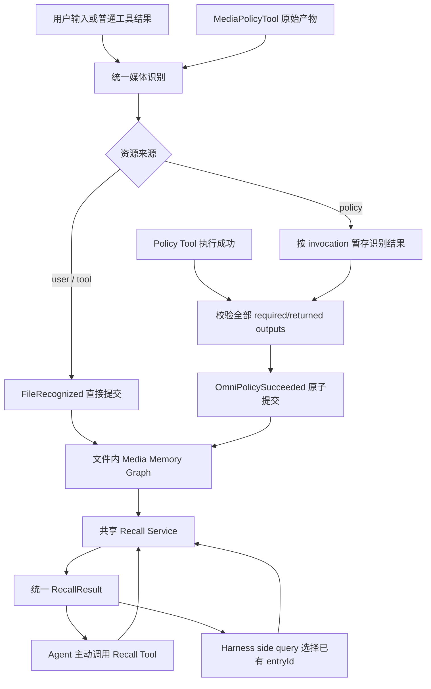

# Omni 多模态 Memory 架构设计

> **Storage-lifecycle revision (2026-08-12):** 本文的三层 File 身份、两个
> collection trigger 与 read-only recall 约束继续有效；Provider-neutral v2 的
> bytes liveness 由
> [Provider-neutral Omni ingestion and multimodal delivery](./omni/2026-08-12-provider-neutral-multimodal-delivery.md)
> 扩展。conversation sidecar、active session/in-flight lease 与独立 best-effort
> access journal 取代本文“任意 active Memory 记录永久 pin artifact bytes”的规则。
> 无 root 且超过 retention 的 backing 可回收并标为 `missing`，但 metadata、lineage
> 与两个语义写入触发点保持不变；recall 不因 access journal 写入失败而改变结果。
> FileVersion 仍表示字节身份；同一字节在 detector/config/probe 升级后的识别结果
> 由版本化 recognition assertion 表示，并仍在 FileRecognized 事务内提交，不增加
> 第三个 collection trigger。File 的 current pointer 是
> `(FileVersion, recognitionAssertion)` 原子对；历史 assertion 仅作 provenance，
> runtime verdict 不会由 recall 写入 Memory。
> Conversation byte roots 归属于 group-level adoption record，而不是可独立于
> sidecar/chat 提交的 per-object row；adopting 与 durable group 都是 GC roots，
> group correction/tombstone 才能整体释放。
> Group 删除先转为不含 root 的 authenticated deleting row，以保留 sidecar
> locator/digest/file identity；fork owner 是 add-if-absent，不能移走 source
> conversation 的 owner/root。Sidecar 的 HMAC ID 与认证 envelope 绑定
> conversation generation；旧 generation 的合法 sidecar 不能被新会话采用。
>
> **Audit status (2026-08-14):** 审计已按请求停止。最后完成的三方审计是
> Round 26，结果不 clean；Revision 27 已记录拟议修订，但 Round 27 未形成有效的
> 三方结论。详见新设计的 [§12 Audit record](./omni/2026-08-12-provider-neutral-multimodal-delivery.md#12-audit-record)。

## 状态

- 状态：Draft
- 范围：Qwen Code 实验分支中的图片、音频、视频文件级 Memory
- 前置设计：
  [多模态文件识别与元数据提取架构设计](./2026-07-29-multimodal-file-recognition-and-metadata.md)、
  [Omni 多模态数据处理 Policy 编排架构设计](./2026-07-29-omni-multimodal-policy-orchestration.md)
- 配套设计：
  [Omni 受管媒体存储设计](./2026-07-30-omni-managed-media-storage.md)
- 基线：`origin/main`，核对至 `2ce9da85bd99`

## 1. 背景

文件识别阶段已经把用户输入、工具结果、URL、base64 和 bytes 归一为带有完整
SHA-256 与技术 metadata 的媒体资源；Policy 阶段又可以从这些资源产生音轨、切片、
关键帧、转写、OCR、caption 和 summary 等结果。

如果这些事实只存在于当前 Tool 返回或当前模型上下文中，后续调用无法稳定回答：

- 当前文件已经提取过哪些 metadata；
- 哪些衍生物来自哪个文件版本、哪个 policy 和哪段范围；
- 一段转写、OCR 或 summary 覆盖了文件的哪些部分；
- 当前问题是否已有可复用结果，还是仍需调用某个 policy；
- 原文件发生变化后，哪些旧结果已经不应默认召回。

因此，本设计在现有 Qwen Code 识别服务、Policy Tool 和请求构造链路上增加一个
文件级的结构化 Memory。它不是新的产品、独立平台或 Agent 自主记忆系统；它只把
Harness 已经确定的文件事实和成功 policy 结果组织成可追溯、可召回的文件内图。

## 2. 目标与非目标

### 2.1 目标

- 只在两个确定的 Harness 生命周期边界收集 Memory：`FileRecognized` 与
  `OmniPolicySucceeded`；
- 建立文件、文件版本、policy 执行、媒体衍生物和文本结果之间的文件内关联；
- 保留来源、完整内容哈希、处理参数、作用范围、覆盖度和 producer lineage；
- 对成功 policy 的全部有效输出进行原子登记，不留下半套可召回结果；
- 支持 Agent 主动调用 Tool 召回，以及 Harness 通过 side query 被动召回；
- 两种召回模式复用同一查询服务和返回协议，并通过 `omni.memory.recall.mode`
  切换；
- 默认只召回当前文件版本的记录，文件变化后自动隔离旧版本结果；
- 允许后续 policy 直接使用召回到的既有媒体衍生物，而不向模型暴露真实本地路径；
- 记录 resolved Omni 配置、Tool 版本和最终参数，支持实验复现与训练数据追溯。

### 2.2 非目标

初版不设计：

- `MediaTurnCompleted` 或其他轮次结束后的总结触发；
- `MediaTurnTrace`，以及“模型在本轮实际看过什么”的完整轨迹；
- 从主 Agent 最终回答中抽取结论并写入 Memory；
- 允许 Agent 通过 Tool 直接创建、修改或删除 Memory；
- Agent 驱动的 memory extraction、dream 或 consolidation；
- 跨文件语义关联、相似文件合并或全库内容搜索；
- `/learn` command 的任何接入；
- computation 调度；
- 具体存储后端、长期保留周期和垃圾回收实现。

本设计中的 side query 只选择已经存在的记录，不能生成新结论并写回 Memory。

## 3. 核心决策

### 3.1 初版只有两个收集触发点

初版只允许以下两类事实进入媒体 Memory：

1. `FileRecognized`：统一识别器已经确认媒体类型、计算完整 SHA-256，并产出可用的
   文件 metadata；
2. `OmniPolicySucceeded`：一个 MediaPolicyTool 已成功执行，所有返回产物已经完成
   descriptor、路径、类型、内容和 lineage 校验。

这里的“触发点”是语义生命周期边界，不要求新增全局 EventBus。实现可以是识别服务
和 policy orchestrator 对同一个 `MediaMemoryService` 的显式方法调用：

```ts
await mediaMemory.recordFileRecognized(payload);
await mediaMemory.commitPolicySucceeded(payload);
```

这样可以沿用现有调用链、事务和错误传播，不建立另一套异步消息平台。

### 3.2 Harness 独占写入，Agent 只读

Memory 的写入事实必须来自可验证的 Harness 事件，而不是模型判断：

- Agent 可以调用 MediaPolicyTool；Tool 成功后由 Harness 触发
  `OmniPolicySucceeded`，间接增加 Memory；
- Agent 可以调用召回 Tool 读取既有记录；
- Agent 不能提交任意文本让 Memory 保存；
- side query 只能返回候选记录 ID，不能生成新 Memory 条目；
- 主 Agent 的回答、推理或猜测不自动进入 Memory。

因此，初版不需要 `MediaTurnTrace`。只有未来要保存“本轮采用了哪些证据、模型形成了
什么结论”时，才需要引入轮次级 trace 和第三个收集触发点。

### 3.3 初版只建立文件内图

每个原始文件形成一个独立 root graph。它的 metadata、policy 执行、衍生媒体和文本
结果都挂在这个 root 下；初版不在两个 root file 之间建边。

即使两个文件的完整 SHA-256 相同，也只能复用底层识别或 policy 缓存，不能合并
它们的 `fileId` 或来源关系。这样可以保留“用户从哪里得到这个文件、在哪个上下文中
使用它”的独立事实，避免内容相同但权限、来源或语义不同的资源被错误混为一体。

### 3.4 文件身份与内容版本分离

`fileId` 表示一个逻辑文件，`fileVersionId` 表示该逻辑文件的一份确定字节内容。

初版只在以下场景确认是同一个逻辑文件：

- 上游携带已知的稳定 `fileRef`，或者同一 project 内再次出现相同来源类型和规范化
  locator（例如同一个本地路径或同一个 URL）；
- URL、base64 或 bytes 本地化过程显式把来源和受管本地文件登记为同一资源；
- policy 产物通过 `parentRef`、`rootFileId` 和 `producedBy` 明确建立 lineage；
- 同一受管资源在当前系统内被再次解析，且携带既有持久引用。

不同路径、不同 URL，或没有稳定 locator/lineage 的独立工具结果，即使名称、大小、
ETag 或 SHA-256 相同，也作为另一个 `File` 处理。locator 只确定逻辑 File，不能证明
其内容版本没有变化。

在已经确认的同一 `fileId` 内，只有完整文件 SHA-256 相同才能确认是同一版本：

- SHA-256 相同：复用现有 `FileVersion`；
- SHA-256 不同：创建新版本，并把它设为当前版本；
- URL、文件名、大小、mtime、ETag、声明 MIME 和部分哈希都不能单独证明版本相同。

### 3.5 Metadata 是版本属性，不强制拆成节点

技术 metadata 直接保存在 `FileVersion` 上即可。只有具有独立来源、范围或 producer
语义的 policy 结果才成为独立节点。这样既能查询宽高、时长、流信息和 probe 状态，
又不会把每个标量字段膨胀成图节点。

## 4. 总体架构



写链路只由两个触发点驱动。主动召回和 side-query 召回是读链路，不构成新的收集
触发点。

## 5. 文件内逻辑数据模型

### 5.1 概念图

```text
File
  └── FileVersion
        ├── technical metadata
        ├── PolicyExecution
        │     ├── final arguments / input scope / config hash
        │     └── output references
        ├── DerivedMedia (另一个带 lineage 的 File/FileVersion)
        │     └── subsequent PolicyExecution
        └── PolicyResult
              ├── transcript
              ├── OCR
              ├── caption
              └── summary
```

媒体衍生物在物理模型中仍使用 `File + FileVersion`，从而复用统一识别、版本和
metadata 契约；`DerivedMedia` 只是它在父文件图中的角色。文本结果使用
`PolicyResult`，不伪装成媒体文件。

### 5.2 持久 ID 与 session resourceId

当前 Policy 设计中的 `resourceId` 是会话内 opaque handle，用于让模型调用 Tool，
不能作为跨 session 的持久主键。Memory 使用独立 ID：

```ts
type MediaFileId = string;
type MediaFileVersionId = string;
type MediaMemoryEntryId = string;
type PolicyExecutionId = string;
```

召回某个仍可访问的媒体文件或衍生物时，Harness 把持久 `fileVersionId` 重新绑定到
当前 session 的 `MediaResourceRegistry`，再返回新的或已存在的 `resourceId`。
模型只看到 `resourceId` 和持久 evidence ref，不看到本地路径。

### 5.3 File 与 FileVersion

以下接口是逻辑契约，不预先绑定 SQLite、JSON 或其他存储格式：

```ts
interface MediaFileRecord {
  fileId: MediaFileId;
  rootFileId: MediaFileId;
  origin: 'user' | 'tool' | 'policy';
  currentVersionId: MediaFileVersionId;
  createdAt: string;
}

interface MediaFileVersionRecord {
  fileVersionId: MediaFileVersionId;
  fileId: MediaFileId;
  sha256: string;
  mediaType: 'image' | 'audio' | 'video';
  metadata: MediaFileMetadata;
  source: MediaSourceProvenance;
  recognition: {
    ingestionConfigHash: string;
    detectorVersion: string;
    probeBackend?: string;
    probeStatus: 'complete' | 'partial' | 'unavailable';
  };
  parentVersionId?: MediaFileVersionId;
  producedByExecutionId?: PolicyExecutionId;
  createdAt: string;
}
```

`source` 保留来源类型和经过脱敏的 locator/protocol 信息。鉴权 header、token 和真实
受管路径不进入模型可见协议。

### 5.4 PolicyExecution

```ts
interface MediaPolicyExecutionRecord {
  executionId: PolicyExecutionId;
  invocationId: string;
  sourceVersionId: MediaFileVersionId;
  rootFileId: MediaFileId;
  executionOrigin:
    | {
        kind: 'fixed_policy';
        policyId: string;
        stage: 'preprocessing' | 'transport_guard';
      }
    | { kind: 'model' | 'client' };
  toolName: string;
  toolVersion: string;
  finalArguments: Record<string, unknown>;
  inputScope: MediaScope;
  omniConfigHash: string;
  outputRefs: MediaMemoryEntryId[];
  startedAt: string;
  completedAt: string;
}
```

Memory 记录的是通过 Tool 原生 schema、`defaultArguments`、`lockedArguments` 和
runtime resolver 之后的最终参数，不只记录用户原始配置或模型原始参数。

### 5.5 Scope、channel 与 coverage

同一结果必须明确“它描述了文件的哪一部分”和“覆盖了哪些信息通道”：

```ts
interface MediaScope {
  temporal?: { startMs: number; endMs: number };
  spatial?: {
    x: number;
    y: number;
    width: number;
    height: number;
    unit: 'normalized';
  };
  frameRange?: { start: number; end: number };
  streamIndexes?: number[];
  audioChannels?: number[];
}

type MediaChannel =
  | 'technical_metadata'
  | 'visual'
  | 'acoustic'
  | 'speech_text'
  | 'onscreen_text';

interface MediaCoverage {
  mode: 'complete' | 'continuous' | 'sampled' | 'partial' | 'summary';
  scope: MediaScope;
  sampleCount?: number;
  sampleRate?: number;
}
```

空 `MediaScope` 表示整个文件版本。示例：

- 完整音频转写：`speech_text + complete + {}`；
- 视频 15s 到 30s 的切片：`visual/acoustic + continuous + temporal`；
- 每 10 秒抽一帧：`visual + sampled + temporal + sampleRate`；
- 图片局部 OCR：`onscreen_text + partial + spatial`；
- 全片 summary：`visual/acoustic + summary + {}`。

### 5.6 统一 Policy 输出记录

Memory 不解析 `llmContent` 寻找结果。每个可持久化输出必须来自
`PolicyArtifactBatch`，并由 Tool descriptor 和 bridge 归一为：

```ts
interface NormalizedPolicyOutput {
  outputId: MediaMemoryEntryId;
  kind: 'derived_media' | 'policy_result';
  role: string;
  artifactRef?: {
    storage: 'managed' | 'workspace';
    managedId?: string;
    workspacePath?: string;
    mimeType: string;
    sizeBytes: number;
  };
  inlineText?: string;
  /** 有损/表达变换输出随附的处理与降质披露文本（见 Policy 设计 3.2）。 */
  disclosure?: string;
  scope: MediaScope;
  channels: MediaChannel[];
  coverage: MediaCoverage;
  parentVersionId: MediaFileVersionId;
  producedByExecutionId: PolicyExecutionId;
}
```

初版至少需要稳定表达这些 role：

- 文本结果：`transcript`、`ocr`、`caption`、`summary`；
- 媒体结果：`keyframe`、`clip`、`extracted_audio`；
- 其他实验产物由 MediaPolicyTool descriptor 声明稳定 role，不能依赖展示标题猜测。

媒体结果必须使用 artifact 引用并重新经过文件识别。小型 UTF-8 文本可以内联保存；
超过 `collection.maxInlineTextBytes` 的文本必须由 policy 输出受管文本 artifact。两者都
必须带 scope、channel、coverage 和 producer，不能只存一段无来源文本。

## 6. 收集触发点一：FileRecognized

### 6.1 触发条件

只有识别结果满足以下条件时才产生 `FileRecognized` payload：

- `mediaType` 已确定为 image、audio 或 video；
- 完整文件 SHA-256 已计算；
- 本地化和安全检查已完成；
- 公共 metadata 可用；
- probe 即使降级，也有明确的 `complete`、`partial` 或 `unavailable` 状态。

`not_media`、`approval_required`、下载失败、hash 失败或无法建立受控引用的候选不写入
Memory；它们只进入识别日志或用户可见错误。

### 6.2 写入内容

一次成功触发至少登记：

- 逻辑 `File` 和当前 `FileVersion`；
- 来源类型、显式 lineage 和本地化关系；
- 完整 SHA-256；
- detected/declared/extension MIME 与冲突告警；
- 图片、音频或视频技术 metadata；
- versioned token estimate、估算方法和实际估算输入；
- probe 状态、后端和 resolved ingestion config hash；
- 如果是 policy 媒体产物，则登记 parent、root 和 producer invocation。

### 6.3 普通来源直接提交

用户输入和普通工具结果没有等待中的 policy 事务。识别成功后可以立即、幂等地提交
File 与 FileVersion。相同事件重试不会生成重复版本。

### 6.4 Policy 媒体产物先暂存

Policy Tool 可能声明多个必须同时成立的输出。例如一次视频处理同时产生音轨、
关键帧和索引文件。不能在第一个媒体完成识别时就把它暴露为可召回节点，否则后续
必需产物失败会留下孤儿或半套结果。

因此，policy-origin 的 `FileRecognized` 结果按 `invocationId` 进入 staging：

```text
原始 Tool artifacts
  → 每个媒体 artifact 识别 / hash / probe
  → staging[invocationId]
  → 全部 descriptor 与文本产物校验
  → OmniPolicySucceeded 原子提交
```

staging 不是第三个触发点，也不是持久可召回图；它只是
`OmniPolicySucceeded` 事务的准备状态。

## 7. 收集触发点二：OmniPolicySucceeded

### 7.1 固定调用与模型调用共用

所有 policy 都以 Qwen Code Tool 实现；Fixed Policy 与 Transport Guard policy 也
通过 `execute` 运行。因此，固定调用、模型 ToolCall 和 direct client 调用在成功后
都进入同一个 `OmniPolicySucceeded` 逻辑边界，不为不同调用来源复制 Memory 写入代码。

### 7.2 成功门槛

只有同时满足以下条件才允许触发：

- Tool 返回没有 `error`，也没有取消或 timeout；
- descriptor 中所有 required output 已出现；
- 所有实际返回 output 都命中 descriptor；
- 所有 artifact 都通过 managed/workspace path、文件存在性和权限校验；
- 所有媒体 artifact 都已完成识别、完整 hash 和 probe 状态登记；
- 所有文本 artifact 都可读取、编码有效且未越过对应资源预算；
- 每个 output 的 role、scope、channels、coverage 和 producer 已归一化；
- source version、最终参数、execution origin、policy ID、stage 和配置哈希都已确定。

Policy 文档定义的 delivery `include` 与 `retain` 只决定是否进入当前模型输入，不决定
是否进入 Memory。一个成功 invocation 的有效输出都会被登记；`source: omit` 也只
影响投递，不删除 source 的 Memory。

### 7.3 原子提交内容

一次事务同时写入：

1. `PolicyExecution`；
2. source/root/version 关系；
3. staging 中已经识别的媒体衍生文件与版本；
4. transcript、OCR、caption、summary 等 policy-native 文本结果；
5. execution 到全部 output 的 producer edge；
6. parent、root、scope、channel、coverage 和配置 provenance。

任一步失败都不提交本 invocation 的 active Memory。已产生的文件按 Policy 设计进入
quarantine/cleanup；失败记录可以进入独立运行日志，但不能伪装成可召回 Memory。

### 7.4 禁止从模型文本反推产物

以下内容不能成为 `OmniPolicySucceeded` 的输出来源：

- `llmContent` 中提到的路径、URL 或摘要；
- `returnDisplay` 中的 Markdown；
- PostToolUse hook 追加的 artifact；
- 对任意返回对象进行递归扫描发现的字段。

Memory 只消费 Policy 文档定义的原始 `PolicyArtifactBatch`。这样能证明 producer，
也不会把 hook 或 UI 产物错误关联到 MediaPolicyTool。

## 8. 图关系与查询边界

初版需要支持以下关系：

| 关系              | 含义                                   |
| ----------------- | -------------------------------------- |
| `HAS_VERSION`     | File 拥有不可变 FileVersion            |
| `CURRENT_VERSION` | File 当前默认召回的版本                |
| `DERIVED_FROM`    | 衍生媒体版本来自某个父版本             |
| `PRODUCED_BY`     | 衍生媒体或 PolicyResult 由某次执行产生 |
| `EXECUTED_ON`     | PolicyExecution 的输入文件版本         |
| `HAS_OUTPUT`      | PolicyExecution 的结构化输出           |

所有遍历必须被 `rootFileId` 限制。查询一个文件可以沿 lineage 查看它的祖先、后代、
执行和结果，但不能自动跳到另一个 root graph。相同 hash 的缓存映射不是图关系。

## 9. Recall 设计

### 9.1 一个 Recall Service，两种触发方式

主动与被动召回共享：

- 同一个项目作用域和权限检查；
- 同一个 file/version 解析器；
- 同一个查询、过滤和预算逻辑；
- 同一个 `MediaMemoryRecallResult`；
- 同一个 current-version 默认规则；
- 同一个持久 fileVersion 到 session resourceId 的绑定器。

两者的差异仅在于谁发起查询：

- `active`：Agent 调用 `omni_recall_media_memory` Tool；
- `sideQuery`：Harness 在构造相关模型请求前运行 side query，自动选择已有记录。

配置 `mode` 用于实验切换。`active` 模式不自动注入，`sideQuery` 模式不向模型暴露
主动召回 Tool，避免一次实验同时混入两种策略。

### 9.2 主动召回

主动 Tool 最小输入包括：

```ts
interface MediaMemoryRecallRequest {
  resourceIds: string[];
  query: string;
  kinds?: Array<'metadata' | 'derived_media' | 'policy_result' | 'execution'>;
  roles?: string[];
  scope?: MediaScope;
  includeHistoricalVersions?: boolean;
  limit?: number;
}
```

`resourceIds` 必须属于当前 session 已授权资源。服务先解析为持久 file/version，再只在
对应 root graph 内查询。模型不能用任意路径、hash 或 fileId 扫描整个项目。

召回返回的可用媒体衍生物会绑定出当前 session 的 `resourceId`，Agent 随后可把它传给
另一个 MediaPolicyTool。召回本身不复制文件、不创建新 File，也不触发 policy。

#### 9.2.1 "按路径/内容 hash 查询"的一致解读

issue #8188 同一条验收项里写了"按路径/内容 hash 查询"与"返回中永不暴露真实本地路径"。
按本设计 §5.2/§15 的路径隔离不变量，二者的一致解读是**按调用方分层**：

| 调用方                                | 允许的入口              | 理由                                                                                                                                                                                                                |
| ------------------------------------- | ----------------------- | ------------------------------------------------------------------------------------------------------------------------------------------------------------------------------------------------------------------- |
| 模型（active Tool / passive selector) | 仅 session `resourceId` | 句柄是不可伪造的能力凭证：模型只能问本会话真的投递给它的媒体。放开路径入参会让媒体文件里的注入内容驱使模型探测任意路径，而召回返回的是转写正文——典型 confused-deputy 提权；即使 miss，"有/无记忆"本身也是存在性泄露 |
| Harness（受管管线内部)                | 路径 / 内容 hash        | 不经模型，无提权面。已由 `findBindingBySha256` 提供并被反应式降质阶梯使用                                                                                                                                           |

因此"系统能按路径/hash 找到记忆"这一能力是满足的，只是不向模型暴露。

代价与已知缺口：句柄只在投递时签发，而投递要求文件存在——所以在新 session 中，被
删除或移动的文件无法再获得句柄，其记忆暂时不可达。补法不是放开模型的路径入参，而是
在**授权层**补：让 `@` 引用一个"记忆里有、磁盘上没了"的文件也能凭记录的
`fileRef`+`sha256` 签发句柄（用户的 `@` 引用即授权）。留作后续阶段。

### 9.3 被动 side-query 召回

被动召回只处理当前请求已经显式引用并完成识别的文件。它不从普通文本猜路径，也不
跨文件搜索项目中的其他媒体。

流程为：

```text
当前请求的显式 resourceIds
  → 解析为当前 FileVersion
  → 从对应文件内图生成有界 candidate manifest
  → runSideQuery(JSON schema)
  → side query 只返回 candidate entryId
  → 校验 ID 必须属于 manifest
  → Harness 按统一协议物化结果并注入主模型请求
```

candidate manifest 可以包含 entry ID、kind、role、scope、channels、coverage、简短
description 和 producer 摘要，但不把原始媒体、完整大文本、本地路径或密钥发送给
selector。

side query 不允许返回自由文本结论，也不能要求创建新条目。未知 ID、跨 root ID、
超出 `maxSelectedEntries` 或 schema 不合法的结果整体拒绝。

为了保证实验条件确定，选中结果必须在相关主模型请求发送前完成注入；不能在模型已
开始回答后再把迟到结果塞进后续 ToolResult turn。超时或 selector 失败时本次按空召回
继续，并记录明确的失败原因和配置哈希。

### 9.4 最小返回协议

```ts
interface MediaMemoryRecallResult {
  status: 'hit' | 'partial' | 'miss';
  files: Array<{
    fileId: MediaFileId;
    fileVersionId: MediaFileVersionId;
    current: boolean;
    mediaType: 'image' | 'audio' | 'video';
  }>;
  entries: Array<{
    entryId: MediaMemoryEntryId;
    kind: 'metadata' | 'derived_media' | 'policy_result' | 'execution';
    role?: string;
    content?: string;
    /** content 是 memory 所存文本的前缀时为 true（被 recall.maxTextChars 截断）。
     * coverage 讲的是"处理过什么"，所以一条被截断的转写仍合法地报 complete；
     * 没有这个标记，模型看到前缀 + 完整覆盖 + 无 gap，就会对它从未读到的后半段
     * 音频作答。默认值本身就会撞上：maxTextChars（24000 字符）小于收集期界
     * （65536 字节），任何长转写都在读取期被切。 */
    contentTruncated?: boolean;
    resourceId?: string;
    scope: MediaScope;
    channels: MediaChannel[];
    coverage: MediaCoverage;
    evidenceRefs: Array<{
      fileVersionId: MediaFileVersionId;
      executionId?: PolicyExecutionId;
    }>;
    provenance: {
      toolName?: string;
      toolVersion?: string;
      policyId?: string;
      stage?: 'preprocessing' | 'transport_guard';
      omniConfigHash: string;
    };
  }>;
  gaps: Array<{
    scope: MediaScope;
    channels: MediaChannel[];
    reason: 'not_processed' | 'partial_coverage' | 'artifact_unavailable';
  }>;
  nextPolicyActions?: Array<{
    toolName: string;
    resourceId: string;
    arguments: Record<string, unknown>;
    reason: string;
  }>;
  /** 匹配总数，仅当条目预算把列表截短时出现。没有它，一页被截断的结果与穷尽结果
   * 无法区分：真实审计在 limit: 12 下读到 6 段 clip，就得出"从未抽过关键帧"，
   * 而库里有 72 条——读的人没有说谎，它只是无从知道自己看到的是一页。 */
  matchedEntries?: number;
}
```

`partial` 表示已有相关结果，但请求范围或 channel 仍存在缺口。`nextPolicyActions` 只
提供可执行建议，由 Agent 决定是否调用；side query 和 Recall Service 都不能自动执行
这些 Tool。

### 9.5 Current-version-first

默认查询只返回当前 `FileVersion` 及其派生图。历史版本记录可以为 provenance 保留，
但只有主动请求或配置允许时才进入候选。

如果当前版本没有结果、旧版本有结果，默认返回 `miss` 或带明确历史提示的 `partial`，
不能把旧结果当成当前文件事实。这样文件更新后不会静默复用失效 transcript、OCR、
关键帧或 summary。

## 10. 顶层 Omni 配置

Memory 配置直接放在现有实验配置的 `omni.memory` 下，不并入 Qwen Code 当前的
managed auto-memory 配置，也不增加独立配置文件、环境变量或 CLI flag。初版没有
`omni.enabled` 或 `memory.enabled`；收集始终按两个确定触发点执行，默认 recall 模式
为 `active`。

以下 JSONC 展示初版需要的细粒度实验控制。每个字段都在 scope 合并、默认补齐和
校验后进入 resolved Omni config hash。

```jsonc
{
  // Omni 实验配置的唯一顶层入口；不增加总开关。
  "omni": {
    // 配置结构版本，用于记录实验并兼容后续 schema 调整。
    "schemaVersion": 1,

    // 文件级多模态 Memory 的收集与召回配置。
    "memory": {
      // 两个固定收集触发点共用的持久内容边界。
      "collection": {
        // 文本不超过该字节数时可直接存入 PolicyResult；更大的文本必须由
        // policy 产出受管 text artifact，不能静默截断后保存。
        "maxInlineTextBytes": 65536,
      },

      // 控制已收集记录如何暴露给模型，不影响底层事实收集。
      "recall": {
        // active 由 Agent 调用 Recall Tool；sideQuery 由 Harness 自动选择并注入。
        "mode": "active",

        // 单次统一 RecallResult 最多返回的 entry 数量。
        "maxEntries": 12,

        // 单次返回给主模型的文本内容总字符预算；超过时按确定顺序裁剪并报告 gap。
        "maxTextChars": 24000,

        // 默认允许召回的节点类型；高优先级 settings scope 对该数组整体替换。
        "kinds": ["metadata", "derived_media", "policy_result", "execution"],

        // false 表示默认只召回当前文件版本；true 用于显式历史对照实验。
        "includeHistoricalVersions": false,

        // Agent 主动调用 Recall Tool 时的额外资源边界。
        "active": {
          // 一次 ToolCall 最多查询多少个当前 session 资源，防止无界批量扫描。
          "maxFilesPerCall": 8,
        },

        // mode 为 sideQuery 时使用的 selector 参数。
        "sideQuery": {
          // null 表示沿用 runSideQuery 的 fast-model 优先选择；字符串可固定实验模型。
          "model": null,

          // selector 必须在该时间内返回；超时后本次空召回并继续主请求。
          "timeoutMs": 30000,

          // 发送给 selector 的候选 entry 上限；候选仍只来自当前显式文件。
          "maxCandidateEntries": 100,

          // selector 最多可以返回的合法 entryId 数量，且不能大于 maxEntries。
          "maxSelectedEntries": 12,

          // side query 的最大请求尝试次数；1 最便于控制实验成本和延迟。
          "maxAttempts": 1,
        },
      },
    },
  },
}
```

### 10.1 配置校验

启动时至少校验：

- `mode` 只能为 `active` 或 `sideQuery`；
- 所有数量、文本和 timeout 预算必须为正数；
- `maxSelectedEntries <= maxEntries <= maxCandidateEntries`；
- `kinds` 只能包含已知节点类型且不能为空；
- `model` 为 `null` 或非空字符串；
- 未信任 workspace 的 Omni 配置不参与合并；
- 数组整体替换，不做 concat 或 union。

与前两篇设计一致，scope 优先级为
`SystemDefaults < User < trusted Workspace < System`。无效配置启动失败，不静默回退到
另一种召回模式。

## 11. 版本、失效与复用

### 11.1 文件变化

同一逻辑文件得到不同完整 SHA-256 时：

1. 创建新的不可变 `FileVersion`；
2. 更新 `CURRENT_VERSION`；
3. 旧版本及其执行和产物保留为历史 provenance；
4. 默认 recall 排除旧版本；
5. 新版本必须重新运行需要的 policy，不能只按路径或名称复用旧结果。

### 11.2 不合并不同文件

两个独立 `fileId` 即使 SHA-256 一致，也保留两个 File 和两套来源。允许复用的是：

- sniff/probe/hash 的计算缓存；
- 确定性 policy 结果及其底层 artifact；
- 受管文件的物理存储块。

复用时每个 File 仍保留自己的 root、source 和 lineage 引用，不能把一个文件的
权限或 provenance 泄漏给另一个文件。

#### 11.2.1 三层身份：为什么"不合并"与"不重复建节点"并不矛盾

issue #8188 的验收项写作"内容相同的两个文件不重复建节点（复用同一底层身份)",
与本节标题字面冲突。二者实际落在**不同层**，实现同时满足：

| 层          | 键                 | 承载                                                            | 满足                                     |
| ----------- | ------------------ | --------------------------------------------------------------- | ---------------------------------------- |
| Content     | `sha256`           | 物理对象（`objects/sha256/…`)、可复用的计算结果与 policy 派生物 | #8188「不重复建节点（复用同一底层身份)」 |
| File        | locator            | `CURRENT_VERSION`、source、provenance、权限/workspace 归属      | 本节「不合并不同文件」、#8189 版本隔离   |
| FileVersion | `(fileId, sha256)` | 二者的连接，不可变                                              | 11.1 版本链                              |

关键约束：**身份键不能是内容**。若 `fileId = hash(content)`，则"内容变化"直接
产生另一个 `fileId`,11.1 的版本链（新 FileVersion → 更新 `CURRENT_VERSION` →
旧版本留作历史 → 默认排除旧版本）与 #8189 验收项"修改文件内容后旧衍生物不默认
召回"**都无法表达**——编辑文件会凭空出现无关节点，改回去则历史成环。因此逻辑文件
必须由跨内容稳定的 locator 定键。

于是"不重复付费"由 content 层承担：同字节的第二个文件不重跑任何工具（见 11.3 的
复用键与 `reusedExecutionId`),不重复存储字节（共享同一 `objects/` 对象），只额外
写几行属于自己的廉价元数据行。

派生物同样按 `(rootFileId, objectPath)` 定键而非仅 `objectPath`:两个 root 派生出
逐字节相同的产物时，若共享一个 File 节点，该节点的 `rootFileId` 只能属于先创建者,
既泄漏 lineage 又让第二个 root 的有界遍历（§8)够不到它。

### 11.3 Policy 结果复用键

可复用 policy 结果的复用键必须与 11.2 的跨文件复用语义一致，因此以**内容身份**
而不是 File 作用域的 version ID 为基础：

```text
source content sha256
+ tool name and implementation version
+ tool settings hash（影响结果的 Tool 级配置）
+ schema 校验后的 final arguments
+ input scope
+ resolved Omni config hash 中影响结果的部分
```

`fileVersionId` 是 File 作用域的主键，两个独立 File 的 version ID 必然不同；如果
把它放进复用键，11.2 允许的跨文件确定性复用将永远无法命中。以 sha256 为键则
同一份字节在任何 File 中出现都能复用底层计算，同时每个 File 仍写入自己的
PolicyExecution 与 provenance（记录 cache hit 与 `reusedExecutionId`），不共享
图节点。

相同 `invocationId` 重放必须幂等；独立 cache hit 可以记录一次明确的
`reusedExecutionId`/cache-hit 运行事实，但不能复制 FileVersion 或 PolicyResult
节点。精确 cache key 的字段裁剪在实现计划中确定，不能牺牲上述 provenance。

## 12. 事务与失败语义

| 场景                                        | Memory 行为                                            |
| ------------------------------------------- | ------------------------------------------------------ |
| 普通文件识别成功                            | 幂等提交 File/FileVersion                              |
| probe 降级但类型、hash 和基础 metadata 可用 | 提交并记录 partial/unavailable                         |
| 下载拒绝、识别失败或非媒体                  | 不写 Memory，只记录运行状态                            |
| Policy Tool 返回 error、timeout 或取消      | 不触发 `OmniPolicySucceeded`                           |
| required output 缺失                        | 整个 invocation 不提交                                 |
| 返回 artifact 未命中 descriptor             | 整个 invocation 不提交                                 |
| 某个媒体 artifact 识别失败                  | 丢弃该 invocation 的全部 staging 结果                  |
| 文本 artifact 无法读取或编码非法            | 整个 invocation 不提交                                 |
| policy-origin staging 完成但进程中断        | 恢复时清理或重放，不对 recall 可见                     |
| 相同事件重复投递                            | 通过 event/invocation ID 幂等，不重复建节点            |
| side query 超时或返回非法 ID                | 本次空召回，主请求继续并记录原因                       |
| 主动 Recall Tool 参数或权限非法             | Tool 返回结构化错误，不扩大查询范围                    |
| backing artifact 已清理或不可读             | 返回 `artifact_unavailable` gap，不返回失效 resourceId |

## 13. 存储与作用域要求

初版逻辑 store 必须满足：

- 以 project/workspace 为隔离边界，不跨 workspace 自动召回；
- 对 `FileRecognized` 提供幂等 upsert；
- 对 `OmniPolicySucceeded` 提供多记录原子事务；
- 支持按 `fileId`、current `fileVersionId`、root、role、scope 和 channel 查询；
- active graph 记录不能引用 staging 或 quarantined artifact；
- 持久引用与真实路径分离，返回协议不泄漏受管目录；
- artifact 生命周期不得早于仍引用它的 active Memory 记录；
- 可以保留历史版本，但默认索引必须把它们与 current version 分开。

本文不提前选择 SQLite、JSONL 或其他后端。后端选择必须证明上述事务、索引和恢复
语义，而不是反过来改变已确定的数据边界。受管文件的物理目录布局、staging 与
quarantine 的落盘形式、保留周期和垃圾回收由
[Omni 受管媒体存储设计](./2026-07-30-omni-managed-media-storage.md) 定义；本节的
"artifact 生命周期不得早于 active Memory 记录"是该设计必须满足的强约束。

## 14. 与当前 Qwen Code 源码的对应关系

本设计是现有 Qwen Code 能力上的增量开发：

- 文件识别设计新增的 `MediaRecognitionService` 在成功结果形成后调用
  `recordFileRecognized`；policy-origin 结果携带 invocation ID 进入 staging；
- Policy 设计新增的 `PolicyArtifactBatch` 是 `OmniPolicySucceeded` 唯一产物入口，
  不能消费合并后的 hook artifacts；
- `packages/core/src/tools/tools.ts` 当前 `ToolArtifact` 继续承载文件、URL、managed
  ID、MIME、大小和 metadata；Memory bridge 在 descriptor 约束下把它归一为
  `NormalizedPolicyOutput`；
- `packages/core/src/core/turn.ts` 当前 `ToolCallResponseInfo.artifacts` 只有合并后语义，
  继续按 Policy 设计增加仅供内部使用的 `policyArtifacts` channel；
- `packages/core/src/core/coreToolScheduler.ts` 在原始 Tool 成功、hook artifact 合并前
  捕获 policy 输出；固定调用和模型调用都复用这一成功边界；
- `packages/cli/src/acp-integration/session/Session.ts` 在 ACP 自己的 Tool executor 中
  捕获相同 batch，再调用同一个 core Memory service；
- `packages/core/src/utils/sideQuery.ts#runSideQuery()` 已支持 JSON schema、超时信号、
  model override 和结果校验，可以直接作为 passive selector 基础；
- `packages/core/src/memory/relevanceSelector.ts` 已验证“给模型有界 manifest、只允许
  返回 manifest 内 ID”的 selector 模式，可以复用该约束方式，但不能复用其 Markdown
  文件数据模型；
- `packages/core/src/core/client.ts` 当前 managed auto-memory 已有 recall 取消、请求
  构造和 prompt 注入经验；媒体 side query 复用生命周期原则，但必须在关联主请求发送
  前完成，不能采用迟到后再注入 ToolResult turn 的机会式语义；
- `packages/cli/src/config/settingsSchema.ts`、`packages/cli/src/config/config.ts` 与
  `packages/core/src/config/config.ts` 继续加载顶层 `omni.memory` 并提供不可变 getter；
- 当前 `packages/core/src/memory/` 的 managed auto-memory 以 Markdown、Agent
  extraction/dream 和用户/项目主题文件为核心，不作为结构化 media graph 的存储格式，
  也不参与本设计写入。

建议把新增能力作为一个 Qwen Code Core service 放在：

```text
packages/core/src/services/media-memory/
```

目录内部可以包含 types、store、collector 和 recall，但对外只暴露一个
`MediaMemoryService` 以及 Recall Tool 所需的类型。它不是新的 daemon、MCP server、
进程、插件协议或独立配置系统。

## 15. 安全与权限

- 写入者只接受识别服务和 policy orchestrator 的 typed payload；
- Agent 与 side query 都没有写接口；
- active recall 只接受当前 session 已授权的 `resourceId`；
- side query 只处理当前请求显式引用的文件；
- project/workspace 隔离、workspace trust 和现有文件权限继续生效；
- 不向模型、selector、日志或 telemetry 暴露鉴权 header、token 或受管本地路径；
- 历史版本、quarantine 和已清理 artifact 不自动重新绑定为 session resource；
- 同 hash 缓存复用不能绕过来源权限和 workspace 隔离。

## 16. Observability 与实验复现

每次收集至少记录：

- 触发类型、event/invocation ID 和幂等结果；
- file/root/version ID 与 hash 的脱敏引用；
- source、parent、producer、tool、policy 和 execution origin；
- Tool 版本、final arguments hash、scope、channels 和 coverage；
- ingestion/processing/memory resolved config hash；
- staging、提交、回滚、cache hit 和 artifact availability 状态；
- 耗时、节点数、输出数和错误类别。

每次召回至少记录：

- mode、请求文件数、候选数、选中数、返回数；
- hit/partial/miss、gap 类型和历史版本过滤数量；
- selector model、timeout、attempts、耗时和失败原因；
- 注入文本字符数与绑定出的 session resource 数；
- resolved Omni config hash。

Telemetry 默认不记录原始媒体、transcript/OCR 正文、真实路径或完整 Tool 参数值；需要
复现时使用 hash 和本地结构化执行记录关联。

## 17. 验收标准

### 17.1 收集边界

- 用户、普通 Tool、URL 和 inline 媒体识别成功后只通过 `FileRecognized` 入库；
- 固定与模型 policy 成功后只通过 `OmniPolicySucceeded` 入库；
- 不存在 `MediaTurnCompleted`、Agent write Tool 或 final-answer extraction 写路径；
- `llmContent`、`returnDisplay` 和普通文本中的路径不会被解析为 Memory 产物；
- `/learn` 不出现在实现接入点中。

### 17.2 文件与版本

- 同一显式 fileRef、相同完整 SHA-256 重复识别不会产生重复版本；
- 同一 fileRef 内容改变后创建新版本，默认召回不返回旧结果；
- 两个独立来源即使完整 SHA-256 相同，也保留两个 file/root graph；
- URL 到受管本地文件的本地化 lineage 保持同一个 fileId；
- 名称、大小、mtime、ETag 或部分 hash 相同不能合并版本。

### 17.3 Policy 原子性

- 多输出 policy 只有全部 required/returned artifacts 校验通过才一次性入图；
- 任一媒体识别或文本读取失败时，不出现部分衍生物或孤立执行节点；
- include、retain 和 source omit 不改变事实收集结果；
- PostToolUse hook artifact 不会被登记为 policy 自身输出；
- 相同 invocation 重放幂等，cache hit 不复制结果节点。

### 17.4 主动召回

- `active` 模式只暴露 Recall Tool，不自动运行 side query；
- Tool 只能查询当前 session resource 对应的文件内图；
- 可用衍生媒体返回新的或复用的 session resourceId，不返回真实路径；
- status、entries、gaps、coverage、evidence 和 provenance 字段完整；
- Agent 不能通过 Recall Tool 写入或修改 Memory。

### 17.5 被动召回

- `sideQuery` 模式不暴露主动 Recall Tool；
- 候选只来自当前请求显式引用文件的 current-version graph；
- selector 只能返回 manifest 中的 entryId，非法或跨 root ID 整体拒绝；
- selector 不接收原始媒体、大文本或本地路径；
- 结果在相关主请求前注入；timeout 时空召回且不阻断主请求；
- side query 不创建任何新 File、PolicyResult 或 Agent conclusion。

### 17.6 配置与隔离

- `omni.memory` 没有 enabled 总开关；
- mode、预算、数组替换和 workspace trust 合并行为可验证；
- 不同 project/workspace 的 Memory 不会互相召回；
- 相同输入、配置、Tool 版本和参数可以从记录完整复现收集与召回条件。

## 18. 实现阶段仍需确定的细节

以下是实现方案选择，不改变本文已经确定的需求边界：

1. `File`、`FileVersion`、`PolicyExecution` 和 `PolicyResult` 的精确持久 schema 与
   schema migration 方式；
2. `NormalizedPolicyOutput.role` 的初版完整枚举及自定义 role 命名规则；
3. store 后端、索引布局、事务和崩溃恢复实现；
4. side-query candidate 的确定性预排序、description 生成和 token 预算；
5. 历史版本、孤立受管文件、quarantine 与 cache 的 retention/GC；
6. cache hit 是否单独保存轻量 execution 记录，以及 provenance 的精确引用方式。

这些选择不得改变已经确认的约束：**只有 FileRecognized 与
OmniPolicySucceeded 两个收集触发点、Harness 独占写入、文件内图、完整 SHA-256
版本判断、policy 原子提交、active/sideQuery 共用只读协议，以及默认只召回当前
版本**。
