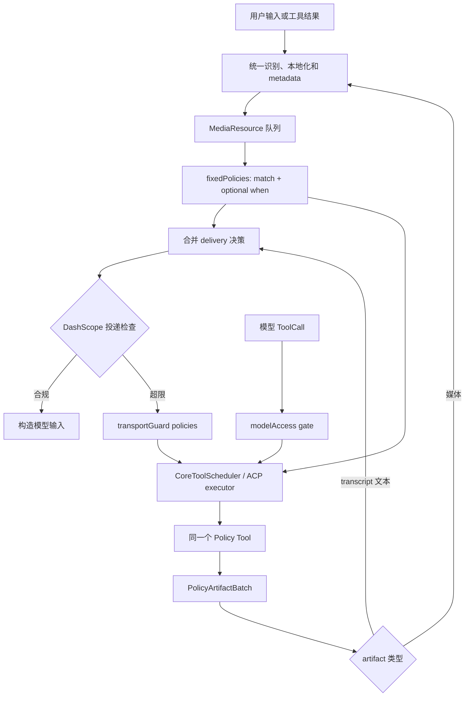

# Omni 多模态数据处理 Policy 编排架构设计

> **Transport revision (2026-08-12):** 本文的 DashScope-only、统一 `oss://`
> 与禁止 inline 投递结论，只描述首个实现。多 Provider 的投递选择、adapter-specific
> transport guard 和 final validator 由
> [Provider-neutral Omni ingestion and multimodal delivery](./omni/2026-08-12-provider-neutral-multimodal-delivery.md)
> 扩展；本文的 Policy、disclosure、lineage 和受管产物约束继续有效。多产物、纯
> transcript 与 omission 会作为有序 delivery group 延迟物化，且依赖 `session.*`
> 的 Policy 必须使用实际消费该媒体的 provider request 上下文。模型/client Policy
> 的 source identity 与 output authority 由 scheduler-private execution context
> 传递，不再通过 `inputPath`/`outputDir` 反推；runtime-verdict recall 只允许
> session-only ephemeral Policy，持久结果要求显式 re-reference。每个
> policy-derived 持久 delivery item 单独引用 assertion-specific Policy use 和
> use-local output ID，再由 use ref 解析到不可变 execution-output ID；use 记录使用
> 区分 media、text/file、omission/disclosure 的有序 output ref，多
> Policy/guard 输出不能用一个 group-level use 或仅 entry-ID 列表覆盖。
> PolicyUse 是随 conversation/branch group 持久化和 tombstone 的 occurrence，
> 不是永久 computation fact；sidecar、Memory authority 与 append-only chat 之间
> 通过显式 adopting saga、幂等 owner key 和 chat record evidence 收敛。
> PolicyUse 的 pending/completed 形态是严格判别联合；持久 chat 已提交但 sidecar
> 缺失/损坏时记录 bounded unavailable correction，而会话文件删除由 chat 外部的
> durable delete intent 驱动，不能先删除唯一 tombstone evidence。
> Sidecar、raw/derived object root 与一个 group 内的全部 PolicyUse 通过同一个
> group-level adoption saga 原子进入 adopting/durable/unavailable 状态；单个
> PolicyUse owner 不能代表 raw-only 或 mixed group 的持久化边界。
> Fork/branch 对既有 use 只增加目标 owner，不替换来源 owner；删除将 durable
> group 原子转为不再 pin bytes、但保留 sidecar cleanup authority 的 deleting
> row，直到 unlink 与 parent fsync 完成。Fork 目标在 transcript、全部 group 和
> file-history 完成前保持 broker `fork-preparing`；transcript 先写入确定性的私有
> temp leaf 并 fsync file/parent，再 no-replace rename 到 final leaf、再次 fsync
> parent，proof 才从 planned 经 temp-published 进入 published，不会把 partial file
> 作为 active 会话暴露。
>
> **Audit status (2026-08-14):** 审计已按请求停止。最后完成的三方审计是
> Round 26，结果不 clean；Revision 27 已记录拟议修订，但 Round 27 未形成有效的
> 三方结论。详见新设计的 [§12 Audit record](./omni/2026-08-12-provider-neutral-multimodal-delivery.md#12-audit-record)。

## 状态

- 状态：Draft
- 范围：Qwen Code 实验分支中的图片、音频、视频 Harness 侧处理
- Provider：仅支持 DashScope OpenAI-compatible 路径
- 前置设计：
  [多模态文件识别与元数据提取架构设计](./2026-07-29-multimodal-file-recognition-and-metadata.md)
- 后续设计：
  [Omni 多模态 Memory 架构设计](./2026-07-29-omni-multimodal-memory.md)
- 配套设计：
  [Omni 受管媒体存储设计](./2026-07-30-omni-managed-media-storage.md)
- 基线：`origin/main`，核对至 `2ce9da85bd99`

## 1. 背景

本功能用于探索不同图片、音频和视频处理策略对多模态模型表现的影响，并为后续
长短视频、音频处理和训练数据生产寻找稳定策略。它不是一个独立产品，也不新增
Qwen Code 之外的平台或插件生命周期。

文件识别与 metadata 阶段已经把用户输入、工具结果、URL、base64 和 MCP 资源
归一为本地 `MediaResource`。本文从该结果继续，设计 Harness 如何自动执行固定
policy、如何把同一 policy 暴露为模型可调用 Tool、如何选择模型输入衍生物，以及
如何经官方临时上传通道投递媒体并在投递前强制满足上传通道限制。

本功能具有明确的实验属性：配置需要支持细粒度组合、消融和参数约束，并且每次
执行必须能够记录完整实验条件。本文不以合入 Qwen Code 主分支和长期配置兼容为
目标；分支、发布和最终交付方式留到整体 roadmap 阶段讨论。

## 2. 目标与非目标

### 2.1 目标

- 每个媒体处理 policy 只实现一次，并以现有 Qwen Code Tool 形态注册；
- 同一 Tool 同时支持 Harness 固定调用和 Agent 模型调用；
- 所有用户 fixed policy 使用同一策略集合；省略 `when` 表示无条件执行，配置
  `when` 表示按资源 metadata、token 估算或 session context 条件执行；
- 用户可以为每个 fixed policy 配置匹配范围、顺序、Tool 参数、失败行为和产物投递；
- 用户可以为每个模型可调用 Tool 配置描述、默认值、锁定值、参数约束和运行预算；
- policy 产物成为新的媒体资源，可以继续参与后续 Fixed Policy；
- 媒体统一经 DashScope 官方临时上传投递（oss:// URL），必须满足上传通道限制
  （单文件 ≤ 1GB 及模型时长档位）；不保留 inline 投递模式；
- 所有执行记录 policy ID、Tool、参数、资源 lineage 和 resolved Omni 配置哈希，支持
  实验复现及训练数据追溯；
- 复用 Qwen Code 现有 Tool registry、scheduler、ToolSearch、settings、artifact
  和工具结果公共漏斗。

### 2.2 非目标

本文不设计：

- 具体图片、音频和视频 policy 的完整产品清单；
- 多 Provider 兼容层；
- 跨 session media memory；
- computation 调度平台；
- 主分支合入、版本发布或兼容迁移策略。

### 2.3 硬性运行前提

作为实验分支，以下前提在启动时强制校验，不满足即启动失败：

- **`ffmpeg`/`ffprobe` 可用**：音频、视频类 policy Tool 和 probe 均依赖它们，
  不提供缺失时的降级运行（与识别设计一致）；
- **active model 已声明全模态能力**：实验中使用的模型必须在
  `contentGeneratorConfig.modalities` 中配置支持 image、audio 和 video。启动时
  校验该声明覆盖 Omni 可能投递的媒体类型；若运行期 converter 仍触发
  `unsupportedModalityPlaceholder`（编程错误或漏配），必须按投递失败记入执行
  记录并明确告知，不得让占位文本静默替换媒体。

## 3. 核心概念

### 3.1 Policy Tool

每个 policy 使用现有 `BaseDeclarativeTool + ToolInvocation` 实现。Tool 原生 schema
和业务校验是固定调用与模型调用共享的最终参数契约。

示例 Tool 包括：

- `omni_downsample_image`；
- `omni_extract_audio`；
- `omni_transcribe_audio`；
- `omni_extract_keyframes`；
- `omni_clip_video`。

Tool 名属于代码注册表，不等于用户配置的 policy ID。同一个 Tool 可以被多个 fixed
policy
以不同参数重复引用。

每个 Policy Tool 的可配置面固定分为两部分，设计任何 Tool 时都必须同时给出：

1. **调用参数 schema**（per-invocation）：单次执行的业务参数，如裁剪起止时间、
   压缩质量、目标分辨率。固定调用来自 configured policy 的 `arguments`，模型
   调用来自经过投影的 `parameterSchema`，两者最终都经过同一个 Tool 原生 schema
   校验；
2. **工具配置参数**（per-tool `settings`）：与单次调用无关的 Tool 级配置，如
   ASR/VL 后端模型与 endpoint、默认编码器、质量档位默认值、本地二进制路径。
   由 Tool 声明自己的 settings schema，启动时校验
   `omni.processing.policyTools.<tool>.settings`，运行时以只读形式注入 Tool。

调用远端模型的 policy（ASR、VL describe 等）的 backend 凭证沿用 Qwen Code 现有
model provider 凭证体系，`settings` 中只引用模型/endpoint 标识，不保存密钥。

### 3.2 处理披露是 Policy 输出的一部分

任何有损或改变媒体表达的 policy（压缩、降采样、抽帧、裁剪、转写等），其返回
内容必须同时包含两部分：**衍生产物本身** + **对本次处理与降质情况的文字介绍**。
披露是每个 Policy Tool 自己的输出义务，不是 Harness 的统一后置能力：

- Tool 在每个衍生 artifact 的 `metadata.omniDisclosure` 中提供披露文本，说明
  实际生效参数、原始与输出的关键差异（分辨率/时长/帧数/码率）、损失类型与
  未覆盖范围（例如"原图 6000x4000 已降采样至 2000x1333，文字细节可能不可读"、
  "从 3600s 视频按场景抽取 16 帧，非关键帧画面未覆盖"）；
- delivery 把 artifact 物化为媒体 Part 投递时，同时把披露文本作为紧邻的 text
  Part 投递，保证模型始终知道自己看到的是什么、丢了什么；
- 模型调用场景中，`llmContent` 本身就应承载同一份披露；
- 披露文本随 `NormalizedPolicyOutput` 进入 Memory，供后续召回时复述。

MediaPolicyTool descriptor 中声明为有损（`lossy: true`）的输出缺失
`omniDisclosure` 时，按产物校验失败处理。

### 3.3 Fixed Policy

Fixed Policy 是一次可配置的固定执行绑定：

```text
policyId + match + optional when + tool + arguments + output + failure behavior
```

例如：

```jsonc
{
  // 用户定义的 policyId。
  "extract-video-audio": {
    // 所有 fixed policies 中数字越大越先执行。
    "priority": 100,
    // 实际执行的 MediaPolicyTool 名。
    "tool": "omni_extract_audio",
  },
}
```

其中：

- `extract-video-audio` 是用户命名的 `policyId`；
- `omni_extract_audio` 是实际执行的 Tool；
- policy ID 在 `fixedPolicies` map 内全局唯一；
- policy ID 用于配置覆盖、日志、lineage、防循环和实验复现；
- `when` 省略时，对所有命中 `match` 的资源执行；存在时，只有条件成立才执行。

### 3.4 MediaResource

`MediaResource` 是单轮处理中的轻量执行对象，不是新的 artifact 平台：

```ts
interface MediaResource {
  resourceId: string;
  mediaType: 'image' | 'audio' | 'video';
  metadata: MediaFileMetadata;
  origin: 'user' | 'tool' | 'policy';
  parentResourceId?: string;
  rootResourceId: string;
  producedBy?:
    | {
        executionOrigin: 'fixed_policy';
        policyId: string;
        stage: 'preprocessing' | 'transport_guard';
        toolName: string;
        invocationId: string;
      }
    | {
        executionOrigin: 'model' | 'client';
        toolName: string;
        invocationId: string;
      };
  lineage: MediaLineageEntry[];
}
```

真实本地路径和内容哈希保留在 Harness 内部。模型只获得 opaque `resourceId`、媒体
类型以及经过配置投影的 metadata；模型调用 policy Tool 时使用 `resourceId`，由
Harness 解析到受管本地文件。

每个媒体 policy 输出形成不可变的新资源，非媒体 artifact 也不可原地覆盖输入。
原资源不会被覆盖，替换只发生在“是否进入模型输入候选”的投递层。

## 4. 总体架构



该结构包含两个闭环：

1. policy 产出的媒体 artifact 回到统一识别和 metadata 链路；
2. transport guard 产物回到 `fixedPolicies`，完成用户 policy 后再次检查
   是否可投递。

`transportGuard` 是模型投递边界的强制保护，不属于用户 `fixedPolicies` 的条件
调度。用户 policy 可以先把资源处理成合规衍生物；只有最终仍准备发送超限媒体时
才执行 transport policy。

## 5. 触发位置

### 5.1 用户资源

用户资源沿用文件识别设计中的统一入口：

```text
输入 adapter
  → 显式 MediaCandidate
  → 本地化
  → sniff / probe / hash
  → MediaResource
  → fixed policy orchestrator
  → 模型 Part
```

固定 policy 必须发生在 `processSingleFileContent` 将文件转成 `inlineData` 或按
当前 9.9/10 MiB 逻辑提前拒绝之前；Omni 媒体经识别后完全脱离现有 inline 转换
路径，由 Omni delivery 统一上传投递。TUI、non-interactive、ACP 和 Web Shell
只做入口适配，不复制 policy 编排器。

### 5.2 工具返回资源

工具结果遵循 PR #7484 已建立的公共漏斗原则：

- CoreToolScheduler 在统一工具结果形成后调用共享处理器；
- ACP `Session.runTool()` 在模型 ToolCall 的统一工具结果边界调用同一处理器；
- MCP、Extension、Skill 和内置 Tool 只负责把 typed media、resource link 或
  `ToolArtifact` 保留成显式候选；
- 不在每个 Tool 实现中分别扫描和识别媒体；
- MCP `resource_link` 必须在退化为普通文本前保留结构。

对 model/client 来源的 MediaPolicyTool，原始 producer artifacts 只通过
`PolicyArtifactBatch` 进入共享 bridge，并从通用 `artifacts → mediaCandidates` 适配
中排除；PostToolUse hook 产物仍按普通显式候选处理。这样同一 policy artifact 不会
同时走专用 output 语义和普通 Tool artifact 语义。

模型调用 policy Tool 后产生的 artifact 也经过该入口，因此仍可命中 Fixed Policy 和
transport guard。

## 6. Policy Tool 契约

### 6.1 输入

Policy Tool 的原生 schema 同时服务两种来源：

- 固定调用：orchestrator 只注入 `resourceId`，并从 configured policy 读取
  `arguments`；
- 模型调用：模型提交 `resourceId` 和允许控制的业务参数，Harness 合并默认值、
  校验锁定值与约束，再调用 Tool 原生校验。

固定配置不得自行指定本地输入路径，避免配置与实际候选脱节。模型也不能直接访问
受管临时路径。模型提交的 `resourceId` 必须解析到当前 session 已授权、且媒体类型
满足 Tool 输入契约的资源；Tool 在受信执行上下文中通过共享 MediaResourceResolver
把 ID 解析为本地路径。未知、跨 session 或已清理的 ID 在执行前返回参数错误。

固定配置使用从 Tool 原生 schema 删除 Harness-owned `resourceId` 后得到的
fixed-policy argument schema：启动时只用它校验 configured policy `arguments`；运行时 orchestrator
合并 `{ resourceId, ...arguments }` 后，再执行完整 Tool 原生 schema 与业务校验。
因此合法 fixed policy 不需要、也不能在 settings 中伪造 `resourceId`。

### 6.2 输出

Policy Tool 返回现有 `ToolResult`：

- `artifacts` 是衍生文件身份的权威输出；
- `llmContent` 是模型调用场景的简短事实结果，不承担衍生物发现；
- `returnDisplay` 用于 UI 进度和结果展示；
- `error` 表达 Tool 执行失败。

固定编排器不得解析 `llmContent` 寻找文件。每个媒体衍生物必须返回
`ToolArtifact`，随后由统一识别服务补齐 MIME、大小、内容哈希和技术 metadata，
再登记 parent/root/producer lineage。

Scheduler 现有 `ToolCallResponseInfo.artifacts` 会合并 Tool 自身和 PostToolUse hook
产物，无法证明 producer。为避免 hook artifact 冒充 policy 输出，本设计定义内部
`PolicyArtifactBatch`，只包含成功 MediaPolicyTool 的原始 `toolResult.artifacts` 及
tool/invocation/origin：Core Scheduler 通过新增的
`ToolCallResponseInfo.policyArtifacts` 保留这批原始产物；ACP `Session.runTool()` 在
PostToolUse hook artifact 合并或通知前直接捕获同一批原始产物。现有 `artifacts`
仍保留合并后的 UI/记录语义。共享 Omni bridge 只消费 `PolicyArtifactBatch`，并按
Tool 注册时的 output descriptor 校验。

Policy Tool 不直接决定自己是否进入当前模型上下文；该决定属于 fixed policy 的
`output` 或 `modelAccess.output` 配置。媒体 policy artifact 使用现有
`ToolArtifact.kind`，并可在
`metadata.omniRole` 中提供稳定的用途标识，例如 `transcript`、`keyframe` 或
`proxy`，供 delivery 精确选择。

首版 transcript 使用受管 `ToolArtifact` 文件表达：`kind: 'file'`、
`mimeType: 'text/plain'`、`metadata.omniRole: 'transcript'`。它不是
`MediaResource`，不进入媒体识别器；delivery planner 只在大小预算内读取 UTF-8
文本并物化为 text Part。越界、非法编码或读取失败均视为该 policy 产物失败。

### 6.3 Tool 标记

只有明确注册为 `MediaPolicyTool` 的 Tool 才能被固定编排器引用。该标记至少用于：

- 配置启动校验；
- 固定调用 permission bypass；
- Tool 输出契约校验；
- 模型可见性 gate；
- 阻止伪造执行来源调用 Shell、Edit 或普通 MCP Tool。

最小 descriptor 与 bridge batch 形态为：

```ts
interface MediaPolicyToolDescriptor {
  kind: 'media_policy';
  inputMediaTypes: Array<'image' | 'audio' | 'video'>;
  outputs: Array<{
    kind: ToolArtifactKind;
    role?: string;
    mimeTypes: string[];
    required: boolean;
    /** 有损/改变表达的输出必须随附 metadata.omniDisclosure 披露文本。 */
    lossy?: boolean;
  }>;
  /** Tool 级配置参数（settings）的 JSON schema；无配置项时省略。 */
  settingsSchema?: object;
}

interface PolicyArtifactBatch {
  toolName: string;
  invocationId: string;
  executionOrigin:
    | {
        kind: 'fixed_policy';
        policyId: string;
        stage: 'preprocessing' | 'transport_guard';
      }
    | { kind: 'model' | 'client' };
  artifacts: ToolArtifact[];
}
```

Descriptor 是代码注册事实，不由 configured policy、模型参数或 Tool 返回 metadata
动态修改。
`required` 表示成功 invocation 至少要产生一个匹配该描述的 artifact；所有返回
artifact 仍必须命中一个允许的输出描述并通过 managed storage/path 校验。

## 7. 固定调用执行路径

固定调用复用现有 `executeToolCall()` 和 `CoreToolScheduler`：

```text
FixedPolicyOrchestrator
  → ToolCallRequestInfo
  → executeToolCall(recordToolResult: false)
  → CoreToolScheduler
  → ToolInvocation.execute()
  → ToolResult
  → CoreToolScheduler captures raw policy artifacts
  → ToolCallResponseInfo.policyArtifacts
  → FixedPolicyOrchestrator
```

固定执行不会伪造 assistant `functionCall`，也不会把孤立 `functionResponse` 写入
模型历史。本文核对的 `origin/main@2ce9da85bd99` 基线中，
`ExecuteToolCallOptions.recordToolResult` 已存在；传 `false` 只关闭 chat recording，
schema 校验、timeout、取消、并发控制、hooks、telemetry、streaming output 和
artifact 汇总继续复用 Scheduler。

### 7.1 Execution origin

`ToolCallRequestInfo` 增加明确来源，不能复用语义含混的 `isClientInitiated`：

```ts
type ToolExecutionOrigin =
  | { kind: 'model' }
  | { kind: 'client' }
  | {
      kind: 'fixed_policy';
      policyId: string;
      stage: 'preprocessing' | 'transport_guard';
    };
```

该字段同时用于 permission bypass、模型可调用 gate、hooks、telemetry 和实验记录。
不能从现有 `isClientInitiated` 推断它：当前 AgentCore 的模型授权调用也可能设置
`isClientInitiated: true`。迁移时由每个受信构造点显式标记：Turn、AgentCore/subagent
和 ACP 模型 function call 标记 `model`，真实 direct/client API 标记 `client`，只有
内部 FixedPolicyOrchestrator 能标记 `fixed_policy`。兼容期缺少新字段的请求一律按
`model` fail closed 并记录诊断，不得因为旧布尔值升级权限；旧字段只继续服务原有
UI/调度语义。`fixed_policy` 不能从 Tool 参数、协议 payload 或模型输出反序列化。
首版对 MediaPolicyTool 的 `client` 调用使用与 `model` 相同的 `modelAccess` gate，
防止 direct tool API 绕过 fixed-only 限制；其 permission 行为仍沿用现有 client
路径。

### 7.2 固定调用跳过 permission

配置 fixed policy 代表用户已经授权它在受管资源上执行，因此固定调用：

- MediaPolicyTool factory 使用专用注册分支，跳过 `PermissionManager.isToolEnabled()`
  的注册前 gate，保证固定编排器能解析已配置 Tool；
- 跳过 PermissionManager deny/ask 计算；
- 跳过 Scheduler 执行前的 PermissionManager/legacy deny gate 以及后续完整 permission
  flow；
- 跳过确认 UI、PLAN/AUTO approval flow 和 `requiresUserInteraction`；
- 不允许模型伪造 `fixed_policy` 来源；
- 不允许 Fixed Policy 引用非 `MediaPolicyTool`；
- 输入资源必须由 orchestrator 注入；
- 输出必须位于 Omni 管理目录。

`tools.disabled` 仍是显式的 registry 禁用配置，不被固定调用绕过。如果 configured
policy
引用的 Policy Tool 同时出现在 `tools.disabled`，启动时作为配置冲突拒绝，而不是让
policy 在运行时悄悄消失。

专用注册只保证 fixed orchestrator 的内部可用性，不等于模型授权。Registry 的
model-visible view 仍同时应用 `modelAccess` 和现有 PermissionManager 可见性，
Scheduler 对 model/client origin 也继续执行完整 permission gate。

PreToolUse 和 PostToolUse hooks 仍执行。PreToolUse 返回 block，或任何 hook 结果
要求重新进入 ask/confirmation 时，固定调用都 fail closed，不弹确认框。当前
PreToolUse 协议不修改 Tool 参数；如果后续 Hook 协议增加 updated input，必须重新
执行 projected schema、Tool 原生 schema、resourceId 和受管输出边界校验。

固定调用不计入 Agent `maxToolCalls`，但计入独立 Omni execution budget。

### 7.3 固定调用结果的唯一归属

`fixed_policy` 的 `ToolResult` 由发起它的 FixedPolicyOrchestrator 独占消费：Scheduler
返回 `ToolCallResponseInfo`；orchestrator 只读取其中从原始 Tool 输出单独保留的
`policyArtifacts`，再按当前 invocation 的 MediaPolicyTool descriptor 校验受管
storage/path、允许类型和必需产物，缓冲后统一送入识别、lineage 与 delivery 流程。
该结果不再经过普通 Tool result 媒体漏斗，避免同一 artifact 触发嵌套编排或被处理
两次。

模型调用和普通 Tool 调用的结果仍只在 Tool result 完整组装后进入一次公共漏斗；
其中 MediaPolicyTool 的原始 producer artifacts 由该漏斗中的专用 bridge 分支消费，
不再被通用 artifact adapter 重复提取。execution origin、invocation ID 和独立
`policyArtifacts` channel 共同标记归属；普通 hook 附带的 artifact 只存在于合并后
的 `artifacts`，不会因为与 Policy Tool 同轮返回而获得 Omni output descriptor。

## 8. Fixed Policy 编排语义

### 8.1 统一策略集合

用户 fixed policy 只有一个 `fixedPolicies` map：

- `match` 选择资源类型、来源和 producer；
- `when` 是可选条件；省略时表示对所有命中 `match` 的资源执行；
- 配置 `when` 时，可以判断资源 metadata、资源 token 估算、当前请求媒体 token 总量
  以及 session context snapshot；
- 所有 policy 使用同一个 priority 序列：数字越大越先执行，相同 priority 按
  policy ID 字典序执行。

因此，“总是执行”只是 `when` 省略后的普通 fixed policy，不再拥有独立分类或
特殊执行阶段。`transportGuard` 仍是最终投递保护，不参与用户 fixed policy 的
priority 排序。

### 8.2 当前资源快照与衍生物回流

对单个资源执行时：

1. 所有 fixed policy 都基于该资源和本次调度 pass 的同一份 evaluation snapshot
   匹配；
2. policy 按确定顺序串行执行；
3. policy 产物先缓冲，不会成为当前资源后续 policy 的隐式输入；
4. 当前资源处理完成后，产物按
   `priority(desc) → policyId → artifact index` 入队；
5. 新媒体资源重新执行完整 `fixedPolicies` 集合。

因此 priority 只代表调度顺序，不代表数据依赖。显式链式处理使用
`match.producedBy`：

```jsonc
{
  // 用户定义的音频转写 policyId。
  "transcribe-extracted-audio": {
    // 定义该 policy 可以匹配的资源。
    "match": {
      // 只处理音频资源。
      "mediaTypes": ["audio"],
      // 只处理 extract-video-audio 产生的衍生物。
      "producedBy": ["extract-video-audio"],
    },
  },
}
```

### 8.3 匹配条件

`when` 使用受限的表达式条件 DSL（Mapbox style-spec 风格的表达式数组），不接受
任意 JavaScript 或 JSONPath。表达式形如 `[operator, ...operands]`：comparison
支持 `>`、`>=`、`<`、`<=`、`==`、`!=`，恰好两个操作数，操作数是
`["field", "<namespace.field>"]` 字段引用或裸字面量；组合子 `["all", <expr>, ...]`、
`["any", <expr>, ...]`、`["!", <expr>]` 递归嵌套：

```ts
type ConditionOperand = ['field', FixedPolicyField] | number | string | boolean;

type ComparisonCondition = [
  '>' | '>=' | '<' | '<=' | '==' | '!=',
  ConditionOperand,
  ConditionOperand,
];

type FixedPolicyCondition =
  | ComparisonCondition
  | ['all' | 'any', ...FixedPolicyCondition[]]
  | ['!', FixedPolicyCondition];
```

可读字段分为三个自然命名空间：

- `resource.*`：`sizeBytes`、`durationMs`、`width`、`height`、`maxWidth`、
  `maxHeight`、`frameRate`、`frameCount`、`bitRate`、`sampleRateHz`、`channels`、
  `estimatedTokenCount`；
- `request.totalEstimatedMediaTokens`：当前调度 pass 中所有待投递媒体的估算 token
  总和；在 pass 开始时计算，包含当前资源，并在衍生物进入下一 pass 后重新计算；
- `session.*`：`contextWindowTokens`、`promptTokenCount`、`reservedOutputTokens`、
  `availableContextTokens`。

Session context snapshot 在 fixed policy 执行前生成，并在同一 pass 内保持不变：

```text
availableContextTokens = max(
  0,
  contextWindowTokens - promptTokenCount - reservedOutputTokens
)
```

`contextWindowTokens` 来自当前 active model 的 context window；`promptTokenCount` 使用
当前 chat 的 Provider usage 作为基线，再用 Qwen Code 现有 prompt estimator 计入
本次尚未发送的内容；`reservedOutputTokens` 来自
`processing.limits.reservedOutputTokens`。不能直接读取一个与当前 chat 无关的全局 UI
计数。估算媒体 token 来自 metadata 文档定义的 versioned estimator。

例如，当单个视频估算 token 已超过本轮可用 context 时执行关键帧提取：

```jsonc
{
  "when": [
    "all",
    [
      ">",
      ["field", "resource.estimatedTokenCount"],
      ["field", "session.availableContextTokens"],
    ],
    [">=", ["field", "session.contextWindowTokens"], 131072],
  ],
}
```

任何字段无法获得时，该 comparison 结果为 `unavailable`，不能静默当作 `false`。
运行记录必须说明缺失字段和来源状态；policy 按 `onConditionUnavailable` 的默认
`skip` 行为跳过，后续如有需要再开放 `abortTurn`。

### 8.4 防循环与资源预算

默认策略：

- 同一用户 fixed policy 在同一 lineage 默认最多执行一次；transport policy 使用
  10.2 的 per-occurrence/pass 语义；
- 不同 policy 可以使用同一个 Tool 和不同参数；
- 每个 provenance occurrence 保留独立 resourceId 和单一 parent lineage；
- 相同 content hash 只复用 sniff、probe 和可复用 policy 结果缓存，不合并资源节点；
- `maxRunsPerLineage` 可以显式允许迭代实验；
- 输出 hash 与输入 hash 相同立即终止该 policy 的迭代；
- 超过 lineage、policy run、artifact、derived bytes 或 transport pass 预算时停止
  当前 root 的继续派生，并记录预算原因。

同一资源的 policy 始终串行。不同资源可按 `maxConcurrentResources` 并行；即使开启
并行，最终模型输入顺序仍按逻辑序号而不是完成时间。

### 8.5 失败行为

用户 fixed policy 的 `onFailure` 支持：

- `continue`：记录失败，继续当前资源其他 policy，默认值；
- `stopResource`：停止该资源后续用户 policy；
- `abortTurn`：终止本轮。

policy 失败不会应用其 output delivery 变化。无论使用哪种用户失败策略，最终
transport guard 都不能被跳过。

## 9. 产物投递语义

不使用含混的 `append`、`replace`、`sidecar` 单值，而把输入资源与衍生物分别配置。
每个 fixed/transport policy 都必须显式提供 `output.reprocessMedia`、`source` 和
`artifacts`；`artifacts` 可以是空 map，但不能依赖隐式 source 行为：

```jsonc
{
  // 当前 policy 的衍生物回流和模型投递配置。
  "output": {
    // 让已完成识别的媒体衍生物重新执行 fixedPolicies。
    "reprocessMedia": true,
    // 保留当前输入资源的模型投递资格。
    "source": "keep",
    // 按 artifact selector 配置每类衍生物的投递行为。
    "artifacts": {
      // 音频衍生物自动进入模型输入候选。
      "kind:audio": "include",
      // 其他衍生物只登记和保留。
      "*": "retain",
    },
  },
}
```

语义如下：

- 所有媒体 artifact 都先进入识别和 metadata，不受 output 配置影响；
- `reprocessMedia: true`：完成识别后重新执行 `fixedPolicies`；
- `source: keep`：当前输入资源继续保留为模型输入候选；
- `source: omit`：只从模型输入候选移除当前资源，不删除本地文件；
- `include`：衍生物加入当前模型输入候选；
- `retain`：衍生物只登记和保留，可供后续 policy、模型 Tool 或 memory 使用；
- `kind:<kind>`：按现有 `ToolArtifact.kind` 选择，例如 `kind:audio`；
- `role:<role>`：按 `ToolArtifact.metadata.omniRole` 选择，例如
  `role:transcript`；
- `*`：未被更具体 selector 匹配的默认行为；所有 output 中未配置 `*` 时，未命中
  artifact 也默认 `retain`。

同一 artifact 同时命中多个 selector 时，固定优先级为
`role:<role> > kind:<kind> > *`，只采用最具体 selector 的结果。配置使用 map，
同一个 role 或 kind 不可能出现同级 tie；未知 selector 在启动时拒绝。

原有概念对应关系：

| 原表述  | source | artifact |
| ------- | ------ | -------- |
| append  | keep   | include  |
| replace | omit   | include  |
| sidecar | keep   | retain   |

多 policy 合并使用单调集合语义：

- 任意 policy 对同一 source 设置 `omit` 后，该资源不再自动投递；
- 多个 policy 的 `include` 结果取并集；
- 不存在“最后一个 replace 获胜”；
- `retain` artifact 仍可回流并产生被 `include` 的后代。

被 `include` 的衍生物在物化为媒体 Part 时，其 `metadata.omniDisclosure` 披露文本
同时物化为紧邻的 text Part（见 3.2）；投递层不得剥离披露只发送媒体。

每次 invocation 的 delivery 变化以事务方式提交。只有 Tool 成功，且它声明的所有
artifact descriptor 都通过受管路径、类型、识别或文本物化校验后，才同时提交
`source` 和 `artifacts` 变化。任一必需产物失败时，不回流或投递该 invocation 的
任何 artifact，也不执行 `source: omit`；产物文件标记为 failed/quarantined，用户
policy 按 `onFailure` 继续，transport policy 则 fail closed。这样不会在替代产物只完成一
半时先移除原资源。

## 10. Transport guard

### 10.1 与用户 fixed policy 的区别

用户 fixed policy 是实验策略，可以使用大小、时长、分辨率、预估 token 和 session
context 等条件。Transport guard 是 DashScope 投递不变量。首版投递统一采用官方
临时上传（见 10.3），因此 guard 的度量口径是**上传通道限制**，逐个媒体文件判断：

- `maxUploadFileBytes`：官方临时上传单文件硬上限 1GB，只能调低；
- `maxDurationMs`（可选）：当前实验模型集合的时长上限（例如 qwen-vl-max 为
  20min–2h 档、Qwen2.5-VL 为 10min 档）；`null` 表示不启用时长维度。

两者使用独立配置：

- 用户 fixed policy 可以启用、关闭、组合和改变条件；
- transport guard 始终启用；
- transport policy 集合不能为空；
- `maxUploadFileBytes` 可以为实验调低，但不得高于官方 1GB 硬上限；
- 处理后仍超限时 fail closed，不能发送原媒体。

由于上限从 base64 <10MB 抬升到 1GB/文件，guard 的实际触发频率大幅下降：它从
"几乎所有音视频的强制预处理入口"退化为"超大/超长媒体的边界保护"，用户 fixed
policy 回归纯实验语义。

### 10.2 反馈式执行

执行过程是：

```text
用户 fixed policy 闭包
  → 汇总 include/keep 候选
  → 上传通道限制检查（文件大小 / 时长）
      → 合规：上传并发送 oss:// URL
      → 超限：运行 transport policies
                 → 产物重新识别并进入用户 fixed policy
                 → 再次检查
```

这样用户配置的降采样、压缩或切片已经产生合规资源时，默认 transport policy
直接 no-op；transport 产生音频或图片时，又能自然触发“所有音频转写”或“所有图片
降采样”等用户策略。

同一 pass 中，一个超限资源会执行所有匹配的 transport policy，顺序为
`priority(desc) → policyId`；各 policy 仍基于该 pass 开始时的同一资源 snapshot，
产物在该 pass 全部执行结束后统一提交、识别和入队，不把前一个 transport policy 的
产物隐式传给后一个 policy。Transport policy 对每个 resource occurrence 最多执行
一次；它可以在下一 pass 作用于自己产生的新 occurrence，但必须同时受
`maxTransportPasses`、lineage 和总
执行预算约束。输出 hash 与输入相同或不能降低超限度量时，停止该分支继续迭代。

“pass 末统一提交”不把多个 invocation 绑定成一个事务：每个 transport invocation
按第 9 节独立原子校验，失败 policy 只隔离自己的 artifacts，其他成功 policy 的合规
产物仍可进入候选。无论某条 policy 是否成功，原超限 source 都不能发送；transport
policy 的 `output.source` 必须是 `omit`，其他值启动时拒绝。pass 末若没有任何成功且合规
的替代产物，则生成明确 omission；这就是 transport fail closed 的含义。

达到 `maxTransportPasses`、执行失败或无可投递合规产物时，移除超限媒体并产生明确
的 omission 说明。现有分散在 ACP、TUI 和 Vision Bridge 图片路径的 inline clamp
继续服务非 Omni 链路；Omni 媒体不再走 inline 通道。此外必须在 Omni model Part
物化完成、进入 DashScope OpenAI converter 之前新增统一 final clamp，检查两件事：
所有 Omni 媒体 Part 必须是受管 `oss://` 上传 URL（不允许 inlineData 或本地路径
泄漏到 converter），且文件大小/时长在 guard 上限内。它只能 fail closed 并报告
错误，不能替代 policy guard 或降级成 placeholder。

### 10.3 DashScope OpenAI 边界

首版只支持 DashScope OpenAI-compatible converter：

- 图片使用 `image_url`；
- WAV/MP3 音频使用 `input_audio`；
- 视频使用 `video_url`；
- Tool result 中的媒体沿用现有 split-tool-media 行为，在连续 tool response 后作为
  follow-up user media 发送；
- 不建设 Gemini、Anthropic 或其他 Provider 的媒体回传兼容。

#### 10.3.1 DashScope 官方输入限制（2026-07-30 按官方文档核对）

以下是百炼官方文档给出的多模态输入限制，作为 transport guard 度量和后续
"大文件原生通路"决策的事实基础：

| 通道                              | 限制                                                                                     |
| --------------------------------- | ---------------------------------------------------------------------------------------- |
| Base64 传入（所有模态）           | 编码后字符串 < 10MB                                                                      |
| 图片公网 URL                      | 单图 ≤ 10MB（Qwen3.5+ 系列 ≤ 20MB）                                                      |
| 视频公网 URL                      | qwen-vl-max/Qwen3-VL 及更新系列 ≤ 1–2GB；旧模型 ≤ 150MB                                  |
| 视频时长                          | Qwen2.5-VL/QVQ：2s–10min；qwen-vl-max/Qwen3-VL：至 20min–2h（按模型）                    |
| 音频公网 URL（Omni）              | Qwen3.5-Omni ≤ 2GB / 3h；Qwen3-Omni-Flash ≤ 100MB / 20min；Qwen-Omni-Turbo ≤ 10MB / 3min |
| 视频公网 URL（Omni）              | Qwen3.5-Omni ≤ 2GB / 1h；Qwen3-Omni-Flash ≤ 256MB / 150s；Qwen-Omni-Turbo ≤ 150MB / 40s  |
| 官方临时上传（`/api/v1/uploads`） | 单文件 ≤ 1GB，URL 有效期 48h，文件与模型绑定，100QPS，官方标注勿用于生产                 |
| URL 响应头要求                    | 必须含 `Content-Length` 与正确 `Content-Type`，否则服务端下载失败                        |

结论与决策：**base64 inline 的 10MB 限制远小于 URL 通道的限制**，且官方临时
上传已经过端到端实测验证（2026-07-30，真实 API）：

- 123KB / 21MB / 424MB 视频均完成"上传 → oss:// URL → qwen-vl-max 理解"全链路，
  424MB/60s 视频消耗 35,642 video tokens 且内容理解完整；
- 图片（`image_url`）与音频（`input_audio.data` 填 oss URL，qwen3-omni-flash）
  同样打通；
- 同一 oss URL 可在 48h 内跨请求复用；一份 getPolicy 凭证（300s 有效）可签发
  多次上传；实测 `max_file_size_mb=1024`、日容量配额实际无限制；
- 文件-模型绑定实测比文档宽松（vl-max 上传的文件 vl-plus 可用），但按文档保守
  处理：上传缓存 key 含 model；
- 漏加 `X-DashScope-OssResourceResolve: enable` 请求头时确定性返回 HTTP 400，
  不会静默降级。

**因此首版投递唯一采用官方临时上传通道，不保留 inline 投递模式。**外部 URL
不透传给模型：任何来源（本地路径、URL、base64、工具产物）都先本地化为受管
文件——本地字节是 metadata、SHA-256 身份、token 估算和 policy 加工的唯一事实
源——再经官方上传取得 oss:// URL 投递。这同时规避了外部 URL 缺失
`Content-Length`/`Content-Type`、鉴权、内容漂移导致的服务端拉取失败与实验不可
复现问题。

#### 10.3.2 上传服务

投递前的上传由一个共享 upload service 承担：

```text
待投递媒体（受管本地文件, sha256 已知）
  → 查上传缓存 (sha256 + model)
      → 命中且未过期：直接复用 oss:// URL
      → miss / 过期：
          getPolicy(model)（凭证按 model 缓存，300s 有效期内复用）
          → OSS multipart 表单上传（流式，记录耗时与速率）
          → 写入上传缓存 {ossUrl, uploadedAt, expiresAt = +47h}
  → oss:// URL 进入 Part 物化
```

约束：

- 上传缓存的持久化形态由受管媒体存储设计定义；**Memory 永不持久化 oss URL**，
  只存 sha256 引用——URL 是 48h 投递缓存，不是身份；
- 缓存按 47h 过期（对官方 48h 留余量）；过期后从本地 `objects/` 透明重传；
- 上传失败按可重试错误处理（`maxAttempts` 内重试）；最终失败时该媒体投递
  fail closed，产生明确 omission，不回退到任何 inline 通道；
- getPolicy 限流 100QPS 按主账号+模型计；凭证复用使实验负载远低于该限；
- 每次上传记录文件大小、耗时、速率与缓存命中情况，计入实验执行记录（上传
  时间是 harness 侧成本的一部分）；
- 上传发生在 transport guard 通过之后，只上传最终确认投递的媒体，`retain`
  产物不上传。

#### 10.3.3 Part 物化与 converter 接入

当前 `ToolArtifact` 只是 `ToolCallResponseInfo` metadata，不会自动成为模型
`Part`。本设计必须新增共享 bridge：

```text
Core ToolCallResponseInfo.policyArtifacts ─┐
ACP raw MediaPolicyTool artifacts ─────────┴→ PolicyArtifactBatch
  → 验证 managed path 和 policy output descriptor
  → MediaCandidate
  → recognition / fixed policy / transport
  → upload service → oss:// URL
  → fileData Part { fileUri: "oss://…", mimeType }
  → 原 Tool 的 FunctionResponse.parts
  → OpenAI split-tool-media converter
```

完成该 bridge 后才是"复用现有 converter"。Omni 模式强制或启动校验
`splitToolMedia = true`，避免 DashScope 把媒体留在不兼容的 tool message 中。
Scheduler 合并进来的普通 hook artifact 不自动进入该 bridge；只有带有 Omni policy
output descriptor、位于受管目录且通过候选校验的 artifact 才能回流。

`fileData.fileUri` 只允许承载 `oss://dashscope-instant/` 前缀的受管上传 URL；
本地路径和任意外部 URL 仍然禁止进入 fileData。converter 侧需要两处增量：

1. **音频 fileData 分支**：现有 converter 的 fileData 只处理 image/pdf/video，
   音频会落入 unsupported 文本，必须补 `fileData + audio → input_audio.data =
<oss url>` 的映射；
2. **请求头注入**：请求包含 oss:// 媒体 Part 时，为该请求附加
   `X-DashScope-OssResourceResolve: enable`（缺失时服务端确定性 400，属于
   final clamp 应拦截的编程错误）。

官方文档未明确整请求媒体总量限制（图片数量、多媒体混合等仍有模型级约束），
在开始真实模型 E2E 前须实测多媒体混合请求；若发现新约束，只修正 guard 的度量
实现，不改变用户 Fixed Policy 语义。

## 11. 模型调用

### 11.1 模型可见性

Policy Tool 始终可以注册，但只有 `modelAccess.enabled: true` 才能被模型或 direct
client 调用。未配置 `policyTools` 条目时使用 Tool 原生 runtime 默认值，并默认
`modelAccess.enabled: false`；fixed policy 仍可引用它。该 gate 必须同时覆盖：

1. ToolRegistry 初始 declarations 和 subagent 使用的 filtered declarations；
2. deferred Tool 摘要和 ToolSearch keyword 搜索；
3. ToolSearch exact-select；
4. CoreToolScheduler 对 model/client 来源 ToolCall 的执行前校验；
5. ACP `Session.runTool()` 对模型返回 ToolCall 的执行前校验。

仅使用 `shouldDefer` 不够，因为 ToolSearch 可以重新 reveal；使用 `tools.disabled`
也不合适，因为固定编排器将无法找到 Tool。

### 11.2 参数投影

每个模型可调用 Tool 支持：

- `description`：覆盖模型看到的 Tool 描述；
- `defaultArguments`：模型缺省时填入；
- `lockedArguments`：Harness 固定注入，模型 schema 中不可见；
- `parameterSchema`：在 Tool 原生 schema 基础上进一步收窄；
- `runtime`：timeout 和并发限制。

参数处理顺序固定为：

```text
拒绝模型显式传入 lockedArguments 字段
  → 用 projected parameterSchema 校验模型原始参数
  → defaultArguments + model args + lockedArguments
  → Tool 原生 schema 和业务校验
  → execute
```

模型显式传入 lockedArguments 字段时返回参数错误，不能静默覆盖。配置 schema 只能收窄
Tool 原生 schema，不能扩大类型、枚举、范围或额外属性集合。Projected schema 从
Tool 原生 schema 删除 lockedArguments 字段后再应用配置约束，因此
defaultArguments 和 lockedArguments 只在最终原生 schema 校验中出现。

参数投影和归一化实现为 core shared resolver，由 CoreToolScheduler 与 ACP
`Session.runTool()` 共同调用，不能只修改模型声明或 Core Scheduler。

fixed policy 不使用 `modelAccess.defaultArguments` 或 `lockedArguments`，只使用自己的
`arguments`，启动时先经过删除 `resourceId` 后的 fixed-policy argument schema；运行时注入资源 ID 后再
经过完整 Tool 原生校验。

### 11.3 Per-tool runtime

`policyTools.<tool>.runtime` 不是只供 fixed orchestrator 使用的旁路预算。Core 增加
shared runtime resolver/controller，由固定调用、Core Scheduler 的 model/client
调用和 ACP 模型 ToolCall 共同使用：

- `timeoutMs` 是该 MediaPolicyTool invocation 的超时；未配置时回退到现有全局 Tool
  timeout，显式配置时覆盖全局默认，但不覆盖 turn abort 或 session cancellation；
- `maxConcurrency` 是同一 Config/session 内该 Tool 的共享 semaphore；未配置时只受
  现有全局 Tool 并发限制，配置后有效并发上限是 per-tool 与全局上限的较小值；
- fixed、model 和 client origin 竞争同一个 per-tool semaphore，不能各自维护计数；
- timeout 等待、排队时间、取消原因和最终 effective runtime 全部写入实验记录。

这需要在现有全局环境变量控制之外增加 MediaPolicyTool 专用解析与接入；不能只在
配置 schema 中声明字段而没有调用方读取。

### 11.4 模型调用产物

模型调用没有 configured fixed policy，因此 `modelAccess.output` 单独定义产物行为：

- 当已启用的 MediaPolicyTool descriptor 声明 outputs 时，必须显式配置
  `modelAccess.output.reprocessMedia` 和 `artifacts`；

- 所有媒体 artifact 始终先经过识别和 metadata；
- `reprocessMedia` 决定是否执行 `fixedPolicies`；
- artifact selector 决定哪些结果进入原 Tool 的 model-visible result；
- 被 include 的媒体继续经过 transport guard；
- 未命中的结果默认 retain；
- 原始 source 已存在于当前上下文，不提供 fixed policy 的 `source keep/omit`。

模型调用失败时不处理或投递部分 artifacts。成功产物由共享 artifact-to-media bridge
物化为 `FunctionResponse.parts`，然后复用 DashScope OpenAI split-tool-media。

## 12. 顶层 Omni 配置

实验配置直接使用 settings 顶层 `omni`，不嵌入现有 `tools`、`modelProviders` 或
其他长期产品配置：

```text
settings.json.omni
  → 现有 settings scope 加载与 workspace trust
  → loadCliConfig 专用归一化和语义校验
  → ConfigParameters.omni
  → Config.getOmniConfig()
```

不增加独立配置文件、加载器或运行时服务。首版要求重启生效，不增加 CLI flag、
环境变量、settings UI、migration 或 hot reload。启动时必须输出归一化后的配置
错误，不能静默跳过无效 fixed policy。

### 12.1 Scope 合并语义

沿用现有 settings scope 优先级：
`SystemDefaults < User < trusted Workspace < System`；未信任 workspace 的 `omni`
配置不参与合并。Omni 在现有 deep merge 上为策略集合增加专用语义：

- `fixedPolicies`、`transportGuard.policies` 和 `policyTools` 都是按 ID/key 合并的
  map；
- 高优先级 scope 出现同一个 ID 时，整条 Fixed Policy 或整个 Policy Tool 配置替换
  低优先级条目，不递归拼接其 `arguments`、`output`、`runtime` 或
  `modelAccess.parameterSchema`；
- 所有数组整体替换，不做 concat 或 union；
- 其他普通对象和 scalar 沿用现有 settings deep merge 与 last-wins 行为；
- 高优先级 scope 可以用仅含 `enabled: false` 的同 ID tombstone 关闭低优先级用户
  Fixed Policy；归一化后 tombstone 不进入执行计划；
- `transportGuard` 和其中的 policy 不支持 tombstone 或关闭，覆盖后的最终集合仍须
  通过三种媒体覆盖与非空校验；
- `policyTools.modelAccess.enabled: false` 只关闭模型可调用性，不注销固定调用所需
  的 Policy Tool。

系统最高优先级配置可以重新声明或锁定最终策略。日志中的 resolved config hash 在
scope 合并、tombstone 移除、默认值补齐和语义校验完成后计算，确保记录的是实际执行
配置而不是任一原始 settings 文件。

### 12.2 完整带注释示例

以下 JSONC 是结构示例。具体 policy 默认参数将在逐模态策略设计中确定；所有字段
均附带用户可理解的说明。`omni.ingestion` 的权威契约在前置的文件识别与 metadata
设计中维护；这里复制一份仅为展示完整配置，最终实现必须复用同一个 schema 和
normalizer，并用配置 snapshot 测试防止两处示例漂移。

```jsonc
{
  // Omni 实验配置的唯一顶层入口；不增加 omni.enabled。
  "omni": {
    // 配置结构版本，用于记录实验和兼容后续结构调整。
    "schemaVersion": 1,

    // 文件本地化、识别和 metadata 提取配置。
    "ingestion": {
      // 将 URL、base64 等资源转为本地受管文件的配置。
      "localization": {
        // HTTP(S) URL 的预检和下载配置。
        "url": {
          // 超过该大小时必须征求用户下载许可；默认 100 MiB，只允许调低。
          "approvalThresholdBytes": 104857600,
          // URL 预检最多读取的响应前缀，用于判断 magic bytes。
          "preflightBytes": 65536,
          // HEAD 或 Range 预检的超时时间。
          "preflightTimeoutMs": 30000,
          // 用户许可后，完整文件下载允许的最长时间。
          "downloadTimeoutMs": 600000,
          // URL 下载最多允许的重定向次数；每次重定向都会重新安全检查。
          "maxRedirects": 5,
        },
        // base64、data URI 和直接 bytes 输入的本地化配置。
        "inline": {
          // 允许解码并落盘的最大二进制大小，防止超大 inline 数据耗尽内存。
          "maxDecodedBytes": 104857600,
        },
      },

      // 文件内容类型识别配置。
      "recognition": {
        // sniff 阶段最多读取的本地文件字节数；最终类型仍以内容证据为准。
        "sniffMaxReadBytes": 65536,
      },

      // Metadata 的内部提取与模型可见投影配置。
      "metadata": {
        // Harness 内部使用的完整 metadata 提取配置。
        "extraction": {
          // 图片 probe 的资源控制配置。
          "image": {
            // 图片尺寸、方向和动图信息提取的最长执行时间。
            "timeoutMs": 10000,
          },
          // 音频 ffprobe 配置。
          "audio": {
            // 单个音频 probe 的最长执行时间。
            "timeoutMs": 30000,
            // 传给 ffprobe 的 probesize；null 表示使用 ffprobe 默认值。
            "probeSizeBytes": null,
            // 传给 ffprobe 的 analyzeduration；null 表示使用 ffprobe 默认值。
            "analyzeDurationUs": null,
          },
          // 视频 ffprobe 配置。
          "video": {
            // 单个视频 probe 的最长执行时间。
            "timeoutMs": 30000,
            // 传给 ffprobe 的 probesize；可用于实验探测精度与耗时的关系。
            "probeSizeBytes": null,
            // 传给 ffprobe 的 analyzeduration；可用于调整流信息分析深度。
            "analyzeDurationUs": null,
          },
        },

        // 控制哪些 metadata 会展示给模型，不影响内部 Fixed Policy 判断。
        "modelVisibility": {
          // 所有媒体都可以展示的公共字段。
          "commonFields": [
            "displayName",
            "sizeBytes",
            "detectedMimeType",
            "container",
            "probe.status",
            "tokenEstimate.status",
            "tokenEstimate.estimatedTokenCount",
            "tokenEstimate.method",
          ],
          // 图片可展示的技术字段。
          "imageFields": [
            "width",
            "height",
            "orientation",
            "animated",
            "frameCount",
            "durationMs",
          ],
          // 音频文件级可展示字段。
          "audioFields": ["durationMs", "bitRate"],
          // 音频流级可展示字段。
          "audioStreamFields": [
            "codec",
            "sampleRateHz",
            "channels",
            "channelLayout",
            "bitRate",
          ],
          // 视频文件级可展示字段。
          "videoFields": ["durationMs", "bitRate"],
          // 视频流级可展示字段。
          "videoStreamFields": [
            "codec",
            "width",
            "height",
            "frameRate",
            "bitRate",
          ],
          // 是否向模型展示 MIME 冲突、probe 不完整等非致命警告。
          "includeWarnings": true,
          // 是否向模型展示内容哈希；默认隐藏，但内部始终保留。
          "includeContentHash": false,
        },
      },
    },

    // 多模态 policy 的编排和 Tool 配置。
    "processing": {
      // 固定 policy 编排器的全局资源预算。
      "limits": {
        // 同时处理的媒体资源数量；1 最利于实验复现。
        "maxConcurrentResources": 1,
        // 计算 session 可用上下文时，为本轮模型输出预留的 token 数量。
        "reservedOutputTokens": 8192,
        // 单个原始资源允许产生的最大衍生链深度。
        "maxLineageDepth": 8,
        // 单个原始资源允许执行的最大 policy 次数。
        "maxPolicyRunsPerRoot": 64,
        // 单个原始资源允许登记的最大衍生物数量。
        "maxArtifactsPerRoot": 256,
        // 单个原始资源允许产生的衍生文件总大小。
        "maxDerivedBytesPerRoot": 1073741824,
        // Transport Guard 最多允许执行的反馈轮数。
        "maxTransportPasses": 3,
      },

      // Harness 自动调用的 Fixed Policy；所有条目共享一个有序集合。
      "fixedPolicies": {
        // 用户定义的 policyId，用于日志、配置覆盖和实验复现。
        "extract-video-audio": {
          // 是否启用该 Fixed Policy；可用于策略消融实验。
          "enabled": true,
          // 全局执行优先级；数字越大越先执行。
          "priority": 100,
          // 定义该 Fixed Policy 可以处理哪些资源。
          "match": {
            // 该 Fixed Policy 只处理视频资源。
            "mediaTypes": ["video"],
            // 允许处理用户输入、工具结果和其他 policy 产生的资源。
            "origins": ["user", "tool", "policy"],
          },
          // 未配置 when，表示匹配资源后无条件执行。
          // 实际执行该 policy 的 Qwen Code Tool 名。
          "tool": "omni_extract_audio",
          // 固定调用时传给 Tool 的参数；输入 resourceId 由 Harness 注入。
          "arguments": {
            // 将提取结果封装为 WAV 文件。
            "format": "wav",
            // 使用适合 ASR 的 16-bit PCM 编码。
            "codec": "pcm_s16le",
            // 将输出音频采样率固定为 16 kHz。
            "sampleRateHz": 16000,
          },
          // 同一衍生链中该 Fixed Policy 最多执行一次，防止重复提取。
          "maxRunsPerLineage": 1,
          // 失败后继续执行该资源的其他 Fixed Policy。
          "onFailure": "continue",
          // 定义衍生物是否回流以及如何进入模型输入。
          "output": {
            // 让完成识别的音频重新进入 Fixed Policy 处理。
            "reprocessMedia": true,
            // 保留原视频作为模型输入候选。
            "source": "keep",
            // 按 artifact 类型决定投递方式。
            "artifacts": {
              // 按 ToolArtifact.kind 选择音频，并自动加入模型输入候选。
              "kind:audio": "include",
              // 其他辅助产物只保留，不自动发送给模型。
              "*": "retain",
            },
          },
        },

        // 用户定义的显式衍生物依赖 policyId。
        "transcribe-extracted-audio": {
          // 是否启用音频转写 Fixed Policy。
          "enabled": true,
          // 全局执行优先级。
          "priority": 90,
          // 只处理指定 policy 产生的音频。
          "match": {
            // 该 Fixed Policy 只处理音频资源。
            "mediaTypes": ["audio"],
            // 只匹配 extract-video-audio 产生的衍生物。
            "producedBy": ["extract-video-audio"],
          },
          // 未配置 when，表示匹配资源后无条件执行。
          // 执行音频转写的 Tool 名。
          "tool": "omni_transcribe_audio",
          // 固定转写调用的 Tool 参数。
          "arguments": {
            // 自动识别音频语言。
            "language": "auto",
          },
          // 转写失败时继续保留音频资源和其他处理结果。
          "onFailure": "continue",
          // 定义转写结果的投递方式。
          "output": {
            // 文本转写不是媒体资源，不重新执行媒体 fixed policies。
            "reprocessMedia": false,
            // 保留输入音频的既有投递状态。
            "source": "keep",
            // 按 artifact 类型决定是否发送给模型。
            "artifacts": {
              // 按 Tool 声明的 transcript role 选择转写文本并加入模型上下文。
              "role:transcript": "include",
              // 其他转写辅助文件只登记，不自动发送。
              "*": "retain",
            },
          },
        },

        // 仅在 when 条件命中时执行的图片降采样 Fixed Policy。
        "downsample-image-over-2k": {
          // 是否启用该 Fixed Policy。
          "enabled": true,
          // 全局执行优先级。
          "priority": 100,
          // 定义该 Fixed Policy 处理的媒体类型。
          "match": {
            // 该 Fixed Policy 只处理图片。
            "mediaTypes": ["image"],
          },
          // 定义触发该 Fixed Policy 的 metadata 条件。
          "when": [
            // 任意一个条件成立即可执行。
            "any",
            // 图片宽度超过 2000 像素时命中。
            [">", ["field", "resource.width"], 2000],
            // 图片高度超过 2000 像素时命中。
            [">", ["field", "resource.height"], 2000],
          ],
          // 执行图片降采样的 Tool 名。
          "tool": "omni_downsample_image",
          // 固定调用时使用的降采样参数。
          "arguments": {
            // 输出图片的最大宽度。
            "maxWidth": 2000,
            // 输出图片的最大高度。
            "maxHeight": 2000,
          },
          // 条件所需字段不可用时跳过，并记录不可求值原因。
          "onConditionUnavailable": "skip",
          // 降采样失败时继续其他 Fixed Policy，最终由 Transport Guard 兜底。
          "onFailure": "continue",
          // 定义原图和降采样图片的投递方式。
          "output": {
            // 让完成识别的降采样图片重新执行 Fixed Policy。
            "reprocessMedia": true,
            // 从模型输入候选中移除原图，但仍在本地保留。
            "source": "omit",
            // 自动把降采样图片加入模型输入候选。
            "artifacts": {
              // 按 ToolArtifact.kind 选择图片衍生物并加入模型输入候选。
              "kind:image": "include",
            },
          },
        },

        // 当本轮媒体预估 token 超过当前 session 可用上下文时提取视频关键帧。
        "extract-keyframes-when-context-tight": {
          // 是否启用该上下文预算策略。
          "enabled": true,
          // 全局执行优先级；低于显式尺寸处理策略。
          "priority": 80,
          // 该 Fixed Policy 只处理视频资源。
          "match": {
            // 只为视频执行关键帧提取。
            "mediaTypes": ["video"],
          },
          // 比较本轮全部媒体的预估 token 与当前 session 可用上下文。
          "when": [
            // 所有条件均满足时才执行。
            "all",
            // 本轮待发送媒体的预估 token 总量大于可用上下文时命中；
            // 可用上下文由窗口、已用 prompt 和预留输出 token 计算。
            [
              ">",
              ["field", "request.totalEstimatedMediaTokens"],
              ["field", "session.availableContextTokens"],
            ],
            // 确认当前视频本身具有可用的 token 估算值（大于零表示有效）。
            [">", ["field", "resource.estimatedTokenCount"], 0],
          ],
          // 条件依赖值不可用时跳过，不误判为条件不成立。
          "onConditionUnavailable": "skip",
          // 执行视频关键帧提取的 Tool 名。
          "tool": "omni_extract_keyframes",
          // 固定调用时使用的关键帧参数。
          "arguments": {
            // 单次最多生成 16 张关键帧。
            "maxFrames": 16,
            // 按场景变化选择代表帧。
            "strategy": "scene",
          },
          // 失败时继续后续策略，最终由 Transport Guard 兜底。
          "onFailure": "continue",
          // 定义原视频和关键帧的投递方式。
          "output": {
            // 关键帧完成识别后继续执行适用于图片的 Fixed Policy。
            "reprocessMedia": true,
            // 原视频不再作为本轮模型输入候选，但仍保留在本地。
            "source": "omit",
            // 将生成的图片衍生物加入模型输入候选。
            "artifacts": {
              // 按 ToolArtifact.kind 选择关键帧图片。
              "kind:image": "include",
            },
          },
        },
      },

      // 模型投递前不可关闭的上传通道超限保护。
      "transportGuard": {
        // 官方临时上传的单文件上限；只能调低，不得高于官方 1GB 硬上限。
        "maxUploadFileBytes": 1073741824,
        // 当前实验模型集合的媒体时长上限（毫秒）；null 表示不启用时长维度。
        "maxDurationMs": null,
        // 超限时按 priority 执行的默认策略；该集合不能为空。
        "policies": {
          // 示例：超限图片默认进行尺寸和质量压缩。
          "default-image-downsample": {
            // Transport Guard 内部的执行优先级。
            "priority": 100,
            // 定义该默认策略处理的图片资源。
            "match": {
              // 只处理超过 transport 限制的图片。
              "mediaTypes": ["image"],
            },
            // 执行图片降采样的 Tool 名。
            "tool": "omni_downsample_image",
            // 默认图片降采样参数；最终值在图片 policy 设计中确定。
            "arguments": {
              // 输出图片最长边不超过 1568 像素。
              "maxDimension": 1568,
              // 输出 JPEG 的初始质量系数。
              "quality": 85,
            },
            // 定义默认处理结果的投递方式。
            "output": {
              // 让完成识别的降采样图片重新执行用户 Fixed Policy。
              "reprocessMedia": true,
              // 超限原图不再进入模型 payload。
              "source": "omit",
              // 降采样图片自动加入模型输入候选。
              "artifacts": {
                // 按 ToolArtifact.kind 选择图片衍生物并加入模型输入候选。
                "kind:image": "include",
              },
            },
          },

          // 示例：超限音频默认转写为文本。
          "default-audio-transcription": {
            // Transport Guard 内部的执行优先级。
            "priority": 100,
            // 定义该默认策略处理的音频资源。
            "match": {
              // 只处理超过 transport 限制的音频。
              "mediaTypes": ["audio"],
            },
            // 执行音频转写的 Tool 名。
            "tool": "omni_transcribe_audio",
            // 默认转写参数；最终值在音频 policy 设计中确定。
            "arguments": {
              // 自动识别音频语言。
              "language": "auto",
            },
            // 定义默认处理结果的投递方式。
            "output": {
              // 文本不是媒体资源，不执行媒体 fixed policies。
              "reprocessMedia": false,
              // 超限原音频不再进入模型 payload。
              "source": "omit",
              // 转写文本自动加入模型输入候选。
              "artifacts": {
                // 按 Tool 声明的 transcript role 选择转写文本。
                "role:transcript": "include",
              },
            },
          },

          // 示例：超限视频默认提取关键帧。
          "default-video-keyframes": {
            // Transport Guard 内部的执行优先级。
            "priority": 100,
            // 定义该默认策略处理的视频资源。
            "match": {
              // 只处理超过 transport 限制的视频。
              "mediaTypes": ["video"],
            },
            // 执行关键帧提取的 Tool 名。
            "tool": "omni_extract_keyframes",
            // 默认关键帧提取参数。
            "arguments": {
              // 最多生成的关键帧数量。
              "maxFrames": 16,
              // 使用场景变化方式选择关键帧。
              "strategy": "scene",
            },
            // 定义默认处理结果的投递方式。
            "output": {
              // 让完成识别的关键帧重新执行用户 Fixed Policy。
              "reprocessMedia": true,
              // 超限原视频不再进入模型 payload。
              "source": "omit",
              // 关键帧自动加入模型输入候选。
              "artifacts": {
                // 按 ToolArtifact.kind 选择图片衍生物并加入模型输入候选。
                "kind:image": "include",
              },
            },
          },
        },
      },

      // 对每个 Omni policy Tool 进行运行时和模型暴露配置。
      "policyTools": {
        // 固定提取音频所使用的 Tool。
        "omni_extract_audio": {
          // 对固定调用和模型调用都有效的运行时约束。
          "runtime": {
            // 单次音频提取最长允许执行两分钟。
            "timeoutMs": 120000,
            // 该 Tool 最多允许两个 invocation 并行执行。
            "maxConcurrency": 2,
          },
          // 控制该 Tool 是否暴露给模型。
          "modelAccess": {
            // false 表示只能由 Fixed Policy 或 Transport Guard 调用。
            "enabled": false,
          },
        },

        // 图片 Fixed Policy 和 Transport Guard 使用的降采样 Tool。
        "omni_downsample_image": {
          // 对固定调用和模型调用都有效的运行时约束。
          "runtime": {
            // 单次图片降采样最长允许执行一分钟。
            "timeoutMs": 60000,
            // 最多允许两个图片降采样 invocation 并行执行。
            "maxConcurrency": 2,
          },
          // 控制该 Tool 是否暴露给模型。
          "modelAccess": {
            // false 表示示例中只允许 Harness 固定调用。
            "enabled": false,
          },
        },

        // 音频 Fixed Policy 和 Transport Guard 使用的转写 Tool。
        "omni_transcribe_audio": {
          // Tool 级配置参数：与单次调用无关的后端与默认行为设置。
          "settings": {
            // 执行转写使用的 ASR 后端模型标识；凭证走现有 provider 体系。
            "asrModel": "qwen3-asr-flash",
            // 转写输出是否包含分段时间戳。
            "includeTimestamps": true,
          },
          // 对固定调用和模型调用都有效的运行时约束。
          "runtime": {
            // 单次音频转写最长允许执行十分钟。
            "timeoutMs": 600000,
            // 默认只并行执行一个转写 invocation，便于控制远端成本。
            "maxConcurrency": 1,
          },
          // 控制该 Tool 是否暴露给模型。
          "modelAccess": {
            // false 表示示例中只允许 Harness 固定调用。
            "enabled": false,
          },
        },

        // 视频 Fixed Policy 和 Transport Guard 使用的关键帧提取 Tool。
        "omni_extract_keyframes": {
          // 对固定调用和模型调用都有效的运行时约束。
          "runtime": {
            // 单次关键帧提取最长允许执行五分钟。
            "timeoutMs": 300000,
            // 默认只并行处理一个视频，避免瞬时 CPU 和磁盘压力。
            "maxConcurrency": 1,
          },
          // 控制该 Tool 是否暴露给模型。
          "modelAccess": {
            // false 表示示例中只允许 Harness 固定调用。
            "enabled": false,
          },
        },

        // 允许模型主动裁剪视频片段的 Tool。
        "omni_clip_video": {
          // 对视频裁剪 Tool 的运行时限制。
          "runtime": {
            // 单次裁剪最长允许执行两分钟。
            "timeoutMs": 120000,
            // 最多允许两个视频裁剪 invocation 并行执行。
            "maxConcurrency": 2,
          },
          // 模型可调用行为的精细配置。
          "modelAccess": {
            // 将该 Tool 暴露给模型。
            "enabled": true,
            // 覆盖模型看到的 Tool 描述，可用于 Tool prompt 实验。
            "description": "Read a selected segment of a video resource.",
            // 模型未提供参数时补入的默认值。
            "defaultArguments": {
              // 默认生成 MP4 片段。
              "format": "mp4",
            },
            // 模型不能修改、且不会出现在模型参数 schema 中的参数。
            "lockedArguments": {
              // 限制单个裁剪产物大小，控制磁盘与上传成本。
              "maxOutputBytes": 104857600,
            },
            // 定义模型调用成功后如何处理和投递 Tool artifacts。
            "output": {
              // 让完成识别的裁剪视频继续执行用户 Fixed Policy。
              "reprocessMedia": true,
              // 按 artifact selector 配置模型可见产物。
              "artifacts": {
                // 裁剪视频自动进入原 Tool 的模型可见结果。
                "kind:video": "include",
                // 其他辅助文件只登记和保留。
                "*": "retain",
              },
            },
            // 在 Tool 原生 schema 基础上进一步收窄模型可用参数。
            "parameterSchema": {
              // 模型最终提交的参数必须是对象。
              "type": "object",
              // 对各个模型可控参数设置实验约束。
              "properties": {
                // 模型要读取的已登记视频资源。
                "resourceId": {
                  // 资源引用必须是字符串。
                  "type": "string",
                  // 说明该值来自当前上下文中的媒体资源信封。
                  "description": "Opaque media resource ID from the current context.",
                },
                // 模型可以显式覆盖的输出容器格式。
                "format": {
                  // 输出格式必须是字符串枚举。
                  "type": "string",
                  // 首版只允许 DashScope 可接收的 MP4。
                  "enum": ["mp4"],
                },
                // 视频裁剪起始位置，单位为毫秒。
                "startMs": {
                  // 起始位置必须是整数。
                  "type": "integer",
                  // 起始位置不能小于视频开头。
                  "minimum": 0,
                },
                // 需要裁剪的视频长度，单位为毫秒。
                "durationMs": {
                  // 裁剪长度必须是整数。
                  "type": "integer",
                  // 单次至少读取一秒。
                  "minimum": 1000,
                  // 单次最多读取三十秒。
                  "maximum": 30000,
                },
              },
              // 模型必须显式提供资源、起始位置和裁剪长度。
              "required": ["resourceId", "startMs", "durationMs"],
              // 禁止模型传入未在 schema 中声明的额外参数。
              "additionalProperties": false,
            },
          },
        },
      },
    },

    // 官方临时上传投递配置（10.3.2 上传服务）。
    "delivery": {
      // DashScope 官方临时上传通道。
      "upload": {
        // getPolicy 凭证的本地缓存时长（秒）；官方凭证有效期 300s，留余量。
        "credentialTtlSeconds": 240,
        // oss:// URL 的复用窗口（小时）；官方有效期 48h，留 1h 余量。
        "urlTtlHours": 47,
        // 单文件上传的最长允许时间。
        "uploadTimeoutMs": 600000,
        // 上传失败的最大尝试次数（含首次）。
        "maxAttempts": 3,
      },
    },
  },
}
```

## 13. 配置解析与校验

`loadCliConfig` 对 `omni` 执行专用归一化和语义校验，随后把不可变的
`NormalizedOmniConfig` 传入 Core `Config`。至少检查：

- schemaVersion 是否支持；
- policy ID 是否在所属 map 内唯一；
- priority、timeout、并发和预算是否为合法有限值；
- `match`、condition field 和 output selector 是否使用支持的枚举；
- `when` 引用的 resource、request 和 session 字段是否由对应 snapshot 提供；
- Tool 是否存在并标记为 `MediaPolicyTool`；
- `policyTools.<tool>.settings` 是否通过该 Tool 声明的 settings schema；
- 有损输出的 descriptor 是否声明 `lossy`，运行时校验其 artifact 携带
  `metadata.omniDisclosure`；
- active model 的 `modalities` 声明是否覆盖 image、audio 和 video（硬性前提，
  见 2.3）；
- `ffmpeg`/`ffprobe` 是否可用（硬性前提，见 2.3）；
- Fixed Policy `arguments` 是否通过删除 Harness-owned `resourceId` 后的
  fixed-policy arguments
  schema；
- `producedBy` 是否引用存在的用户 Fixed Policy；
- scope 合并后的 tombstone、整条替换和数组替换是否满足专用 merge 语义；
- Omni 引用的 Tool 是否同时出现在 `tools.disabled`；
- Transport Guard policy 是否覆盖模型可接受的图片、音频和视频类型；
- `transportGuard.policies` 是否非空；
- 每个 Transport Guard policy 的 `output.source` 是否为 `omit`；
- `maxUploadFileBytes` 是否不高于官方临时上传 1GB 硬上限；
- `delivery.upload` 的凭证 TTL、URL TTL、超时与重试次数是否为合法正值，且
  `urlTtlHours` 不高于官方 48h；
- `modelAccess.parameterSchema` 是否只收窄原生 schema；
- `defaultArguments`、`lockedArguments` 和模型可控字段是否互相冲突；
- 每个 output artifact selector 是否对应 Tool 可能产出的类型；
- Fixed Policy、Transport Guard 与已启用的 `modelAccess` 是否提供各自必需的 output
  字段；
- transcript selector 是否只指向有界、受管的 UTF-8 `text/plain` artifact；
- DashScope 路径是否启用了 `splitToolMedia`。

配置结构错误或 Fixed Policy 引用不存在的 Tool 时启动失败。运行时单个用户策略的
资源数据错误按 `onFailure` 处理；Transport Guard 配置错误属于程序或配置错误，不能降级为
发送超限媒体。

## 14. Metadata extraction 与 model visibility

Metadata 必须分成两个独立概念：

- `extraction`：Harness 内部完整事实，供 Fixed Policy、Transport Guard 和后续
  memory 使用；
- `modelVisibility`：模型可见投影，可通过字段 allowlist 做消融实验。

`modelVisibility` 隐藏字段不能影响 Fixed Policy 判断。字段 allowlist 可以全部为空，但模型
信封中的 `resourceId` 和 `mediaType` 始终存在。`localPath` 和鉴权 header 永不暴露；
`contentHash` 和 warnings 只在显式配置时暴露。首版没有 source visibility 配置，
`source` 全部保留为 Harness 内部 provenance，不向模型暴露。

token estimate 与其他内部 metadata 一样始终可供条件判断；是否展示给模型由
`modelVisibility` 单独决定。probe、估算或 session snapshot 字段不可得时，对应
condition 记录 `unavailable`，避免把“没有数据”错误解释为“条件不成立”。

## 15. Observability 与实验复现

每次 fixed、model 和 client policy 调用至少记录：

- Omni schemaVersion 与 resolved config hash；
- root/source/resource ID 与内容哈希；
- parent、producer 和完整 lineage；
- policy ID、stage、priority 和 `when` 条件；
- Tool 名、Tool 实现版本和 invocation ID；
- 配置参数、模型参数以及 `defaultArguments`/`lockedArguments` 解析后的最终参数；
- execution origin；
- condition 命中、未命中或 unavailable 详情，以及本次 evaluation snapshot；
- 开始时间、耗时、timeout、取消和错误类型；
- 输入与输出 MIME、大小和关键技术 metadata；
- delivery 变化；
- Transport Guard pass 与最终投递/省略原因；
- 上传缓存命中/上传耗时/速率/重试次数，以及每个投递媒体对应的 oss URL 有效期
  快照（URL 本身可脱敏，仅保留可关联的 hash 引用）。

模型 history 不包含伪造固定 ToolCall，但 UI 可以显示简洁进度。结构化执行记录与
模型 transcript 分离保存，为策略评测和训练数据过滤提供事实依据。

## 16. 与当前 Qwen Code 源码的对应关系

本设计在现有链路中增加最小增量：

- `packages/core/src/tools/tools.ts`：复用 `DeclarativeTool`、`ToolInvocation`、
  `ToolResult` 和 `ToolArtifact`，增加 MediaPolicyTool 标记或 descriptor；
- `packages/core/src/core/turn.ts`：为 `ToolCallRequestInfo` 增加明确 execution
  origin，并为 `ToolCallResponseInfo` 增加只包含原始 MediaPolicyTool 产物的内部
  `policyArtifacts` channel；
- `packages/core/src/agents/runtime/agent-core.ts` 及其他 request 构造点：显式标记
  model/client origin；不得使用 `isClientInitiated` 推断，缺省按 model fail closed；
- `packages/core/src/core/nonInteractiveToolExecutor.ts`：固定调用继续复用
  `executeToolCall(recordToolResult: false)`；
- `packages/core/src/config/config.ts#createToolRegistry()`：MediaPolicyTool factory
  使用不经过 PermissionManager 注册前 gate 的专用注册分支；
- `packages/core/src/core/coreToolScheduler.ts`：校验 fixed origin 后跳过执行前
  PermissionManager/legacy deny gate 和后续 permission flow，并为 model/client 来源增加
  `modelAccess` 执行 gate；对 MediaPolicyTool 使用 shared per-tool runtime
  resolver/controller，并在 hook artifact 合并前把原始 Tool 产物保留到
  `policyArtifacts`，而不是只读取全局 timeout/concurrency 或依赖合并后 artifacts；
- `packages/core/src/tools/tool-registry.ts`：模型 declarations 使用 Omni
  model-visible view，并同时应用 `modelAccess` 与 PermissionManager 可见性；现有
  `tools.disabled` 冲突在 Omni 启动校验中显式报错；
- `packages/core/src/tools/tool-search.ts`：搜索和 exact-select 过滤 fixed-only policy，
  并从 registry 的 model-visible view 返回同一份 projected description/schema，不能
  重新序列化 Tool 原生 schema 暴露 `lockedArguments` 字段；
- `packages/core/src/core/contentGenerator.ts`：从当前 active model 的
  `contentGeneratorConfig.contextWindowSize` 读取 `session.contextWindowTokens`；
- `packages/core/src/core/geminiChat.ts` 与现有 prompt estimation 路径：以当前 chat 的
  `getLastPromptTokenCount()` 为已发送基线，再估算尚未发送内容，构造同一 pass 使用的
  `FixedPolicyEvaluationContext`；不得读取与当前 chat 无关的全局 UI telemetry；
- `packages/core/src/utils/fileUtils.ts`：媒体在现有 inline 转换和大小拒绝前进入
  识别与 fixed policy；Omni 媒体此后不再回到 inline 通道，现有分散 clamp 只继续
  服务非 Omni 链路；
- `packages/core/src/services/media-processing/` 与 OpenAI 请求物化边界：新增
  upload service（getPolicy 凭证缓存、OSS 表单上传、sha256+model URL 缓存），
  并在 transport guard 之后、converter 之前新增统一 final clamp（校验 Omni 媒体
  Part 均为受管 oss:// URL 且在上传限制内）；
- `packages/core/src/core/openaiContentGenerator/converter.ts`：复用 DashScope
  OpenAI 的 image/video `fileData → image_url/video_url` 与 split-tool-media
  转换；需新增两处增量：`fileData + audio → input_audio.data = <oss url>` 分支，
  以及请求含 oss:// 媒体 Part 时注入 `X-DashScope-OssResourceResolve: enable`
  请求头；
- `packages/core/src/core/openaiContentGenerator/pipeline.ts`：converter 的
  modality gate 读取 `contentGeneratorConfig.modalities`（缺省为空对象，即全部
  拒绝并替换 placeholder）。Omni 启动校验必须确认该配置覆盖三种媒体（见 2.3），
  并在 placeholder 事件发生时回写执行记录；
- `packages/cli/src/acp-integration/session/Session.ts`：ACP 在自己的输入和工具结果
  公共漏斗调用同一 core orchestrator，并与 Core Scheduler 共用 `modelAccess`
  gate、参数 resolver 和 per-tool runtime controller；ACP 模型 function call 显式
  标记 model origin；模型 Policy Tool 成功后，在
  PostToolUse artifact 合并/通知前捕获原始 `toolResult.artifacts`，构造同一
  `PolicyArtifactBatch`，不实现第三套 policy 生命周期；
- `packages/cli/src/config/settingsSchema.ts`、`packages/cli/src/config/config.ts` 和
  `packages/core/src/config/config.ts`：加载顶层 `omni` 并提供只读配置 getter。

建议把共享编排能力放在：

```text
packages/core/src/services/media-processing/
```

目录内部可以包含 resolver、matcher、orchestrator、delivery planner、upload
service 和 transport guard，但它们共同组成一个 Qwen Code 媒体处理服务，不拆成
多个平级项目。

## 17. 失败语义

工具结果中的 URL 如果在预检或流式下载时超过许可阈值，公共漏斗暂停该候选并返回
`approval_required`。交互入口通过统一媒体下载确认恢复原 invocation 的后续处理；
无交互入口返回明确的 artifact unavailable/error，不自行授权，也不把 URL 文本当成
已处理媒体。

| 场景                               | 行为                                                                 |
| ---------------------------------- | -------------------------------------------------------------------- |
| 用户 Fixed Policy 参数无效         | 启动时拒绝配置                                                       |
| 模型参数违反 projected schema      | 返回 Tool 参数错误                                                   |
| 模型调用 fixed-only Tool           | 在 Scheduler 执行前拒绝                                              |
| Fixed Policy 引用普通 Tool         | 启动时拒绝配置                                                       |
| Omni Tool 与 `tools.disabled` 冲突 | 启动时拒绝配置                                                       |
| 用户 fixed policy hook deny/ask    | 作为 Tool 失败进入 `onFailure`，不弹确认框                           |
| Transport policy hook deny/ask     | 该 policy 失败并隔离自身产物；其他成功 policy 可继续，原媒体不得发送 |
| Tool 返回 error 及部分 artifacts   | 不识别、不回流、不投递；标记 failed/quarantined 并按失败策略处理     |
| 产物校验或物化只完成一部分         | 回滚该 invocation 全部 delivery 变化，不提前 omit source             |
| 用户 Fixed Policy Tool 失败        | 按 `onFailure`，不应用 output 变化                                   |
| condition 字段缺失                 | `unavailable`，按 `onConditionUnavailable` 处理                      |
| 衍生资源重复 hash                  | 保留独立 occurrence/resourceId，仅复用识别和可复用 policy 结果缓存   |
| 触发 lineage 或资源预算            | 停止该 root 继续派生并记录原因                                       |
| 单个 Transport Guard policy 失败   | 隔离自身产物；聚合其他成功 policy，原超限媒体始终不发送              |
| Transport Guard policy 全部失败    | 移除超限媒体并生成明确 omission 说明                                 |
| transport 多轮后仍超限             | 移除媒体并生成明确 omission 说明                                     |
| getPolicy 或 OSS 上传失败          | 在 `maxAttempts` 内重试；最终失败则该媒体投递 fail closed 并明确说明 |
| oss URL 过期（>48h 后复用）        | 上传缓存按 TTL 提前失效，从本地对象透明重传；不发送过期 URL          |
| 请求含 oss:// 但漏加 resolve 头    | 服务端确定性 400；final clamp 在发送前拦截该编程错误                 |
| DashScope 不接受已判定合规请求     | 返回 Provider 错误并记录度量，不绕过 guard 重发原媒体                |

## 18. 验收标准

### 18.1 Fixed Policy 条件与顺序

- 所有用户 Fixed Policy 都位于同一个 `fixedPolicies` map；
- 缺省 `when` 表示匹配资源后无条件执行；
- `when` 可读取 resource metadata、token estimate、request media token total 和
  session context snapshot，并支持字段间比较；
- 数字更大的 priority 先执行，相同 priority 按 policy ID 排序；
- 同一 pass 的全部 policy 使用同一份 evaluation snapshot；
- 当前资源后续 policy 不会隐式读取前序 policy 产物；
- `producedBy` 可以稳定实现视频提取音频后再转写；
- fixed 调用不产生模型历史中的伪 function call/response；
- Fixed Policy 的 Tool 参数经过原生 schema 校验。

### 18.2 衍生物与 delivery

- policy 输出登记 parent/root/producer lineage；
- 媒体 artifact 始终识别，`reprocessMedia` 只控制是否重新执行用户 Fixed Policy；
- `source keep/omit` 与 artifact `include/retain` 独立生效；
- selector 冲突固定按 role、kind、默认项的具体度解析；
- transcript 作为有界 `text/plain` artifact 物化为 text Part；
- 有损 policy 的每个衍生物携带 `omniDisclosure`，投递媒体时披露文本随附为紧邻
  text Part，模型可见"实际处理了什么、丢了什么"；
- 有损输出缺失披露文本按产物校验失败处理；
- 多个 policy 的 include 取并集、omit 单调生效；
- 产物部分失败时不会提交半套 delivery 变化；
- 同一 policy 默认不重复作用于自己的 lineage；
- 并发开启后，模型输入顺序仍保持确定。

### 18.3 Transport 与上传投递

- 用户 policy 已生成合规产物时 Transport Guard policy 不运行；
- 同一 pass 多个匹配 Transport Guard policy 按确定顺序全部执行并缓冲产物；
- 超限视频运行默认 Transport Guard policy 后，关键帧重新进入图片 Fixed Policy；
- transport 产物仍超限时按轮次继续处理，达到上限后 fail closed；
- guard 按上传通道口径（文件字节数与可选时长）判断，任何路径都不能把超限
  媒体上传或发送给 DashScope；
- 所有投递媒体均以 `oss://` 上传 URL 形式进入请求；不存在 inlineData 投递路径，
  也不存在外部 URL 透传路径；
- 相同 sha256+model 的媒体在 TTL 内复用上传缓存，不重复上传；TTL 过期后自动
  重传且对调用方透明；
- `retain` 产物不上传；只有最终确认投递的媒体产生上传流量；
- 含 oss:// Part 的请求带有 `X-DashScope-OssResourceResolve: enable` 请求头；
- 音频经 `fileData → input_audio` 新增分支正确转换；
- 上传耗时、速率与缓存命中写入执行记录；
- 启动时校验 active model modalities 覆盖三种媒体；converter placeholder 替换
  一旦发生按投递失败记录，不允许静默吞掉媒体；
- 新增的统一 final clamp 可以捕获所有来源的漏接入口（非 oss:// 媒体 Part、超限
  文件、缺失请求头），但正常成功路径不依赖它或 placeholder 降级。

### 18.4 模型调用

- `modelAccess.enabled: false` 的 policy 不出现在 declarations 或 ToolSearch；
- 模型猜测 fixed-only Tool 名也会被 Scheduler 拒绝；
- direct client 调用 fixed-only Policy Tool 也会被执行 gate 拒绝；
- `defaultArguments`、`lockedArguments` 和 `parameterSchema` 按固定顺序生效；
- `lockedArguments` 不能被模型覆盖；
- per-tool timeout/concurrency 对 fixed、model 和 client 三种来源使用同一 resolver 与
  计数器；
- 模型裁剪视频后，DashScope OpenAI 收到配对后的 follow-up user video media；
- Tool 返回的 artifact 重新经过识别、fixed policy 和 transport guard。

### 18.5 Permission 与可复现性

- Fixed Policy 不出现 permission 弹窗；
- 普通模型 ToolCall 保留现有 permission 行为；
- 固定调用不能借 execution origin 执行普通 Tool；
- hook、timeout、取消、telemetry 和 artifact 汇总仍然生效；
- 相同输入、resolved config 和 Tool 版本产生相同执行顺序；
- scope 中同 ID policy 整条替换、数组替换和 tombstone 行为可验证；
- 每次执行可由 config hash、policy、最终参数和 lineage 完整追溯。

## 19. 后续设计顺序

在本架构确认后，下一步分别讨论：

1. 图片 policy Tool 清单、参数空间与 transport 默认策略；
2. 音频 policy Tool 清单、ASR/转码/切分参数与 transport 默认策略；
3. 视频 policy Tool 清单、抽帧/音轨/切片参数与 transport 默认策略；
4. policy 产物如何进入
   [Omni 多模态 Memory](./2026-07-29-omni-multimodal-memory.md)；
5. 整体实验分支、交付和 roadmap。

这些后续设计可以增加 Tool 和配置实例，但不得改变本文已经确定的统一 Tool 实现、
固定编排器、模型可见性 gate、衍生物回流和 transport guard 边界。
