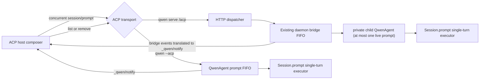

# ACP Follow-up Prompt Queue

Status: Implemented in Qwen Code; ACP host UI validation pending

Issue: [#8542](https://github.com/QwenLM/qwen-code/issues/8542)

Upstream source snapshot: `4a7951781501b95b93baf84cf5899dc2b752d80e`
(`QwenLM/qwen-code` `main`, 2026-08-09)

## Summary

Qwen Code will support concurrent ACP `session/prompt` requests as a
per-session FIFO. The first request owns the running turn; later requests wait
for the next complete turn without cancelling it. Both direct stdio
(`qwen --acp`) and ACP over HTTP (`qwen serve /acp`) will advertise the same
versioned `_qwen` capability, expose the same queue events, and support list
and targeted removal operations.

This is a **next-turn queue**, equivalent to the terminal CLI's `Ctrl+Q`
behavior. It is not mid-turn steering: a queued prompt never enters the current
model/tool loop. The existing daemon mid-turn-message path remains separate.
The equivalence is deferral, visibility, and non-destructive delivery; ACP
requests remain distinct turns and are not batched the way the TUI may combine
multiple plain queued messages.

The Qwen Code changes make the agent side complete and observable. An ACP host
must still keep its composer enabled while a turn is running, send a second
`session/prompt` without waiting for the first response, and render the
extension events. Qwen Code cannot independently enable JetBrains AI
Assistant's disabled Send control.

## Pre-implementation baseline (verified)

At the implementation starting point, the source did not provide a consistent
ACP queue:

- `packages/cli/src/acp-integration/session/Session.ts` aborts
  `pendingPrompt` before waiting for `pendingPromptCompletion`. Therefore a
  concurrent direct ACP prompt supersedes the running prompt; a third call can
  also cancel the second waiter. Existing tests describe this as a
  "superseding prompt."
- `packages/cli/src/acp-integration/acpAgent.ts` calls `Session.prompt()` once
  per incoming request and tracks concurrent calls only for cancellation. It
  has no FIFO or queue-state contract.
- `packages/cli/src/serve/acp-http/dispatch.ts` aborts the previous
  `SessionBinding.promptAbort` before forwarding a second prompt, so the HTTP
  ACP adapter also defeats the queue beneath it.
- `packages/acp-bridge/src/bridge.ts` already has the required daemon
  primitive: synchronous admission that is bounded by default, one FIFO per
  session, `PendingPromptEntry`, list/remove operations, and
  `pending_prompt_{added,started,completed}` events. Its default maximum is
  five admitted prompts per session, including the running prompt.
- The bridge's current running-deadline path settles its FIFO node before the
  child prompt necessarily settles and explicitly accepts overlapping the next
  prompt. That recovery trade-off is incompatible with making `Session` a
  strict single-turn executor and must become the executor fence defined below.
- ACP SDK 0.14.1 has `_meta` and extension method hooks but no standard prompt
  queue capability or queue update type.

The automated triage comment on #8542 says the current direct ACP path already
queues without cancelling the running turn. The `pendingPrompt?.abort()` call
and the supersession tests contradict that claim; this design treats the
source as authoritative.

The disabled JetBrains Send control is reporter evidence from the issue, not a
host-runtime result reproduced in this repository. The acceptance plan keeps
that dependency explicitly unverified until a real-host test is green.

## Goals

- Preserve the running turn when another `session/prompt` arrives.
- Execute every admitted prompt that is not removed/expired exactly once and
  in admission order; retired prompts never execute.
- Give a capable host enough state to show, remove, and edit queued prompts.
- Give direct stdio and HTTP ACP the same observable behavior.
- Use a five-request default bound, accurately advertise HTTP's existing
  explicit unlimited mode, and return a stable queue-full error when bounded.
- Preserve session, cancellation, teardown, and trust-boundary invariants.

## Non-goals

- Injecting text into a running model/tool loop or implementing a safe-point
  steer protocol.
- Changing the terminal CLI or Web Shell queue UI.
- Reproducing TUI-specific batching or slash-command handling. Each admitted
  ACP `session/prompt` keeps its own request, turn, and response.
- Adding a server-side in-place edit operation. Edit is remove, restore to the
  host composer, and submit again at the tail.
- Standardizing ACP upstream in this change. The wire contract is a versioned
  Qwen extension that can later inform an upstream proposal.
- Persisting queued prompts across agent-process restart or full ACP
  connection teardown.
- Changing automatic-turn, permission, retry, or prompt-deadline values. This
  design only tightens the post-deadline execution fence required by the
  strict single-turn executor.

## User-visible contract

1. A host that sees `agentCapabilities._meta.qwen.promptQueue.version === 1`
   keeps Send enabled during a running turn.
2. Each submission is a normal `session/prompt` JSON-RPC request with a unique
   request id. The host does not await earlier prompt responses before sending
   a follow-up.
3. The agent starts one prompt per session. Later accepted prompts appear in a
   visible FIFO and start only after the previous `Session.prompt()` settles.
4. Removing a still-queued prompt immediately removes it from the visible
   queue and resolves its original `session/prompt` request with
   `{ "stopReason": "cancelled" }`. A hidden FIFO tombstone retains its
   admission position/capacity until it reaches the head. It is never sent to
   the model and creates no user-history entry.
5. Editing removes the item first. Only after removal succeeds does the host
   restore its locally retained content to the composer. A resubmission joins
   the tail as a new prompt.
6. If removal loses a race with dispatch, the server reports
   `reason: "already_started"`. The host must not restore a duplicate; the user
   can use the ordinary Stop action if desired.
7. Standard ACP `session/cancel` affects only the currently running prompt.
   Queued prompts remain admitted and continue in FIFO order. A queue-aware
   host that wants to discard follow-ups removes them explicitly before
   sending `session/cancel`.
8. Closing a session cancels every prompt in that session. Ending an HTTP ACP
   connection after its reconnect grace period cancels every running/queued
   prompt submitted through that connection; prompts owned by another attached
   connection remain. Nothing cancelled by teardown may begin later.

The host retains the complete local content blocks for queue rendering and
editing. Server snapshots expose only the existing text projection, not raw
image/audio bytes, so reconnect reconciliation does not create a second copy
of large prompt payloads.

### Host reducer requirements

A host cannot represent the session with one `isRunning` boolean after it opts
into this capability. It tracks each locally submitted request independently
as `submitting`, `queued`, `running`, or `settled`, keyed first by
`clientPromptId` and then by the server `promptId` learned from an event or
list response. A response for P1 must not mark the whole session idle while P2
is queued or running. A successfully removed row disappears and its cancelled
response settles the local request immediately; the invisible server
tombstone is capacity accounting, not host UI state.

Queue notifications and JSON-RPC responses are separate asynchronous streams:
`pending_prompt_started(P2)` may race with the response for P1, and a completed
event may race with P2's own response. The host therefore treats the prompt
response as the execution terminal, treats queue events as idempotent display
transitions, and uses list as the visible-queue reconciliation source. It
freezes the local row while remove is in flight and restores editable content
only from its own retained blocks after `{ removed: true }`.

## Wire protocol

Queue method names, capability types, metadata parsing, and validation live in
a new dependency-free module,
`packages/acp-bridge/src/promptQueueProtocol.ts`, exported as
`@qwen-code/acp-bridge/promptQueueProtocol`. It imports and re-exports the
existing event-name constants from `daemonEventTypes.ts` rather than defining
duplicate strings. It also exposes one capability builder and event-data
builders, so direct ACP and HTTP ACP cannot drift in field names or version
markers. Its default-limit constant replaces the duplicate value in
`bridge.ts`, `run-qwen-serve.ts`, and `server/serve-features.ts`; operator
configuration still flows through the existing bridge option.

### Capability

Both initialize responses add the following data. HTTP retains its existing
`connectionId`, `workspaceCwd`, and method entries.

```jsonc
{
  "agentCapabilities": {
    "_meta": {
      "qwen": {
        "methods": [
          "_qwen/session/prompt_queue/list",
          "_qwen/session/prompt_queue/remove",
        ],
        "promptQueue": {
          "version": 1,
          "delivery": "next_turn",
          "maxPendingPromptsPerSession": 5,
          "sessionCancelScope": "running_only",
          "notificationMethod": "_qwen/notify",
          "events": [
            "pending_prompt_added",
            "pending_prompt_started",
            "pending_prompt_completed",
          ],
        },
      },
    },
  },
}
```

`maxPendingPromptsPerSession` counts the running prompt. Direct stdio reports
five. HTTP reports the bridge's resolved runtime limit; `null` means the
operator explicitly selected the existing unlimited mode.

Capability advertisement is not an enable flag. FIFO semantics apply to all
concurrent prompt requests. A client that does not understand the extension
normally sends only one request at a time and sees no change.

The capability builder merges into `_meta.qwen`: it concatenates and
deduplicates queue methods without overwriting HTTP's existing identity or
method fields. Direct stdio creates the `qwen` object if absent. Both paths
retain the sibling `imageCapability` entry.

### Client correlation metadata

A capable host should attach an opaque id that remains stable for that local
submission:

```jsonc
{
  "_meta": {
    "qwen": {
      "promptQueue": {
        "clientPromptId": "550e8400-e29b-41d4-a716-446655440000",
      },
    },
  },
}
```

`clientPromptId` is optional for compatibility. When present it must match
`[A-Za-z0-9._:-]{1,128}` and be unique among admitted prompts in that session.
Invalid or duplicate values reject the request before queue admission with
`INVALID_PARAMS`. The value is used only to correlate host-local content with
the queue-owner `promptId`; it is never trusted as the server id,
invocation id, or ownership credential. Queue control metadata is stripped
before the request reaches `Session.prompt()`.

### State notification

Queue state uses the HTTP adapter's existing extension envelope:

```jsonc
{
  "jsonrpc": "2.0",
  "method": "_qwen/notify",
  "params": {
    "kind": "pending_prompt_added",
    "data": {
      "version": 1,
      "sessionId": "s1",
      "promptId": "server-generated-uuid",
      "clientPromptId": "host-generated-id",
      "text": "use approach X",
      "queuedAt": 1786190000000,
    },
  },
}
```

The event lifecycle is:

| Event                      | Emission point                             | Data beyond ids                     |
| -------------------------- | ------------------------------------------ | ----------------------------------- |
| `pending_prompt_added`     | A prompt is admitted behind another prompt | `text`, `queuedAt`                  |
| `pending_prompt_started`   | That queued prompt reaches the FIFO head   | `text`                              |
| `pending_prompt_completed` | It settles or is removed                   | `state` is `completed` or `removed` |

As in the existing daemon bridge, the first prompt on an idle session does not
emit queue events. A prompt that errors after starting still emits queue state
`completed`; its JSON-RPC error is the authoritative execution result. Events
are hints and may be replayed by HTTP SSE, so hosts reduce them idempotently by
server `promptId`. They are not encoded as fake `session/update` content and
must never be added to conversation history.

### List

Request:

```jsonc
{
  "method": "_qwen/session/prompt_queue/list",
  "params": { "sessionId": "s1" },
}
```

Response:

```jsonc
{
  "version": 1,
  "pendingPrompts": [
    {
      "promptId": "server-id",
      "clientPromptId": "host-id",
      "originatorClientId": "bridge-issued-client-id",
      "text": "use approach X",
      "queuedAt": 1786190000000,
      "state": "queued",
    },
  ],
}
```

`clientPromptId` and `originatorClientId` are optional. The result includes the
running prompt followed by visible queued prompts in admission order. It is the
authoritative visible-queue snapshot for event-ring eviction or reconnect
reconciliation; removed tombstones may still consume admission capacity until
they drain. HTTP preserves the bridge's existing `originatorClientId` from
`getPendingPrompts`; direct stdio projects its in-memory queue and omits that
field.

### Remove

Request:

```jsonc
{
  "method": "_qwen/session/prompt_queue/remove",
  "params": { "sessionId": "s1", "promptId": "server-id" },
}
```

Response is one of:

```jsonc
{ "removed": true }
```

```jsonc
{ "removed": false, "reason": "not_found" }
```

```jsonc
{ "removed": false, "reason": "already_started" }
```

Only `state: "queued"` is removable through this method. The session must be
owned by the calling ACP connection. A server id is still required after list;
`clientPromptId` alone cannot authorize or select a mutation. Repeated removal
is idempotent and returns `not_found`. The public method accepts the bounded,
non-blank opaque id returned by list; a malformed or oversized id gets
`INVALID_PARAMS` before lookup. Removal leaves a hidden
tombstone at the item's FIFO position until its predecessors settle. This keeps
the admission bound honest while allowing the host to restore/edit the content
immediately. Both direct stdio and the bridge clear the retained request/text
immediately after publishing the removal transition; the tombstone retains
only ids and latches. No snapshot returns raw content blocks. The remove
operation also settles the original prompt request as cancelled immediately;
RPC settlement and slot release are intentionally separate.

### Queue full

Admission is synchronous relative to other prompts in the same JavaScript
process. A rejected prompt creates no queue event or retained entry. Both
transports return the same JSON-RPC error shape:

```jsonc
{
  "code": -32603,
  "message": "Prompt queue full for session ...",
  "data": {
    "errorKind": "prompt_queue_full",
    "sessionId": "s1",
    "limit": 5,
    "pendingCount": 5,
    "retryable": true,
  },
}
```

The host keeps the rejected content in its composer and may retry after an
admission slot is released. A normal completion releases its slot immediately;
a removed item releases its slot when its tombstone reaches the FIFO head, not
when the remove response is returned.

The shared protocol module builds the error data. Direct `QwenAgent.prompt()`
throws an ACP `RequestError` with that code/data, while ACP HTTP's existing
`toRpcError(PromptQueueFullError)` mapping adds the same `retryable: true`
field. Neither path relies on generic serialization of an ordinary `Error`.

## Architecture



There is exactly one FIFO owner on each route:

- Direct stdio: `QwenAgent` owns the FIFO.
- HTTP ACP: the daemon bridge owns the FIFO. The dispatcher tracks request
  controllers but does not add another scheduling queue.
- `Session` remains a one-turn executor and fails closed if a caller bypasses
  its owner and invokes it concurrently.

## Direct stdio implementation

### Queue owner

In `packages/cli/src/acp-integration/acpAgent.ts`, replace the current
set-only `activePromptCalls` bookkeeping with a per-session queue state that is
also the source of truth for activity checks:

```ts
interface AcpPromptQueueEntry {
  promptId: string;
  clientPromptId?: string;
  params?: PromptRequest;
  queuedAt: number;
  state: 'queued' | 'running' | 'removed';
  wasQueued: boolean;
  callerSettled: boolean;
  controller: AbortController;
  resolve: (response: PromptResponse) => void;
  reject: (reason: unknown) => void;
}

interface AcpPromptQueueState {
  session: Session;
  entries: AcpPromptQueueEntry[];
  draining: boolean;
  admissionClosed: boolean;
}
```

`prompt()` validates and sanitizes metadata, reserves the bounded slot, appends
the entry, and returns its deferred result. On an idle state it marks the head
`running` and starts the drain synchronously before returning, so a following
`session/cancel` cannot observe an unclassified head. Later entries start as
`queued`. The `historyMutationOwner` check, slot/id reservation, append, and
idle-head classification contain no `await`; a history mutation therefore
cannot enter between admission and visible queue ownership. A single drain
loop calls `Session.prompt()` for the head and awaits its full settlement
before starting the next entry. Each entry catches its own failure so one
failed turn cannot poison the FIFO tail. Removal changes an
entry to `removed`, clears `params`, settles the original request as cancelled
through the exactly-once `callerSettled` latch, and leaves a tombstone until the
drain reaches it. The drain skips execution and releases the admission slot.
The state map is deleted only when its exact `Session` is unregistered, not
when the queue becomes empty. Session registration creates the state before
exposing the Session.

Every direct close path sets `admissionClosed` synchronously before its first
`await`; `prompt()` verifies both the registered Session and state identity
before retaining params or reserving a slot. If a reversible close fails, its
existing rollback reopens admission only when the same state still owns the
same registered Session. Successful removal deletes that exact state after the
Session leaves `sessions`; registering a genuinely new/loaded instance with a
reused persisted id installs a new state object. Late cleanup from the old
object can neither close nor reopen its replacement. This single state is the
queue, activity, and close-admission source of truth. Existing session-creation
rollback also compare-deletes a state if initialization fails after allocation.

Existing readers that use `activePromptCalls.has(sessionId)` to decide whether
transcript finalization is safe must read the new queue state instead; queued
requests count as active ownership even though only the head mutates history.

For a trusted daemon parent, the queue entry reuses the validated invocation
context's bridge `promptId`. For ordinary direct stdio, `QwenAgent` creates an
internal `InvocationContextV1` from the server-generated queue id and passes it
to `Session.prompt()`; it never trusts an external invocation-context metadata
field. This gives all direct turns a stable owner id for Todo Stop Guard and
queue lifecycle correlation without widening the trust boundary.

Add one identity-scoped `Session.historyMutationOwner` for live-session
operations that can replace, truncate, or snapshot history: `rewindSession` /
`sessionRewind`, `restoreSessionHistory`, and the source snapshot used by
`sessionBranch` / `sessionSideTask`. A small `QwenAgent` wrapper first rejects
if the prompt queue contains any running, queued, or retired entry, then calls
`Session.beginHistoryMutation()` synchronously and releases the exact token in
`finally`. Conversely, `prompt()` rejects before admission if that owner is
active. `rewindToTurn()` and `restoreHistory()` also check the Session owner as
defense in depth: their internal variants require the exact owner token that
the wrapper acquired and reject a missing or stale token. The check-and-mark
portions contain no `await`, so either the prompt queue or the history
operation wins deterministically; a mutation cannot start in the microtask gap
between P1 settling and admitted P2 dispatching. This is a fail-fast ownership
gate, not a second scheduler. Read-only replay and status methods do not acquire
it.

`QwenAgent.extMethod()` implements the shared list/remove methods against this
state. Direct queue notifications use
`connection.extNotification('_qwen/notify', ...)` as fire-and-forget writes
with rejection logging; a slow or extension-unaware host cannot block FIFO
progress. `initialize()` adds the shared capability and method names alongside
the existing image capability.

### Todo Stop Guard and automatic work

`Session` already asks its ACP client whether a daemon-owned follow-up is
queued so Todo Stop Guard yields to the ordinary user prompt. A direct stdio
queue is agent-local, so the host cannot answer that existing bridge query.
`QwenAgent` therefore passes one read-only prompt-queue coordinator into each
`Session`:

- `hasQueuedPrompt()` is true only for live, non-retired entries behind the
  running head;
- `Session.#drainMidTurnInput()` ORs that value with the existing remote drain
  response, including the method-unavailable fallback; and
- `Session.#claimTodoStopGuardContinuation()` gives the local queue priority
  before asking the remote client to claim an automatic continuation;
- `inspectTurnBoundary()` linearizes the decision to start cron,
  notification, scheduler, or follow-up-suggestion work after an ordinary
  turn.

For direct stdio, the boundary inspection is the same synchronous local read
and sends nothing to the host. For a trusted private daemon child, it calls the
existing mid-turn-drain ext-method with a new `inspectQueuedPromptOnly: true`
flag and the trusted running prompt id; `BridgeClient` returns
`{ messages: [], hasQueuedPrompt }` without splicing mid-turn messages and
atomically records that id when a queued successor exists. An already-promoted
different prompt also returns `true` but does not recreate the wait owner that
promotion cleared. Other ACP clients never receive that private query. Each
inspection await races the existing mid-turn-drain timeout, so it cannot hold
the prompt response indefinitely. The ACP SDK cannot cancel an already-sent
extension request, so a Session retains at most two unresolved inspections:
one timed-out request and one recovery probe. A timed-out request is never
reused, settled requests free their slot, and a full two-request set returns
`unavailable` without sending another RPC.

An unavailable or positive private-parent inspection suppresses automatic
work for that boundary rather than allowing it to overtake a possible
successor. It starts or retains one session-owned, cancellation-aware watchdog
with bounded exponential backoff. Every attempt carries the owner prompt id
and has the same timeout. The bridge reports `true` while a different live
prompt is queued or has been promoted but may not yet have entered the child;
`true` rearms the watchdog, while an authoritative `false` consumes the
deferred work. Successor prompt start, a proactive identity-matched release, or
session close cancels the loop. Only one loop may exist per session, and its
timer is unref'd. A prompt admitted after a successful `false` response is
ordered after that boundary by definition.

`Session.prompt()` performs the boundary inspection before every success or
`finally` path that starts cron/notification drains, the scheduler, or a
follow-up suggestion. If an ordinary successor exists, it leaves that work
pending; the queue owner starts P2, and the final prompt in the FIFO drains it.
Channel delivery and required turn cleanup still run at each boundary.

When boundary inspection yields, `Session` stores one identity-scoped
`deferredAutomaticBoundary` containing the running prompt id, drain/scheduler
flags, and the optional follow-up result. Starting the ordinary successor
clears that record, discards the now-stale predecessor suggestion, and leaves
the durable automatic queues for the final FIFO prompt. If the last live
successor is instead removed, aborted, or expires before promotion, a unified
release consumes the record exactly once and starts the deferred drains,
scheduler, and still-current follow-up suggestion while the Session is idle.
An early-release latch covers a release that races ahead of installing the
record after an awaited private inspection. Conditional idle cleanup refuses
to reap a Session while this record exists, while released automatic work is
queued or acquiring history ownership, or while its drain is active. Optional
fire-and-forget follow-up generation does not retain an otherwise idle Session;
explicit close and managed shutdown retain their force semantics.

The same successor-wait identity extends the existing Todo Stop Guard release.
Both a Todo claim and `inspectTurnBoundary()` record the running entry's
internal prompt id. Direct stdio calls the Session release locally; the private
daemon child sends the prompt id in `inspectQueuedPromptOnly`, and
`BridgeClient` records it atomically only when a queued successor produced the
`true` result. An already-promoted successor returns `true` without restoring
the cleared owner. The bridge's existing
`craft/todoStopGuardQueueReleased` method is retained for wire compatibility
but broadened to release both Todo priority and the deferred automatic
boundary. Removing P2 while P3 remains does not release either wait. Normal
promotion of P2 clears the bridge owner and the Session wait through the
existing prompt-start path. Retired tombstones never count as queued work. The
private daemon child sees no local successor because the bridge is its sole
scheduler, so the bridge queue remains authoritative through the inspect-only
query and is not double-counted.

### Session invariant

In `packages/cli/src/acp-integration/session/Session.ts`, remove the implicit
supersession behavior. `Session.prompt()` must never abort a previous prompt in
response to a new prompt. It synchronously installs an identity-scoped
`promptInvocationOwner` before its first `await`; if an owner already exists it
returns an internal invariant error without touching the running turn. The
owner spans writer admission, live-tool synchronization, prompt execution, and
settlement, and only its exact token may clear it in `finally`. Checking only
`pendingPrompt` after writer admission is insufficient because two same-tick
callers could both pass through the earlier awaits. The queue owner is the only
component allowed to serialize user prompts. `promptInvocationOwner` and
`historyMutationOwner` are mutually exclusive and are acquired without an
intervening `await`.

The old `pendingPrompt?.abort()` and wait-for-previous-prompt admission branch
are removed. `pendingPrompt`/`pendingPromptCompletion` may remain as internal
execution/drain signals for the single owner, but a later call never waits on
or replaces them.

The entry's admission `AbortSignal` is attached to an admission controller
before potentially slow writer admission. Thus cancel/close can stop a request
that has reached the FIFO head but has not installed `Session.pendingPrompt`
yet. `isIdle()` and close/drain checks include `promptInvocationOwner`, so the
pre-execution admission window cannot be mistaken for an idle session.

### Direct cancellation and close

- ACP `session/cancel` aborts the running entry and calls
  `Session.cancelPendingPrompt()`. It does not abort queued entries.
- `_qwen/session/prompt_queue/remove` aborts only a queued entry, drops its
  retained prompt content, emits `removed`, immediately settles the original
  prompt request as cancelled, and leaves its FIFO tombstone for slot release.
- The private `craft/cancelPendingPrompt` path used by the daemon child carries
  the exact bridge `promptId` and keeps running-only semantics. The child
  acknowledges only after that matching executor settles. The caller-facing
  forward has a five-second bound. A late private request cannot cancel a
  promoted successor because its stale prompt id no longer matches the running
  entry. The standard session-scoped ACP fallback for older children keeps its
  actual write as the FIFO fence after that bound, so a successor cannot start
  before a late fallback is delivered or the transport closes.
- Session close, managed shutdown, and final session removal use a separate
  `cancelAllPromptEntries` helper. It closes admission first, aborts all
  entries, retires every queued row as removed, and settles every still-open
  caller as cancelled while the wire is writable. It then waits for executor
  settlement within the existing drain deadline before disposing the
  session/config. If the deadline wins, it invalidates that exact queue
  state, clears retained payloads/ids/slots, and lets late executor settlement
  no-op against the old state identity; no successor can dispatch.
  Close/admission races are decided by synchronous ordering: an entry admitted
  first is flushed by close; a prompt observed after the close marker is
  rejected without admission.

Tests that currently assert prompt supersession are replaced with FIFO and
non-cancellation assertions; retaining them would encode the bug this design
removes.

## HTTP ACP implementation

### Dispatcher bookkeeping

In `packages/cli/src/serve/acp-http/connection-registry.ts`, replace the single
`SessionBinding.promptAbort` with a map keyed by server-generated `promptId`.
Each value contains the AbortController and JSON-RPC request id. Binding
teardown aborts the whole map; ordinary cancel does not.

In `packages/cli/src/serve/acp-http/dispatch.ts`, `handlePrompt()`:

1. validates optional client correlation metadata, removes only the queue
   subobject while preserving sibling `_meta.qwen` fields, and forwards a
   sanitized prompt request;
2. generates a UUID `promptId` and registers its controller before forwarding;
3. passes `promptId` and `clientPromptId` only through trusted
   `BridgeClientRequestContext`;
4. stops aborting the previous controller;
5. maps bridge `AbortError` to a successful `{ stopReason: "cancelled" }`
   response rather than `internal_error`; and
6. removes only its own controller in `finally`.

The new list/remove cases are added to `ALL_QWEN_VENDOR_METHODS` and the
connection-routed method set. They use the existing `requireOwned` /
`withMutableOwned` gate and the bridge's list/remove methods. Remove first
checks the target state and invokes bridge removal in the same synchronous
turn, with no `await` between them, so the ACP contract cannot use the bridge's
broader internal ability to remove a running prompt.

`session/cancel` keeps the bridge's existing running-only contract and calls
`bridge.cancelSession()` once. It does not abort a dispatcher request
controller: in a multi-client session the running prompt may belong to a peer,
while every controller in the cancelling connection's own map may be queued.
The map exists for binding/connection teardown, not session-wide Stop. The
bridge already owns the running child cancel and eventual prompt response;
queued request controllers remain live.

`buildInitializeResult()` reads the resolved limit from
`bridge.getDaemonStatusSnapshot().limits`; it must not re-derive the default
from CLI flags because `0` and `Infinity` already normalize to `null` in the
bridge.

### Bridge metadata

`packages/acp-bridge/src/bridgeTypes.ts` adds optional `clientPromptId` to
`BridgeClientRequestContext`, `PendingPromptEntry`, and
`PendingPromptSummary`, plus an internal
`queueRetired?: 'completed' | 'removed'` transition latch, caller-settlement
latch, optional text projection, and optional retained request on
`PendingPromptEntry`.
`packages/acp-bridge/src/bridge.ts` copies the correlation value into
added/started/completed events and snapshots. The bridge generates a UUID when
the caller omits `promptId`; embedded callers may supply a non-blank opaque id
of at most 128 characters without control characters. It revalidates that id, its bridge-issued
`clientId`, and `clientPromptId`. Each `SessionEntry` gains
`admittedPromptIds` and
`admittedClientPromptIds` sets and an optional
`timedOutExecutorPromptId`. The existing Todo-only queued-wait field becomes
`queuedSuccessorWaitOwnerPromptId`; Todo claims and inspect-only boundary reads
both set it from the trusted running prompt id. While set, it counts as bridge
local work and blocks idle reaping. Admission reserves both ids synchronously
after validation. Slot count, both id reservations, and list insertion form
one admission transaction: any synchronous
construction/publication failure rolls all of them back. They remain reserved
across visible removal and are released only from the FIFO node's final
slot-release path. This rejects duplicate live correlation ids across the
whole session and duplicate server `promptId` values even though the HTTP
adapter normally supplies a UUID. Retired entries stay in the internal
`pendingPromptList` until their executor fence drains;
`getPendingPrompts()` filters `queueRetired` entries instead of splicing them
early. This preserves teardown/correlation ownership while keeping tombstones
out of the public snapshot.

The narrowed `BridgeClientSessionEntry` interface mirrors
`timedOutExecutorPromptId` and `queuedSuccessorWaitOwnerPromptId`, so every
agent-to-client boundary can apply the same fence/wait identity without
looking up queue state by text or caller-controlled metadata.

The bridge also centralizes queued retirement in one synchronous helper.
Targeted remove and an external request-signal abort (including connection
teardown) hide the queued item, emit
`pending_prompt_completed{state:'removed'}` and the formal cancelled terminal
once, and settle the returned prompt promise as cancelled immediately. A
deadline that expires while queued uses the same helper with
`state:'completed'`, its existing formal `turn_error`, and an immediate
deadline rejection. All cases retain the admission slot until the FIFO node
drains. If retirement leaves no other live queued successor, the helper clears
the exact successor relation but retains its owner while it sends the existing
release ext-method once. A matching child acknowledgement or an owner-matched
watchdog inspection that returns `false` clears the owner; failure retains it
as local work for watchdog self-healing. Promotion clears the same owner
without sending a release because the successor's pending count takes over the
reaper fence. Caller settlement clears the entry's deadline timer unless a
cancellation forward is still draining; in that case the timer remains only
as the cancel-forward bound and cannot publish another caller terminal. After
publishing the retirement transition, the helper clears both the text
projection and retained request immediately; the executor closure reads only
that mutable entry and never captures the original `req` separately. A running
signal abort keeps the current cooperative cancel path. This prevents a
disconnected or already expired queued row from lingering for other clients
until it reaches the head, without retaining removed text/image/audio payloads
behind a stuck predecessor.

Before forwarding to the private ACP child, `sendPrompt()` defensively removes
the nested `_meta.qwen.promptQueue` control object while preserving sibling
Qwen and non-Qwen metadata. The dispatcher performs the same sanitization at
the public ACP boundary, but the bridge check keeps REST and future internal
callers from accidentally carrying queue-control data into `Session` or model
input.

### Caller result and executor fence

`sendPrompt()` separates the promise returned to its caller from the promise
that advances `entry.promptQueue`:

- **Caller result:** settles once with the normal prompt result/error, queued
  removal cancellation, or deadline error. This lets the originating surface
  observe a removed or expired prompt immediately.
- **Executor fence:** owns the FIFO node, admission slot, id reservations, and
  child `connection.prompt()` lifetime plus the existing cancellation-forward
  drain. It advances only after a non-dispatched tombstone reaches the head, or
  a dispatched child request actually settles (success/error/cancel) or its
  transport closes and the cancel-forward fence drains.

For a running deadline, the existing timer still publishes `turn_error`,
settles the caller result, hides the terminal prompt from the visible pending
list, and forwards cancellation immediately. It moves the id from
`activePromptId` to `timedOutExecutorPromptId`, clears `promptActive` and active
originator state, and decrements `activePromptCounter`; the entry's
`pendingPromptCount` and executor fence still block reaping and successor
dispatch. If that prompt had previously emitted `pending_prompt_added`, it now
emits one matching completed transition. A late child result is suppressed by
the existing terminal/caller latches, clears only its matching timed-out fence,
releases the slot, and starts the next FIFO node. If the child ignores
cancellation while its transport stays alive, strict FIFO remains blocked
until session close or transport failure; already queued callers may still
receive their own deadline errors, but their tombstones cannot dispatch.

`BridgeClient` treats `timedOutExecutorPromptId` as a terminal safety fence,
not an active turn:

- `sessionUpdate()` suppresses event-bus/transcript frames but still records
  token usage and ingests authoritative artifact changes already produced;
- a late follow-up suggestion from the terminal turn is suppressed;
  independently requested session-generation progress and authoritative
  active-work holds, model, mode, title, recording, terminal-sequence,
  MCP-budget, and artifact reconciliation remain available;
- a new permission request resolves cancelled;
- the external tool guard rejects because `promptActive` is false;
- prompt/session-scoped client MCP, file read/write, sub-session, Live screen,
  Live task, Live speak, prompt-sourced channel-delivery, normal mid-turn
  drain, and Todo claim calls fail closed before invoking their host handlers;
  unrelated scheduled delivery retains its existing correlation checks; and
- the inspect-only queue query plus teardown/accounting and authoritative
  model/mode/title/recording/artifact reconciliation remain available.

Calls already inside an external handler when the deadline wins remain subject
to that handler's existing cancellation contract; this design cannot roll back
an already completed side effect. New calls after the terminal cannot gain
permission or start daemon-mediated work. The late child response is consumed
only to release the fence; it cannot publish a second terminal or mutate
visible queue state.

This deliberately removes the bridge's current post-deadline overlap trade-off.
Without the fence, the private child's generic `QwenAgent` FIFO would become a
second hidden queue and a later session-level cancel could target the old
running prompt instead of the bridge item that timed out. With the fence, the
private child sees at most one live `session/prompt`; the daemon bridge remains
the only HTTP scheduling owner and `Session.prompt()` is never overlapped.
The contract comment on `PromptDeadlineExceededError` in `bridgeErrors.ts` must
be updated at the same time: deadline settles the caller and requests cancel;
only the executor fence releases FIFO capacity/dispatch.

`packages/sdk-typescript/src/daemon/types.ts` mirrors optional
`clientPromptId` in `DaemonPendingPromptSummary`.
`packages/sdk-typescript/src/daemon/events.ts` mirrors optional `version: 1`
and optional `clientPromptId` in all three pending-prompt event data types.
They remain optional in the public daemon SDK so old recorded/replayed events
still type-check. The open-record parser in
`packages/webui/src/daemon/pendingPromptVersion.ts` needs no behavior change,
but its tests must prove the new fields survive parsing and that existing Web
Shell consumers remain compatible.

No second FIFO, queue limit, or adapter-level scheduling policy is added to the
HTTP layer. The bridge remains authoritative for admission, ordering, caller
settlement, executor fences, prompt deadlines, terminal publication, and SSE
replay.

### Existing bridge consumers

`AcpSessionBridge.sendPrompt()` keeps its current signature and continues to
return the caller-facing result. Only the internal promise assigned to
`entry.promptQueue` changes from the caller result to the executor fence. Every
production caller has the following explicit outcome:

| Consumer                                      | Compatibility outcome                                                                                                                                                                                |
| --------------------------------------------- | ---------------------------------------------------------------------------------------------------------------------------------------------------------------------------------------------------- |
| ACP HTTP dispatcher                           | Uses the caller result for its JSON-RPC response and per-request controller cleanup; queued removal/teardown can now settle it immediately                                                           |
| REST `POST /session/:id/prompt` and Web Shell | Keeps 202 admission, completion logging, and channel-delivery authorization cleanup; a running deadline still rejects at the same wall-clock point, but a successor no longer overlaps the old child |
| Live session coordinator                      | Keeps its existing turn deadline/error result; a timed-out child remains fenced from later prompts until child/transport settlement                                                                  |
| Sub-session creation                          | Starts the first prompt on a fresh session and still correlates completion from the event stream; no queue-owner change                                                                              |
| Live task service                             | Keeps synchronous `onPromptAdmitted` behavior and its fire-and-forget result observer                                                                                                                |
| Trusted `continueSession`                     | Keeps the admission callback/result rejection observer and enters the same authoritative bridge FIFO                                                                                                 |

The REST authorization grace timer already starts from the caller-facing
deadline result today, so the executor-fence split does not move that cleanup
earlier. The route and `PromptDeadlineExceededError` comments that currently
say a deadline releases the FIFO must be updated to state that it settles the
caller and forwards cancel while the executor fence retains dispatch
ownership.

## State machine and invariants

```mermaid
stateDiagram-v2
  [*] --> Rejected: admission or validation fails
  [*] --> Running: session idle
  [*] --> Queued: another prompt admitted first
  Queued --> Running: reaches FIFO head
  Queued --> Removed: remove; caller gets cancelled
  Queued --> Expired: deadline; caller gets error
  Running --> TimedOutFenced: deadline; caller gets error
  Running --> Drained: child settles normally/cancelled/error
  TimedOutFenced --> Drained: child settles or transport closes
  Removed --> Drained: tombstone reaches FIFO head
  Expired --> Drained: tombstone reaches FIFO head
  Drained --> [*]: release slot and ids
  Rejected --> [*]: JSON-RPC error
```



The implementation must maintain all of these invariants:

1. At most one `Session.prompt()` mutates a session's history at a time.
2. Admission order equals dispatch order for every entry that is not removed
   or expired before dispatch.
3. While its transport remains writable, each admitted JSON-RPC prompt receives
   exactly one terminal result or error. Teardown still settles every internal
   deferred and prevents later dispatch even though a closed wire cannot carry
   the response.
4. The publisher creates at most one added, one started, and one completed
   transition per queued item. SSE replay may redeliver a published event, and
   an item retired while queued never emits started.
5. Removal succeeds only before dispatch and never writes user content to
   history.
6. Queue admission count never exceeds a configured finite limit, even when
   removal races with dispatch; explicit unlimited mode remains explicit.
7. A settled child error releases the FIFO. A caller-only deadline error does
   not: a stuck head is never bypassed, and the bridge holds its executor fence
   until child settlement/transport close. Direct stdio requires ordinary
   cancel or session close.
8. Session close prevents new admission before it aborts existing entries.
9. A late completion from an old entry cannot clear, resolve, or emit state for
   a newer entry.
10. Queue ids and correlation metadata confer no session ownership.
11. Running-only cancel and all-entry teardown are separate code paths and
    cannot accidentally call each other.
12. Queue events never become model input, persisted chat content, or ordinary
    ACP `session/update` content.
13. Server and client correlation ids stay reserved for the full admission-slot
    lifetime, including the hidden-tombstone interval.
14. A history mutation and an admitted prompt queue never own the same session;
    the loser fails before mutating history or retaining a new prompt.
15. Partial admission cannot leak a capacity slot, id reservation, list entry,
    or unresolved request; `pending_prompt_added` is published only after the
    admission state commits.
16. Caller settlement and executor release are distinct latches. A remove or
    deadline may settle the caller early but can never release a live child
    request's FIFO fence.
17. Once a running prompt publishes its timeout terminal, later child
    transcript and turn-output frames for that prompt are dropped until the
    executor fence drains; accounting, active-work holds, and authoritative
    state reconciliation remain available.
18. Todo Stop Guard and automatic-turn claims observe the same live queue as
    dispatch; they cannot overtake an admitted ordinary prompt or wait forever
    on a removed/expired last successor.
19. At most one boundary-inspection watchdog exists per session; `true` rearms
    it, while authoritative `false`, successor prompt start, matched release,
    or close clears it and its timer.
20. A timed-out executor is not an active turn: it cannot obtain a new
    permission, tool-guard approval, client filesystem operation, or other
    daemon-mediated side effect while its fence drains.
21. A bridge successor-wait owner counts as local work until promotion, a
    child-acknowledged release, owner-matched `false`, or teardown clears it;
    release loss cannot open an idle-reaper window.
22. At most two private boundary-inspection RPCs may remain unresolved per
    Session. Exhaustion deliberately remains fail-closed until a request
    settles or explicit session/transport recovery occurs; sending unbounded
    recovery probes would recreate the pending-request leak. A deferred
    boundary prevents conditional idle cleanup.
23. A private cancellation is correlated to one bridge prompt id; forwarding
    timeout or late delivery cannot cancel a successor. A session-scoped ACP
    fallback remains a FIFO fence until its write settles or transport closes.
24. Managed writer/resource shutdown waits for every live restore and prompt
    drain admitted before the shutdown marker. A prompt drain that exceeds the
    close deadline invalidates its exact queue before writer teardown.

## Races and failure semantics

| Race/failure                                    | Required outcome                                                                                                                                  |
| ----------------------------------------------- | ------------------------------------------------------------------------------------------------------------------------------------------------- |
| Two prompts arrive in the same tick             | Synchronous admission establishes a deterministic FIFO order                                                                                      |
| Queue reaches its limit                         | Later request fails before retention; existing entries are unchanged                                                                              |
| Remove races with start                         | Exactly one transition wins; remove reports `already_started` if dispatch won                                                                     |
| Cancel arrives during writer admission          | Running entry's admission signal returns it as cancelled; queued entries remain                                                                   |
| Running prompt rejects                          | Its caller receives the error; completed queue state emits; the next entry starts                                                                 |
| Running prompt does not settle                  | Strict FIFO does not bypass it; a bridge caller may hit its deadline but the executor fence remains, while direct requires cancel/session close   |
| Bridge deadline expires while running           | Visible active state retires immediately; a non-authorizing executor fence blocks successors until old child settlement/transport close           |
| Managed shutdown begins during live restore     | Restore may finish; writer/resource shutdown waits for it, admission stays closed, and the Session close gate is reacquired until disposal        |
| Bridge deadline expires while queued            | Error terminal, caller rejection, and completed queue transition publish immediately; a hidden tombstone retains capacity until its FIFO position |
| Queued prompt is removed                        | It is hidden, its caller gets cancelled immediately, and it never calls `Session.prompt`; the tombstone retains capacity until its FIFO position  |
| Timed-out child emits late output/state         | Bridge suppresses transcript and follow-up-suggestion output while retaining independent generation, cost, active-work, and authoritative state   |
| Todo Stop Guard inspects P1 while P2 is queued  | It yields to P2; removing only P2 releases the wait, while a remaining P3 keeps ordinary-prompt priority                                          |
| Last queued successor retires after P1 boundary | One identity-matched release resumes deferred automatic work exactly once; a remaining live successor suppresses release                          |
| HTTP SSE reconnect replays events               | Host deduplicates by server `promptId`, then list reconciles if replay was compacted                                                              |
| HTTP grace expires                              | Binding teardown aborts every controller owned by that connection and prevents those queued requests from dispatching                             |
| Session closes while a terminal is in flight    | Existing terminal latch wins exactly once before event bus disposal                                                                               |
| Client repeats a `clientPromptId`               | Second request is rejected; it is never treated as a retry                                                                                        |
| History mutation races the prompt queue         | Synchronous ownership gives one side the session; the loser gets the existing busy error before mutation or prompt retention                      |
| Host ignores `_qwen`                            | Normal serialized prompting is unchanged; extension notifications are ignored                                                                     |

## Ownership and security

- Direct queue state is process-local and session-keyed.
- HTTP list/remove calls require the same `AcpConnection` session ownership as
  prompt and cancel. The bridge revalidates its stamped `clientId` before any
  read or mutation.
- `clientPromptId`, prompt text, `_meta`, forwarded headers, and JSON-RPC ids
  are untrusted. None selects a workspace, runtime, session owner, or
  invocation context.
- The HTTP dispatcher generates `promptId`; it does not pass a caller-provided
  bridge prompt id. Duplicate server ids fail closed.
- Queue summaries continue to omit raw content blocks and internal controllers.
- When the limit is enabled, admission accounting includes running, queued, and
  retired tombstones rather than only visible rows, so repeated enqueue/remove
  cannot bypass the configured count. HTTP's pre-existing `0`/`Infinity`
  operator setting deliberately disables this count limit and is advertised
  as `null`.
- The limit bounds request count, not aggregate prompt bytes. Existing ACP
  content and inline-media validation remains in force; this feature does not
  introduce a second, inconsistent payload-size policy.
- Logs use ids and counts, not prompt text.

## Compatibility and rollout

This ships as one behavior change with no user-facing configuration flag:

- Serialized clients are unaffected.
- Clients that previously issued concurrent prompts to obtain undocumented
  supersession now get FIFO. They must use standard `session/cancel` before a
  replacement prompt. This is intentional and documented in release notes.
- Unknown `_meta` is ignored under ACP extension rules. Queue events use the
  existing `_qwen/notify` path rather than a new transport.
- Direct stdio and HTTP advertise only after their queue implementation and
  tests land together; no transport may claim version 1 early.
- Any host integration is enabled only after that host checks the capability,
  supports multiple outstanding request ids, and implements queue event
  reduction. JetBrains is the reported case; Zed behavior is not verified by
  this analysis. Until a host test passes, Qwen Code is agent-ready but the
  disabled Send control remains outside this repository's control.
- After host validation, the same state and lifecycle can be proposed to ACP
  upstream without changing Qwen's version-1 contract.

## ROI and recommendation

The ROI is **medium overall, medium-high for the Qwen-owned agent surfaces,
and conditional for the reported JetBrains experience**.

| Factor              | Assessment  | Evidence / consequence                                                                                                         |
| ------------------- | ----------- | ------------------------------------------------------------------------------------------------------------------------------ |
| User value          | High        | Avoids destructive Stop during long turns and restores parity with an established CLI interaction                              |
| Qwen-owned reuse    | Medium-high | The daemon bridge already supplies a bounded FIFO, events, list, and removal; this solution reuses it for HTTP                 |
| Reach at launch     | Medium-low  | Only hosts that allow multiple outstanding prompt requests and implement the capability/reducer expose the UX                  |
| Engineering cost    | Medium-high | Direct ACP, HTTP dispatch, bridge lifecycle, protocol types, SDK/WebUI compatibility, and two E2E transports change together   |
| Correctness risk    | Medium-high | Cancellation, history ownership, teardown, deadlines, replay, and multi-client controller scope all cross the prompt lifecycle |
| Protocol durability | Medium      | A versioned extension unblocks Qwen now but may later need an adapter to an upstream ACP standard                              |

Recommendation: keep the issue at P2. The atomic Qwen-side contract is now
implemented and should be reported as **agent-ready**, not as completion of
the JetBrains feature. The next investment gate is a host owner implementing
concurrent outstanding requests plus the capability/event reducer. If no host
adopts it, the realized UX return remains low despite the correctness value of
the queue hardening.

## Implementation status

The Qwen-owned protocol and execution paths are implemented together:

- direct stdio ACP and ACP-over-HTTP advertise the version-1 capability;
- both routes provide bounded FIFO admission, running-only cancellation,
  queue list/removal, correlation ids, lifecycle events, and stable queue-full
  errors;
- `Session` is a single-turn executor with prompt/history ownership gates and
  cancellation attached before writer admission;
- the daemon bridge separates caller settlement from the executor fence and
  blocks late timed-out prompts from starting new prompt-scoped side effects;
- daemon SDK and WebUI replay types preserve the new optional version and
  client-correlation fields; and
- focused plus full package regressions cover the direct queue, Session,
  bridge, HTTP transport, and replay consumers.

The remaining delivery dependency is outside this repository: a real ACP host
must keep its composer enabled, issue concurrent requests, and reduce queue
events. The JetBrains AI Assistant UI has not been validated in this checkout.

## Observability

Add low-cardinality counters and histograms on both queue owners:

- prompt queue admissions (`started_immediately` / `queued`);
- queue rejections with `limit` but no session or prompt id label;
- queue wait duration;
- post-terminal executor-fence duration and currently fenced timed-out prompts;
- targeted removal result (`removed` / `not_found` / `already_started`);
- maximum observed depth per session;
- cancel scope (`running_only`) and teardown flush count; and
- invariant failures, duplicate terminal suppression, and orphaned queue
  entries.

Do not emit prompt text, `clientPromptId`, workspace paths, or session ids as
metric attributes. Existing debug logs may include log-safe server ids for
race diagnosis.

## Verification plan

### Unit and integration tests

`packages/cli/src/acp-integration/acpAgent.test.ts`:

- assert initialize merges the exact version-1 capability without losing
  `imageCapability`;
- send three prompt requests without awaiting; assert P1 is not aborted and
  execution order is P1, P2, P3;
- verify added/started/completed ordering and client/server id correlation;
- remove P2 while P1 runs; assert removal is visible and P2 resolves cancelled
  immediately, while its slot remains held until P1 settles and P3 follows P1
  without executing P2;
- race removal with P2 dispatch and assert no duplicate model input;
- cancel P1; assert P2 remains and starts after P1 returns cancelled;
- make P1 enter Todo Stop Guard with P2/P3 queued; assert the local queue wins
  over automatic continuation, removing P2 keeps the wait, and removing the
  last successor releases it;
- finish P1 normally with cron/notification/follow-up work pending and assert
  none starts before queued P2/P3, while the last ordinary prompt releases the
  pending automatic work;
- retire the last queued successor after P1's positive boundary inspection and
  assert deferred drains, scheduler, and P1 follow-up resume exactly once;
- fill five slots and assert the sixth gets the stable queue-full error;
- make P1 reject and assert P2 still runs;
- close with running and queued entries and assert every request settles and no
  later prompt starts; force the drain deadline, re-register the same session
  id, and prove late cleanup from the old instance cannot alter the new queue;
- verify duplicate/invalid `clientPromptId` rejection and metadata stripping;
- prove a direct turn receives the internally generated invocation prompt id
  while a trusted daemon child retains its bridge-issued id;
- race history rewind/branch admission against the P1-to-P2 boundary; assert
  one owner wins, P2 is never rejected after admission, and history never
  overlaps a prompt; and
- cover `restoreSessionHistory` and branch/side-task source snapshots with the
  same fail-fast ownership gate while proving read-only replay remains
  available.

`packages/cli/src/acp-integration/session/Session.test.ts`:

- replace supersession expectations with the single-owner invariant;
- hold the first call in writer admission, invoke a same-tick bypass call, and
  prove the second fails without aborting the first or observing the session as
  idle;
- verify an aborted admission signal returns cancelled without history writes;
- require the exact live `historyMutationOwner` token for rewind/restore and
  reject a missing, stale, or cross-session token; and
- verify boundary inspection true/unknown suppresses automatic work, false
  permits it, true/unknown recheck without duplicate timers, prompt/close
  cancels the watchdog, a lost or early last-successor release self-heals, and
  required cleanup/channel delivery is never suppressed.

`packages/acp-bridge/src/bridge.test.ts` and the protocol module tests:

- verify the capability builder preserves existing Qwen metadata, deduplicates
  method names, and reports numeric versus `null` limits;
- verify all queue owners and serve capability surfaces consume the shared
  default-limit constant;
- preserve FIFO, admission-limit, removal-fence, deadline, and terminal-latch
  coverage;
- verify `inspectQueuedPromptOnly` never splices the mid-turn-message queue,
  reports a live queued or already-promoted different prompt as a successor,
  records the wait owner only for the queued case, and identity-matches one
  proactive release when the last successor is removed/expired but not while
  another remains; make release delivery fail and assert the wait owner blocks
  reaping until watchdog `false` clears it;
- inject synchronous admission failures at each reservation/publication step
  and assert slot, id sets, list, and caller all roll back together;
- add `clientPromptId` event/snapshot propagation and validation coverage;
- pass nested queue metadata through a non-ACP bridge caller and prove the
  child request strips only that control object while preserving siblings;
- prove queue summaries still omit raw content blocks;
- abort a queued request through its external signal and assert immediate
  removed visibility/caller cancellation, one formal terminal, retained
  admission accounting, and no later child dispatch;
- expire a queued deadline and assert immediate completed visibility/caller
  rejection, one `turn_error`, retained admission accounting, and no later
  child dispatch; assert the tombstone retains only ids/latches, not the
  request or text projection;
- expire a running deadline and assert immediate caller rejection/cancel
  forwarding plus visible-row retirement; assert `promptActive` is false while
  `timedOutExecutorPromptId`, the FIFO slot, ids, and successor dispatch remain
  fenced until the old child request settles or its transport closes;
- inject a late child `session/update` after that timeout and assert
  `BridgeClient` suppresses its transcript frame while token accounting,
  artifact ingestion, and authoritative state notifications still work;
- inject a late follow-up suggestion and assert it is suppressed, while an
  independently requested session generation, active-work holds,
  model/mode/title/recording, terminal-sequence, MCP-budget, and artifact
  reconciliation remain visible;
- attempt every prompt/session-scoped BridgeClient permission, tool-guard,
  client-MCP, file, sub-session, Live, channel-delivery, mid-turn-drain, and
  Todo-claim path after timeout and assert no host side-effect handler runs,
  while independently correlated scheduled delivery remains available; and
- reject duplicate bridge `promptId` and session-live `clientPromptId` values
  both before and after the original row becomes a hidden tombstone.

`packages/sdk-typescript` daemon type tests and
`packages/webui/src/daemon/pendingPromptVersion.test.ts`:

- compile the new summary/event fields through the public exports;
- accept old events without `version` or `clientPromptId`; and
- preserve and replay version-1 fields without treating them as transcript
  content.

`packages/cli/src/serve/acp-http/transport.test.ts` and
`connection-registry.test.ts`:

- assert initialize preserves existing HTTP Qwen fields and advertises the
  bridge's configured numeric/unlimited limit;
- issue concurrent JSON-RPC prompts and assert neither controller replaces the
  other;
- exercise list/remove ownership, malformed params, queued-only removal, and
  structured queue-full errors;
- verify AbortError becomes a cancelled prompt result;
- verify `session/cancel` touches only the running request;
- verify cross-client `session/cancel` calls bridge cancel exactly once and
  does not abort any queued controller in the cancelling connection;
- verify session close aborts every session request, while connection destroy
  and grace expiry abort only binding-owned controllers and clear those queued
  rows for surviving peer subscribers; and
- replay queue events across SSE reconnect and reconcile with list.

Run focused tests from their package directories, then run
`npm run build && npm run typecheck` from the repository root. Building first
refreshes cross-package `dist` declarations for the new protocol export.

### End-to-end tests

Implementation must add `.qwen/e2e-tests/acp-follow-up-prompt-queue.md` and
exercise:

1. raw stdio NDJSON against `qwen --acp` with two outstanding request ids;
2. ACP-over-HTTP/SSE with three outstanding requests, list, remove, cancel,
   reconnect, and queue-full behavior; and
3. one real supported host (initially JetBrains AI Assistant) showing enabled
   Send, a visible queued row, edit/delete, non-destructive current-turn
   completion, and running-only Stop behavior.

The first two prove Qwen-owned behavior. The feature is not called
end-to-end complete until the host test is green; an unverified host UI is
reported explicitly as an external dependency.

## Acceptance criteria

- A second and third ACP prompt never cancel an earlier prompt merely by
  arriving.
- The two ACP transports expose the same version-1 capability, method names,
  event shapes, cancellation scope, queue-full error, and default limit.
- Direct stdio uses one queue owner; HTTP reuses the bridge queue and does not
  create a second scheduler.
- A host can correlate, display, list, remove, and edit any still-queued item
  without losing the running turn.
- Cancel-current, remove-queued, close, disconnect, error, and queue overflow
  have explicit tests and exactly-once settlement.
- No queue path bypasses session ownership, history serialization, prompt
  limits, terminal latches, or teardown fences.
- Automatic work never overtakes a live queued successor and resumes exactly
  once if the last successor retires before dispatch.
- A bridge deadline never overlaps a successor with the timed-out executor,
  and late executor activity cannot publish old-turn output or start a new
  daemon-mediated side effect.
- Qwen-owned stdio and HTTP E2E tests pass. Host UI support is either verified
  or clearly marked pending; capability advertisement alone is not presented
  as delivery of the JetBrains experience.
