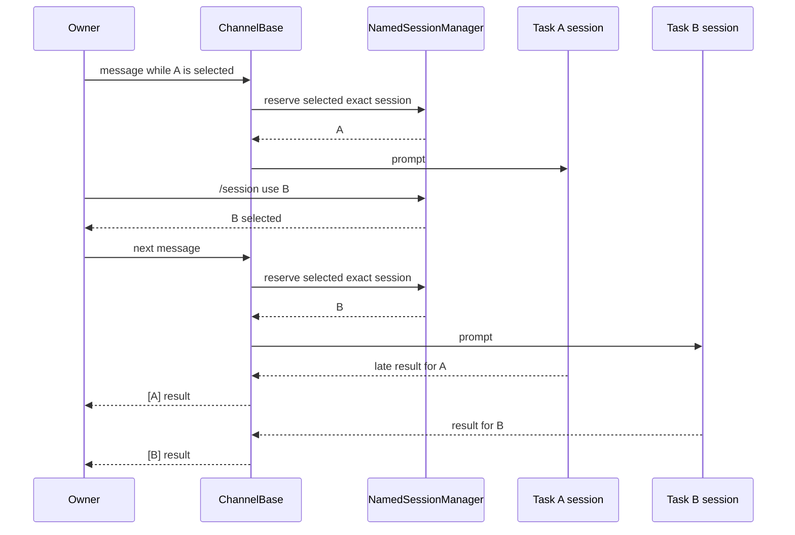

# Channel Named Sessions: Part 3

## Goal

Allow one owner to keep several named Channel tasks running concurrently while
selecting which task receives the next normal message. Part 3 adds task-aware
cancellation, permission correlation, and visible source labels without
changing the version 1 registry, the daemon session protocol, or the model
transcript.

This remains opt-in for daemon-managed Channels with `sessionScope: "user"`
and `multiSession: true`. Existing Channels behave exactly as before when the
mode is disabled.

## Verified baseline

Part 1 made same-chat delivery state session-aware. Part 2 added the exact
owner catalog, exact-session loading, per-owner serialization, and the selected
compatibility route. The current runtime already keeps these structures by
session ID:

- prompt queues, active prompt state, queued-turn reservations, collect
  buffers, output segments, and cancellation state in `ChannelBase`;
- delivery targets and working directories in `SessionRouter`;
- prompt clients, permission request ownership, and active-prompt state in the
  daemon bridge; and
- streaming or activity state in the DingTalk, Feishu, QQ, Weixin, and example
  adapters.

Consequently, different named sessions can execute concurrently today. Part 2
prevents users from reaching that behavior by rejecting selection changes
while either the selected task or the destination task is busy. Part 3 removes
that policy restriction; it does not introduce another scheduler or duplicate
runtime activity in the registry.

The registry continues to own task names and ownership. The selected legacy
route remains only the compatibility pointer used to bind the next normal
message. Inactive live sessions keep their own delivery targets.

## Scope

Part 3 includes:

- selecting or creating a task while another task is queued, running, waiting
  for permission, or completing cancellation;
- selecting a task that is itself still running;
- `/session cancel [<name>]` on every named-session Channel;
- selected-task semantics for bare permission commands and exact request-ID
  semantics for an inactive task;
- source labels for foreground and background results, direct shell results,
  streaming blocks, permission messages, and interactive user-input surfaces;
  and
- focused manager, base-runtime, adapter, daemon-backed, and compatibility
  verification.

Part 3 does not include:

- worktree creation or filesystem isolation, which remains Part 4;
- task-directed prompt submission such as `/session send`;
- clearing queued follow-up messages or cancelling media preparation;
- task-targeted webhooks or loops;
- standalone Channel execution, ambient group history, or a different session
  scope;
- persisting in-flight prompts, permissions, cards, or display names across a
  worker crash; or
- exposing daemon session IDs or the daemon-wide session catalog to chat.

## Invariants

1. An owner remains exactly `(channelName, chatId, senderId)`. A command can
   name only a task inside the authenticated envelope's owner record.
2. An owner has at most one selected open task, but any number of that owner's
   open tasks may be queued or running, subject to the existing eight-task and
   daemon process limits.
3. Changing selection changes only the compatibility route. It never pauses,
   cancels, retargets, or transfers the active prompt, queued turns,
   permissions, streaming buffers, or output of another session.
4. A normal inbound message is bound to the task selected when its named-turn
   reservation is acquired. Session-scoped bridge commands such as `/model`
   follow the same binding. Later selection changes cannot retarget either.
5. Close must still reject any task that is preparing media, queued, running,
   waiting for input or permission, or winding down cancellation. Clear/reset
   remains the explicit destructive operation that can cancel and replace only
   the selected task through its existing bounded cleanup path.
6. A task name is never interpreted as a daemon session ID. Failed exact loads
   never create a replacement and never change the prior selection.
7. Labels are delivery-only metadata. Raw model chunks and the final response
   passed back by the bridge remain unchanged for transcript persistence,
   telemetry, memory, and future resume.
8. A permission or card action must retain the original request, session, run,
   owner, and target checks. Selection is an additional rule for bare text
   commands, not an ownership authority.
9. If named presentation metadata cannot be resolved for a managed session,
   the runtime must not guess another task or owner. Correlated interactive
   operations fail closed, and delivery reports a bounded internal error
   instead of emitting misleading unlabeled output.

## Concurrent selection

The named-session manager keeps its existing per-owner lock and failure
ordering. Only the busy policy changes:

- `create` no longer checks whether the previously selected task is busy;
- `use` no longer checks either the previous selection or the destination for
  busy state;
- `close` still rejects the task being closed when it is busy, but selecting a
  busy fallback is valid; and
- `reset`, clear, queue ordering, and close rollback remain unchanged.

Selecting a dormant task still exact-loads it before committing the selection.
Selecting an already live task only rebinds the compatibility route. A running
task is necessarily live in the current worker, so selecting it does not
create a second daemon client.

Asynchronous inbound preparation keeps the Part 2 reservation contract. Media
preparation holds the owner's catalog lock until it binds the then-selected
session. A simultaneous `/session use` waits for that binding and then succeeds
even though the old task is now busy. The prepared message stays on the old
task; messages and session-scoped bridge commands accepted after the switch
bind the new one.

The resulting flow is:



No cross-session mutex is added. Existing per-session queues continue to
serialize turns within one task while allowing task A, B, and C to run in
parallel.

## Task lookup without registry migration

The manager adds narrow read operations over the existing in-memory registry:

- owner-scoped lookup of the selected task or an explicit task name, used by
  cancellation; and
- internal lookup by exact session ID, returning only the stored task name and
  target, used to derive delivery presentation.

An asynchronous presentation lookup may perform the same exact legacy-route
adoption Part 2 already performs for the first inbound message. This covers a
background response from an existing selected route immediately after named
mode is enabled but before its owner has sent another message. Adoption still
requires an exact channel, chat, sender, and current-workspace match and must
persist `default` before output is labeled or delivered. It never adopts an
unknown inactive route or replaces a failed session.

The session-ID lookup is never exposed to command input or output. Session IDs
are process-wide exact identities, and the manager is already scoped to one
Channel instance. Because only open tasks are capped and closed records can
accumulate, delivery must not scan every owner and task for each stream update.
The manager builds a non-persisted `sessionId -> task presentation` index after
registry validation and refreshes it only after a successful owner commit.
Registry validation already rejects duplicate session IDs, so this index is a
derived cache, never a second authority. Closed records remain indexed so stale
background or permission events can be rejected in O(1) without making a
closed task visible or actionable again.

The version 1 registry schema and atomic-write format do not change. Mutable
display names are not added to it.

## Named cancellation

`/session cancel` targets the selected task. `/session cancel <name>` targets
that exact owned task even when another task is selected. Lookup is
case-insensitive like the other task commands and never accepts a session ID.

The command cancels the task's current active prompt through the existing
`requestActivePromptCancellation` state machine. This preserves all established
behavior:

- duplicate cancel requests share the in-flight cancellation request;
- output is held while cancellation is pending;
- a successful cancel stops streaming, discards collect-mode follow-up data,
  removes pending permissions, and emits one terminal cancellation event;
- a failed or timed-out cancel leaves the response deliverable; and
- cancellation is refused after response delivery has started.

The command reports the task name in success, failure, and no-active-request
responses. It does not load a dormant task merely to cancel it and does not
purge queued future turns or media preparation. Those operations have distinct
ownership and delivery consequences and are outside this part. Close remains
the only non-destructive catalog operation, and clear/reset remains the
explicit selected-task reset.

The platform-specific `/cancel` command, where registered, keeps its current
selected-task meaning and uses the same cancellation helper. Run-scoped stop
buttons continue to cancel their captured `(sessionId, runId)` and therefore
remain correct after selection changes.

## Permission correlation

Every pending permission already records its exact request ID, session ID, and
delivery target. Interactive user-input contexts additionally carry the active
run and owner. Part 3 changes only text-command selection and presentation.

### Bare commands

For `/approve`, `/approve-always`, or `/deny` without an argument, the handler
captures the currently selected named session for the authenticated owner and
considers pending requests only from that session. A permission from an
inactive task is never selected merely because it is the only request in the
chat.

If the selected task has no pending request, the response states that no
permission is pending for the selected task and may identify other owned tasks
that require an explicit request ID. It must not expose another owner's task or
request.

### Explicit request IDs and cards

`/approve <request-id>`, `/approve-always <request-id>`, and
`/deny <request-id>` may answer an inactive task. The existing checks still
require the original chat, thread, sender for user-scoped input, shared-session
authorization where applicable, and bridge-side request-to-session ownership.
Knowing a task name, request ID, or daemon session ID is insufficient to cross
an owner boundary.

Platform card callbacks retain their captured request, session, run, owner,
target, and operator validation and do not consult current selection. A card
created by task A therefore remains valid after the owner selects task B.

Every named-session text permission prompt displays its exact request ID and
shows the explicit command form, so a request delivered by an inactive task is
actionable without changing selection. Permission prompts, ambiguity lists,
and acknowledgement messages include the task source. An acknowledgement uses
the permission's captured session rather than re-reading current selection
after the bridge response awaits. Interactive question contexts receive the
same source label so adapters can render it in the card header and fallback
text.

The named-mode text fallback distinguishes bare selected-task commands from
exact inactive-task commands. The explicit request-ID form remains the stable
way to answer a request after selecting another task:

```text
[feature-a] Permission required to run a tool
Request: req-123

/approve req-123          this exact request
/approve-always req-123   this exact request, persistent grant
/deny req-123             this exact request
```

## Delivery-only source labels

### Format and identity

Named output uses:

```text
[feature-a] ...
[Alice · feature-a] ...
```

Direct chats use only the task name. Groups include the sanitized originating
sender label. The active envelope's sender name is preferred. Background
delivery can reuse the newest persisted observed-contact label; if no display
label is available, the sanitized sender ID is the deterministic fallback.

Task names are already bounded ASCII slugs. Sender labels continue through the
existing sanitizer before interpolation. The formatted source label is
computed from the registry's exact session record and is never accepted from
adapter or model content. Adapters escape it for their own Markdown/card
dialect and reserve its length before applying existing platform content caps.

### Presentation metadata

`ChannelBase` exposes one protected, read-only presentation helper and adds an
optional `sourceLabel` to output-segment and user-input request contexts. The
field is populated only for named-session mode. Existing third-party adapters
remain source-compatible because the field is optional; the base delivery path
handles final text for adapters that do not implement streaming. A custom
adapter that opts into `multiSession` is behaviorally supported only after its
own streaming, splitting, card, and retry boundaries consume the field; Part 3
certifies all in-repository adapters, not uninspected deployed plugin code.

Formatting occurs after the bridge has produced raw output:

- the first visible update of each output segment carries the label;
- every independently delivered block-streaming or QQ flush carries the label;
- every adapter-internal platform split, including Telegram HTML and WeCom
  Markdown chunks, repeats the label so concurrent long replies cannot
  interleave into unlabeled messages;
- final-card replacements carry one label, even if earlier streaming updates
  already displayed it;
- proactive and fallback background replies carry the label to the adapter's
  visible delivery boundary;
- direct shell success and failure replies are labeled from the exact session
  reserved for that command;
- plain permission messages and permission acknowledgements are labeled; and
- question cards render the label in their visible heading or introductory
  markdown.

When an adapter separates media markers from text, the logical result still
includes a labeled text envelope before or beside the attachment. Part 3 does
not redesign platform attachment APIs or require a caption on every binary
message.

Repeated tokens are not prefixed. Adapters keep a label beside their existing
per-session or per-run presentation state and apply it only when they emit a
new visible message or replace a whole card. Existing sender mentions remain
intact; in groups, the task label is the stable visible source even when a
platform also renders an `@` mention. A retry retains raw content and the
captured label separately, then reapplies exactly one label at its visible send
boundary; it never infers presentation state by inspecting model-generated
text that happens to start with the same label.

### Adapter responsibilities

- Base/default delivery prefixes final one-shot messages and wraps every
  `BlockStreamer` send.
- DingTalk associates the label with the run presentation so status, output,
  fallback, cancellation, and question-card surfaces retain the task after a
  switch.
- Feishu stores the label with the inbound card state and uses it for streaming
  updates, final replacements, plain fallbacks, stopped cards, and question
  cards.
- QQ stores the label in its per-session stream state and prefixes each idle,
  size, tool-call, retry, and final flush without changing reply-context or
  sequence ownership.
- Telegram and WeCom pass structured presentation metadata into their existing
  splitters, reserve the prefix within platform limits, and repeat it on every
  independently sent text chunk.
- Weixin factors its existing media projection into a label-aware sender that
  parses raw markers before rendering the label, so even a media-only result
  retains a visible text envelope and a crafted display label cannot become a
  marker.

Tool-call events remain session-keyed. Card-based adapters show tool progress
inside the run presentation that already carries the source label; no task
name is added to bridge events or model content.

## Failure and recovery semantics

- Selection persistence and exact-load ordering remain unchanged from Part 2.
- A selection failure leaves the old task selected and does not affect any
  running task.
- A cancel lookup failure or missing active prompt performs no bridge mutation.
- A permission request whose exact target or named presentation cannot be
  verified is cancelled rather than offered to the wrong chat or owner.
- A delivery lookup never falls back to the currently selected task. The
  originating session ID is the only catalog lookup key. The sole bootstrap
  exception is exact, persisted `default` adoption of that same selected
  legacy route.
- Adapter send failures retain their existing retry and fallback behavior; a
  retry reapplies the same captured source label.
- Daemon or worker restart still restores task names and exact sessions lazily
  through Part 2. In-flight prompt state, pending permissions, streaming cards,
  and cancellation requests are runtime-only and are not promised to survive a
  worker crash in Part 3.

## Compatibility

When `multiSession` is absent or false, busy guards, permission lookup, output
text, cards, streaming, and cancellation remain unchanged. No label is added
to legacy single-route output. The existing fail-closed gates for standalone
execution, history, webhooks, loops, and incompatible scopes remain in force.

The registry remains version 1 and requires no migration. The daemon bridge
and daemon REST/API surface do not change. Part 3 does not depend on peer-agent
session addressing or worktree support.

## Delivery stages

Part 3 lands as two PRs so the safety prerequisites merge before the
running-switch guard is removed.

### Part 3A: Correlation and presentation

Part 3A is merged. It keeps Part 2's idle-only selection policy and adds exact
task lookup, the derived presentation index, source labels, explicit request
IDs in named permission prompts, and presentation coverage for every
in-repository adapter.
The detailed design is in
[`channel-named-sessions-part3a.md`](./channel-named-sessions-part3a.md). These
changes are independently useful and can be reviewed while concurrency remains
gated.

Expected diff after the full adapter audit: 450–760 production lines and
1,020–1,730 test/documentation lines. The proposal's original estimate did not
include custom final-send overrides or prefix-aware DingTalk, Telegram, and
WeCom splitting.

### Part 3B: Concurrent control

Part 3B removes only the selection-related busy checks, keeps an already
reserved turn on its exact task without rebinding the selected compatibility
route, makes bare permission commands selected-task-only, adds named
cancellation through the existing state machine, updates the affected Part 2
guard tests, and runs the three-task daemon-backed E2E plan. It does not revisit
adapter presentation or introduce another runtime abstraction.

Expected diff: 80–160 production lines, 300–500 test lines, and 20–50
documentation lines.

The merge order is mandatory: 3A, then 3B. Part 3B must not temporarily ship
without labeled late output and selected-task permission semantics.

## Implementation slices

1. Add read-only task lookup and derive delivery-only source presentation from
   exact registry records.
2. Propagate optional metadata through output and user-input contexts and apply
   it at every in-repository visible-delivery boundary, including cards,
   progressive streams, platform splits, persistent retries, media projection,
   and the plugin extension contract, without changing raw bridge output.
3. Relax only selection-related busy checks, then add named cancellation and
   selected-session permission filtering in `ChannelBase` using the existing
   ownership and cancellation state machines.
4. Add focused unit, adapter, daemon-worker compatibility, and daemon-backed
   E2E coverage before enabling the running-switch acceptance cases.

Across both PRs, production code should remain near 530–920 lines and tests/docs
near 1,320–2,230 lines. The original issue estimate undercounted
adapter-internal splitting, custom final-send overrides, and the checked-in
design artifacts; code scope should not be expanded to consume that variance.
If implementation requires a new daemon protocol, registry version, global
scheduler, or task lifecycle service, that is evidence the change has escaped
Part 3 and should stop for redesign.

## Verification plan

Focused manager tests verify busy-to-busy selection, creation while busy,
exact dormant load ordering, busy close rejection, and fallback selection of a
running task. Base-runtime tests run three sessions concurrently, switch during
preparation and active prompts, keep `/model` session-local, cancel selected and
inactive tasks, preserve other owners, correlate two pending permissions, label
foreground/background and block-streamed output, and prove disabled-mode output
is byte-for-byte unchanged.

Adapter tests verify DingTalk run cards and question cards, Feishu streaming and
final cards, QQ repeated flushes and retries, Telegram and WeCom long-message
splits, labeled media envelopes, and existing same-chat passive reply and
activity cleanup. Verification then runs focused package tests, repository
build, typecheck, lint, and the daemon-backed Channel E2E plan in
`.qwen/e2e-tests/channel-named-sessions-part3.md`.

## Alternatives reviewed

### Persist running state in the registry

Rejected. Runtime activity changes too frequently for atomic catalog writes,
would be stale after crashes, and would create a second authority beside
`ChannelBase` and the bridge. The registry should remain durable ownership and
selection state only.

### Add a cross-session scheduler or owner actor

Rejected. Per-session queues and prompt clients already provide the required
concurrency and isolation. A second scheduler would add ordering and shutdown
failure modes without solving a current gap.

### Route late output through the selected task

Rejected. Selection is an inbound compatibility pointer, not an outbound
authority. Using it would recreate the cross-task misdelivery Part 1 was built
to prevent.

### Put task labels into prompts or persisted transcripts

Rejected. It would contaminate model context, resumed history, token usage,
memory extraction, and provider behavior. Labels are a Channel presentation
concern.

### Make every permission require a request ID

Rejected. Bare commands remain convenient and unambiguous when bound to the
selected task. Exact IDs are required only to act on an inactive task.

### Cancel all queued work for a task

Rejected for Part 3. Queue reservations, media preparation, collect buffers,
and active prompts have different settlement semantics. Reusing the proven
active-prompt cancellation path gives a bounded command contract without
inventing a destructive queue purge.
