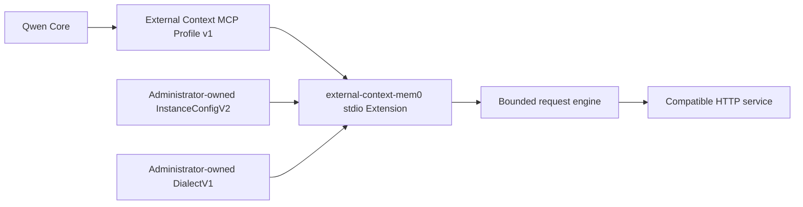

# Administrator-configured Mem0 External Context Extension

**Status:** PR2 implementation

**Date:** 2026-08-28

**Related profile:**
[External Context Provider Extensions](./external-context-provider-extensions.md)

**Related implementation proposal:**
[PR #9952](https://github.com/QwenLM/qwen-code/pull/9952)

## Decision

Mem0-compatible services integrate through a self-contained local stdio
Extension named `external-context-mem0`. The Extension implements External
Context MCP Profile v1 and translates the fixed `context_search({ query })`
contract through an administrator-owned, versioned dialect file.

Qwen does not publish, select, or maintain provider presets. The instance file
binds one endpoint, scope, credential environment-variable name, timeout, and
absolute dialect path. The dialect file describes request and response
differences within the existing closed `DialectV1` grammar. Its `id` is an
administrator-managed audit label and has no registry or file-name semantics.

External Context MCP Profile v1 remains the only public Qwen interoperability
boundary. Qwen Core does not gain a provider registry, public provider SDK,
dynamic module loading, or new third-party cases in its private
`ProviderConfig` union. The existing direct integration remains available for
compatibility and is not modified by this design.

## Goals

- Let administrators connect retrieval-only compatible services without a
  Qwen release or built-in provider data.
- Keep the model-facing contract stable as `context_search({ query })` while
  endpoint, credential, scope, timeout, and dialect remain administrator-owned.
- Preserve the bounded request engine, response normalization, and failure
  behavior already implemented by the Extension.
- Give protocols outside the closed grammar a clear path to a separate local
  or remote MCP Extension.

## Non-goals

- Publish provider presets, provider-specific contract fixtures, or live
  service credentials.
- Add ordinary Qwen settings or Extension settings for the configuration path.
- Define arbitrary request templates, JSONPath, scripting, custom headers, or
  executable hooks.
- Probe or fall back between upstream protocol versions.
- Add memory creation, update, deletion, Auto Recall, redirects, or retries.
- Migrate or remove the existing direct External Context integration.

## Architecture



The local Extension owns configuration loading and HTTP translation. Qwen sees
only the MCP profile. A service that cannot fit the bounded dialect grammar
owns a separate MCP implementation instead of expanding the grammar or Qwen
Core.

## Version model

Four independent version axes remain explicit:

1. **MCP Profile version** defines the Qwen-to-Extension tool contract. This
   Extension implements External Context MCP Profile v1.
2. **Instance schema version** defines administrator binding. This design uses
   `schemaVersion: 2`.
3. **Dialect version** defines interpretation of the closed request and
   response grammar. This design keeps `dialectVersion: 1` unchanged.
4. **Upstream API version** belongs to the service and appears only in the
   administrator's endpoint and static dialect path.

An incompatible instance schema or dialect version fails closed. In
particular, the old `schemaVersion: 1` plus `preset` shape is not retained as a
compatibility branch because the shipped registry never provided a usable
provider.

## Instance configuration

`InstanceConfigV2` supplies deployment-specific binding:

```json
{
  "schemaVersion": 2,
  "dialectPath": "/etc/qwen/external-context/memory.dialect.json",
  "endpoint": {
    "origin": "https://memory.example.com",
    "basePath": "",
    "allowInsecureHttp": false
  },
  "credentialEnv": "MEMORY_API_KEY",
  "scope": {
    "userId": "repository-memory"
  },
  "timeoutMs": 5000
}
```

`QWEN_EXTERNAL_CONTEXT_MEM0_CONFIG` is supplied through the Extension process
environment and points to this file by absolute path. It is not a normal Qwen
setting. Managed deployments provide it through a system environment,
controlled launcher, or pinned MCP configuration. Production files should
normally live outside workspaces; a repository-owned file is trusted only when
the repository is inside the deployment's administrative trust boundary.

`dialectPath` must also be absolute. The Extension does not resolve it relative
to the instance file, interpolate environment variables, load URLs, search
fallback locations, or watch for changes. Both files are capped at 64 KiB and
read once during startup. Changes take effect only after restarting the
Extension.

The endpoint separates `origin` from `basePath` so authority validation remains
independent of path joining. Scope values are fixed administrator input, not
tool arguments. Every non-`omit` scope location in the dialect requires the
matching instance value, while every `omit` location rejects a supplied value.
Administrators choose fixed scope or `omit`; there is no optional-scope
grammar.

Credentials are never stored in either file. `credentialEnv` names the process
environment variable containing the credential, which is read only after both
files and all semantic constraints validate.

## Dialect configuration

The second file conforms to the unchanged `DialectV1` schema. This synthetic
example illustrates the contract without naming a provider:

```json
{
  "dialectVersion": 1,
  "id": "organization-memory-v1",
  "auth": "authorization-token",
  "search": {
    "method": "POST",
    "path": "/memories/search",
    "queryLocation": "json",
    "userIdLocation": "json.filters",
    "agentIdLocation": "omit",
    "appIdLocation": "omit",
    "limitField": "limit"
  },
  "response": {
    "collection": "results",
    "idField": "id",
    "contentField": "memory",
    "titleField": "omit",
    "uriField": "omit",
    "scoreField": "score",
    "updatedAtField": "omit"
  }
}
```

The grammar stays deliberately closed:

- Authentication is `authorization-token`, `authorization-bearer`, or
  `x-api-key`.
- Search uses `GET` or `POST` with one static exact path.
- Query, user, agent, and app values use only the enumerated `json`,
  `json.filters`, `query`, or `omit` locations supported by each field.
- Result limits use `top_k`, `limit`, or `omit`.
- Response collections are `results` or a root array.
- Response fields use only the explicit simple-name allowlists in the schema.
- `threshold` and `rerank` are typed fields, not request fragments.

The dialect cannot define arbitrary headers, body interpolation, JSONPath,
code, environment-variable expansion, redirects, or response transformations.
Its `id` does not have to match its file name or any value in the instance
file. Administrators own its naming and versioning policy.

## Startup and failure behavior

Startup is deterministic:

1. Read `QWEN_EXTERNAL_CONTEXT_MEM0_CONFIG` from the process environment.
2. Bounded-read and parse `InstanceConfigV2`.
3. Require an absolute `dialectPath`, then bounded-read and parse `DialectV1`.
4. Validate endpoint, HTTP opt-in, static paths, GET/JSON compatibility, and
   scope consistency.
5. Read the credential named by `credentialEnv`.
6. Start the stdio MCP server with the existing bounded request engine.

The process exposes no tool if any step fails. Errors use fixed categories for
unavailable or invalid instance configuration, non-absolute dialect paths,
unavailable or invalid dialect configuration, and invalid endpoint, path,
scope, or dialect semantics. Messages never include the real path, endpoint,
query, credential, or upstream response.

## Security and request boundary

- The model supplies only `query`; it cannot select the endpoint, credential,
  scope, dialect, timeout, or result limit.
- HTTPS is required by default. Plain HTTP requires explicit
  `allowInsecureHttp` opt-in for a trusted private network.
- Origin validation rejects embedded credentials, query strings, fragments,
  and paths. Static paths reject traversal, percent encoding, control
  characters, and ambiguous separators.
- The request engine does not follow redirects, retry, probe protocol versions,
  or cache responses.
- Requests have a bounded timeout. Responses are capped at 1 MiB before JSON
  parsing, normalized through fixed fields, and limited to five results.
- Retrieved content is untrusted external context. Fixed scope values are
  routing values, not authorization boundaries.
- A local Extension runs with the Qwen process user's privileges. The Extension
  package is a distribution unit, not a sandbox or a security binding.

## Retrieval-only boundary

The manifest exposes exactly `context_search`. A dialect cannot enable memory
creation, update, deletion, or Auto Recall. Write protocols require a separate
future profile or Extension because their idempotency, duplication, timeout,
and authorization semantics do not fit the retrieval grammar.

## Packaging and service ownership

The npm package publishes only the bundled runtime, canonical schemas,
Extension manifest, and README. It contains no administrator dialect, provider
preset, provider identifier, or provider-specific contract fixture.

The public package name is `@qwen-code/external-context-mem0`. Its package and
Extension manifest versions follow the Qwen Code release version and are
updated in the same release commit. Administrators can install the latest
release with `qwen extensions install @qwen-code/external-context-mem0` or pin
an explicit npm version. Installation never creates an instance file, dialect
file, credential, or ordinary Qwen setting.

The normal release workflow builds the self-contained bundle, checks whether
the exact package version already exists, and publishes with the release's npm
dist-tag and provenance. The package participates in the shared
already-published guard so a partial release cannot be overwritten by a retry.
Because npm requires a package to exist before trusted publishing can be
configured, the publish step remains behind the
`NPM_EXTERNAL_CONTEXT_MEM0_TRUSTED_PUBLISHING_ENABLED` repository variable
until a maintainer completes the one-time public bootstrap publish and binds
the package to the `release.yml` workflow in the `production-release`
environment. The bootstrap should publish the first actual Qwen release that
contains this change, not invent a second version line. Future releases use
trusted publishing and require no npm token.

When a service fits `DialectV1`, its administrator writes and validates a local
dialect file. When it does not fit, the service owner publishes a separate MCP
Extension implementing External Context MCP Profile v1. Qwen does not add a
built-in provider rollout for either case.

## Rollout

1. **PR0:** Record the Extension architecture and External Context profile
   boundary.
2. **PR1:** Add the self-contained retrieval runtime, canonical schemas,
   bounded request engine, and synthetic contract tests with an intentionally
   empty registry.
3. **PR2:** Replace the unused registry with administrator-owned
   `InstanceConfigV2` and `DialectV1` files, while preserving the request engine
   and profile boundary.
4. **Distribution follow-up:** Publish the self-contained Extension through the
   normal Qwen Code npm release without adding provider data or Core wiring.
5. Design any portable write capability separately.

There is no Qwen-maintained provider-preset PR3. Administrators own compatible
dialect data; incompatible protocols use their own MCP Extension.

## Verification

Verification covers both canonical schemas; 64 KiB file limits; unavailable,
malformed, unsupported, relative, and semantically invalid configurations;
credential ordering; synthetic GET and POST request contracts; response
normalization; the MCP tool surface; real stdio MCP startup against a local
synthetic HTTP service; restart-only reload behavior; package contents; build,
typecheck, lint, and tests. No verification contacts a live provider service.
