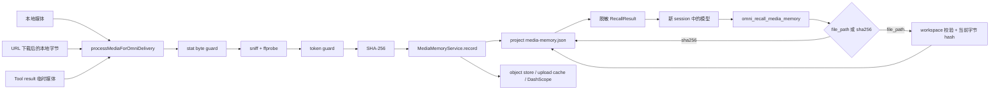

# S5a Omni 最小媒体 Memory 召回技术设计

> **Follow-up revision (2026-08-12):** 本文记录的是已实现的 S5a snapshot。
> 最新 #8188 要求模型召回只接受当前 session 签发的 opaque `resourceId`，路径与
> SHA-256 查询仅属于 Harness；完整 S5 的权威实现基线是
> `upstream/omni/s5-memory@d9eb5e37b0`（相对 S4 共 19 个 commit），包含三层
> File 身份、session registry、active/passive recall、Policy 结果收集与复用，以及
> Policy 产物命名碰撞、duration guard 与执行时间窗口修复。Provider-neutral 的
> 后续写入边界与 v1→v2 迁移方案见
> [Provider-neutral Omni ingestion and multimodal delivery](./2026-08-12-provider-neutral-multimodal-delivery.md)。
>
> **Audit status (2026-08-14):** Provider-neutral 后续设计的审计已按请求停止。
> 最后完成的三方审计是 Round 26，结果不 clean；Revision 27 已记录拟议修订，
> 但 Round 27 未形成有效的三方结论。详见新设计的
> [§12 Audit record](./2026-08-12-provider-neutral-multimodal-delivery.md#12-audit-record)。

## 状态

- 状态：Implemented
- 目标分支：`omni-experiment`
- 跟踪 Issue：[#8188](https://github.com/QwenLM/qwen-code/issues/8188)
- 路线图：[#8197](https://github.com/QwenLM/qwen-code/issues/8197)
- 已落地基线：S1 [#8183](https://github.com/QwenLM/qwen-code/issues/8183)、
  S2 [#8184](https://github.com/QwenLM/qwen-code/issues/8184)、
  S3 [#8185](https://github.com/QwenLM/qwen-code/issues/8185)
- 依赖边界：按路线图 S5a 只依赖 S2；当前源码基线已包含 S3，本方案只复用其受管
  目录与可靠性模式，不把 S3 能力变成新的功能前置条件
- 关联设计：
  [多模态文件识别与元数据提取](../2026-07-29-multimodal-file-recognition-and-metadata.md)、
  [Omni 多模态 Memory](../2026-07-29-omni-multimodal-memory.md)、
  [Omni 受管媒体存储](../2026-07-30-omni-managed-media-storage.md)
- 源码基线：`omni-experiment@dcab32cad55e3848a077ee8d3e064344af8056bd`

## 1. 背景与问题

S1 到 S3 已经实现图片、音频、视频从本地文件、URL 和工具结果进入统一投递
管线，但识别事实只存在于当前调用中。进程结束后，新 session 无法知道某个文件
曾经被识别，也无法复用已经获得的 MIME、尺寸、时长、编码或 token 估算信息。

S5a 的目标是建立最小的跨 session 识别记忆：Harness 在媒体识别成功后持久化
事实，模型在后续 session 中通过只读 Tool 按路径或内容 SHA-256 精确召回。

本设计只实现 #8188 明确要求的 `FileRecognized` 写入和主动召回，不提前实现
S5b 的 Policy 结果图、lineage、复用键和 file-version 隔离，也不实现 S6 的 GC、
容量预算和导出。

## 2. 已验证的实现基础

当前 `omni-experiment` 最近五个提交形成了以下边界：

| 提交         | 已实现能力                                | 与 S5a 的关系                                    |
| ------------ | ----------------------------------------- | ------------------------------------------------ |
| `dcab32cad`  | S3 上传缓存、凭证复用、失败失效、启动恢复 | `oss://` 仅是投递缓存，不能作为 Memory 身份      |
| `604a84f083` | S2 三模态、URL、工具结果、token guard     | 所有已支持媒体来源都能进入统一处理函数           |
| `dd188b0da6` | 四份 Omni 架构设计                        | 确定 Harness 独占写入、项目隔离、内容哈希身份    |
| `b9c27ee557` | S1 识别、对象存储、上传、投递             | 建立 `recognize -> hash -> store -> upload` 主链 |
| `74e86a4852` | `omni-experiment` PR CI                   | S5a PR 沿用该分支验证入口                        |

当前实现中，`packages/core/src/omni/recognition.ts` 的
`recognizeMediaFile()` 返回内容 sniff 得出的模态、权威 MIME、大小和 ffprobe
metadata；SHA-256 与 token estimate 在
`packages/core/src/omni/index.ts` 的 `processMediaForOmniDelivery()` 中补齐。
后者是当前唯一同时拥有以下完整事实的成功边界：

- `recognized.modality`；
- `recognized.detectedMimeType`；
- `recognized.sizeBytes`；
- `recognized.metadata`；
- `tokenEstimate`；
- 完整内容 `sha256`。

三个现有入口都汇入该函数：

1. 本地文件通过 `packages/core/src/utils/fileUtils.ts` 中的
   `readMediaViaOmniDelivery()`；
2. URL 通过 `packages/cli/src/ui/hooks/atCommandProcessor.ts` 下载为临时文件后
   直接调用；
3. 工具结果通过 `packages/core/src/omni/tool-result-media.ts` 解码为临时文件后
   直接调用。

当前源码尚未实现完整设计中的 `MediaResourceRegistry`、持久 `fileId` /
`fileVersionId` 图和 `OmniPolicySucceeded`。S5a 不能依赖这些未来组件。

## 3. 目标与非目标

### 3.1 目标

- 在 project 作用域持久化成功的媒体识别事实；
- 只由 Harness 在确定的 `FileRecognized` 边界写入；
- 以完整 SHA-256 作为 S5a 底层内容身份，相同字节只保存一份识别记录；
- 为 workspace 内稳定本地文件保留内部路径 occurrence；
- 新 session 中允许模型通过只读 Tool 按当前路径或 SHA-256 精确召回；
- Tool 返回识别 metadata，但绝不返回真实路径、鉴权信息或 `oss://` URL；
- 写入幂等，并在同进程及多进程并发下不丢失已提交记录；
- Memory 故障不回归 S1 到 S3 的媒体识别与投递能力。

### 3.2 非目标

S5a 不实现：

- 逻辑 `File`、`FileVersion`、`PolicyExecution` 或 `PolicyResult` 图；
- `OmniPolicySucceeded`、Policy artifact、lineage、coverage 或复用键；
- session `resourceId` 注册表；
- side-query、语义检索、模糊搜索、自动 prompt 注入或项目级枚举；
- 历史版本默认选择策略；
- Memory 删除、GC、容量预算、JSONL 导出或远端同步；
- 新的 `omni.memory.enabled`、CLI flag 或环境变量；
- 对 URL、临时下载路径或工具 staging 路径的可见 locator 召回。

## 4. 核心决策

### 4.1 S5a 保存内容识别记录，不冒充完整 File 图

#8188 要求“内容相同的两个文件不重复建节点”，而完整 Memory 设计要求不同来源
保留各自的逻辑 File，只复用底层内容。S5a 用一个明确的中间模型协调两者：

- `MediaRecognitionRecord` 是按 SHA-256 去重的底层内容识别记录；
- 多个本地路径可以作为 occurrence 指向同一个记录；
- S5a 不把该记录命名或解释为最终的逻辑 `File`；
- S5b 可以在 schema v2 中增加逻辑 File/FileVersion 节点，并让它们共享现有的
  内容识别记录，而无需复制 metadata 或改变 S5a 的去重结果。

因此，相同内容的两个路径在 S5a 中只有一个 `MediaRecognitionRecord`，同时内部
保留两个路径 occurrence。Tool 输出不暴露 occurrence。

### 4.2 使用项目内 JSON 文档与文件锁

Store 固定放在：

```text
<projectRoot>/.qwen/omni/media-memory.json
```

Service 是 project-scoped，不使用进程级 store singleton。每次写入或 Tool invocation
开始时从当前 `config.storage` 一次性解析并固定 project root、`.qwen` 路径和 workspace
边界；workspace 快照保留 project root 的 resolved lexical spelling，并把
`WorkspaceContext` 已在注册时 canonicalize 的目录直接固定为信任根，整个操作只使用
该快照。project root 的当前 realpath 必须精确匹配 `WorkspaceContext` 的 initial root，
防止启动时的 project symlink 后来被重定向到另一个目录，包括另一个已批准的附加
workspace。同进程切换 target directory 后必须构造/选择新 service，不能沿用旧
project 的路径或缓存。附加 workspace root 后来删除时仍保留原信任边界字符串；路径
查询会在当前候选 `realpath` 失败时返回不可用，而与 workspace path 无关的 hash 召回
和内容事实写入不受影响。不能再次 `realpath` 已固定的 workspace root，否则该目录
后来被替换为指向外部的 symlink 时会错误扩张信任范围。

选择一个带版本的 JSON 文档，而不是 SQLite 或 JSONL：

- S5a 只有按 SHA-256 的精确 upsert/get，不需要数据库查询规划或索引；
- Core 已依赖 `proper-lockfile`，并已有“进程内串行化 + 跨进程锁 + 临时文件
  原子 rename”的成熟写入模式；
- JSONL 要实现幂等更新还需要 tombstone、重放和压缩，超出 S5a；
- `version` 为后续 S5b schema migration 保留明确入口。

`.qwen/omni/.gitignore` 已自忽略整个目录。新建受管目录时请求 `0700`；已有目录按
第 8.1 节校验为真实目录，但不假定历史权限已经收紧。Memory 文件、锁哨兵和临时
文件使用 `0600`；POSIX 上已有 Memory 文件或锁哨兵若带 group/other 权限则拒绝
使用，并由 Tool 映射为不含绝对路径的 `store_unavailable`。

S5a 在 S6 治理落地前仍需防止单个文件无界占用内存和磁盘，因此使用四个内部硬
边界，不增加用户配置：

```ts
const MAX_MEDIA_MEMORY_BYTES = 16 * 1024 * 1024;
const MAX_MEDIA_MEMORY_PATHS_PER_ENTRY = 64;
const MAX_MEDIA_MEMORY_PATH_LENGTH = 4096;
const MAX_METADATA_STRING_LENGTH = 256;
```

预计序列化结果超过文件上限时拒绝本次 mutation、保留既有文档并继续媒体投递；
达到单 entry 的路径数量上限时不再增加该 path occurrence；单路径或 metadata
字符串超过上限时拒绝该 mutation。以上情况都不影响按当前路径重新 hash 后召回
既有同一内容。S6 再用 GC 和容量预算替代这组实验期硬边界。

### 4.3 在现有同步调用链显式写入，不增加 EventBus

`FileRecognized` 是语义生命周期边界，不是新的全局事件系统。
`processMediaForOmniDelivery()` 在完成 token guard 和 SHA-256 后显式调用：

```ts
await mediaMemory.record(payload);
```

写入位置在 hash 完成后、上传缓存查询和网络上传之前。这样：

- 被 transport guard 拒绝的文件不会进入 Memory；
- hash 失败的文件不会进入 Memory；
- 上传缓存命中仍会刷新识别记录；
- OSS 上传失败不抹掉已经成立的识别事实；
- Memory 不依赖短期 `oss://` 投递状态。

持久事实还需要一个当前投递链原先不要求的稳定性检查：byte guard 的初始 `stat`
保留 `dev`、`ino`、`size`、`mtimeMs`、`ctimeMs`；hash 完成后再次 `stat` 同一
`filePath`（沿用 `stat` 的 symlink-following 语义），并同时核对
`recognized.sizeBytes`。任何字段变化或复查失败都跳过本次 `FileRecognized`（只记
脱敏类别），避免把 probe 的旧 metadata 绑定到另一版字节的 hash；原媒体投递仍按
现有语义继续。稳定性通过后才单独为 occurrence 解析 canonical path，因此 occurrence
校验失败仍可安全地只省略路径。该检查缩小常见并发改写窗口，但不冒充对恶意 ABA
替换的强保证。

### 4.4 主动召回只做路径或 hash 的精确查询

新增只读 Tool：

```text
omni_recall_media_memory
```

一次调用只允许提供 `file_path` 或 `sha256` 之一。S5a 不提供 list、prefix、全文、
语义或跨 project 查询。路径查询重新计算当前文件的完整 hash，再按 hash 查询；
不直接信任持久化路径映射，避免文件内容变化后返回旧 metadata。

### 4.5 不新增 Memory 配置

现有 Omni 本身已经是 opt-in。S5a 在 Omni 媒体管线实际运行时收集事实，Tool 只在
`omni.enabled` 且 workspace trusted 时注册。主动召回是 #8188 的唯一模式，不提前
落地 S5b 才需要的 recall mode、返回预算或 side-query 配置。

## 5. 总体架构



## 6. 数据契约

### 6.1 写入输入

```ts
interface RecordRecognizedMediaInput {
  sha256: string;
  recognized: RecognizedMedia;
  tokenEstimate: OmniTokenEstimate;
  /** 仅在调用方证明它是当前 workspace 内稳定路径时提供。 */
  observedLocalPath?: string;
  recognizedAt?: string;
}
```

`observedLocalPath` 不是内容身份，只是内部 occurrence。URL、URL query、鉴权 header、
下载 `.part` 路径、Tool staging 路径和 object-store 真实路径不得放入该字段。

### 6.2 持久文档

```ts
interface MediaMemoryDocumentV1 {
  version: 1;
  entries: Record<string, MediaMemoryRecordV1>;
}

interface MediaMemoryRecordV1 {
  sha256: string;
  modality: 'image' | 'audio' | 'video';
  detectedMimeType: string;
  sizeBytes: number;
  metadata: MediaProbeResult;
  tokenEstimate: OmniTokenEstimate;
  observedLocalPaths: string[];
  firstRecognizedAt: string;
  lastRecognizedAt: string;
}
```

`entries` 的 key 是小写 64 位 SHA-256，且必须等于 value 中的 `sha256`。读取前先
用 file handle 的 `stat()` 拒绝超过 `MAX_MEDIA_MEMORY_BYTES` 的文件，再进行
带 `fatal: true` 的 UTF-8 解码和运行时 shape 校验；未知 `version`、非法 key、重复
或非法路径、非法 ISO timestamp、非有限数值、未知 modality/MIME/token status 都
使整个文档不可用，不能部分接受一个结构不可信的权威 store。

持久路径的 shape 定义为：当前平台绝对且 normalized、无 NUL、不超长度、数组内
唯一。读取 store 时不因路径已删除、project 被移动或已不属于当前 workspace 而访问
或丢弃它；这些 occurrence 是内部历史事实且不会进入 Tool 输出，当前可访问性只由
路径查询对调用参数重新判断。

`metadata` 只允许 `MediaProbeResult` 当前定义的字段；不能把未经筛选的 ffprobe JSON
直接持久化，其中 `formatName` 与 `codec` 还受
`MAX_METADATA_STRING_LENGTH` 限制，并必须符合 ffprobe 标签实际需要的 ASCII
`[A-Za-z0-9,._-]+`。`tokenEstimate` 只允许当前的 versioned estimator 结果。这样
单条公开结果不会借由手工篡改 store 形成超大字符串或指令文本输出。

数值按领域约束而不只是 `typeof number`：`sizeBytes` 为正 safe integer；
`durationMs`、width、height 可为非负 safe integer，frame count 为正 safe integer，
`frameRate` 为有限正数；token status 为 `ok` 时估算为正 safe integer，为
`unavailable` 时必须为 0。这样保留当前 ffprobe 能返回的退化 metadata，由 estimator
status 表达“不可估”，而不是把整个 store 误判为损坏。时间戳必须是 canonical ISO
字符串并满足
`firstRecognizedAt <= lastRecognizedAt`。

### 6.3 Upsert 规则

在跨进程锁内按 SHA-256 执行：

1. 不存在：创建记录，`firstRecognizedAt = lastRecognizedAt = recognizedAt`；
2. 已存在：刷新已验证的识别字段；`firstRecognizedAt` 取已有值与本次
   `recognizedAt` 的较早者，`lastRecognizedAt` 取较晚者，保证并发到达顺序或时钟
   回拨不会颠倒区间；
3. 有合法 `observedLocalPath`：按 canonical real path 去重后加入
   `observedLocalPaths`，每条不超过 `MAX_MEDIA_MEMORY_PATH_LENGTH`；
4. 重复事件不会创建第二个记录；
5. `observedLocalPaths` 达到 `MAX_MEDIA_MEMORY_PATHS_PER_ENTRY` 后不再增长；
6. 相同路径后来产生新 SHA-256 时创建新记录，不覆盖旧内容记录；
7. 序列化后的文档超过 `MAX_MEDIA_MEMORY_BYTES` 时拒绝提交，不覆盖旧文档。

S5a 不维护“路径当前指向哪个版本”的第二份索引。路径召回以当前字节 hash 为权威，
避免双账本和索引漂移。

### 6.4 Tool 输入

```ts
interface OmniRecallMediaMemoryParams {
  file_path?: string;
  sha256?: string;
}
```

JSON schema 与 `validateToolParamValues()` 共同保证：

- 两个字段必须且只能出现一个；
- `file_path` 必须是非空绝对路径，且不超过 `MAX_MEDIA_MEMORY_PATH_LENGTH`；
- `sha256` 必须是完整 64 位十六进制，写入查询前归一为小写；
- `additionalProperties: false`。

### 6.5 Tool 输出

```ts
type OmniRecallMediaMemoryResult =
  | {
      status: 'hit';
      entry: {
        sha256: string;
        modality: 'image' | 'audio' | 'video';
        detectedMimeType: string;
        sizeBytes: number;
        metadata: MediaProbeResult;
        tokenEstimate: OmniTokenEstimate;
        firstRecognizedAt: string;
        lastRecognizedAt: string;
      };
    }
  | { status: 'miss'; reason: 'not_recognized' }
  | {
      status: 'error';
      reason:
        | 'file_unavailable'
        | 'file_too_large'
        | 'outside_workspace'
        | 'recall_unavailable'
        | 'store_unavailable';
    };
```

输出必须由 allowlist 显式构造，禁止对内部 record 直接 `JSON.stringify()`。
`observedLocalPaths` 即使为空也不能进入 Tool 输出。

结果组合固定为：`hit` 只带 `entry`，`miss` 只带 `not_recognized`，其余固定 reason
只与 `error` 组合。Tool invocation 必须在自己的执行边界内捕获 fs、store 和解析
错误并映射为这些固定结果；不能让原始异常逃到 `BaseDeclarativeTool` 的通用 catch，
因为该层会把 `error.message` 放进模型可见内容。参数校验错误也只能使用不插值输入值
的常量消息。

## 7. 写入链路

### 7.1 唯一写入点

在 `processMediaForOmniDelivery()` 中：

```text
stat byte guard
  -> recognizeMediaFile
  -> token guard
  -> hashFileSha256
  -> source stat stability check
  -> MediaMemoryService.record
  -> upload-cache lookup
  -> object promotion on miss
  -> upload on miss
```

处理函数只有在 `config.isOmniEnabled()` 与 `config.isTrustedFolder()` 都为 true 时才
尝试任何 Memory 写入；direct embedder 绕过正常 Omni gate 也不能写入。通过总开关
后，处理函数把现有 `filePath` 当作可能的 occurrence，用 `fs.realpath()` 得到
canonical path，通过当前 `WorkspaceContext` 确认真实路径仍位于 workspace，并复核
canonical path 的 stat 仍等于 post-hash 指纹；路径校验失败只省略 occurrence，不能
阻止按 SHA-256 记录已经成立的内容识别事实。即使路径在 workspace 内，只要落在
当前 project 的 `.qwen/omni` 受管根下，也不得登记，避免用户直接读取 object、
download 或 store 文件时把内部真实路径写回 Memory。

因此无需修改已导出函数的参数：本地 workspace 文件会形成 occurrence；当前 URL
下载和 Tool result staging 都位于 `.qwen/omni/downloads`，由同一受管根校验排除，
但仍按 SHA-256 形成内容识别记录。未来若 staging 布局改变，必须继续保持这一测试
不变量，不能靠临时文件名猜测来源。

### 7.2 写入错误语义

Memory 是附加识别能力，不能成为 S1 到 S3 投递链的单点故障：

- hash 后、进入 Memory mutation 前调用 `signal?.throwIfAborted()`；
- `MediaMemoryService.record()` 被 `await`，保证成功返回时记录已经落盘；
- 跨进程锁采用有界退避，计划重试延迟总预算不超过 1 秒；拿锁超时按写入失败
  处理，且该预算不冒充底层文件系统 I/O 的硬时限；
- mutation 一旦进入 read-modify-write 临界区就完成或回滚，不在原子提交中途响应
  取消；返回后再次检查 signal，因此取消会等待当前 mutation 结束，但不会遗留后台
  写入；文件大小和拿锁重试有界不等于底层文件系统 I/O 有确定时限；
- 写入错误在边界处捕获，记录不含路径、URL 或正文的 warning；
- 原媒体处理继续执行上传缓存、对象存储和上传；
- 不返回虚假的“Memory 已写入”状态；
- 后续主动召回遇到相同 store 错误时返回 `store_unavailable`，而不是伪装成 miss。

这里不能 fire-and-forget。后台写入会在进程退出时丢失，也会让跨 session 验收依赖
不可观测的时序。

## 8. Store 一致性与恢复

### 8.1 进程内与跨进程写入

写入协议沿用 Core 已有的文件 Memory 模式：

1. 以 store 绝对路径为 key，在进程内串行化 mutation；队尾 settle 后仅在仍是当前
   队尾时删除 map entry，避免长生命周期 embedder 访问多个 project 后泄漏 key；
2. 对 `<projectRoot>/.qwen` 和 `.qwen/omni` 的每个受管目录组件逐级执行非递归
   `mkdir` 与 `lstat`，拒绝 symlink/非目录；只创建 S5a 所需的 `.gitignore`，不借
   `OmniObjectStore.ensureLayout()` 提前创建 S3 的 object 目录；
3. 先 `lstat` 已有 `.media-memory.lock` 哨兵并拒绝 symlink/非普通文件，再以平台
   支持的 no-follow、non-blocking 选项打开或创建为 `0600`，最后以同一 handle 的
   `stat()` 复核类型与 POSIX group/other 权限；并发首次创建遇到 `EEXIST` 时重新
   `lstat`、打开并复核已有哨兵，不能在进入跨进程锁之前丢失一次正常写入；
4. 使用 `proper-lockfile` 获取跨进程锁，设置 `realpath: false`、
   `stale: 30_000`、`update: 10_000`，以及计划延迟总和小于 1 秒的 retry 参数；
5. 在锁内重新读取、严格解析、upsert；
6. 锁内使用进程所有的 `media-memory.json.<pid>.tmp`：若它是同一 PID 上次崩溃
   留下的普通 `0600` 文件则先 unlink；若是 symlink、非普通文件或 POSIX 权限过宽
   则拒绝。随后以 `wx` 和 `0600` 创建。不同进程不共享 temp 路径，因此锁被判 stale
   后恢复的旧 writer 不能删除或提交新 writer 的 temp；
7. 写完后 `fsync` 文件；序列化大小仍在硬上限内才原子 rename 到
   `media-memory.json`；每次 rename retry 前都重新核对 temp 的 inode、大小和
   时间指纹以及 lock compromise 状态，不能在重试窗口提交其他 writer 的文件；
8. 明确每个 handle 的所有权：lock sentinel 校验后关闭，temp 在 fsync 后且 rename
   前关闭，read handle 在解析成功/失败时都关闭；在 `finally` 中清理未提交临时文件
   并释放锁。清理前再次核对 temp 指纹，只删除当前 writer 自己留下的版本；partial
   write 失败时从仍打开的 handle 刷新该指纹。

多进程锁覆盖完整的 read-modify-write 临界区，不能只锁 save。不同进程同时识别
不同文件时，第二个写入者必须在拿锁后读到第一个已提交的记录。

### 8.2 读取与损坏文件

读取无需加锁：原子 rename 保证读者只会看到旧版本或新版本，不会看到半文件。
读取路径绝不创建 `.qwen`、`omni`、lock 或 store；任一受管目录或 Memory 文件不存在
都表示空 store，已有目录组件为 symlink/非目录才是 `store_unavailable`。因此
`Kind.Read` 的 hash miss 不会产生文件系统 mutation。

读者先 `lstat` 拒绝明显的 symlink/非普通文件，再以平台支持的 no-follow、
non-blocking 选项打开 `media-memory.json`，最后用同一 handle 完成 `stat()`、
权限/大小校验和读取。non-blocking 避免竞态下打开 FIFO 时等待 writer；handle 复核
遇到 `lstat` 与 `open` 之间的正常原子替换时有界重试，保证 rename 并发下只会解析旧
inode 或新 inode 的完整内容。POSIX 上拒绝带任何
group/other 权限的既有 Memory 文件；锁哨兵只在 mutation 路径校验。新建与每次
原子替换的目标文件都必须保持 `0600`。Windows 不把 POSIX mode 当成 ACL 证明，只
依赖当前用户的 profile/workspace 访问控制，且不能在文档或实现中把 `0600` 描述成
跨平台强隔离保证。

目录链在打开和 rename 前再次校验。与第 9.1 节相同，Node 没有可移植的逐层
`openat()`，而且并非所有平台都提供可用的 no-follow 打开语义，因此不能声称完全
消除恶意并发替换祖先目录或最终组件的竞态；这仍是 trusted workspace 内的残余
风险，不是跨信任边界的强沙箱。

`media-memory.json` 是权威 Memory，不具有上传缓存“损坏即清空、最多多传一次”的
可丢弃语义。因此：

- 文件缺失表示空 store；
- JSON、UTF-8、schema 或 version 非法表示 `store_unavailable`；
- mutation 遇到损坏文档必须失败并保留原文件，禁止写一个空文档覆盖；
- 日志只记录错误类别和 store basename，不输出项目绝对路径或记录内容。

S5a 不自动修复、压缩或删除记录。迁移和治理由后续切片显式实现。

## 9. Recall Tool 行为

### 9.1 路径查询

1. `path.resolve()` 得到绝对路径，并先对 invocation 开始时快照的 resolved lexical
   workspace roots（也接受其 canonical spellings）做纯词法 containment；明显在外部
   时立即返回，不对该候选路径调用 fs；
2. 在读取前拒绝被 `.qwenignore` 排除的 lexical path；
3. `fs.realpath()` 解析 workspace 内候选的 symlink；
4. 再次确认 canonical path 属于同一组 workspace roots，拒绝 symlink escape，并再次
   对 canonical path 应用 `.qwenignore`，避免 symlink 别名绕过忽略规则；
5. `lstat` canonical path，拒绝明显的 symlink 或非普通文件；
6. 以平台支持的 no-follow、non-blocking 选项打开 canonical path，并用 handle
   `stat()` 再次确认是普通文件，且大小不超过当前
   `effectiveMaxUploadFileBytes(config)`；
7. 再次解析原始输入并确认 canonical path 未改变；
8. 使用同一个已验证 file handle 流式计算当前内容 hash；
9. 按 hash 查询当前 project store；
10. 返回公开字段投影。

Hash 操作携带 Tool 的 AbortSignal。取消时终止读取，不把取消转换成 miss。
词法上位于 workspace 外的路径不触发任何 fs 调用；workspace 内候选只在 canonical
二次校验通过后读取和 hash。两类越界都返回 `outside_workspace`。

现有 `hashFileSha256()` 只接受路径，因此实现 PR 增加一个明确的 sibling
`hashFileHandleSha256(handle, signal, sizeBytes?)`；Recall Tool 传入打开 handle 后
快照的长度，只读取这段有界字节，避免并发追加让 hash 无界追赶文件增长。helper
使用显式的 `FileHandle.read()` 循环且不关闭调用方 handle，Recall Tool 在 `finally`
中负责关闭自己打开的 handle。
不能用一个所有权含糊的 path/handle union 让 abort/error 分支重复关闭或泄漏。
no-follow、handle stat、二次 canonical 校验和
同 handle hash 能缩小最终路径替换等常见 check-then-open 窗口；Node 没有可移植的
逐层 `openat()`，且部分平台缺少可用的 no-follow 语义，无法声称完全消除恶意并发
替换祖先目录或最终组件的竞态。该残余风险限定在用户已信任、当前用户可写的
workspace 内，必须在实现审计中保留并复核，不能把这里描述成强沙箱边界。

### 9.2 SHA-256 查询

Hash 查询不读取文件，只在当前 project store 中做精确 key lookup。不存在时返回
`not_recognized`。不接受前缀，不支持枚举，因此不能通过短 hash 扫描项目记录。

### 9.3 Tool 注册与下游消费者

Tool 使用 `Kind.Read`，`shouldDefer = false`，默认允许并可与其他只读 Tool 并发。
非 deferred 是跨 session 验收的一部分：新 session 的模型不应先猜测并搜索这个
Tool。只在以下条件同时满足时注册：

- `config.isOmniEnabled()`；
- `config.isTrustedFolder()`；
- 非 `--bare` 的正常 Tool registry。

Invocation 开始时、路径 hash 完成后访问 store 前、以及返回 store 结果前再次检查
Omni enabled 与 trusted 状态，防止长生命周期 registry 中的条件在注册后或长文件
读取期间变化；不再满足时停止后续访问并返回固定 `recall_unavailable`。

Tool 不要求当前 Provider 仍支持 DashScope 上传；已经存在的本地识别事实与临时
上传凭证无关。

新增 Tool 名称后必须同步以下消费者：

- `packages/core/src/tools/tool-names.ts` 的 Tool name/display name；
- `packages/core/src/config/config.ts#createToolRegistry()` 的条件 lazy factory；
- `packages/core/src/core/coreToolScheduler.ts` 的 `FS_PATH_TOOL_NAMES`；
- `extractToolFilePaths()` 的 `file_path` 分支；
- 相应 registry、permission、path activation 和 schema 测试。

Core scheduler 与 ACP 都消费同一个 Config ToolRegistry，因此不新增 ACP 平行 Tool
实现。

## 10. 安全与隐私

必须保持以下不变量：

- 只有 Harness 的 typed `RecordRecognizedMediaInput` 可以写入；Agent 没有写 Tool；
- store 固定在当前 project 的 `.qwen/omni`，不从模型参数选择 store 路径；
- 只有 trusted workspace 执行写入和注册召回 Tool；
- 本地路径只在确认属于 workspace 后持久化；
- URL、query string、Authorization、Cookie、配置中的 API key、base URL、`oss://`
  URL、staging/object 真实路径永不进入 Memory；按 #8188 明确保存的
  `observedLocalPaths` 本身按敏感数据处理，不能据此声称任意用户路径文本不含
  credential-like substring；
- Tool 输出通过 allowlist 投影，任何分支都不返回 `observedLocalPaths`；
- Tool 的调用描述和 `returnDisplay` 只使用固定状态与查询类型，不回显路径或其中
  任何片段；
- fs 和 JSON 错误在进入模型可见内容前映射为固定 reason，不拼接原始错误消息；
- S5a 新增的 Memory 日志不记录真实路径、URL、原始 metadata 文本或完整请求参数；
- 路径查询拒绝 workspace 外路径和 symlink escape，以同一 file handle 校验和 hash
  缩小常见 check-then-open 窗口，并明确保留第 9.1 节记录的残余竞态；
- 路径查询在读取前同时检查 lexical 与 canonical path 的 `.qwenignore`，symlink
  别名不能绕过忽略边界；
- hash 查询只返回当前 project 内精确命中，不能列举其他记录；
- `media-memory.json`、lock sentinel 和 temp 文件拒绝 symlink/非普通文件；
- `oss://` 上传缓存的过期、失效和删除不修改 Memory 身份记录。

## 11. 实现文件

建议的最小生产改动：

```text
packages/core/src/services/media-memory/media-memory-service.ts
packages/core/src/tools/omni-recall-media-memory.ts
packages/core/src/omni/index.ts
packages/core/src/omni/recognition.ts
packages/core/src/tools/tool-names.ts
packages/core/src/config/config.ts
packages/core/src/core/coreToolScheduler.ts
packages/core/src/permissions/permission-manager.ts
packages/core/src/permissions/rule-parser.ts
packages/core/src/permissions/autoMode.ts
packages/core/src/services/loopDetectionService.ts
```

测试与源码同目录：

```text
packages/core/src/services/media-memory/media-memory-service.test.ts
packages/core/src/tools/omni-recall-media-memory.test.ts
packages/core/src/omni/index.test.ts
packages/core/src/omni/recognition.test.ts
packages/core/src/config/config.test.ts
packages/core/src/core/coreToolScheduler.test.ts
packages/core/src/permissions/permission-manager.test.ts
packages/core/src/permissions/autoMode.test.ts
packages/core/src/services/loopDetectionService.test.ts
```

不修改 CLI settings schema、SDK/daemon 协议或现有 managed auto-memory Markdown
数据模型，也不新增跨 package API。

## 12. 验证计划

### 12.1 Store 单元测试

- 首次写入产生 version 1 文档；
- 同 hash 重放幂等，只刷新 `lastRecognizedAt`；
- 相同 hash、两个 workspace 路径只有一个 entry，内部保留两个 occurrence；
- 同一路径内容改变后形成两个 hash entry；
- URL/Tool 临时来源形成 hash entry，但不持久化临时路径或 URL；
- 用户直接读取 `.qwen/omni` 下的媒体时不持久化受管路径；
- 两个 service 实例并发写入不同 hash 不丢记录；
- 同一长生命周期 Config 切换 target directory 后读写进入新 project，不能命中旧
  project store；
- 进程内 serializer 在队尾 settle 后清除对应 project key，且不会误删后续队列；
- 子进程并发写入验证跨进程锁，而不只验证同进程 Promise 队列；
- 临时写失败和 rename 失败路径释放锁并清理 temp；
- read、lock sentinel 和 temp handles 在成功、解析失败、写失败时都恰好关闭一次；
- 模拟同一 PID 上次崩溃留下的合法 process-owned temp 会在下次 mutation 锁内回收；
- 损坏 JSON、非法 UTF-8、未知 version、非法 entry shape/数值/时间区间不被空文档
  覆盖；
- 手工篡改的超长或非标签型 metadata 字符串使 store 不可用，不能进入 Tool 输出；
- store、lock sentinel 或 temp symlink/非普通文件被拒绝；
- `.qwen`、`.qwen/omni` 中间目录 symlink/非目录被拒绝，外部 canary 不被读取、
  覆盖或删除；
- 写入文件和临时文件权限为 `0600`；POSIX 上权限过宽的已有 Memory 文件或锁哨兵
  返回 `store_unavailable`；
- 预计 store 大小、单 entry 路径数、单路径长度或 metadata 字符串长度超过硬边界时
  拒绝新增数据但保留既有文档；
- 跨进程锁超时后媒体投递继续，且没有延迟写在调用返回后发生。

### 12.2 写入边界测试

- byte guard、识别、token guard 或 hash 失败时不调用 Memory；
- 初始/复查 stat 指纹或 `recognized.sizeBytes` 不一致时跳过 Memory，但不新增媒体投递
  失败；
- hash 成功后在 upload-cache lookup 前调用一次 Memory；
- hash 后已取消时不进入 Memory；mutation 期间取消时先完成或回滚原子写入，返回后
  传播取消，且不遗留后台任务；
- upload-cache hit 仍执行幂等记录；
- object promotion 或上传失败时已成立的识别记录保留；
- Memory 写入失败时媒体管线继续，且没有未处理 rejection；
- 本地 workspace 文件登记稳定 occurrence；URL 和 Tool staging 被路径校验排除；
- Omni disabled、workspace untrusted 或 direct embedder 绕过正常 gate 时不写入；
- 重复识别同内容不会产生第二条记录。

### 12.3 Recall Tool 测试

- 参数恰好二选一，拒绝额外字段、相对/超长路径和短 hash；
- path query 重新 hash 当前字节后命中；
- 文件改变后不返回旧 hash 的 metadata；
- 超过当前 Omni byte cap 的文件返回 `file_too_large`，且不读取内容；
- hash query 精确命中和 miss；
- 词法上位于 workspace 外的路径不触发针对该候选路径的 fs 调用；symlink escape、
  目录、device/FIFO 被拒绝且不读取内容；
- `.qwenignore` 排除的 lexical path 以及指向被排除 canonical path 的 symlink 都不被
  打开或 hash；
- 取消大文件 hash 会及时结束；
- handle hash 在 hit、miss、error 和 abort 分支都由 Tool 恰好关闭一次；
- hit、miss、error 输出均不含 store 中的真实路径；
- fs 原始错误、URL、API key 和 `oss://` 不进入 `llmContent`、`returnDisplay`
  或 `error.message`；
- Tool 只在 Omni + trusted normal registry 下出现；
- 注册后 Omni/trust 状态变化时执行也会 fail closed，且不读取路径或 store；
- `extractToolFilePaths()` 能看到 `file_path`。

隐私测试应使用唯一 canary 路径和 credential 字符串，并对 ToolResult 的所有
模型可见字段递归序列化后断言 canary 不存在，避免只检查 happy-path
`llmContent`。

### 12.4 跨 session E2E

1. 在临时 project 启用 Omni，Session A 通过 `@image` 或 `@video` 完成识别；
2. 结束 Session A，确认没有依赖进程内对象；
3. 启动 Session B，让模型调用 `omni_recall_media_memory` 查询同一路径；
4. 断言 Tool 返回当前 SHA-256、模态和预期技术 metadata；
5. 断言 ToolResult/function response 的全部返回字段不出现真实绝对路径、URL、
   API key 或 `oss://`；ToolCall 输入本身含有模型提交的 `file_path`，不把它错误地
   纳入“召回结果不泄漏路径”的断言；
6. 复制相同字节到第二个 workspace 路径并再次识别，确认 store 仍只有一个 entry；
7. 修改原路径内容，重新查询确认旧 metadata 不会作为当前文件结果返回。

## 13. 验收标准映射

| #8188 验收项                                       | 设计实现                                            | 必须提供的证据                                     |
| -------------------------------------------------- | --------------------------------------------------- | -------------------------------------------------- |
| Session A 识别后，Session B 通过 Tool 查到识别信息 | project JSON store + 非 deferred 主动 Recall Tool   | 两进程/两 session E2E，不能用同一 service 实例代替 |
| 相同内容的两个文件不重复建节点                     | `entries[sha256]` 唯一内容记录，路径只是 occurrence | 双路径单元测试 + store 文档断言只有一个 key        |
| 召回结果不出现真实路径                             | 内外契约分离、Tool allowlist 投影、固定错误 reason  | 对 ToolResult 全模型可见字段的 canary 隐私测试     |

## 14. 实现顺序

1. 先提交本设计并确认 S5a 内容记录与 S5b File 图的边界；
2. 实现严格 schema、原子 store 和并发测试；
3. 在 `processMediaForOmniDelivery()` 接入唯一写边界；
4. 实现 Recall Tool、条件注册及路径消费者；
5. 运行 Core 相关 unit tests、build、typecheck 和 bundle-closure 检查；
6. 按 `.qwen/e2e-tests/` 中的计划执行两 session E2E；
7. 对最终 diff 做开放式审计和反向验收审计。

## 15. 后续切片接口

S5b 引入最终 File 图时，通过 schema migration 消费 S5a 的
`MediaRecognitionRecord`：

- 每个逻辑 File/FileVersion 建立自己的来源和 current-version 关系；
- 多个 FileVersion 可以引用同一个 SHA-256 内容识别记录；
- PolicyExecution、derived media、PolicyResult、lineage、scope 和 coverage 在
  新表/节点中增加；
- session `resourceId` 绑定与 active/side-query 共用协议在该阶段落地；
- S5a 的 Tool 可以保留 path/hash 兼容入口，内部转到新的 Recall Service。

S6 再以 active Memory 引用为 GC 根，增加容量预算、删除、导出和治理。S5a 不用
上传缓存、对象存在性或短期 `oss://` URL 充当 Memory 引用计数。
