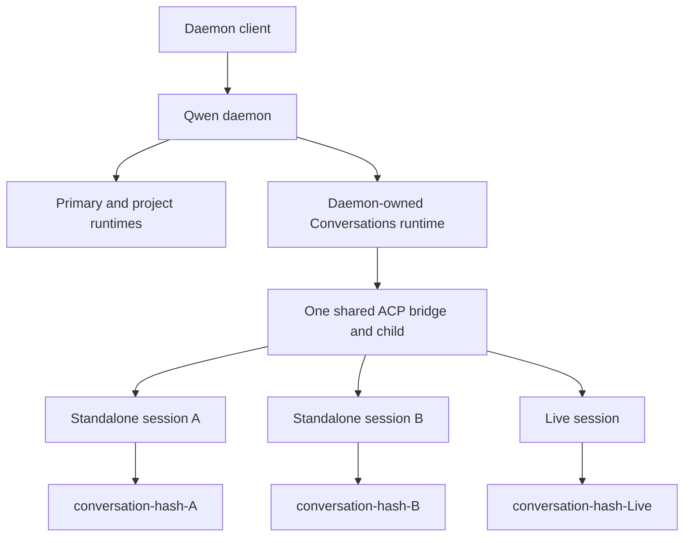
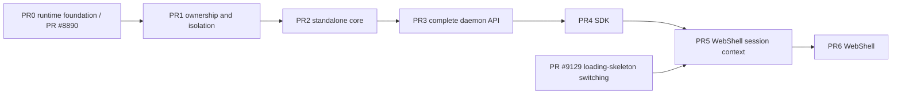

# Standalone Daemon Sessions

> **Proposed cross-daemon update (2026-09-02):**
> [Relaxed Standalone Daemon Ownership](./2026-09-02-relaxed-standalone-daemon-ownership.md)
> for [Issue #10810](https://github.com/QwenLM/qwen-code/issues/10810) would
> supersede this document's process-global ownership requirement and related
> `conversation_runtime_in_use` behavior between updated daemons. A live legacy
> owner retains that response during migration. Updated daemons may host
> different sessions concurrently, while the same session remains fenced by
> its writer lease. Other isolation, persistence, and lifecycle requirements
> remain in force.

## Status

This document is the versioned architecture companion to
[Issue #8908](https://github.com/QwenLM/qwen-code/issues/8908), which is the
source of truth for the standalone-session design and delivery plan.
[PR #8890](https://github.com/QwenLM/qwen-code/pull/8890) is implementation PR0,
not a documentation-only gate: it keeps this document synchronized while
delivering the Conversations runtime foundation.
[PR #9181](https://github.com/QwenLM/qwen-code/pull/9181) is the merged PR1
implementation of runtime ownership and ordinary-workspace isolation.
[PR #9341](https://github.com/QwenLM/qwen-code/pull/9341) and
[PR #9978](https://github.com/QwenLM/qwen-code/pull/9978) are the merged PR2A
and PR2B implementation of isolation primitives and the internal standalone
service. The remaining public daemon API, capability, SDK, WebUI, and WebShell
work is delivered in PR3 through PR6 below.

The design builds on the projectless conversation infrastructure introduced for
Live Voice. It does not authorize a second projectless runtime, a second session
catalog, or a child process per standalone session.

This contract extends, and does not replace, the projectless runtime decisions
in [WebShell Live Voice Codex-Parity Refactor Contract](./web-shell-live-voice-codex-parity-refactor.md).

## Problem

The daemon currently treats its primary workspace as the implicit target when a
client creates a session without `cwd`. This makes the top-level **New Chat**
action project-bound even when the user has not selected a project. It also
exposes the lifetime of that project directory as the lifetime of the chat. If
the directory is moved or removed, the client can only report that the current
working directory no longer exists.

Live Voice already owns a secure projectless storage root at
`~/Documents/Qwen Code/Conversations`, publishes one daemon-owned runtime for
that root, and relocates each Live session into a deterministic private child
directory. Standalone sessions generalize that substrate into a normal text-chat
product surface while preserving Live-specific behavior.

## Goals

- Let a user create and continue a normal text session without selecting a
  workspace.
- Make top-level **New Chat** create a standalone session while keeping
  project-local **New Chat** project-bound.
- Give every standalone session a durable private working directory with normal
  Qwen Code tools and approvals.
- Support creation, listing, exact lookup, load, resume, rename, export, archive,
  unarchive, repair, and deletion across daemon restarts.
- Keep standalone, workspace, and Live contexts explicit throughout the SDK and
  WebShell.
- Reuse the Conversations runtime, ACP bridge, transcript catalog, admission
  limits, and permission pipeline.
- Allow only one daemon process at a time to own the user-level Conversations
  runtime.
- Fail closed when an internal runtime or managed directory cannot be validated;
  never fall back to the primary workspace.

## Non-goals

- An operating-system sandbox or a stronger filesystem boundary than the
  existing approval policy.
- A separate ACP child per standalone session.
- Standalone attachments, durable scheduled tasks, storage quotas, retention
  policy, or general orphan cleanup beyond deletion recovery.
- Workflow execution and workflow snapshot/journal browsing. Those artifacts
  are project-scoped under `Config.storage.getProjectDir()/workflows`; the
  Conversations storage root is shared across standalone and Live sessions, so
  standalone MVP disables the workflow tool and `/workflows` instead of
  pretending that store is private.
- Moving or forking a standalone session into a project.
- Generic transcript branch and WebShell side-task creation from a standalone
  session. The MVP supports guarded background fork-agent work and explicit
  `create_sub_session` children, but it does not route these separate creation
  products around the standalone transaction.
- Agent-managed or caller-pinned Git worktrees. Ordinary Agent/fork work may run
  in the private child, but `isolation: "worktree"`, `working_dir`, and
  enter/exit-worktree tools are rejected for standalone sessions.
- Cascading archive or deletion from parent sessions to child sessions.
- Git branches, worktrees, repository status, or project settings for standalone
  sessions.
- Native LSP for standalone sessions. The current service captures its startup
  workspace and has no managed-relocation contract, so PR2 forces it disabled
  instead of pointing it at the shared Conversations root.
- Changing Live Voice product semantics, Realtime behavior, or its tool surface.
- Multi-master ownership, proxying between daemon processes, or guaranteed
  mixed-version concurrent access to the Conversations root.

## Product contract

### Explicit session contexts

WebShell models the user-visible context as a discriminated value:

```ts
type SessionContext =
  | { kind: 'standalone' }
  | { kind: 'workspace'; cwd: string }
  | { kind: 'live' };
```

Clients derive this value from the operation they perform and the persisted
session source returned by the daemon. They must not infer product semantics
from `workspaceCwd`. The legacy field may be accepted only at a workspace
compatibility boundary and must be normalized immediately into an explicit
workspace context. For protocol compatibility, a standalone session still has
an internal `workspaceCwd`, but that value is a routing detail identifying the
daemon-owned Conversations runtime and must not be displayed as a project or
used to select standalone context.

The entry-point behavior is fixed:

| Entry point                                      | New-session context      |
| ------------------------------------------------ | ------------------------ |
| Top-level home and global **New Chat**           | `standalone`             |
| **New Chat** within a selected or locked project | `workspace`              |
| Goals and Git entry points                       | `workspace`              |
| Current-session **New Chat**                     | Inherit explicit context |
| Live Voice                                       | `live`                   |

> **Amended 2026-09-02.** The WebShell sidebar's top-level **New Chat** is
> project navigation rather than a global entry point, so it inherits the
> current explicit context: a workspace chat stays in its workspace and a cold
> draft lands on the primary workspace. Standalone creation is an option of the
> composer's workspace picker ("No workspace (standalone)"), offered while the
> daemon advertises the capability, no workspace is locked and no projectless
> session is attached; the picker stays enabled for projectless drafts so the
> target can be changed before the first prompt. The workspace navigation tree
> also stays rendered inside a standalone chat — the hiding rule below applies
> to the chat surface and to project-only controls, and dropping the tree left
> a standalone chat with no way back to a workspace.

Standalone sessions appear in a top-level **Recents** group separate from Live
and project groups. Their chat surface hides workspace selection, Git status,
branch and worktree controls, project files, project settings, pin/group
controls, and attachments/uploads. Normal model, approval, tool, permission,
transcript, and supported session metadata controls remain available.
Approval-mode changes are session-local: the generic `persist: true` form is
rejected because it would write the shared Conversations root as a workspace
setting and affect unrelated standalone and Live sessions. User-global settings
retain their existing scope. Model selection is also session-local: every
standalone create, attach, HTTP, or ACP model switch forces
`persistDefault: false` in the ACP child so it cannot write the shared
model route settings. Bridge-driven standalone model changes publish only the
target session's model event and suppress the workspace-wide
`settings_changed(model.name)` broadcast, because no shared default changed and
that broadcast would leak into other standalone and Live session buses. Live
and ordinary sessions keep their existing persistence and workspace-event
rules. ACP slash commands use the same boundary: session reset,
workspace-directory/settings, Git diff, project-skill, and cwd-derived
transcript operations are rejected before their first side effect, while a
plain primary-model or reasoning-effort change applies only to the current
session. Explicit model persistence and auxiliary model selectors remain
unsupported until they have an honest session-local implementation.
Permission persistence follows the same scope boundary. Primary and nested
sub-agent permission dialogs omit project-persistent “Always Allow” for
standalone sessions, reject an unoffered project outcome before tool callbacks
or in-memory rule mutation, and retain one-shot, session-local edit/plan mode,
and user-global permission choices. Live and workspace permission options are
unchanged.

### Persisted source

New top-level standalone transcripts persist `sourceType: "standalone"` with no
`sourceId` and no `parentSessionId`. Live sessions retain their current
`sourceType: "default"` and `sourceId: "realtime_voice:<call-id>"` provenance.

`standalone` is a daemon-reserved source. Generic `POST /session` creation must
reject it, just as it rejects the reserved Live source. Classification requires
both compatible source metadata and ownership by the validated Conversations
runtime; source metadata alone can never turn a project session into a
standalone session.

Existing top-level Conversations transcripts with no parent, no source ID, and
either no source type or `sourceType: "default"` are normalized as legacy
standalone sessions at read time. Their transcripts are not rewritten. A source
that is explicitly Live or belongs to another feature is never silently
reclassified.

`create_sub_session` invoked by a standalone session explicitly persists
`sourceType: "standalone"` together with `parentSessionId`. Children remain
loadable by identity but are excluded from top-level Recents. Parent and child
archive or deletion operations do not cascade; each transcript and private
directory has an independent lifecycle.

Generic transcript branch and side-task endpoints reject explicit and legacy
standalone parents before creating a transcript. Those endpoints have different
fork/copy semantics and do not inherit support merely because their parent can
be owner-routed. Background fork-agent execution remains an operation inside the
current session and uses the normal standalone working-directory guard.

PR2 extends the relocated source-classification helper so Live task list, read,
wait, and follow-up operations treat explicit and legacy standalone sessions as
loadable projectless task targets. It accepts top-level explicit standalone
sources with no `sourceId` and standalone children resolved through their
persisted explicit source and parent ID. Depth-1 is enforced when the child is
created and whenever a session with a parent tries to create another child; an
explicit child remains independently loadable after its parent is archived or
deleted. Only legacy children without source metadata must resolve a surviving
top-level parent to distinguish standalone from Live. This does not relabel them
as Live in WebShell and does not expose Live-only tools in their ordinary text
turns. Projectless Live task creation must use the same standalone creation
service instead of creating new legacy `sourceType: "default"` sessions.

## Runtime architecture



### One Conversations runtime

Introduce one one-flight `ConversationRuntimeManager` per daemon. It lazily
validates the Conversations root and ensures the registered runtime and ACP
bridge even when Live Voice is disabled. `ensure()` does not preheat the bridge
or start the Qwen ACP child; the first operation that actually needs an ACP
session starts the one shared child. Live enablement only binds and advertises
Live-specific Host, Appshot, Realtime, speech, and task channels; it does not own
the manager or the underlying runtime lifetime. Concurrent ensure failures reset
the one-flight so a later request can retry initialization.

The existing internal runtime provenance value `live-conversation` is retained
for compatibility in the first implementation. Within daemon routing it means
"daemon-owned Conversations runtime" and must not be used to classify a session
as Live. Persisted session source performs that classification. Renaming the
runtime provenance is unnecessary for this feature and would expand the change
without changing behavior.

Each workspace runtime owns one ACP bridge and a lazily started child process.
Standalone and Live sessions therefore share the Conversations runtime's ACP
child after first use. Session admission remains subject to the daemon's total
and per-runtime limits. One healthy ACP child is a steady-state ownership
invariant; a bounded overlap during crash replacement or teardown is not treated
as a second runtime.

### Cross-daemon ownership

The Conversations root is user-global, while multiple `qwen serve` processes
can run concurrently. In-process one-flight and per-session locks are therefore
insufficient.

- Before publishing or using the runtime, acquire a secure process-owner record
  using the atomic-write, nonce, PID-liveness, owner/mode, and fail-closed
  patterns already used by Live discovery.
- Store the record in a stable user runtime location independent of a custom
  project runtime base. Serialize replacement with `proper-lockfile`.
- Reclaim only a dead owner, wait a short drain grace before starting a
  replacement ACP child, and treat PID reuse as active and fail-closed.
- Release ownership only after routes, sessions, bridge, and child teardown have
  drained, and only if the record nonce still matches.
- An active foreign owner returns `503 conversation_runtime_in_use`. Malformed
  or unsafe ownership state returns
  `503 conversation_runtime_ownership_compromised`.
- Capability advertisement describes support rather than current owner
  availability. An ownership error never permits fallback to the primary
  runtime.

Acquisition also respects an already-running legacy Live discovery owner. A
pre-feature daemon started after a new standalone owner cannot be made to honor
the new record, so concurrent mixed-version access is explicitly unsupported.

### Managed working directories

The existing conversation workspace creates a deterministic direct child for
each session:

```text
~/Documents/Qwen Code/Conversations/conversation-<sha256(session-id)>
```

The root and child must be real directories owned by the daemon user. On POSIX,
they must not grant group or other permissions. The daemon validates the root's
canonical path, device, and inode before and after sensitive operations, and it
requires each session directory to be an exact direct child. Symbolic links,
junction/reparse escapes, path traversal, non-direct descendants, and identity
changes are rejected.

Device and inode identity are pinned for both the root and every materialized
session child for one daemon ownership lifetime when the filesystem exposes a
nonzero inode. The owner keeps each child's validated identity by session ID and
compares it before every later use; on an inode-verifiable filesystem, an owned
`0700` directory substituted at the same path is still compromised. FAT/exFAT
and some SMB filesystems report inode zero. Consistent with the implemented
identity model, those filesystems explicitly fall back to device, canonical
path, direct-child shape, owner/mode where available, and link/reparse checks;
they cannot detect same-path replacement and must not be described as offering
inode attestation. Identity may be established only at first materialization,
after a daemon restart with no pending deletion journal, or when load, resume,
or explicit repair recreates a path proven absent while holding the lifecycle
coordinator. Archive does not reset it, and the normal-to-staged deletion rename
preserves it. After a restart, a securely recreated root and child at the
expected canonical paths may be accepted only after recovery journals have been
reconciled; the feature does not promise persistent inode attestation across
clean restarts. Windows validates canonical path and link/reparse behavior
exposed by the platform without claiming POSIX owner/mode or ACL guarantees.

Daemon-managed transcripts and sidecars remain in the daemon runtime base's
per-runtime storage keyed by the canonical Conversations runtime cwd (under the
default user-global base unless the daemon explicitly selects another runtime
base). User-authored Conversations-root configuration remains under that root.
Neither is moved into the session's private child, which is only the effective
tool and shell working directory. Managed relocation updates the effective
target directory and workspace context without changing transcript ownership.
For the same reason, the existing per-session `QWEN_CODE_PROJECT_DIR` shell
context continues to identify the Conversations-owned transcript/harness
project directory; changing it to the private child would make nested Qwen
helpers look in a storage namespace that does not own the session. The process
cwd, Config target, workspace context, file discovery, and cwd-derived tool
state still use the child. This environment value is not a sandbox grant: shell
access remains behind the existing approval boundary, and the MVP does not
claim OS-level containment.
For a normalized standalone session, the daemon sends the root and child
identity it already pinned as an internal relocation expectation. The ACP child
validates that exact expectation before and after changing `Config`, but leaves
the session in a pending state that cannot start turns. The daemon validates the
original pin, invokes an idempotent internal binding commit, and validates the
pin again before recording the session as bound. That commit revalidates in the
ACP child, activates deferred post-replay state, promotes the turn guard, and
publishes the artifact store's ready base, but keeps automatic work held. Only
after the daemon's final identity check records the matching session epoch as a
not-yet-released binding does a second idempotent release revalidate the child
and start queued automatic work. Only a successful release promotes the daemon
record to reusable `agentBound`; all owner preflights reject the intermediate
record. The lifecycle admission remains held until that release succeeds. All
standalone relocation callers must provide the expectation; Live
keeps its existing request shape. Identity details are never exposed in logs,
warnings, or public responses.

The bridge's session-artifact store must not continue treating the shared
Conversations root as the session workspace. A normalized standalone entry
defers every workspace-path restore, replay, stat, hash, list, and upsert until
managed relocation has passed ACP pre/post validation and daemon post-validation
for the exact child. The combined binding commit only changes the store's ready
base; deferred filesystem work runs later under a fresh daemon cwd preflight or
ACP turn/rewind guard. Same-path repair clears cached realpaths. Standalone
load/resume never restores worktree state from the Conversations root; paused
background-agent state is restored only during the post-relocation binding
commit, while execution remains held until the daemon has recorded the final
binding and released it. Automatic turns remain queued through pending,
activation, and final daemon validation. Live and ordinary
artifact and post-replay behavior is unchanged, and attachment/upload product
support remains out of MVP. A history-only rewind restores artifact metadata
without refreshing, stating, or hashing workspace files, so it remains
available when the private child is missing.

The turn guard is not the only startup boundary. Before `loadCliConfig`, the ACP
manager derives a trusted provisional-workspace host policy from normalized
source state; it is not an argv, setting, environment, or request option. The
loader does not construct a Conversations-root `FileDiscoveryService` or select
project `output-language.md`, but it may read the Conversations-owned transcript
store and explicitly shared settings, hooks, extensions, skills, MCP config, and
user-global output language. Workspace include-directory values from settings or
daemon argv are not shared configuration: the policy forces the Config's
explicit include-directory set empty, so relocation produces exactly the private
child as its only workspace root. The same policy reaches Config initialization.
It is stored once as read-only Config construction state; there is no second
initialize-time switch that can disagree with loader behavior.
Native LSP, eager file discovery,
initial memory refresh and team sync, MCP discovery, lazy-tool warmup, Gemini
chat initialization, auto-skill curation, stale-worktree cleanup, ACP filesystem
fallback, initial auth refresh, and per-cwd OpenAI-log housekeeping are disabled
or deferred. Session registration and metadata/UI replay may proceed, but the
ordinary ACP fallback that initializes Gemini before storing a Session is also
disabled. Cwd-rooted file-history hydration/validation and restore finalization
are deferred by the same internal activation switch. Managed relocation creates
child-rooted file discovery, refreshes
memory, and may start the existing MCP reconcile only after the target is the
validated child. The binding commit calls the existing Gemini initialization;
that strictly warms tools, builds the initial history and system instruction,
and invokes the `SessionStart` hook from the child. It then performs initial
auth, so the asynchronously scheduled `AuthSuccess` hook also observes the child,
hydrates/finalizes file history from the child Config, and installs the ACP
filesystem wrapper and log housekeeping before promoting the guard. Hook
failures retain the core's existing best-effort logging semantics and do not
become standalone-fatal errors. Successful steps are tracked idempotently, so
response-loss retries do not repeat tool/chat initialization, hook invocation or scheduling,
or registrations. The entry is marked `activating` before the first
non-best-effort step. A returned activation error marks it
`activationPoisoned`; that ACP Session must close, and an unprovable close or
concurrent attach that prevents zero-attach close quarantines the runtime rather
than reusing unknown state. A transport-level response loss is retried against
the same entry first. The CLI Session keys a `bindingPromise` by expectation and
session epoch, so concurrent calls for that key join one activation and an
in-flight different key is rejected; a settled retry reads the recorded bits.
After a completed cycle, only a new expectation installed by successful managed
relocation may start a repair cycle, and completed initial-activation bits are
not replayed. Poisoned state cannot start another cycle. The daemon performs only
one bounded retry/status read, then quarantines if the channel or outcome remains
unknown. Activation state, rather than network ambiguity, decides whether work
continues. Failures before `activating` leave the pending entry retryable. The
commit leaves an `automaticWorkHeld` latch set even after guard and artifact
promotion. After the daemon's final pin check records a matching, unreleased
binding, an idempotent release revalidates the ready identity and session epoch,
clears the latch, starts the scheduler and queued automatic work, publishes the
filtered command set, and schedules the existing MCP failure surface exactly
once. Only the confirmed response promotes the daemon record to reusable
`agentBound`; preflight rejects its unreleased phase. The daemon keeps runtime
activity and lifecycle admission until release succeeds; an explicit release
failure or identity change clears the local binding, while a still-unknown
response follows the same quarantine rule because automatic work may already
have started. This preserves
deferred discovery warning behavior without duplicate output on retries and
prevents automatic work from running inside a transaction that the daemon may
still reject. Stale-worktree cleanup and auto-skill
curation remain disabled because those project-maintenance features are not
standalone behavior; native LSP and its slash command remain unavailable
because the service cannot be relocated. Read-only shared settings, hooks,
extensions, skills, and ancestor
instructions, plus process-global capability probes proven not to inspect cwd,
may still be assembled from the Conversations root. This prevents pre-prompt
file/Git discovery, model-context construction, hook execution, subprocess,
project mutation, cleanup, or local-read fallback from treating the shared root
as the session workspace. Existing Live and ordinary initialization is
unchanged.

Team-memory and auto-skill management remain disabled for a normalized
standalone Config even after relocation, overriding project settings and
environment toggles. Team memory can discover and synchronize an ancestor Git
repository, while auto-skill management mutates project skill state; neither is
honest standalone behavior. Managed auto-memory may use the private child, and
explicit user/shared skills remain readable. Agent and fork work also remains
available in the child, but worktree isolation, a pinned `working_dir`, and the
enter/exit-worktree tools fail before Git or filesystem side effects. Explicit
shell commands outside this product integration continue through the ordinary
approval boundary.

Workflow execution is also disabled for normalized standalone sessions,
overriding settings and environment enablement before tool registration. Its
snapshot and resume journal use the Config storage project directory rather
than the relocatable cwd, which would merge unrelated sessions in the shared
Conversations namespace. The ACP `/workflows` command is hidden and rejected
before listing that store. Source normalization occurs before Config
initialization and tool registration, so a standalone Session cannot acquire a
running Workflow that would need a separate relocation rule.

User/global settings and user-authored Conversations-root configuration
continue to apply. A child may inherit ancestor `QWEN.md`/`AGENTS.md` and shared
Conversations-root MCP/config state. Primary-project settings, memory, Git
state, trust, and cwd must not leak. The design must not describe shared
user-level or Conversations-root configuration as per-session private.
The internal ACP slash-command policy makes this distinction explicit. It keeps
default/user-global language, authentication, and generic user-setting edits,
but rejects session reset, workspace directory management, Git diff, project
skill learning/curation, project-scoped language or config import, explicit
model persistence, and cwd-derived transcript commands for normalized
standalone sessions. In particular, `/dream` and `/export` cannot accidentally
look for the Conversations-owned transcript under the private child. Safe
child-local commands such as init, summary, managed memory, and stats export
remain available after the cwd guard is ready; shared hooks, extensions, and
skills expose only their existing read-only ACP views. The dispatcher checks
the canonical built-in identity before action dispatch and uses the same
predicate for pushed/status command snapshots and model-invocable registration,
so an alias or alternate consumer cannot restore a denied command. The policy
is supplied only by the ACP Session from trusted source state; request metadata
cannot weaken it. Live, ordinary workspace, and other non-interactive callers
retain their existing defaults.

### Permission boundary

The private directory is a stable default working directory, not an OS sandbox.
Relative file and shell operations begin there and normal workspace-aware tools
receive that directory as session context. An explicit operation targeting an
absolute path outside it remains governed by the existing permission and
approval pipeline. This feature does not claim containment that the current
tooling cannot enforce.

### Internal runtime isolation

The Conversations root is not a user workspace. Use a default-deny user-workspace
resolver and a separate explicit internal resolver. Generic registration,
settings, trust, Git, files, shell, extensions, skills, MCP control, memory
control, workspace voice, and workspace-qualified ACP WebSocket routes must
reject a request that resolves to the internal runtime. Generic channel and
scheduled-task administration is also denied. Compatibility exceptions preserve
the existing Live behavior on the workspace-qualified surfaces: channel
management remains read-only, and Live-owned scheduled tasks retain list,
update, delete, and manual-run access. These exceptions authorize only Live
state and do not expose standalone sessions or standalone durable scheduling.

Audit every direct registry consumer, including HTTP routes, ACP and voice
WebSocket upgrades, capabilities, session creation and restore, workspace
management, health, and Live task services. Only owner-routed session
operations, transcript/catalog operations, health/capabilities, and dedicated
Live or standalone services may opt in. The compatibility `kind: "live"`
runtime entry may remain temporarily, but new clients exclude it from project
selectors and generic route denial remains mandatory.

An unknown, bootstrapping, untrusted, compromised, draining, or removed
Conversations runtime returns an error. It must never resolve to or retry against
the primary runtime.

## Daemon and SDK contract

### Capability

The daemon advertises `standalone_sessions_v1` in `GET /capabilities` only when
the complete manager, service, route, and managed-directory lifecycle dependency
set is installed, including embedded `createServeApp` configurations. A build
constant alone is insufficient. The final app evaluates a runtime closure after
route registration; bootstrap capability snapshots and partial embedded apps
therefore omit the tag. PR0 through PR2 do not expose the dedicated
standalone API, capability, SDK, or UI; PR2B does migrate the existing
projectless Live task path to explicit standalone persistence and private
directories and atomically applies the source-aware generic mutation
restrictions to explicit and legacy projectless sessions. Those changes require
focused compatibility and E2E coverage. PR3 is the atomic standalone-v1
advertisement boundary.

Existing active owner-routed session controls continue to operate by session
ownership during PR2, but the new source classifier must not broaden generic
cold transcript, export, archive, unarchive, delete, organization, or catalog
access to explicit standalone sessions. Those lifecycle surfaces remain behind
the dedicated PR3 API boundary.

The capability is not coupled to Live Voice availability or enablement and
describes support rather than current cross-daemon ownership availability. Root
materialization remains lazy, so a missing but creatable root does not suppress
advertisement. Once advertised, initialization or ownership errors are returned
as structured failures and never trigger primary fallback.

### Routes

The dedicated API is:

```text
POST  /standalone/sessions
GET   /standalone/sessions
GET   /standalone/sessions/:id
POST  /standalone/sessions/:id/load
POST  /standalone/sessions/:id/resume
POST  /standalone/sessions/:id/repair-directory
PATCH /standalone/sessions/:id/metadata
GET   /standalone/sessions/:id/export
POST  /standalone/sessions/archive
POST  /standalone/sessions/unarchive
POST  /standalone/sessions/delete
```

Dedicated routes prevent omission of `cwd` from silently selecting the primary
runtime. They also let SDK clients distinguish an unsupported old daemon from a
failed standalone operation.

Creation accepts only:

```ts
interface CreateStandaloneSessionRequest {
  sessionId: string;
  modelServiceId?: string;
  approvalMode?: DaemonApprovalMode;
}
```

The wire-level UUID is required and validates as UUID v1 through v5. An SDK
convenience method may omit it only if the SDK generates the UUID before sending
the request. Wire IDs, lifecycle locks, and in-flight maps use lowercase
canonical UUIDs. For compatibility with legacy transcripts whose filename
contains a mixed-case UUID, storage and ACP operations preserve that
authoritative spelling. The private-directory hash is not one of them: the
directory belongs to the live entry, so it is derived from the canonical UUID
that every materialize and discard call site already uses. If more than one
persisted spelling maps to the same canonical UUID, exact lookup fails with a
conflict and listing excludes the ambiguous entries; the daemon never chooses
one by filesystem enumeration order. The daemon fixes `sessionScope` to
`thread` and source to `standalone`. Unknown keys are rejected, including `cwd`, `workspaceCwd`,
`workspaceId`, `sourceType`, `sourceId`, `sessionScope`, `branch`, and
`worktree`.

`GET /standalone/sessions/:id` is the non-mutating exact-identity lookup used for
response-loss recovery and deep links:

- Return `202` with `state: "creating"` while the UUID reservation is in flight
  or terminal runtime quarantine has frozen the transaction.
- Return `200` with an active or archived summary when a compatible transcript
  exists.
- Return `404 standalone_session_not_found` when the UUID is absent or belongs
  to another context. A retained deletion journal does not make the deleted
  session discoverable; cleanup resumes through owner acquisition or an exact
  delete retry. Lookup never reveals or guesses another runtime.
- Return structured ownership, root, or compromise errors when lookup cannot be
  performed safely.

Exact lookup never writes durable state. A non-quarantined transaction that has
already persisted explicit standalone source releases its process-local
reservation when it exits and leaves the durable transcript intact, so exact
lookup follows the ordinary `200` path. It never tries to reconcile a
quarantine-frozen entry.

Load and resume use `Omit<RestoreSessionRequest, 'workspaceCwd'>`: they retain
the existing approval, history-page, and client timeout options while the route
selects the owner runtime and private directory. Repair has no request body.
Rename and export use dedicated routes so cold and archived transcripts work
without exposing the internal runtime through workspace-qualified APIs. Active
rename additionally notifies the live bridge.

Listing reuses the existing cursor, size, and archive-state semantics. It
includes explicit and compatible legacy top-level sessions, excludes Live and
project sessions and every child, and does not probe working-directory state.
Archive, unarchive, and delete accept the existing bounded, de-duplicated
`sessionIds` array. Batch errors use `{ sessionId, code, message }`. Successful
delete returns `removed`, `notFound`, `errors`, and `fileCleanupPending`;
`fileCleanupPending` is a subset of `removed` because the transcript is already
gone.

Prompt, cancel, subscribe, permission, transcript, status, and other live
session-ID routes retain owner routing after load. Persisted or cold operations
that cannot be satisfied from the live owner index use the standalone service,
not the primary runtime.

### SDK types

The SDK exposes narrow create, restore, and summary results using common fields:

```ts
interface DaemonStandaloneFields {
  sourceType: 'standalone';
  context: { kind: 'standalone' };
  workingDirectory: {
    state: 'ready' | 'recreated';
    warnings?: string[];
  };
}

interface DaemonStandaloneSession
  extends DaemonSession,
    DaemonStandaloneFields {}

interface DaemonRestoredStandaloneSession
  extends DaemonRestoredSession,
    DaemonStandaloneFields {}

interface DaemonStandaloneSessionSummary extends DaemonSessionSummary {
  sourceType: 'standalone';
  context: { kind: 'standalone' };
}
```

Create returns `DaemonStandaloneSession`; load and resume return
`DaemonRestoredStandaloneSession`. A recreated directory warning means the
transcript survived but files previously stored in the directory are not
recoverable. Standalone list summaries expose the explicit context and source
but do not probe or return working-directory state.

The existing internal `workspaceCwd` field remains required on base daemon
session types for routing and backward compatibility. Standalone SDK methods do
not accept it as input, and WebShell does not expose it as a project.

The SDK provides capability-gated create, list, exact get, load, resume, repair,
rename, export, archive, unarchive, and delete methods. It generates the UUID
before create, exposes that UUID on either a structured
`standalone_creation_outcome_unknown` response or an outcome-unknown transport
error, performs exact lookup, and never retries creation automatically.
`DaemonSessionClient` stores an explicit restore strategy: workspace sessions
restore by cwd, while standalone sessions use the dedicated route. Daemon
responses are runtime-validated in both browser and Node builds.

## Lifecycle and consistency

### Creation transaction

The SDK generates a UUID before sending the request. Creation proceeds as one
logical transaction:

1. Strictly validate the request and required UUID.
2. Ensure cross-daemon ownership, runtime, and secure root, then await the
   runtime-generation bounded reconciliation singleflight before acquiring this
   UUID's lifecycle coordinator.
3. Under the exclusive lifecycle coordinator, reconcile an exact matching
   deletion journal. Continue only after it reaches a terminal cleared state. A
   valid record still pending cleanup returns retryable
   `409 standalone_session_conflict`; a compromised record returns
   `409 deletion_recovery_compromised`. Neither case materializes a child. While
   still holding the coordinator, reserve the UUID daemon-wide across every
   active runtime bridge, every active and archived transcript catalog, the Live
   owner index, and in-flight creation. Admission is global, but the new session
   is created only through the validated Conversations runtime. Any existing
   owner is a conflict.
4. Validate and reuse an existing empty child or materialize a new deterministic
   child. A non-empty child without a transcript is a conflict and is never
   adopted or deleted automatically.
5. Create the ACP session with thread scope and standalone source metadata.
6. Require the ACP result to use the reserved UUID and report
   `sourcePersisted: true`.
7. Re-read the transcript location and source through `SessionService`. Require
   one active transcript whose authoritative storage ID matches the reserved
   UUID and whose persisted source is explicit standalone. The bridge receipt
   alone never authorizes workspace activation.
8. Relocate the session into its private directory using managed containment.
   Directory or containment failure is fatal. Memory or MCP refresh failures
   after a successful target switch are explicit warnings. A fresh binding
   builds model context during deferred Gemini initialization, so that failure
   is fatal activation; only an already-initialized session repair can report a
   sanitized model-context refresh warning. The daemon then commits deferred
   activation while automatic work remains held, validates the pinned identity
   again, records an unreleased matching epoch, and invokes the idempotent
   release. Only a confirmed release promotes the record to reusable
   `agentBound` and permits prompts or automatic work.
9. Commit process-local creation state and invalidate the catalog cache before
   attempting to write the HTTP response. The wire create itself carries no
   prompt: the strict `CreateStandaloneSessionRequest` schema admits only
   `sessionId`, `modelServiceId?`, and `approvalMode?`. When a launcher
   supplies an initial prompt, `createWithInitialPrompt(request, prompt)`
   admits it as a separate step only after the transaction above commits —
   inside the same still-held exclusive, via an "exclusive already held"
   internal dispatch helper — and no further fallible durable or workspace
   operation occurs after an initial prompt is admitted.

Before source persistence, failure closes any owned ACP session and releases the
UUID after closure succeeds. The deterministic empty child is retained and may
be reused by a later create with the same UUID. PR2 does not attempt to remove a
standalone child: Node exposes only path-based directory removal, which cannot
atomically bind deletion to the inode validated earlier, so a same-path
replacement race would make an “exact identity” cleanup claim false. If
ACP-session closure fails before a durable standalone marker exists, the UUID
remains reserved as `creating`, the Conversations runtime is quarantined, and
its shared ACP child is torn down to eliminate the unpersisted orphan; the UUID
reservation is held, not released, until daemon shutdown. Quarantine is
terminal for the current daemon: the triggering transaction performs no further
private-directory or transcript cleanup after quarantine begins, every creation
already in flight remains frozen, and exact lookup for those UUIDs returns
`202 state: "creating"` until daemon shutdown. After restart, normal ownership
acquisition and persisted lookup converge each UUID to `200` or `404`; the
quarantined daemon never invents either result after losing its runtime. A
connected create request receives `500 standalone_creation_outcome_unknown`
with the UUID and polls exact lookup rather than retrying create. If the
pre-persistence close completes without quarantine, the connected request
returns `500 standalone_creation_rolled_back` with the UUID and is safe to retry
with that UUID; the retained empty child is reused.

After persistence, only a durable reread proving one active explicit standalone
transcript makes transcript existence the outcome marker. PR2 never deletes that
verified transcript or its private child as part of creation unwind. If the
owned ACP session closes cleanly, the daemon releases its local creation state,
preserves the partial but loadable session, and reports
`500 standalone_creation_outcome_unknown`; ordinary exact lookup returns `200`
and load/resume completes directory repair and binding. If the child explicitly
refuses close while the binding state proves activation never began, the daemon
may likewise preserve the guarded pending live session and let a later load
retry binding; its turn guard still rejects work. A wrong source, conflicting
location, unreadable metadata, activation that has started or become poisoned,
or an unknown release outcome is not safe for that recovery and requires
terminal quarantine rather than releasing the UUID around unqueryable or
partially activated state. This conservative rule avoids turning a recoverable
session into an untracked non-empty directory and leaves intentional user
deletion to PR3's journaled lifecycle.

“Before source persistence” clean rollback requires proof, not merely a missing
bridge response. If `spawnOrAttach` was dispatched and its response is lost, an
absent transcript does not rule out a live ACP entry that has not persisted its
source yet, and a later summary lookup can race that still-running creation.
The daemon therefore treats every dispatched call without a trusted response as
outcome-unknown, triggers terminal quarantine, and preserves the UUID, child,
and any transcript. Only a failure explicitly reported before dispatch may use
the ordinary absence proof for clean rollback; PR2 does not add a second
starting-state or request-order protocol for this edge case.
Once source persistence has succeeded, the transaction does not attempt
creation rollback through transcript or directory deletion. A partial unwind is
therefore discoverable immediately by ordinary exact lookup instead of requiring
a process-local cleanup-reconciliation state.

Quarantine teardown progress remains part of the daemon's runtime-lifecycle
proof. Shutdown continues or waits for safe incomplete drain/dispose steps and
aggregates any terminal failure. The daemon actively removes its owner record
only after runtime disposal and registry/controller completion are proven; an
unresolved containment failure leaves the record for dead-owner recovery after
the old process exits. It never reopens admission or republishes the runtime.

Client disconnect does not abort the logical transaction. If relocation commits
but the response cannot be written, detach the phantom response client without
deleting the session or transcript. The client uses exact lookup by UUID and may
then load; it never retries create automatically.

### Load, resume, prompt, and repair

Load and resume first validate source ownership, root, and deterministic child.
Before per-session admission or any missing-child recreation, they await the
runtime-generation bounded reconciliation singleflight, acquire exclusive
admission, and reconcile an exact pending deletion journal. They never recreate
the normal child while the journal remains. A non-terminal or compromised
recovery returns its structured deletion error instead of loading the session.
If the child is absent, the daemon recreates it at the same path, relocates the
session, and returns `workingDirectory.state: "recreated"` with a warning that
deleted files were not recovered. This recreation holds the lifecycle
coordinator and establishes the new validated child identity before returning.
A suspicious existing path fails closed and is never chmodded, replaced, or
deleted.

Persisted source ownership alone does not authorize attachment to an already
live bridge entry with the same UUID. Before load/resume can attach or apply
model/approval options, it verifies the live summary's authoritative storage
ID, normalized source, parent lineage, and event generation against the durable
fact and daemon record, then verifies the returned identity again. A Live,
foreign, malformed, or replaced entry is rejected before relocation and is
never adopted as standalone.

Before every standalone prompt is admitted, revalidate the root, exact child,
and current session cwd while holding the shared lifecycle admission boundary.
If the child disappeared, return `409 working_directory_missing` without
dispatching the prompt. The UI offers explicit repair and never replays a prompt
whose commit status is uncertain.

The same preflight applies on both REST and ACP owner surfaces to direct shell
execution and session-artifact list/add, and on their applicable surface to
background fork-agent launch and file-restoring rewind. These operations are
cwd-bound even when they are not ordinary model turns. History-only rewind,
artifact metadata removal, and tool-free side generation do not require a
working directory. Generic session `cd` and the ACP session's `/cd`
slash command are rejected for explicit and legacy standalone sessions; only
daemon-managed relocation and the repair operation may change their effective
cwd. The ACP guard owns this source-aware restriction rather than relying only
on the generic command-mode filter.

Repair acquires the exclusive lifecycle coordinator, closes new prompt
admission, waits for the active prompt to settle or cancel, restores a valid
staged child when required, recreates only an absent child, reapplies relocation,
and returns the resulting working-directory state. Relocation also checks the
ACP child's cwd-bound background work under its close gate after active turns
drain. The check includes active-work holds plus running Monitors, which the
health protocol intentionally does not report. Workflow cannot be registered
for a normalized standalone source. Any
blocker returns retryable `409 session_busy`; the daemon does not refresh the
directory identity guard while such work may still refer to the previous
directory.

### Durable cron boundary

ACP currently starts the cron scheduler before managed relocation. Standalone
defers scheduler startup and every automatic-turn producer until the daemon has
recorded the final binding and the post-binding release succeeds. Project-level
durable cron state would otherwise bind to the shared
Conversations root, so standalone MVP must not load, create, or fire durable
scheduled tasks there.

- Normalize explicit and legacy standalone source before ACP session startup.
- Disable durable cron initialization for standalone sessions and children.
- Reject `cron_create({ durable: true })` with a clear unsupported error.
- Keep session-only cron and loop wakeups because they are in-memory and die
  with the session; queued work begins only after binding is finally recorded
  and released. Live
  behavior remains unchanged.

Per-standalone durable scheduling requires a separate design for relocation,
archive, deletion, restart ownership, and UI management.

### Lifecycle coordination

Use one per-session lifecycle coordinator rather than separate repair, archive,
or deletion locks. Shared prompt/read admission and exclusive repair, archive,
unarchive, delete, and rename mutations all use this coordinator. Closing
active ownership means closing new prompt admission, waiting for the active
prompt to settle or cancel, closing the session in the shared Conversations ACP
child, and removing it from the live owner index. Transcript mutation also
acquires the existing writer lease. Cross-daemon Conversations ownership is the
outer boundary; ambiguous ownership never permits fallback.

### Archive, rename, and export

Archive closes active ownership, moves the transcript into the archived catalog,
and retains the private child. Unarchive reactivates the transcript; the next
load validates or recreates the child. Parent and child state does not cascade.

Rename appends title metadata to the correct active or archived transcript and
never renames the deterministic child. Export reads the correct active or
archived transcript under a shared lifecycle lock and does not materialize the
directory.

### Deletion transaction

WebShell retains its second confirmation and explains that deletion removes the
transcript and private files. The daemon acquires the exclusive lifecycle
coordinator, closes prompt admission, and tears down active ownership before
acquiring the writer lease or changing either the directory or transcript. It
never waits for active bridge work while holding the writer lease.

Deletion uses a small durable recovery journal beside the stable Conversations
owner record in an owner-only user-global namespace independent of
`QWEN_RUNTIME_DIR` and project runtime bases. A transaction has immutable
`prepared` and, after directory staging, `staged` phase files. Each phase is
atomically written to a previously absent final name; `staged` supplements
rather than replaces `prepared`, avoiding an unlink-to-replace gap on Windows.
Each bounded record contains the session ID, transaction phase, validated
authoritative storage spelling, pre-delete active/archive transcript location,
validated Conversations-root canonical/device/inode identity, the exact
deterministic normal and staged child names, and the validated child's device/inode
identity captured before rename when a child exists. Recovery derives the only
allowed direct-child paths from the recorded canonical root and those validated
names; it never follows an arbitrary serialized child path. The storage spelling
must case-normalize to the canonical request UUID and remains the cleanup key
after transcript unlink removes the only rediscoverable copy of that spelling.
The atomic rename preserves directory identity, so the prepared evidence plus
physical state remains sufficient after a crash between rename and the
staged-phase write. Recovery must match the recorded root and applicable child
identity using the existing inode-verifiable or documented reduced filesystem
guarantee before destructive file cleanup; an identity mismatch fails closed
and leaves files untouched.

If both normal and staged children are absent, record that state, delete the
transcript, perform idempotent post-commit cleanup, and clear the journal.
Missing files do not block transcript deletion. If either path exists but fails
validation, stop before transcript mutation.

1. If the session has active ownership, wait for its prompt to settle or cancel,
   close its ACP session in the shared Conversations child, and remove its live
   owner entry.
2. Revalidate owner, root, source, transcript, normal child, and absence of
   conflicting staged state.
3. Persist a prepared deletion record, including the validated normal child's
   identity and deterministic normal/staged names when the child exists, plus the
   authoritative transcript spelling and active/archive location.
4. If the normal child exists, atomically rename it to the exact `.deleting`
   sibling and write the immutable staged phase. Transcript deletion cannot
   start until that phase is durable. If the staged write fails, restore the
   child before clearing prepared evidence; interruption leaves a prepared
   record whose pre-rename identity plus physical state drives recovery.
5. Unlink the one accepted active or archived transcript. This unlink is the
   logical deletion commit point; sidecars remain retryable post-commit cleanup.
6. If unlink reports an error, re-read authoritative transcript location under
   the writer lease. An intact transcript permits restoring the staged child
   first and clearing the journal last, followed by retryable
   `500 transcript_deletion_failed`. An absent transcript means deletion
   committed and cleanup continues. Conflicted, unreadable, or unprovable state
   retains the journal and directory state and returns
   `transcript_deletion_outcome_unknown`. A failed restore retains both phase
   evidence and the staged child and returns
   `working_directory_recovery_failed`.
7. After commit, idempotently remove transcript sidecars, bridge attachments,
   and only the exact validated staged child. Clear `staged` first and
   `prepared` last only after all cleanup succeeds.

Final removal failure does not resurrect the transcript. Return the session ID
in `fileCleanupPending` and retain the journal so an exact retry or bounded
reconciliation can resume cleanup.

Reconciliation has explicit reachable entry points. The first mutating, load,
resume, or repair operation after successful Conversations ownership acquisition
starts one runtime-generation singleflight for a bounded pass over deletion
journal records after secure-root validation. The caller awaits this pass before
acquiring its requested session lifecycle lock. The pass sorts canonical IDs
and holds only one record's exclusive lifecycle coordinator and transcript
writer lease at a time; it never runs while a caller-specific session lock is
held. This does not initialize Conversations while Live and standalone are
unused. Read-only get and export inspect but never reconcile a matching record.
List validates only returned page items, taking shared admission for one UUID at
a time, and omits journaled or no-longer-valid entries. A delete retry containing
that exact session ID checks for a matching journal before mapping an absent
transcript to `notFound`; if no session in another context owns the UUID, a valid
record resumes the authorized deletion and returns the session ID in `removed`.
Creation, load, resume, repair, and exact delete then always reconcile their
requested UUID inside its exclusive admission even after the bounded pass
reaches its fixed safety limit. The pass never guesses from staged-looking
directories. A non-terminal or compromised record is isolated to its UUID: the
pass records the structured error, leaves that record untouched, and continues
without blocking unrelated standalone sessions.

Before a valid record authorizes directory or attachment cleanup, recovery
rechecks every runtime and live owner for the canonical UUID. A project, Live,
child, conflicting transcript spelling, or foreign bridge entry that appeared
outside the standalone lifecycle makes the record compromised and leaves every
file untouched. Durable deletion evidence authorizes cleanup of the deleted
standalone incarnation only; it never authorizes mutation of a later owner.

Recovery considers active and archived transcripts and every Conversations
source before destructive cleanup:

- The transcript is intact, a recorded child is matching at the staged path,
  and normal is absent: restore staged to normal first and clear the phase files
  last.
- The transcript is intact, a recorded child is matching at normal, and staged
  is absent: clear the stale phase files without touching the directory.
- The transcript is intact, the record proves the child was absent, and both
  paths remain absent: clear the stale phase files and keep the transcript.
- The transcript is absent and a recorded child is matching at staged: finish
  post-commit cleanup and clear the phase files.
- The transcript is absent and both paths are absent: finish idempotent sidecar
  and attachment cleanup, record a vanished expected child diagnostically when
  applicable, and clear the completed phase files.
- The transcript is intact, the record expected a child, and both paths are
  absent: report `deletion_recovery_compromised`; a missing private directory is
  not equivalent to a record that proved absence before deletion.
- Transcript location is conflicted, unreadable, or unknown: retain journal and
  directory state, report `transcript_deletion_outcome_unknown`, and leave every
  directory untouched.
- Both normal and staged exist, regardless of journal phase or validity: report
  `deletion_recovery_compromised` and leave every file untouched.
- The journal is invalid or missing for staged state, the hash does not match,
  any path fails validation, or any other state combination is not enumerated
  above: report `deletion_recovery_compromised` and leave every file untouched.

A staged-looking directory without a valid recovery record is never proof that
deletion was authorized. Creation cannot establish a new incarnation of a UUID
while any journal for that UUID remains, so recovery never treats a fresh normal
child as belonging beside an older staged child.

The recovery commit rule is deliberately singular: an intact transcript rolls
the incomplete transaction back to an intact session, while an absent
transcript commits deletion and requires cleanup. An exact delete retry may
start a fresh transaction after rollback clears stale evidence. Conflicted or
unreadable transcript state proves neither outcome and fails closed.

### Failure contract

| Condition                                                  | Result                                              |
| ---------------------------------------------------------- | --------------------------------------------------- |
| Invalid/forbidden field or malformed UUID                  | `400 invalid_request`                               |
| Session is absent or belongs to another context            | `404 standalone_session_not_found`                  |
| DELETE sees absent transcript plus journal, no other owner | Resume exact deletion recovery before `notFound`    |
| UUID/source/orphan-directory/session-state conflict        | `409 standalone_session_conflict`                   |
| Creation finds a valid journal still pending cleanup       | `409 standalone_session_conflict`, retryable        |
| UUID creation is currently in flight                       | Exact lookup returns `202 state: "creating"`        |
| Private child disappeared before prompt                    | `409 working_directory_missing`                     |
| Existing managed path fails validation                     | `409 working_directory_compromised`                 |
| Active work prevents safe relocation or identity refresh   | `409 session_busy`, retryable                       |
| Deletion journal or staged state is inconsistent           | `409 deletion_recovery_compromised`                 |
| Create crossed persistence and owned session closed        | `500 standalone_creation_outcome_unknown` with UUID |
| Create failed before persistence and owned session closed  | `500 standalone_creation_rolled_back` with UUID     |
| Transcript deletion failed and directory state recovered   | `500 transcript_deletion_failed`                    |
| Transcript deletion outcome is conflicted/unreadable       | `500 transcript_deletion_outcome_unknown`           |
| Transcript rollback cannot restore staged child            | `500 working_directory_recovery_failed`             |
| Create cleanup outcome is unknown                          | `500 standalone_creation_outcome_unknown` with UUID |
| Conversations root identity or trust fails                 | `503 conversation_root_compromised`                 |
| Runtime owner record is unsafe                             | `503 conversation_runtime_ownership_compromised`    |
| Another daemon owns the runtime                            | `503 conversation_runtime_in_use`                   |
| Conversations runtime cannot be initialized                | `503 conversation_runtime_unavailable`              |
| Transcript was deleted but final file cleanup failed       | `200` with `fileCleanupPending`                     |

Structured errors include the session ID when known, identify retryability, and
never expose untrusted filesystem paths. Logs and telemetry record route,
runtime provenance, phase, code, ownership outcome, and cleanup state.

## Compatibility and rollout

An older daemon omits `standalone_sessions_v1`. A newer WebShell connected to
such a daemon preserves the legacy behavior in which global **New Chat** targets
the primary workspace. It may explain that standalone chat requires a daemon
upgrade, but must not call the new routes.

If the capability is present and standalone creation fails, the client displays
the failure and preserves the user's standalone intent for retry. It must not
silently create a primary-workspace session. This distinction prevents a broken
or compromised Conversations runtime from changing the target of user actions.

An old client against a new daemon retains generic `POST /session` behavior and
therefore still targets primary unless it explicitly uses the new routes.

There is no transcript migration. New sessions persist explicit standalone
source metadata; compatible legacy projectless transcripts are normalized when
read. Removing the feature code leaves existing transcripts in the configured
daemon runtime base's per-runtime storage and managed directories under the
Conversations root, and does not affect project sessions, but a pre-feature
daemon is not required to expose explicit standalone transcripts as projectless
sessions.

The capability is published only in PR3 after the hidden runtime foundation,
ownership/isolation boundary, and standalone core have landed. SDK and UI
changes may then gate on it. Concurrent mixed-version use of the Conversations
root remains unsupported.

## Delivery sequence

The design is reviewed and tracked in Issue #8908. Delivery uses seven
substantive implementation PRs; this companion document is updated with PR0 but
does not occupy a documentation-only stage.

### PR0: Conversations runtime foundation

Implementation PR: [#8890](https://github.com/QwenLM/qwen-code/pull/8890)

Suggested title: `refactor(cli): Generalize the Conversations runtime foundation`

- Move conversation workspace and source helpers out of Live-specific
  ownership.
- Introduce the one-flight `ConversationRuntimeManager` and split optional Live
  bindings from runtime lifetime.
- Revalidate root and ownership immediately before serialized registry
  publication while the candidate remains unpublished; dispose a rejected
  candidate.
- Preserve Live behavior, provenance, managed-relocation token, storage
  namespace, and process sharing.
- Do not add standalone source, public routes, capability advertisement, SDK, or
  UI behavior.

Verification covers manager concurrency and failure reset, secure root/child
validation, absence of ACP/Host/provider preheat, Live enabled/disabled
lifecycle, concurrent Live work sharing the runtime, and complete Live regression
behavior.

Estimated size: 180-320 production lines and approximately 750-850 test lines. Keep the
production refactor below the repository's 500-line core-refactor gate.

Exit criterion: Live uses the generalized manager, and the runtime/bridge can be
lazily ensured without enabling Live or starting the ACP child.

### PR1: Runtime ownership and isolation

Implementation PR: [#9181](https://github.com/QwenLM/qwen-code/pull/9181)

Suggested title: `fix(cli): Harden the Conversations runtime boundary`

- Add the cross-daemon owner record, stale-owner recovery, legacy Live-owner
  detection, shutdown release, and structured errors.
- Make ordinary workspace selectors default-deny for the internal runtime.
- Audit and guard direct HTTP, ACP/voice WebSocket, registry,
  workspace-management, capabilities, settings, Git, filesystem, extensions,
  MCP, memory, channels, trust, and scheduled-task consumers.
- Keep explicit opt-in only for owner-routed session/catalog operations,
  health/capabilities, and Live/standalone services.
- Do not advertise `standalone_sessions_v1`.

Verification covers two-process contention, stale reclaim, PID reuse,
malformed/symlink/wrong-mode owner records, shutdown races, every generic HTTP
and WebSocket route family, no-primary-fallback, and Live regressions.

Estimated size: 300-550 production lines and 600-1,000 test lines.

Exit criterion: at most one supporting daemon owns Conversations, and no
ordinary workspace surface can address the internal runtime.

### PR2: Standalone core

Suggested title: `feat(cli): Add standalone session creation and restore`

- Add reserved explicit standalone source, compatible legacy normalization,
  explicit child inheritance, and top-level filtering.
- Add a focused `StandaloneSessionService` for required-UUID creation with an
  initial prompt, exact lookup, listing, load, resume, internal directory
  repair, prompt preflight, and working-directory warnings. PR3 exposes
  prompt-less create and explicit repair only when their public routes exist.
- Extend the existing per-session lifecycle coordinator with waiting exclusive
  repair/create admission; PR3 extends the same coordinator to the remaining
  lifecycle mutations.
- Implement the persistence-boundary-aware creation transaction and
  response-loss semantics.
- Route projectless Live task creation through the standalone service.
- Disable durable cron initialization and creation for standalone sources while
  retaining session-only cron.
- Keep the public capability absent until PR3 completes the lifecycle contract.

PR2 is one logical phase and is delivered as two mandatory serial review units:
PR2A lands source, directory-identity, and persisted-ID resolution primitives
without normalizing legacy ACP sessions; PR2B atomically lands
managed-relocation identity propagation, the ACP turn/cron guards, generic
standalone mutation denials (including ACP slash reset/workspace/Git/storage/
skill/model boundaries), provisional file/tool/Gemini bootstrap and cwd-side-
effect deferral,
project-permission persistence denial, lifecycle-wait, runtime quarantine, the
service, and Live-task/sub-session adoption. This keeps every identity-wire
field paired with production writers and avoids a partially guarded legacy
intermediate state. Neither unit advertises the capability. PR3 adds
deletion-journal reconciliation to the same service before registering public
routes.

Verification covers the source/owner matrix, UUID conflicts, every creation
failure boundary, caller cancellation without transaction cancellation, exact
lookup `202/200/404`, missing/compromised children, active-work-safe relocation,
concurrent prompt/repair admission, children, Live task compatibility, and
durable-cron denial. PR3 adds transport disconnect coverage with the public
route adapter.

Audited estimate: 1,720-2,500 production lines and 3,400-5,050 test lines across
PR2A and PR2B. The two serial review units are mandatory at this size; a lower
implementation count does not justify collapsing their source/isolation and
service/lifecycle review boundaries.

Exit criterion: the core service creates and restores standalone sessions
without primary fallback, but clients are not yet told that the full v1
contract is available.

### PR3: Complete daemon lifecycle and API

Suggested title: `feat(cli): Add standalone daemon session APIs`

- Register the complete route set and exact request/response schemas.
- Add active/archived rename and export.
- Add archive/unarchive integration, extend the lifecycle coordinator across
  rename/archive/unarchive/delete, and add the deletion journal, exact staged
  cleanup, crash reconciliation, and `fileCleanupPending`.
- Advertise `standalone_sessions_v1` only when every dependency is present.
- Add daemon integration tests and the required E2E plan under
  `.qwen/e2e-tests/`.

Verification covers the complete REST lifecycle, cold and archived operations,
batch schemas, fault injection at every deletion boundary, concurrent prompts
and maintenance, restart reconciliation, load while a deletion journal is
pending, crashes between child rename and phase persistence, crashes between
rollback restore and journal clear, embedded-app capability absence,
multi-daemon ownership, and macOS/Linux/Windows path behavior.

Audited estimate against merged PR2B: 1,250-2,050 production lines and
2,500-4,000 test lines, dominated by the durable deletion transaction and fault
injection. If production logic exceeds 1,000 added lines, obtain maintainer
direction before publication as required by the repository advisory gate.

Exit criterion: the complete feature works through REST without SDK/WebShell,
survives daemon restart, and safely advertises v1.

### PR4: TypeScript SDK

Suggested title: `feat(sdk): Add standalone session APIs`

- Add narrow create/restore/summary/working-directory/delete result types and
  explicit `{ kind: 'standalone' }` context.
- Add capability-gated methods for the complete lifecycle that never accept
  `workspaceCwd`.
- Generate UUID before create, expose it on structured or transport-level
  outcome-unknown errors, perform exact lookup, and never retry automatically.
- Store explicit workspace and standalone restore strategies.
- Runtime-validate daemon responses and preserve browser/Node behavior.

Verification covers request shapes, capability handling, UUID conflict and
`202/200/404` recovery, transport timeout, malformed responses,
standalone/workspace reattach, and Node/browser builds.

Estimated size: 300-500 production lines and 450-800 test lines.

Exit criterion: consumers use the complete lifecycle without constructing
routes or supplying internal cwd.

### PR5: Explicit WebShell session context

Suggested title: `feat(web-shell): Add explicit daemon session contexts`

Dependency: PR4. PR5 targets the current `main` ownership boundary: WebShell
continues to consume the daemon React provider from `@qwen-code/webui`, so the
provider changes land there and WebShell-facing types remain exported through
the existing `daemon-react-sdk` entry. The later WebShell cutover can carry the
same files by rename; it is not a prerequisite.

- Add `standalone | workspace { cwd } | live` to provider props, connection
  state, and transition state. Use a distinct `sessionContext` name because
  `connection.context` already stores model context-window status.
- Classify from an explicit requested context plus the authoritative restore
  path. Standalone uses the dedicated capability-gated SDK methods. Workspace
  uses its exact ordinary runtime cwd. Live resolves exactly one trusted
  capability-advertised Live runtime and then relies on the daemon's persisted
  source and ownership validation. Source strings or cwd alone never select a
  product context.
- Follow the loading-skeleton switching model restored by
  [PR #9129](https://github.com/QwenLM/qwen-code/pull/9129): publish the target
  context, clear the old transcript, and keep the failed target visible with an
  explicit error. Do not restore the transaction or roll back to the previous
  conversation. A generation guard prevents a superseded completion from
  publishing its client, transcript, warnings, or context.
- Accept legacy `workspaceCwd` only at one compatibility boundary, normalize it
  immediately to `{ kind: 'workspace', cwd }`, and reject conflicts with an
  explicit context. It never selects standalone or Live. Existing callers that
  provide neither field retain the current primary-workspace behavior.
- Keep daemon-internal routing cwd private. `connection.workspaceCwd` remains a
  product workspace only and is absent for standalone and Live sessions.
  Standalone working-directory state and outcome-unknown recovery remain in
  target-scoped standalone connection state.
- Skip workspace providers, Git, preheat, and workspace event invalidation for
  standalone and Live contexts. Session-scoped commands, model context, Goal,
  transcript, prompt, and permission behavior remain shared.
- Standalone creation awaits the SDK operation directly so the SDK can complete
  its single exact recovery lookup. It is never wrapped in the provider's
  shorter generic action timeout and is never retried automatically.

Verification covers normalization conflicts, exact workspace/standalone/Live
dispatch, cross-context switching, capability absence, ambiguous Live runtime,
legacy callers, reconnect and reload, outcome recovery, target-scoped directory
warnings, supersession, and no-primary-fallback.

Audited implementation footprint: approximately 910 added production lines and
1,250 added test lines. Most production churn is the explicit routing,
transition, reconnect, and target-scoped error handling inside the existing
provider rather than new abstraction surface.

Exit criterion: the daemon React provider represents and switches all contexts
explicitly without changing visible WebShell entry points. PR6 owns global New
Chat, Recents, lifecycle controls, deep links, and project-control visibility.

### PR6: WebShell product UI

Suggested title: `feat(web-shell): Add standalone chats`

- Make Home/global New Chat standalone on capable daemons; keep project-local,
  locked-project, Goals, and Git entry points workspace-bound; inherit the
  current explicit context for current-session New Chat.
- Preserve primary fallback only when capability is absent. A capable-daemon
  failure preserves standalone intent and displays the error.
- Store explicit pending context for deferred creation; undefined cwd is never
  standalone semantics.
- Add top-level Recents with rename, export, archive, unarchive, and delete.
- Hide project-only selectors, browsers, controls, settings, and uploads.
- Resolve deep links only after standalone/Live/workspace catalogs are ready and
  use exact lookup; never guess primary.
- Surface directory recovery/compromise, outcome-unknown, and deferred-cleanup
  state.
- Retain second delete confirmation and remove the session from Recents once the
  transcript is deleted, even if cleanup is pending.

Verification covers every entry point, old/capable daemons, capable failure,
deferred creation, deep links and restart, context switching, directory states,
lifecycle actions, response loss, cleanup pending, child exclusion, Live
coexistence, and platform differences.

Estimated size: 450-800 production lines and 800-1,400 test lines.

Exit criterion: the end-to-end product matches this contract and keeps
project-only controls and uploads out of standalone chats.

### Dependencies and merge order



PR0 through PR6 are the required feature sequence. PR5 builds on the
loading-skeleton switching model restored by PR #9129. PR #8874 (workspace
uploads) and PR #8817 (fork/move foundations) are follow-up dependencies rather
than MVP blockers. No capability is advertised before PR3.

Expected total implementation size is approximately 3,800-6,170 production
lines plus 7,600-11,800 test lines. The companion document is excluded from
those totals. Capability advertisement is the atomic rollout boundary: partial
internal stages remain unavailable to SDK/WebShell clients until PR3 completes
the daemon contract.

## Acceptance matrix

### Product and compatibility

- Global/Home New Chat creates standalone on a capable daemon; project,
  locked-project, Goals, and Git New Chat remain workspace-bound;
  current-session New Chat inherits explicit context. Amended 2026-09-02: the
  WebShell sidebar's top-level New Chat inherits as well, leaving the host API
  and missing-session recovery as the remaining global entry points, and
  standalone creation moved to the composer workspace picker's no-workspace
  option (draft state only).
- An old daemon without capability preserves legacy primary behavior, and an old
  client against a new daemon retains generic primary behavior.
- Capable-daemon errors, owner contention, and compromised roots never silently
  downgrade to primary.
- Workspace selectors and project controls never display or target the internal
  Conversations runtime.
- Attachments/uploads and other project-only controls are unavailable in the
  standalone MVP.

### Runtime and source

- Concurrent ensure calls produce one runtime/bridge without starting ACP; after
  first ACP use, the runtime owns one healthy child in steady state.
- Multiple standalone and Live sessions share the child without cwd, event,
  permission, transcript, source, or model-state leakage.
- A standalone model change publishes only its session-scoped model event and
  never tells another standalone or Live session that the Conversations
  workspace default changed; Live and ordinary workspace broadcasts are
  unchanged.
- Standalone bootstrap does not create cwd-rooted file discovery, warm
  cwd-sensitive tool factories, initialize Gemini/chat or its system instruction,
  select project output language, refresh project/team memory, sync/probe project
  Git, run `SessionStart` or `AuthSuccess`, start native LSP or MCP, run
  auto-skill/worktree maintenance, install ACP local-read fallback, or schedule
  per-cwd log cleanup against the Conversations root. Cwd-rooted file-history
  hydration and restore finalization are also deferred. Supported file discovery,
  tool/chat initialization, memory, auth, file history, MCP, filesystem, and
  housekeeping activation begins only from the validated child; user-global
  language and the documented shared-config reads remain available. Successful
  binding and response-loss retry schedule each hook and registration once.
  Automatic work and the deferred MCP failure surface remain held until the
  daemon's final identity check records the matching session epoch and an
  idempotent release succeeds. A partial
  non-best-effort activation closes the entry or quarantines the runtime. Hook
  outcomes retain their existing best-effort semantics. LSP and project
  maintenance stay disabled.
- Team-memory and auto-skill source gates override settings/environment state;
  Agent worktree isolation, pinned working directories, and enter/exit-worktree
  tools are denied before Git or filesystem mutation, while ordinary child-local
  Agent/fork work remains available.
- Settings and daemon argv include directories are ignored for standalone
  Configs; after relocation the exact private child is the only WorkspaceContext
  root, so tool `directory` parameters cannot recover an ambient project path.
- Workflow settings/environment cannot register the workflow tool for a
  standalone Config, and `/workflows` cannot read the shared snapshot store.
- Two supporting daemons contend safely; dead-owner reclaim, PID reuse, corrupt
  owner records, and shutdown races follow the specified failure semantics.
- Explicit standalone, compatible legacy, Live, unrelated source, top-level, and
  child classification are covered.
- Standalone children persist source, remain independently loadable, and stay
  out of top-level Recents.
- Standalone cannot load or create durable cron tasks from the Conversations
  root.

### Creation and restore

- Create rejects missing or malformed UUID and every forbidden override.
- Concurrent same-UUID creation, active/archived conflict, empty orphan reuse,
  and non-empty orphan conflict behave deterministically.
- Directory creation, ACP creation, source persistence, relocation, warning,
  disconnect, cleanup, and outcome-unknown boundaries are fault-injected.
- Exact lookup returns creating, existing, or absent without mutation or primary
  fallback.
- Active sessions list/load/resume across restart and retain the deterministic
  path. Archived sessions remain visible to list/exact lookup and require
  unarchive before load/resume, matching the existing daemon archive contract.
- Missing child recreates with warning; link/junction, wrong owner, unsafe POSIX
  mode, non-direct child, root change, and identity race fail closed.
- Prompt preflight rejects missing/compromised children before dispatch; repair
  never replays a prompt.

### Lifecycle and deletion

- Cold, live, and archived rename/export target the correct transcript.
- Archive/unarchive retain the child and do not cascade to children.
- Prompt, repair, rename, archive, unarchive, and delete obey one lifecycle
  admission boundary.
- Delete closes active ownership, stages the exact child, commits by unlinking
  the active or archived transcript, then idempotently cleans sidecars,
  attachments, and the staged child and returns the exact batch fields.
- Every journal write, rename, transcript delete, rollback, final cleanup, and
  restart recovery boundary is fault-injected.
- The first mutating/load/repair operation after owner acquisition and a
  singleton delete retry reconcile a valid journal whose transcript is already
  absent; bounded first-use work leaves excess records for exact retry.
- Invalid/missing journal, normal-plus-staged conflict, hash mismatch, and unsafe
  staged path remain untouched.
- Failed final cleanup reports `fileCleanupPending`; a singleton delete retry and
  the owner-generation first-use pass resume only the journaled exact path.
- Creation with the same UUID cannot materialize a new child until its pending
  deletion journal is terminally reconciled and cleared.

### Isolation and platforms

- Every generic HTTP workspace route and workspace-qualified ACP/voice WebSocket
  upgrade rejects the internal runtime.
- Primary project settings, memory, Git state, trust, and cwd do not leak; shared
  user and Conversations configuration follows the documented boundary.
- Standalone ACP command projection and dispatch use one canonical deny predicate:
  workspace directory management, session/workspace-reset, Git diff,
  project-skill management, project-scoped language or config import, explicit
  model persistence, and cwd-derived transcript commands are absent and fail
  before their actions; supported child-local and user-global commands retain
  their documented behavior.
- Standalone permission prompts, including nested sub-agents, cannot persist a
  project rule into the Conversations root; user-global permission persistence
  remains available and does not mutate another session's in-memory rule set.
- Workspace-backed session artifacts remain deferred before relocation and use
  only the validated private child afterward; restore, replay, list, and upsert
  never stat or hash paths relative to the shared Conversations root. REST and
  ACP artifact list/add both require the shared cwd preflight; metadata removal
  does not.
- macOS/Linux cover owner, mode, identity, restart, rename, journal, and deletion
  semantics.
- Windows covers canonical path, symlink/junction/reparse behavior, open-handle
  rename/delete failure, restart, and cleanup pending without claiming POSIX ACL
  checks.

Unit tests cover source classification, route ownership, containment, state
transitions, rollback, crash recovery, SDK parsing, and UI context reducers.
Daemon integration tests use the real bridge boundary to assert process sharing,
relocation, restart restoration, and owner routing. WebShell tests cover entry
points and capability fallback. Behavioral stages record baseline and final
manual flows under `.qwen/e2e-tests/` as required by repository workflow.

## Follow-up boundaries

File upload and attachments should reuse the workspace upload work from PR
#8874 while applying standalone containment. Moving or forking a conversation
into a project should build on PR #8817. Neither dependency blocks the MVP.

Storage quotas and orphan retention need a separate policy because automatic
deletion changes user data lifetime. A per-session ACP process or OS sandbox
would change resource usage and the security model and therefore requires a new
design rather than an extension of this contract.

Durable standalone scheduling requires a separate lifecycle design. Parent and
child cascade operations require independent retention semantics. Multi-master
or daemon-to-daemon proxying and guaranteed mixed-version concurrent ownership
would replace the single-owner process boundary and are not incremental changes
to this contract.
