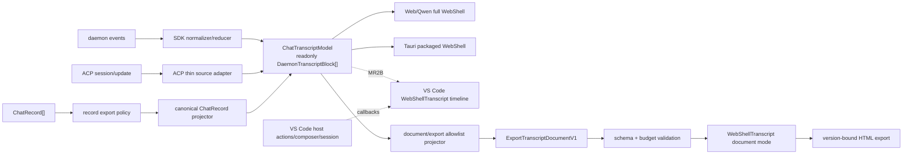

# Web Shell、VS Code、Desktop 与 HTML Export 统一 Chat Transcript 总体设计

> 文档地位：本方案的唯一规范性设计文档
>
> 实施方式：MR1、MR2A、MR2B 按顺序合入
>
> 当前状态：MR1 契约预验证已完成；当前分支实施 MR2A 的 HTML Export 产品路径，VS Code live transcript 迁移留给 MR2B
>
> 当前门禁：direct-daemon/ACP candidate identity 和产品 HTML browser gate 已通过；`selectedVscodePath: null`、`overall: "fail"`，直到 MR2B 完成产品选型、scope/generation、VSIX/宿主动作和 packaging 门禁

## 0. 文档治理

本文档同时定义最终目标架构、公共契约、安全约束、三个 MR 的实施边界和退出门禁。代码虽然拆成 MR1、MR2A、MR2B，但不会新建另一份设计文档。

后续规则如下：

1. MR1、MR2A 和 MR2B 的设计变更都回写本文档；
2. fixture schema、Export JSON Schema、capability matrix 和测试报告是本文档的契约附件，不是第二份设计文档；
3. 实施计划、E2E 记录和发布报告可以单独保存，但不能在其中重新定义本方案的模型、identity 或安全语义；
4. 若代码与本文档冲突，以未完成设计评审处理，不能通过修改 snapshot 将冲突掩盖；
5. 旧的统一 ChatPanel 背景方案和拆分前实现只作为历史上下文，本文档取代它们成为唯一规范来源。

## 1. 结论

本方案不会新建独立 ChatPanel 包，也不会在第一版发布新的跨宿主消息模型。四端共享的最小运行时语义继续建立在现有 `DaemonTranscriptBlock[]` 上；`ChatTranscriptModel` 是本文档对该只读边界的逻辑名称，不要求 MR1 新增生产类型。

最终数据关系是：

```text
native source
  → source adapter / canonical projector
  → ChatTranscriptModel (readonly DaemonTranscriptBlock[])
  → live/readonly renderer

ChatTranscriptModel
  → document/export allowlist projector
  → ExportTranscriptDocumentV1
  → WebShellTranscript document mode
  → version-bound HTML
```

其中：

- Web/Qwen Server 与 Qwen Tauri Desktop 已经使用完整 WebShell，保持现状；
- VS Code 在 direct-daemon 与 ACP 薄转换两条路径都通过稳定 identity 探针后选择生产路径，只迁移聊天时间线；
- HTML Export 从 `ChatRecord[]` 复用规范投影得到 `ChatTranscriptModel`，再单向转换为安全的 `ExportTranscriptDocumentV1`；
- composer、活动权限响应、会话管理、传输、持久化和宿主副作用始终由宿主持有；
- 默认 interactive/readonly adapter 的 `rawInput`、`rawOutput` 和现有 Turn Output 语义不得改变；
- typed `preview`/`resultPreview` 的安全消费只在 document/export 路径启用；
- Mermaid 的额外预算、超时和降级规则只在 document mode 启用。

整个工作按顺序拆成三个 MR：

1. **MR1：契约预验证 MR**——只落地可重复证据，允许门禁如实 FAIL；
2. **MR2A：HTML Export MR**——落地安全 document pipeline、document mode 和 CLI/Web API/VS Code `/export html` 消费者；VS Code 时间线继续使用 legacy `MessageList`；
3. **MR2B：VS Code live transcript 迁移 MR**——选择产品路径并接入真实 adapter、scope/generation、shared renderer、host actions、VSIX 与 packaging 门禁。

## 2. 当前仓库事实与实施状态

### 2.1 当前生产边界

| 消费端                  | 当前事实                                                                                                                  | 本方案处理                                                                                          |
| ----------------------- | ------------------------------------------------------------------------------------------------------------------------- | --------------------------------------------------------------------------------------------------- |
| Web/Qwen Server         | daemon state 经 SDK reducer 产生 `DaemonTranscriptBlock[]`，完整 WebShell 渲染                                            | 保持生产路径不变；作为语义和兼容基线                                                                |
| Qwen Tauri Desktop      | 构建并复制同一 WebShell 产物                                                                                              | 不增加 Desktop adapter；MR1 不认证安装产物行为                                                      |
| VS Code                 | MR2A 继续由现有 legacy `MessageList` 渲染；不注册 transcript update、不引入 `@qwen-code/web-shell`、不发布死 feature flag | 该 render site 是 MR2B 的设计接入 seam，不新增空生产 adapter                                        |
| HTML Export             | CLI、Web API 和 VS Code 导出均把原始 records 交给 document projector，并使用版本绑定的产品模板                            | 产品路径已收敛；legacy renderer 已随 `@qwen-code/webui` 退休移除，`toHtml` 要求 records（见 §12.4） |
| OpenWork/Craft Electron | 独立聊天实现                                                                                                              | 本方案范围外                                                                                        |

当前 `WebShellTranscript`：

- 公开接收 `readonly DaemonTranscriptBlock[]`；
- 固定运行在 `readonly` render mode；
- 不连接 daemon、不提供 composer、不响应权限、不修改 session；
- 默认 adapter 仍从 runtime block 的 raw 字段恢复完整工具展示和 Turn Output 语义；
- 已提供独立 `document` render mode；interactive/readonly 的 raw adapter 语义保持不变。

### 2.2 三个 MR 的状态

| 范围                                             | 当前状态                                                               | 结论               |
| ------------------------------------------------ | ---------------------------------------------------------------------- | ------------------ |
| MR1 fixtures/schema/hash/capability matrix       | 已完成                                                                 | PASS               |
| ChatRecord → SDK → Web Shell 默认 adapter 等价性 | 默认 raw 路径回归通过                                                  | PASS               |
| `write_file` → Turn Output 完整 diff 回归        | 继续读取完整 runtime raw content                                       | PASS               |
| direct-daemon stable identity                    | SDK reducer + integration candidate projection 通过 partial-prepend    | PASS（候选证据）   |
| ACP stable identity                              | integration candidate projection 通过 live/history/partial-prepend     | PASS（候选证据）   |
| VS Code 时间线                                   | MR2A 保持 legacy `MessageList`，没有新 transport/adapter/renderer 接线 | DEFERRED TO MR2B   |
| Export document schema/builder                   | canonical schema、严格结构校验和语义安全校验进入产品路径               | PASS               |
| document mode/HTML wiring                        | CLI、Web API、VS Code export 使用同一版本绑定产品模板                  | IMPLEMENTED        |
| Browser/Scope/VSIX/Packaging                     | 产品 HTML browser gate 已通过；scope/reconnect、VSIX/安装产物尚未认证  | PARTIAL / DEFERRED |

`overall` 仍为 FAIL 不是 HTML renderer 失败，而是 MR2A 有意不选择 VS Code 产品路径，required 的 live timeline、宿主与发布级行为证据留给 MR2B；不能把 candidate probe 的 PASS 当作产品接线完成。

## 3. 目标与非目标

### 3.1 目标

1. 冻结四端共享的最小只读 transcript 语义；
2. 复用现有 SDK reducer 和 `projectChatRecordsToDaemonTranscript()`，不复制 replay 规则；
3. 为 block、renderer item 和宿主动作建立可审计的稳定 identity；
4. 让 VS Code 复用 WebShell 聊天时间线，同时保留其 composer、权限、会话和原生操作；
5. 让 HTML Export 使用版本化、安全、资源有界且不从文档内容主动联网的输入；
6. 保证 Web Shell interactive/readonly 和 Tauri Desktop 不发生功能回归；
7. 通过 fixture、hash、capability matrix 和自动化门禁使每个架构结论可重复验证；
8. 允许 VS Code 与 HTML 两条消费路径通过 MR2A/MR2B 独立评审、灰度、观察和回滚。

### 3.2 非目标

- 不新增 `@qwen-code/web-shell/chat-panel` 或新的通用 ChatPanel framework；
- 不统一 composer、草稿、附件、队列、权限交互、会话列表或宿主导航；
- 不要求 Web/Qwen Server 或 Tauri Desktop 新增生产 adapter；
- 不迁移 OpenWork/Craft Electron；
- 不把 PDF、artifact viewer 或任意宿主 overlay 纳入 transcript model；
- 不把 action callback、transport、credential 或 session service 放入 transcript block；
- 不让 HTML Export 获得工具执行、权限响应或会话修改能力；
- 不以内容 hash、时间、随机数、数组下标、React key 或 DOM 位置伪造稳定 identity。

## 4. 总体架构



### 4.1 所有权边界

| 层级                 | 负责                                                                 | 不负责                                         |
| -------------------- | -------------------------------------------------------------------- | ---------------------------------------------- |
| source adapter       | 协议归一化、source provenance、scope/generation admission            | UI、宿主副作用                                 |
| ChatTranscriptModel  | 有序只读消息语义、稳定 block identity、展示所需层级                  | composer、活动权限响应、传输、session mutation |
| WebShellTranscript   | Markdown、thinking、工具、计划、图片和只读时间线展示                 | daemon 连接、持久化、权限 API                  |
| VS Code host adapter | MR2B 的连接路径、scope/generation、callbacks、feature flag、原生操作 | 复制聊天 renderer；MR2A 不发布空 adapter       |
| export projector     | record policy、逐字段 allowlist、ID 重写、预算与 diagnostic          | live side-channel、raw payload 透传            |
| HTML shell           | schema/version 校验、CSP、document mode、主题/打印                   | 工具执行、远程 runtime 下载                    |

宿主始终是传输、session 和副作用的事实来源。共享 renderer 不得通过 DOM 反向恢复业务状态。

## 5. ChatTranscriptModel 契约

### 5.1 最小定义

```ts
import type { DaemonTranscriptBlock } from '@qwen-code/sdk/daemon';

interface ChatTranscriptModel {
  readonly blocks: readonly DaemonTranscriptBlock[];
}

interface TranscriptAdapterContext {
  readonly scopeKey: string;
  readonly generation: number;
}
```

`ChatTranscriptModel` 是逻辑契约名。除非 MR2 的真实消费者证明现有类型无法表达必需语义，否则生产代码继续直接传递 `DaemonTranscriptBlock[]`，不发布上述 wrapper。

版本系统必须分离：

- runtime model 不增加文档 schema version；
- fixture 使用 `fixtureVersion`；
- HTML envelope 使用 `schemaVersion`；
- renderer 使用精确 `rendererVersion`。

`scopeKey` 和 `generation` 属于 adapter context，不进入 block 列表，也不进入导出文档。

### 5.2 必须表达的共享语义

| 能力                | block 语义                               | 必测状态                                                  |
| ------------------- | ---------------------------------------- | --------------------------------------------------------- |
| 用户/assistant 文本 | `user` / `assistant`                     | streaming、空 delta、usage、replay                        |
| thinking/commentary | `thought`                                | 与 assistant 交错、结束、折叠                             |
| 图片                | text block images                        | 多图、非法 MIME、缺失/超限资源                            |
| 工具                | `tool` + tool identity + typed preview   | pending、完成、失败、取消、并行、嵌套、后台、replay       |
| shell               | `shell` / `user_shell`                   | stdout/stderr、增量、退出、重连                           |
| 计划/Todo           | tool block 的类型化计划展示语义          | revision、priority、依赖、完成、失败                      |
| 权限历史            | `permission`                             | pending、approved、rejected、cancelled、expired、resolved |
| 状态与错误          | `status` / `error` / `prompt_cancelled`  | 取消、截断、不完整 replay、连接/模型错误                  |
| 未知输入            | 安全 fallback、明确排除或阻断 diagnostic | 不得静默丢失用户可见内容                                  |

计划当前不是独立 block kind。不能仅凭工具名称声明支持；fixture 必须证明用户可见的标题、步骤、状态、revision 和依赖仍存在。

### 5.3 不属于 model 的状态

- composer 内容、光标、草稿和待发送附件；
- follow-up queue、suggestion 查询和输入模式；
- 活动 permission response、credential 输入和 ask-user 表单状态；
- session 列表、当前 session、branch 导航和持久化对象；
- 文件打开、diff、URL、artifact、复制和编辑消息等宿主副作用；
- current tool、approval mode、resync、pending shell 等 side-channel。

`permission` block 只描述时间线历史，不授予调用权限 API 的能力。

### 5.4 未知内容与完整性

遇到未知输入时只能选择：

1. 转为不泄露 raw payload 的可见安全 fallback；
2. 按已冻结策略明确排除并记录 diagnostic；
3. 若原本应用户可见，则标记契约缺口并阻断门禁。

禁止把任意 `unknown`、`meta`、`details`、`content` 或 raw object 作为逃生口。diagnostic 对外只包含 code、severity、count 和完整性标记，不能回显 prompt、token、绝对路径或工具参数。

## 6. Render mode 与兼容性

最终定义三种模式：

| 模式          | 输入                                               | raw 语义                                   | 交互与资源策略                                      |
| ------------- | -------------------------------------------------- | ------------------------------------------ | --------------------------------------------------- |
| `interactive` | live runtime blocks                                | 保持现状，以 raw 为完整工具事实来源        | 完整 WebShell 交互                                  |
| `readonly`    | live/replayed runtime blocks                       | 保持现状，以 raw 为完整工具事实来源        | 无 composer/permission response；宿主 callback 可选 |
| `document`    | `ExportTranscriptDocumentV1` 的安全 renderer input | 禁止 raw；只消费 typed safe preview/result | 无宿主动作、无虚拟化、无主动远程资源                |

兼容性不变量：

1. MR2 不改变 interactive/readonly 的 `rawInput`、`rawOutput`、`content` 和 permission `toolCall` 读取优先级；
2. typed `preview`/`resultPreview` 即使同时存在，也不能改变默认 adapter 输出；
3. document mode 缺少安全 typed 字段时不能回退到 raw；
4. `write_file` Turn Output 继续优先使用完整 `tool.args.content`，不能被截断的 `preview.newText` 替代；
5. interactive/readonly 的 Markdown、Mermaid、工具卡、折叠、虚拟化和动作行为保持现状；
6. document mode 的限制通过独立 context/option 启用，配置缓存必须按 mode 隔离。

如果 `ExportTranscriptBlockV1` 不能类型安全地直接交给 `WebShellTranscript`，MR2A 只允许增加一个纯函数 document adapter。该 adapter 只能把安全 DTO 映射为 renderer input，不能恢复 raw payload、复制 reducer 或演变成第二套消息模型。

## 7. 稳定 identity 设计

### 7.1 稳定域

在同一 `scopeKey` 和同一原生语义事件链中，同一个 block 的 identity 必须在以下操作后保持不变：

- React rerender；
- 相同输入重复归约；
- streaming delta append；
- 完整、部分和重叠 replay；
- reconnect；
- 先加载尾部窗口再 prepend 更早历史；
- timestamp 归一化；
- 允许乱序的独立事件交换。

不同 session、branch、原生协议或独立导出文件不要求产生相同字符串 ID。跨 adapter 比较使用语义与 provenance，不虚构全局 ID。

### 7.2 scopeKey 与 generation

- `scopeKey` 是宿主为 session + branch 分配的稳定不透明 key；同一 session 重连保持不变，切换 session/branch 必须变化；
- `generation` 是同一 scope 每次重新绑定 transport 时递增的本地代数；
- `generation` 不参与 block ID；
- event、tool update、permission、copy/edit/open-file 请求及异步结果都携带接收时的 `{scopeKey, generation}`；
- reducer/host 在应用结果前再次比对当前 context，不匹配则丢弃；
- 未知、bootstrapping、draining 或 removed scope 必须 fail closed，不回退到 primary/上一 session。

### 7.3 原生 provenance

| block                  | 首选 source identity                                       | 缺失处理                         |
| ---------------------- | ---------------------------------------------------------- | -------------------------------- |
| tool                   | `toolCallId` + scope                                       | 无 tool identity 则失败          |
| permission             | `requestId` + scope                                        | 无 request identity 则失败       |
| persisted text/thought | `sourceRecordIds` + lane + 持久化 segment identity         | 无法确定性得到则失败             |
| live text/thought      | prompt identity + lane + producer-stamped segment identity | 禁止用 ordinal/content hash 兜底 |
| shell/user_shell       | 权威 shell/event identity + scope                          | 缺失则失败                       |
| status/error/cancelled | 权威 event identity + scope                                | 缺失则失败或并入已有稳定 block   |

event cursor 只表示传输顺序。对由多个 delta 合并的文本 block，cursor 会随最后一个 delta 改变，因此不能单独作为 segment identity。

### 7.4 segment identity 规则

MR2A 只为 persisted replay/document projection 保留 record-derived segment identity；live producer/admission identity 由 MR2B 的真实 VS Code consumer 驱动。最终规则是：

1. 同一 streaming segment 的多个 delta 复用同一 `segmentId`；
2. user、assistant、thought 和 sub-agent lane 分开；
3. tool/permission/离散消息边界结束当前 text segment；
4. persisted replay 保留 record-derived segment identity，不能在 replay adapter 中重新编号；
5. MR2B 的 direct-daemon envelope 和 ACP live update 都必须把 source identity 带到 normalizer；
6. 不同 `segmentId` 的相邻文本不能仅因当前窗口相邻而合并成同一 identity block；
7. 缺少 stable prompt/record/segment 来源时输出阻断 diagnostic，不猜测补齐。

稳定 block ID 由版本化确定性函数从 `{scopeKey, blockKind, nativeSourceIdentity}` 派生。父子 block 引用必须同步重写。默认 Web/Tauri reducer 的 ordinal runtime ID 可保持兼容；MR2A 只在 integration helper 中保留 candidate evidence，稳定投影进入 VS Code 生产 adapter 必须由 MR2B 的真实消费者驱动。

### 7.5 MR1 历史 FAIL 与 MR2A candidate 证据

MR1 的 read-only probe 使用当前 `normalizeDaemonEvent` 和 `reduceDaemonTranscriptEvents`：

1. 完整输入从空 state 归约；
2. 去掉首个历史片段后重新归约同一尾部；
3. 通过语义 key 对齐同一 block；
4. 比较当前 block ID，并记录 source provenance 是否存在。

MR1 当时的结果：

| Candidate     | partial-prepend       | 原生文本 identity           | MR1 gate |
| ------------- | --------------------- | --------------------------- | -------- |
| direct-daemon | ordinal block ID 漂移 | user/thought/assistant 缺失 | FAIL     |
| ACP           | ordinal block ID 漂移 | user/thought/assistant 缺失 | FAIL     |

MR2B 合入前，两条候选都必须运行完整 identity matrix 并通过；若要永久放弃其中一条，必须先在本文档中记录范围变更与理由，不能只从测试中删除失败候选。

MR2A 不保留只供门禁调用的 VS Code 生产 adapter。门禁调用实际 SDK reducer、integration-only candidate projection 与实际 Web Shell message projector；两条候选通过 append/partial-prepend/replay matrix，但结果只证明契约可行性。ACP 是否成为产品路径由 MR2B 结合 scope/generation、host actions、VSIX 和三平台证据重新确认；MR2A 的 `selectedVscodePath` 保持 `null`。

## 8. Renderer item 与宿主动作 identity

稳定 block ID 只是必要条件。renderer 会合并 assistant 文本、合组相邻工具并嵌套 thought/sub-agent，因此一个 block 不一定对应一个 DOM 节点。

测试和宿主接缝使用以下逻辑证据：

```ts
interface TranscriptRenderedItemEvidence {
  readonly renderedItemId: string;
  readonly sourceBlockIds: readonly string[];
  readonly sourceToolCallIds: readonly string[];
  readonly capabilities: readonly (
    | 'copy'
    | 'copy-all'
    | 'copy-last-reply'
    | 'edit-user-message'
    | 'open-file'
  )[];
}
```

规则：

- `renderedItemId` 来自稳定 source IDs、tool call identity 和固定分组边界；
- 工具分组不能仅依赖“当前窗口中的相邻位置”；缺少稳定 batch/turn 边界时宁可不跨边界合组；
- 合并后的所有 `sourceBlockIds` 必须保留，每个 tool call 可单独寻址；
- identity 在 rerender、折叠、虚拟化开关、partial-prepend 和 replay 后不变；
- semantic copy 从 renderer 展示模型生成，不抓取当前挂载 DOM；
- copy、edit、open-file 等动作把稳定目标交还宿主，宿主执行前再次校验 scope/generation；
- streaming 文本增长可以改变 semantic copy hash，但不能改变同一 segment 的 item identity；
- React key、DOM 顺序、数组下标和可见窗口不能成为业务 identity。

MR2B 只增加由失败 fixture 证明必要的最小 callback/handle，不能借此创建通用宿主框架；MR2A 不增加宿主 callback/handle。

## 9. 四端适配设计

### 9.1 Web/Qwen Server

- 继续使用 daemon reducer 和完整 WebShell；
- 不新增生产 adapter；
- 作为 interactive/readonly raw 兼容基线；
- MR2 的 document/identity 改动必须运行其回归测试，不能改变默认输出。

### 9.2 Qwen Tauri Desktop

- 继续打包同一 WebShell build、assets 和 library dist；
- 不新增 Desktop transcript fork；
- MR1 通过源码 wiring 断言建立基础证据；
- 最终桌面发布仍需安装产物 smoke，但不阻塞 MR1。

### 9.3 VS Code direct-daemon 候选

```text
daemon events
  → SDK normalizer/reducer
  → stable identity projection
  → scoped ChatTranscriptModel
  → WebShellTranscript readonly timeline
```

必须验证：loopback/auth/workspace scope、session 生命周期、SSE replay、permission ownership、VSIX bundle、CSP、sidebar/editor tab、callbacks 和 feature flag。direct-daemon 不能因仓库已有 connection spike 就自动成为生产路径。

### 9.4 VS Code ACP 候选

```text
ACP session/update
  → thin source normalizer
  → SDK transcript reducer
  → stable identity projection
  → scoped ChatTranscriptModel
  → WebShellTranscript readonly timeline
```

ACP adapter 只做协议归一化和 provenance 传递：

- 不重新实现 Markdown、tool、plan 或 permission 展示；
- 不把 ACP session object 交给 renderer；
- 不接管 composer、权限响应、session 管理或原生文件操作；
- live 与 history 必须共享同一 segment identity 语义；
- 迟到 update 与异步动作结果按 scope/generation 丢弃。

### 9.5 VS Code 选型规则

两条候选先使用相同 fixture 和 identity matrix。MR2B 只能选择满足以下条件的路径：

1. stable identity 全部通过；
2. 现有 composer、permission、session 和 host action 边界保持不变，或范围变更已单独评审；
3. VSIX bundle、CSP 和三平台行为通过；
4. 能在 feature flag 关闭时完整回退 legacy timeline。

ACP 是当前生产基线，因此在两条路径同等可行时优先 ACP 薄转换；这不是 MR1 的预选结果。最终选择及舍弃理由写入 capability matrix 和本文档状态表。

MR2A 不做产品选型：VS Code 不旁路转发 raw `session/update`，Webview 不实例化 transcript reducer，不声明 `qwen-code.experimental.webShellTranscript`，并始终渲染现有 legacy `MessageList`。该 render site 是 MR2B 的目标接入 seam，但不是需要额外占位代码的生产抽象。ACP 作为当前 transport 仍是优先候选，只有 MR2B 完成宿主动作 parity、VSIX 和三平台门禁后才能写入 `selectedVscodePath`。

### 9.6 HTML Export

```text
ChatRecord[]
  → record-level export policy
  → projectChatRecordsToDaemonTranscript()
  → ChatTranscriptModel
  → safe document projector
  → ExportTranscriptDocumentV1
  → schema/budget validation
  → WebShellTranscript document mode
  → version-bound HTML
```

HTML 路径不能复制 ChatRecord replay/reducer，也不能把完整 `ChatRecord`、`DaemonTranscriptState` 或 runtime blocks 直接序列化进文件。

## 10. ExportTranscriptDocumentV1

### 10.1 角色

`ExportTranscriptDocumentV1` 是 `ChatTranscriptModel` 的单向安全派生物：

```text
ExportTranscriptDocumentV1 = projectForDocument(ChatTranscriptModel)
```

它是版本化文档 DTO，不是第二套运行时 transcript model，也不回流到 live session。

```ts
interface ExportTranscriptDocumentV1 {
  readonly schemaVersion: 1;
  readonly rendererVersion: string;
  readonly blocks: readonly ExportTranscriptBlockV1[];
  readonly diagnostics: readonly {
    readonly code: string;
    readonly severity: 'info' | 'warning' | 'error';
    readonly count: number;
  }[];
  readonly metadata: ExportMetadataPresentationV1;
}
```

### 10.2 两层安全投影

顺序不能调换：

1. **record-level policy**：分类用户可见、内部控制、system 和未知记录；不得改写顺序、parent/branch 或因果链；
2. **post-projection allowlist**：对规范 blocks 逐 kind 新建安全对象，不使用 spread 后删黑名单。

若拒绝的记录是后续可见记录的必要因果节点，导出标记不完整或直接失败，不能重连 parent 伪造会话。

### 10.3 block 字段 allowlist

JSON Schema 以 `additionalProperties: false` 封闭每种 block：

| block                        | V1 允许字段                                                                                                                       |
| ---------------------------- | --------------------------------------------------------------------------------------------------------------------------------- |
| 所有 kind                    | 文档内 opaque `id`、`kind`；三个 block 时间字段固定为 `0`                                                                         |
| `user`/`assistant`/`thought` | `text`、安全 raster images、`collapsed`、安全 parent 引用、数值 allowlist 后的 usage；`streaming=false`                           |
| `tool`                       | opaque `toolCallId`、title、终态 status、安全 toolName/toolKind、typed `preview`/`resultPreview`、安全父子引用、短 `subagentType` |
| `shell`                      | `text`、`stream`                                                                                                                  |
| `user_shell`                 | `text`、`command`、脱敏 workspace-relative `cwd`、`stream`                                                                        |
| `permission`                 | opaque `requestId`、title、label/description、`raw:null` options、typed preview、opaque tool identity、安全 resolved 终态         |
| `status`/`error`             | text、已知 code/errorKind、安全 source                                                                                            |
| `prompt_cancelled`           | 安全 reason                                                                                                                       |
| `debug`                      | V1 默认拒绝；产生 code/count diagnostic                                                                                           |

以下字段永不直接导出：

- `eventId`、`serverTimestamp`、`sourceRecordIds`、`promptId`、`branchRecordId`；
- tool 的 `content`、`locations`、`details`、`rawInput`、`rawOutput`；
- permission 的 `sessionId`、`toolCall` 和原始 response token；
- status 的 `data`、`debugReason`；
- credential、环境变量、绝对用户路径、原始 session ID/label、任意 metadata bag。

### 10.4 typed tool projection

- runtime `preview` 进入文档前必须按 kind 重新构造并递归应用长度、URL、path、image 和数组限制；
- `ask_user_question`/permission 的 `raw` 固定为 `null`；
- tool 完成后只写入安全 `resultPreview`，不能写入 raw result；
- 新的 unsafe、oversized 或无法分类的 tool update 必须清除同一 call 上旧的安全 result preview，避免 stale preview 泄漏；
- Plan/Todo 只保留 id、content、status、priority、blockedBy、planId 和 revision 等 allowlist 字段；
- document adapter 只消费 typed preview/result；缺失时输出安全占位与 diagnostic，不能回退 raw；
- interactive/readonly adapter 继续使用既有 raw 语义。

### 10.5 opaque ID 与引用

原生 ID 不直接进入导出文档。projector 按最终 canonical traversal 为 block、tool、permission 和父子引用建立文档内 opaque 映射，并同步重写所有引用：

- 映射对同一输入确定；
- 不写入原始到 opaque 的反向表；
- 导出文件之间不承诺 ID 稳定；
- duplicate、悬空或循环引用使文档失败或明确降级；
- opaque ID 受字符集和长度限制。

这套 ID 与 live stable identity 是两个域：前者服务单个离线文档，后者服务同一 session scope 的重放和动作寻址。

### 10.6 metadata

```ts
interface ExportMetadataPresentationV1 {
  readonly title?: string;
  readonly startedAt?: string;
  readonly exportedAt: string;
  readonly complete: boolean;
  readonly truncated: boolean;
  readonly projectName?: string;
  readonly repository?: string;
  readonly gitBranch?: string;
  readonly model?: string;
  readonly channel?: string;
  readonly promptCount?: number;
  readonly contextUsagePercent?: number;
  readonly contextWindowSize?: number;
  readonly totalTokens?: number;
  readonly filesWritten?: number;
  readonly linesAdded?: number;
  readonly linesRemoved?: number;
}
```

metadata 逐字段构造：

- `projectName` 只能是 basename 或显式安全标签；
- 不导出绝对 cwd、uniqueFiles、原始 session ID/label 或用户目录；
- 字符串有长度/字符策略；计数是非负安全整数；
- block 时间归零，`exportedAt` 只用于文档元数据，不能参与 identity 或语义快照。

### 10.7 资源与计算预算

| 预算                                | V1 上限                                                 |
| ----------------------------------- | ------------------------------------------------------- |
| transcript blocks                   | 1,000                                                   |
| 单文本字段                          | 400 KiB UTF-8；schema `maxLength` 另设 409,600 结构上限 |
| 全部可见文本                        | 8 MiB UTF-8                                             |
| 单 raster 解码后                    | 8 MiB                                                   |
| 全部 raster 解码后                  | 16 MiB                                                  |
| JSON envelope                       | 32 MiB UTF-8                                            |
| JSON/preview depth                  | 16                                                      |
| 单数组元素                          | 1,000                                                   |
| 单对象属性                          | 1,000                                                   |
| Mermaid/chart/diff/highlight 富任务 | 合计 100，超出显示源码 fallback                         |

JSON Schema 无法表达 UTF-8 总字节、总文本、总图片和 envelope 预算，因此 Node builder 与浏览器 validator 都必须执行显式预算检查；schema `maxLength` 只是结构上限，不能替代字节预算。

资源规则：

- 仅允许 `image/png`、`image/jpeg`、`image/gif`、`image/webp` 的受限 base64 raster；V1 拒绝动画内容；
- 拒绝 SVG、HTML、JavaScript、`file:`、`blob:`、远程图片和非预期 data URI；
- Markdown 图片与结构化 images 共用 MIME/来源/字节策略；
- code、diff、shell、command 和普通文本中的 URL 字面量只作为文本，不触发资源加载；
- 外部链接仅在明确用户点击时导航，去除 credential，并按策略处理 query/fragment；
- credential 去除的实际作用域是 http(s)：自由文本中的内嵌 URL 由 `sanitizeEmbeddedUrls` 逐个改写，Markdown link/autolink 由 `normalizeNavigableUrl` 处理，两者都清空 userinfo、query 和 fragment；非 navigable scheme（`ssh user:pw@host`）、裸参数形式的凭据（`-pSECRET`、`--token=...`）以及 `code` / `inlineCode` 节点内的内容按原文导出。document boundary 不是通用 secret scanner，这条边界必须与代码保持一致，不能在文档里给出更强的承诺；
- 超限时在富解析前输出安全占位和 diagnostic，不继续容错解析危险内容。

### 10.8 document mode

document mode 必须：

- 关闭虚拟化和内部滚动，确保全文查找、选择、复制和打印覆盖全部 blocks；
- 默认展开 thinking、plan、工具组、并行 agent、sub-agent 及嵌套工具；
- 关闭 composer、权限响应、retry、branch、session navigation 和宿主 action；
- 只读取 `ExportTranscriptDocumentV1` 的安全 renderer input；
- Markdown 远程图片不请求网络，危险 HTML/SVG 不执行；
- Mermaid 限制、超时和 fallback 只在 document mode 启用，不能污染 interactive/readonly 的全局配置或缓存；
- Mermaid、代码高亮、diff 和 chart 失败时保留可复制源码；
- 除版本绑定的 renderer 外，不加载需要 `unsafe-eval`、远程 WASM、远程 grammar、字体或其他动态资源。

### 10.9 CSP 与登记网络

HTML 使用与 CLI build 精确绑定的 renderer。禁止 `latest`、版本范围和运行时远程解析。
只有已将 renderer asset 发布到 npm 的 CLI 版本才能打开导出；两次发布之间的 source build 按设计 fail closed。

最低安全要求：

- `default-src 'none'`；
- `connect-src 'none'`、`object-src 'none'`、`frame-src 'none'`、`media-src 'none'`；
- `base-uri 'none'`、`form-action 'none'`；
- images 只允许批准的 `data:` 或明确登记的同包资源；
- script/style 使用 nonce/hash 或等价静态策略；若现有 React 需要 style attribute，只允许 `style-src-attr` 的最小例外，DTO 不接受 style 字段；
- renderer（包含 React runtime）只允许从 unpkg 的精确 npm 版本 URL 加载，并校验最终发布字节的 SRI；打开本地 HTML 后不得产生其他未登记 subrequest；
- 浏览器测试拦截打开、展开、Markdown/Mermaid、主题和打印期间的全部请求；任何未登记请求或 CSP violation 立即失败。

### 10.10 失败、完整性与 canary

- sanitizer error 不得回显被拒绝值；
- 安全降级记录 code/severity/count；
- 因预算或安全策略替换原本可见内容时：`truncated=true`、`complete=false`；
- 富 renderer 失败但完整安全源码仍在时，可以 `complete=true`，同时记录 warning；
- 删除 raw 后工具结果、计划、权限历史只剩不等价摘要时，正向 fixture 和 MR2 gate 失败；
- envelope、HTML、CSP、diagnostic 和旁路资源都执行字节级 canary scan；
- duplicate ID、危险 URL/image、cycle、object-property flood、非法 metadata、schema widening 或超限后继续渲染都失败。

### 10.11 版本规则

- 字段、kind、默认值、allowlist、metadata、CSP、MIME/URL 策略或资源预算的安全语义变化都递增 `schemaVersion`；
- 已发布 schema 不能原地改义；
- `rendererVersion` 必须是精确 CLI 版本或内容 hash，禁止 `latest`、`~`、`^`、比较范围和 `*`；
- renderer 明确声明支持的 schema 版本；不兼容时显示只读错误页，不宽松解析；
- schema 升级保留上一已发布版本的读取和安全 canary 测试，直到对应 CLI 退出支持；
- `fixtureVersion` 只描述测试录制格式，不代替 export schema version。

## 11. Fixture、schema 与 capability matrix

### 11.1 MR1 当前目录

```text
integration-tests/fixtures/chat-transcript-contract/v1/
├── capability-matrix.md
├── cases/
│   └── representative/
│       ├── manifest.json
│       ├── daemon-events.jsonl
│       ├── acp-session-updates.jsonl
│       ├── chat-records.jsonl
│       ├── expected-model.json
│       ├── expected-render-items.json
│       ├── expected-export.json
│       └── expected-gate.json
└── schema/
    └── manifest.schema.json
```

Export schema 的唯一生产副本位于 `packages/cli/src/ui/utils/export/export-transcript-document-v1.schema.json`。integration gate 直接读取该文件；fixture 不再复制第二份容易漂移的 schema。

规则：

- 只使用确定性合成数据，不采集真实用户会话；
- ID、时间、cwd、用户名、URL、token 和图片使用固定测试值；
- manifest 记录 source、consumer、capability、expected diagnostics 和所有 case/schema SHA-256；
- 普通测试只验证，不自动覆盖 fixture；
- gate report 是测试运行产物，不写回 hash fixture；
- `complete: true` 表示 fixture case 完整，不代表迁移 gate PASS。

### 11.2 MR2 必须扩展的场景

1. streaming 多 delta、重复/乱序、完整/部分/重叠 replay；
2. multi-delta partial-prepend，distinct segment adjacency；
3. 并行/嵌套工具、shell、后台 agent、失败/取消/迟到完成；
4. Plan/Todo revision、priority、依赖及安全 result preview；
5. permission 全生命周期且无原始 `toolCall` 仍可安全显示历史；
6. render 合并/分组/折叠/虚拟化下的 source mapping 和 actions；
7. scope 切换、generation 递增和迟到 event/action/result；
8. raw、credential、绝对路径、危险 URL/image、unknown/system/debug canary；
9. Markdown 远程资源、HTML/SVG/data URI、重定向和嵌套链接；
10. 每项预算边界/超限与最大文档 find/copy/print/performance；
11. 正向 Markdown、code、diff、LaTeX、Mermaid、tool summary 和 metadata；
12. `write_file` 同时存在完整 raw content 与截断 preview；
13. document → readonly/interactive mode 切换后 Mermaid 配置无泄漏。

### 11.3 capability matrix

MR1 的紧凑矩阵每项记录 Capability、当前 source/path、Fixture/Evidence、Owner 和 Gate；其中 path 合并 native source 与当前 mapping，evidence 合并 contract/render 证据。MR2 增加真实消费者时再拆出 Consumers 和 Render/action mapping，不能用省略列隐藏未验证能力。

required 项不能以 `unknown`、`TBD`、人工截图或“测试能运行”通过。PASS、FAIL、BLOCKED、DEFERRED 必须分别使用，不能把预计后续修复写成当前 PASS。

## 12. 三个 MR 的实施边界

### 12.1 MR1：契约预验证 MR

只包含：

- 本文档；
- fixtures、schemas、hash 和 capability matrix；
- 测试目录内 direct-daemon/ACP/read-only probes；
- ChatRecord → SDK → 默认 Web Shell adapter 等价性测试；
- `write_file` → Turn Output 完整 diff 回归；
- 必要的 integration test alias/config、no-AK CI wiring；
- 为 integration TypeScript program 补齐的显式 `.js` ESM import specifier；这些改动不得改变 Web Shell runtime 语义。

明确不包含：

- daemon/ACP 协议或 source emitter 新字段；
- SDK/CLI/Web Shell/VS Code 的生产 pipeline；
- stable identity production projector；
- `ExportTranscriptDocumentV1` builder；
- `document` render mode、Mermaid/CSP/browser probe；
- VS Code timeline 迁移或路径选择；
- HTML exporter wiring。

MR1 验收：测试通过，同时 `expected-gate.json` 保持 `overall: "fail"`、两候选 FAIL、`selectedVscodePath: null`。

### 12.2 MR2A：HTML Export MR

MR2A 中每项生产代码必须有 HTML 产品消费者。实施顺序：

1. **safe tool projection**：实现 document-only typed preview/result，保持 runtime raw 兼容；
2. **export builder**：实现 record policy、canonical projection、allowlist、opaque ID、metadata、budget 和 diagnostics；
3. **document mode**：实现非虚拟化/只读/无动作 renderer，Mermaid 限制仅在此 mode；
4. **HTML wiring**：CLI、Web API、VS Code `/export html` 和 integration runner 复用同一产品模板及版本绑定 renderer；
5. **browser/security gates**：CSP、登记网络、canary、最大预算和版本失败测试；
6. **candidate evidence**：direct-daemon/ACP identity 只保留在 integration helper，不创建 VS Code 生产 adapter；
7. **gate state**：HTML capability 可标 PASS，但 `selectedVscodePath: null`、`overall: "fail"` 保持不变。

MR2A 明确不包含：

- `@qwen-code/web-shell` 作为 VS Code 直接依赖；
- VS Code transcript feature flag、raw update 转发、ACP adapter、hook、theme bridge 或 shared timeline render branch；
- VS Code host-action/copy/edit/open-file seam；
- 仅为未来迁移存在的空组件、空 callback、死协议字段或 production probe；
- `NOTICES.txt` 与 notices generator 的 transcript 依赖增量。

VS Code 保留的唯一新行为是 `/export html` 把原始 records 传给 document pipeline；它不接管 live timeline。现有 legacy `MessageList` render site 作为文档定义的 MR2B 接入位置，不新增运行时占位抽象。

### 12.3 MR2B：VS Code live transcript 迁移 MR

MR2B 从 MR2A 之后开始，并由真实 VS Code consumer 驱动：

1. 重新运行 direct-daemon/ACP 完整 identity matrix 并选择产品路径；
2. 建立 scope/generation admission、stable block/item identity 和 parent reference 投影；
3. 接入真实 transcript adapter、hook、feature flag 与 `WebShellTranscript` readonly timeline；
4. 保留现有 composer、permission、session、legacy timeline 和 host actions；
5. 完成 reconnect、late update/action rejection、copy/edit/open-file parity；
6. 增加所需直接依赖并生成准确的 NOTICES；
7. 完成 VSIX、三平台和 packaged artifact 门禁后才能选择路径或翻转 overall gate。

MR2A 先独立收敛产品 HTML Export。MR2B 再接入 VS Code live timeline，避免 renderer、transport、host actions、VSIX 与许可证变更挤入同一评审。JSON Schema 无法表达的 credential URL、脱敏 path、总字节和资源预算继续由小型语义安全层负责，不恢复重复的逐字段结构 validator。

### 12.4 legacy HTML renderer 退休

MR2A 落地后，`@qwen-code/webui` 只剩 HTML Export 的 legacy 回退这一个消费者。该 package 随后被整体退休，legacy renderer 一并移除。删除证据：

1. **无剩余产品消费者**：CLI `/export html`、Web API `session-export` 和 VS Code `/export html` 都无条件传入原始 records，因此 legacy 分支在产品路径上不可达；
2. **接口收紧**：`toHtml(sessionData, originalRecords)` 的第二参改为必填，`loadHtmlTemplate` 与 `injectDataIntoHtmlTemplate` 连同 UMD/CDN 模板一并删除，document renderer 成为唯一 HTML 导出实现；
3. **回退被显式拒绝而非静默降级**：integration runner 遇到 legacy exported JSONL 时直接报错，要求提供 source ChatRecord JSONL，避免用一条未经 allowlist 的路径渲染旧文件；
4. **一次性确认**：退役合并前扫描全仓，确认没有剩余产品依赖或 workspace 路径引用。

本节只覆盖 legacy HTML renderer。VS Code legacy `MessageList` 不在此范围内，其移除仍受 §15 的观察期与删除证据约束。

## 13. 验证架构与测试矩阵

```mermaid
flowchart TD
  INPUTS["daemon / ACP / ChatRecord fixtures"] --> SEM["semantic projection"]
  INPUTS --> IDS["block identity matrix"]
  SEM --> RENDER["actual Web Shell message projector"]
  SEM --> EXPORT["export allowlist projector"]
  EXPORT --> SCHEMA["schema + budget + canary"]
  SCHEMA --> BROWSER["product HTML browser gate"]
  RENDER --> HOSTS["Web / Tauri / VS Code"]
  BROWSER --> HTML["HTML Export"]
  IDS --> GATE{"overall gate"}
  RENDER --> GATE
  HOSTS --> GATE
  HTML --> GATE
```



### 13.1 MR1 已执行验证

```bash
npm run build
npm run typecheck
cd integration-tests && npx tsc -p tsconfig.json --pretty false
npx vitest run chat-transcript-contract.test.ts
cd ../packages/web-shell && npx vitest run client/components/artifacts/turnOutputSelectors.test.ts
```

MR1 证明：fixture/hash/schema 可重复、默认 raw runtime 兼容、Turn Output 完整 diff 不回归，以及两条 identity blocker 可重复。

MR1 不以源码文本断言认证 Desktop 打包行为。Web/Tauri 的现有构建检查继续作为回归信号；安装产物中 Web Shell 文件布局与可加载性的行为 smoke 属于 MR2B Packaging gate，在当前矩阵中保持 DEFERRED。

### 13.2 MR2A 与 MR2B 必须验证

| 范围           | 必须覆盖                                                                                                                 |
| -------------- | ------------------------------------------------------------------------------------------------------------------------ |
| SDK/source     | segment provenance、append/prepend/replay、parent refs、默认 ordinal 兼容                                                |
| ACP            | live/history 同 identity、缺失 provenance fail closed、迟到 update                                                       |
| VS Code        | MR2A 验证 legacy timeline 与 `/export html`；MR2B 验证选定路径、scope/generation、callbacks、feature flag、legacy parity |
| Web Shell      | interactive/readonly raw 兼容、document safe-only、render/action identity                                                |
| Export builder | record policy、per-kind allowlist、opaque IDs、metadata、diagnostic、version                                             |
| Browser        | schema failure、登记网络、CSP、canary、find/copy/print、最大预算                                                         |
| Packaging      | Web/Tauri regression、VSIX 三平台、CLI renderer 版本绑定、integration runner 收敛                                        |

Passing test 也必须反向审计：测试是否断言了正确语义、是否加载当前构建产物、是否真的覆盖真实消费者，不能用静态 source assertion 替代浏览器或 VSIX 行为验证。

当前 MR2A 验证结果：SDK、Core、CLI、Web Shell、VS Code `/export html` 聚焦测试和 direct-daemon/ACP integration candidate gate 已通过；产品 HTML 已完成构建、Node 侧安全断言和真实 Chromium browser gate，concurrent runner 也复用同一产品收集、归一化和 formatter。browser gate 已覆盖最大文档、真实产品入口、登记网络、主动 CSP 违规、canary、搜索、复制、打印、远程资源降级和 epoch 时间戳排除。VS Code live timeline、scope/generation/reconnect、宿主动作、VSIX 与 packaged artifact 证据全部属于 MR2B。

## 14. 门禁

### 14.1 共享语义门禁

- required capability 都有 source、mapping、owner、fixture 和结论；
- unknown/incomplete 输入有安全 fallback、明确排除或阻断；
- 工具、计划、权限历史删除 raw 后在 document mode 仍保留等价可见语义；
- interactive/readonly 默认 adapter 不消费 document-only result projection；
- 没有宿主对象、callback 或 transport 进入 model。

### 14.2 identity/action 门禁

- direct-daemon 与 ACP 的 append、partial-prepend、replay、reconnect 和乱序矩阵通过；
- 每个 block 有 source provenance；
- rendered item 保留完整 source block/tool mapping；
- copy/edit/open-file 不依赖 DOM 或数组位置；
- scope/generation 切换丢弃全部迟到 event/action/result；
- 缺失 identity 时 fail closed。

### 14.3 Export 安全门禁

- record policy 和每个 block kind 的 allowlist 实现并校验；
- raw、credential、绝对路径、session identity 和危险资源负向测试通过；
- envelope/HTML/CSP/diagnostic/resources canary 零命中；
- 打开、展开、富渲染、主题和打印期间零未登记网络请求、零 CSP violation；
- 所有预算边界和超限 fixture 通过；
- 正常 Markdown、code、diff、LaTeX、Mermaid、tool/plan/permission 与 metadata 不被过度删除；
- schema/renderer 不兼容安全失败。

### 14.4 当前与最终结论

MR1 的历史结论是 FAIL evidence。MR2A 的两候选 identity 与产品 HTML browser gate 通过，但不选择 VS Code 产品路径；总体门禁保持 FAIL：

```json
{
  "overall": "fail",
  "selectedVscodePath": null
}
```

MR2B 只有在上述三组门禁和真实消费者验证全部通过后才能选择路径或改为 PASS。任何 required 组失败都阻断 MR2B 合入；不能人工豁免，也不能先 assert false、合入生产代码后在同一证据缺失状态下只把期望改成 true。

## 15. 发布、观察与回滚

### 15.1 VS Code

- MR2A 不发布新时间线或 feature flag，始终使用 legacy timeline；
- MR2B 的新时间线受独立 feature flag 控制；
- legacy timeline 在 pre-release 和观察期内保留；
- 比较相同录制会话的状态、动作、截图、性能和错误；
- flag 关闭必须完整回退 legacy，不改变 session 数据；
- 观察期和删除证据完成后再移除 legacy timeline。

### 15.2 HTML Export

- 新 exporter 与旧 exporter 可独立切换；
- 生成失败不覆盖已有文件；
- schema/version 错误显示安全只读页面；
- integration runner 与产品模板在新路径稳定后再删除重复 renderer；
- 回滚 renderer 不得放宽已经发布的 schema 安全语义。

### 15.3 Web 与 Desktop

Web/Qwen 和 Tauri 不迁移。若 MR2A/MR2B 对共享组件的改动导致默认模式回归，应回滚对应 MR，而不是为两端增加兼容 adapter。

## 16. 风险与控制

| 风险                                 | 控制                                                                  |
| ------------------------------------ | --------------------------------------------------------------------- |
| 证据 MR 膨胀成生产实现               | MR1 文件范围白名单；HTML 与 VS Code 生产变更分属 MR2A/MR2B 真实消费者 |
| 测试模型变成第二套 model             | `ChatTranscriptModel` 只命名现有 blocks；不发布 wrapper               |
| ordinal ID 在简单 replay 中假稳定    | 强制 multi-delta、partial-prepend、overlap replay                     |
| block ID 稳定但 render/action 不稳定 | 单独 item/source/action probe                                         |
| ACP 与 direct 只验证一条             | 两候选共用 matrix；删除候选必须更新本文档                             |
| document projection 污染 runtime     | mode 隔离；默认 raw compatibility tests                               |
| preview 截断破坏 Turn Output         | `write_file` 完整 raw content 回归                                    |
| raw/metadata 泄漏                    | 两层 allowlist、closed schema、canary 和字节扫描                      |
| Markdown/图片绕过网络策略            | 统一资源 policy、CSP 和浏览器全请求拦截                               |
| Mermaid 全局配置污染                 | 仅 document context 启用限制，缓存按 mode 隔离                        |
| document 无虚拟化导致资源耗尽        | builder/browser 双预算、源码 fallback、最大文档测试                   |
| snapshot update 掩盖 blocker         | hash、显式 fixture diff、gate 由测试生成                              |
| 备份实现与最新 main 漂移             | MR2A/MR2B 选择性迁移并重新审计，不整包恢复                            |

## 17. 完成定义

整个总体设计完成需要同时满足：

- MR1 已合入且稳定保存 PASS/FAIL/DEFERRED 证据；
- direct-daemon 与 ACP identity 验证达到本文档门禁；
- MR2A 的 VS Code `/export html` 使用新 document pipeline，同时 live timeline 保持 legacy；
- MR2B 已选择并实现一条 VS Code live transcript 路径，其时间线使用 WebShell UI，现有 composer、permission、session 和 host actions 保持边界；
- HTML Export 使用 canonical projector、`ExportTranscriptDocumentV1`、版本绑定 renderer 和 document mode；
- HTML 产品路径与 integration runner 不再维护第二套 renderer；
- Web/Qwen Server 和 Tauri Desktop 默认行为无回归；
- security、network、budget、CSP、version、VSIX/CLI packaging 和观察期完成；
- legacy HTML renderer 已移除，删除证据见 §12.4；VS Code legacy timeline 仍只有在有删除证据时才移除；
- 未引入新的跨宿主 ChatPanel 包、通用消息模型或 OpenWork overlay；
- 后续任何公共契约变化继续更新本文档，不创建平行设计来源。
