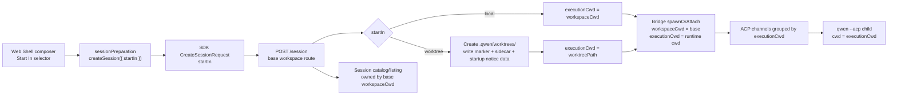

# Web Shell Start In Selector

## Summary

Implement #6701 by adding an execution-context selector for fresh Web Shell sessions, with real git worktree isolation.

- Add a compact `Start In` selector to the UI:
  - `Work locally`
  - `New worktree`
- `New worktree` affects only future fresh sessions. It does not affect loaded, resumed, or active sessions.
- The daemon creates the git worktree before starting the session.
- The bridge retains the base `workspaceCwd` as the workspace ownership, listing, and routing key, while introducing `executionCwd` as the actual runtime directory for the child process and session.
- ACP bridge channels are grouped by `executionCwd`, ensuring that local and worktree sessions never reuse the same child process.



## Key Changes

1. Add `StartInMode = 'local' | 'worktree'` and thread it through:
   - Web Shell `sessionPreparation`
   - `DaemonSessionActions.createSession`
   - SDK `CreateSessionRequest`
   - daemon `POST /session`

2. Split the bridge's runtime-directory semantics:
   - `workspaceCwd`: the base workspace ownership key, used for routing, listing, session storage, trust, and workspace registry matching.
   - `executionCwd`: the actual session runtime directory, used for ACP child spawning, shell command cwd, child-facing status, artifacts, and all path-sensitive session behavior.
   - ACP child configuration keeps execution storage rooted at `executionCwd` while transcript and catalog persistence remain rooted at `workspaceCwd`.
   - `SessionEntry` stores both values.
   - ACP channels are grouped by `executionCwd`. Sessions with the same `executionCwd` may reuse a channel, while different worktrees and the local cwd must use separate child channels.

3. Create worktree sessions in the daemon:
   - For `startIn: 'worktree'`, create a worktree automatically from the base repository using the existing `GitWorktreeService`.
   - Write a `WorktreeSession` sidecar with the same shape used by CLI worktree sessions.
   - Write or adopt the worktree marker so that `exit_worktree` ownership checks remain valid.
   - Generate a startup notice equivalent to `buildStartupWorktreeNotice` and inject it through the initial-context path of the new session's first prompt.
   - If worktree creation, spawning, sidecar writing, marker writing, or response delivery fails, close the newly created fresh session and remove only the worktree created by that request on a best-effort basis.

4. Restore behavior:
   - The `load` and `resume` routes resolve the base workspace first.
   - Read the session sidecar from the base workspace before bridge restore.
   - If the sidecar is valid and the worktree still exists, pass its path to the bridge as `executionCwd`.
   - If no valid sidecar exists, restore locally with `executionCwd = workspaceCwd`.
   - The transcript root record stores its durable `workspaceCwd`; the worktree sidecar is only a temporary execution binding and may be removed without orphaning the session.
   - Session listings remain owned by the base workspace and may include worktree metadata for display or debugging.

5. UI behavior:
   - Add a compact `StartInSelector` using the existing ChatEditor toolbar and dropdown styles.
   - Enable `New worktree` only when both the capability and workspace preflight report that it is available.
   - When unsupported, keep the option visible but disabled and explain the reason in a tooltip.
   - Reset the selector to `Work locally` after a fresh session is created successfully.
   - Do not display or mutate the current session mode for loaded, resumed, or active sessions.

## Preflight And Capability

- Add the capability feature flag `session_start_in_worktree`.
- Add the preflight kind `worktree`.
- The daemon's `worktree` preflight checks that:
  - the git binary is available;
  - the current workspace is inside a git repository;
  - the repository top level can be resolved;
  - the current cwd is not inside `.qwen/worktrees`.

The UI enables `New worktree` only when both conditions are met:

- `capabilities.features.session_start_in_worktree === true`
- `kind === 'worktree' && status === 'ok'` for the preflight cell

## Local Verification

Use a clean temporary Git repository so test artifacts do not affect the development workspace:

```bash
export TEST_REPO="$(mktemp -d "${TMPDIR:-/tmp}/qwen-start-in-test.XXXXXX")"
git -C "$TEST_REPO" init -b main
git -C "$TEST_REPO" config user.name "Local Test"
git -C "$TEST_REPO" config user.email "local-test@example.com"
echo test >"$TEST_REPO/README.md"
git -C "$TEST_REPO" add README.md
git -C "$TEST_REPO" commit -m "initial commit"
```

Build and start Web Shell so the verification uses artifacts from the current branch:

```bash
npm run build && npm run bundle
npm start -- serve \
  --workspace "$TEST_REPO" \
  --port 4170 \
  --token local-test-token \
  --open
```

Verify the following with fresh sessions:

1. `Start In` defaults to `Work locally`, and `New worktree` is available in a Git workspace.
2. Create a session with `Work locally`: `workspaceCwd` is `$TEST_REPO`, and `executionCwd` is omitted.
3. Start another fresh session and select `New worktree`: a worktree appears under `$TEST_REPO/.qwen/worktrees/<slug>`, while status reports `$TEST_REPO` as `workspaceCwd` and the worktree path as `executionCwd`.
4. After successful session creation, the selector resets to `Work locally` for the next fresh session only. Loading an existing worktree session continues to use its original worktree as the execution directory.

Inspect the runtime state with:

```bash
git -C "$TEST_REPO" worktree list
curl -s -H 'Authorization: Bearer local-test-token' \
  "http://127.0.0.1:4170/session/$SESSION_ID/status" |
  jq '{sessionId, workspaceCwd, executionCwd}'
```

`npm run dev:daemon` cold-starts ACP children through `tsx`, so initialization may exceed the 10-second timeout for large workspaces. Prefer the bundle-based workflow above for local acceptance testing. When Vite hot reload is needed, set `QWEN_CLI_ENTRY="$PWD/dist/cli.js"` before running `npm run dev:daemon`.

## Test Plan

- SDK and webui unit tests:
  - `startIn` serializes to `POST /session`.
  - `DaemonSessionActions.createSession` forwards `startIn` correctly.
  - `sessionPreparation` forwards the selected `startIn` together with the workspace and approval mode.

- Daemon route unit tests:
  - `local` preserves the existing behavior with `executionCwd = workspaceCwd`.
  - `worktree` creates an automatic worktree, writes the marker and sidecar, injects the startup notice, and calls the bridge with the base `workspaceCwd` and worktree `executionCwd`.
  - Invalid `startIn`, a non-Git repository, a missing git binary, and a nested worktree cwd fail before bridge spawn.
  - Spawn failure, metadata failure, and client disconnect clean up the fresh worktree and session.

- Bridge unit tests:
  - Workspace mismatch validation still uses the base `workspaceCwd`.
  - Channels are grouped by `executionCwd`.
  - Local then worktree, worktree then local, and two different worktrees all use separate child channels.
  - Shell commands, artifacts, and child status use `executionCwd`.
  - List, load, and resume remain owned by the base `workspaceCwd`.

- Web Shell unit tests:
  - The selector renders and switches modes.
  - `New worktree` is disabled without the capability or preflight.
  - The first prompt creates the session with the selected `startIn`.
  - Changing the selector during an active session neither migrates nor recreates that session.

## Assumptions And Boundaries

- V1 supports only the automatic-slug semantics of bare `qwen --worktree`; explicit slugs and PR worktrees are out of scope.
- Active session migration is out of scope.
- On mobile, V1 uses the existing toolbar wrapping and does not add a new overflow menu.
- Worktree cleanup is best-effort and applies only to worktrees created by the failed request. Previously retained or reused worktrees are never removed automatically.
