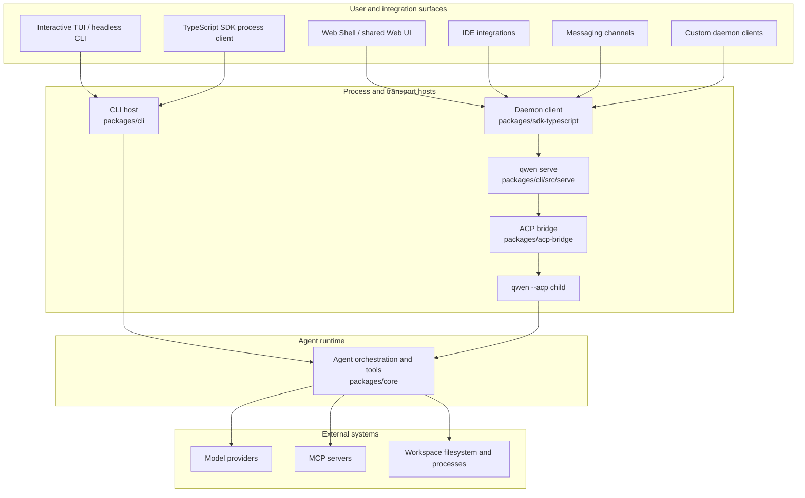

# Qwen Code Architecture Overview

Qwen Code is a monorepo that supports an interactive terminal, headless and
programmatic execution, the Agent Client Protocol (ACP), a long-running HTTP
daemon, web and IDE clients, and messaging-channel adapters. This document maps
those surfaces to the packages that implement them and explains the main
runtime boundaries.

For detailed daemon internals, start with the
[daemon documentation](./daemon/00-index.md). For HTTP request and event
shapes, see the [`qwen serve` protocol reference](./qwen-serve-protocol.md).

## System at a glance

Qwen Code has two agent execution models:

- **Direct execution:** the interactive TUI and headless CLI construct and run
  the agent runtime directly.
- **ACP execution:** `qwen --acp` hosts the agent behind an ACP transport. It
  can be driven by an ACP client directly or by `qwen serve` through the shared
  ACP bridge.

`qwen serve` adds an HTTP + Server-Sent Events (SSE) control plane around ACP
execution so multiple clients can use long-lived, workspace-scoped runtimes.

The diagram shows the main production paths. Some adapters also have standalone
modes: for example, `qwen channel start` uses the ACP bridge without requiring
an HTTP daemon. See the
[channel plugin guide](./channel-plugins.md#runtime-modes) for those variants.

## Repository layout

| Path                                                                                                             | Responsibility                                                                                                                                                                                   |
| ---------------------------------------------------------------------------------------------------------------- | ------------------------------------------------------------------------------------------------------------------------------------------------------------------------------------------------ |
| `packages/cli`                                                                                                   | The `qwen` executable, argument parsing, configuration assembly, Ink TUI, headless output, ACP entry point, `qwen serve`, and command-specific adapters.                                         |
| `packages/core`                                                                                                  | UI-independent agent orchestration, model-provider integration, prompt and context construction, tool registration and execution, permissions, sessions, memory, telemetry, and shared services. |
| `packages/acp-bridge`                                                                                            | ACP channel lifecycle, session multiplexing, event delivery, permission mediation, process spawning, and the filesystem seam shared by daemon and adapter hosts.                                 |
| `packages/sdk-typescript`                                                                                        | Programmatic process execution through `query()` plus HTTP/SSE clients and transcript projection for `qwen serve`.                                                                               |
| `packages/web-shell`                                                                                             | The browser UI and daemon React adapter built on the TypeScript SDK.                                                                                                                             |
| `packages/web-templates`                                                                                         | Web templates packaged as embeddable JavaScript and CSS strings.                                                                                                                                 |
| `packages/audio-capture`                                                                                         | Native microphone capture for voice input.                                                                                                                                                       |
| `packages/channels`                                                                                              | The shared channel runtime and platform adapters for messaging services.                                                                                                                         |
| `packages/desktop-shell`, `packages/vscode-ide-companion`, `packages/chrome-extension`, `packages/zed-extension` | Product and editor surfaces that adapt Qwen Code to their host environments.                                                                                                                     |
| `packages/sdk-java`, `packages/sdk-python`                                                                       | Language-specific programmatic clients.                                                                                                                                                          |
| `packages/cua-driver`, `packages/mobile-mcp`                                                                     | Computer-use and mobile-device integrations exposed through MCP-compatible boundaries.                                                                                                           |
| `integration-tests`                                                                                              | End-to-end coverage for CLI, interactive, SDK, sandbox, hook, and terminal behavior.                                                                                                             |
| `docs` and `docs-site`                                                                                           | User, developer, protocol, and design documentation plus the documentation site.                                                                                                                 |
| `scripts`                                                                                                        | Build, packaging, release, validation, and repository-maintenance automation.                                                                                                                    |

Most code lives in npm workspaces under `packages/`. A package should depend on
another package through its declared public exports rather than through a
relative path into that package's source tree.

## Package boundaries

### CLI and presentation surfaces

`packages/cli` owns the executable and chooses the runtime mode from command-line
arguments. It loads user and workspace settings, constructs the core
configuration, enters the requested sandbox when necessary, and then starts one
of the interactive, headless, ACP, daemon, channel, or maintenance flows.

Presentation remains outside the core runtime:

- the Ink TUI renders local interactive sessions;
- `packages/web-shell` adapts daemon state to React providers and hooks and
  provides the browser experience;
- IDE and channel packages translate host-specific events into shared client or
  bridge contracts.

### Core runtime

`packages/core` owns the agent loop. It constructs model requests, maintains
conversation context, dispatches tool calls, applies permission policy, and
returns structured events and results to the active host. Built-in tools cover
file operations, shell execution, search, planning, web access, memory, skills,
and subagents. MCP extends the tool and resource surface without coupling the
runtime to a specific integration.

The core package does not decide how results are displayed or how a remote
client transports them. Those decisions belong to the CLI, bridge, SDK, and UI
layers.

### ACP bridge

`packages/acp-bridge` connects a host process to an ACP agent runtime. Its main
responsibilities are:

- spawning or attaching to an ACP channel;
- multiplexing sessions and clients;
- forwarding prompts, cancellations, and ACP notifications;
- mediating permission requests;
- publishing bounded session event streams;
- providing a workspace filesystem interface to the host.

The bridge can use a real `qwen --acp` child process in production or an
in-memory channel in tests. See the
[`@qwen-code/acp-bridge` README](../../packages/acp-bridge/README.md) for its
public entry points.

### SDK and UI adapters

The TypeScript SDK exposes two client styles:

- `query()` starts and controls a Qwen Code process for programmatic local use;
- daemon clients communicate with `qwen serve` over HTTP and SSE.

`packages/web-shell` builds a React state layer and browser UI on the daemon
client. Other clients,
including IDE integrations and daemon-managed channels, reuse the same SDK and
event contracts instead of importing server implementation code.

## Runtime flows

### Direct CLI flow

1. The CLI parses arguments and resolves user, workspace, environment, and
   command-line configuration.
2. It prepares sandboxing and constructs the core runtime configuration.
3. The core runtime builds the model request and enters the agent/tool loop.
4. Tool calls are checked against permission policy and executed in the active
   workspace environment.
5. The CLI renders incremental events in the TUI or serializes them for
   headless output.

### Daemon flow

1. A client uses the TypeScript SDK or the documented HTTP API to connect to
   `qwen serve`.
2. The daemon authenticates the request and resolves the workspace that owns
   the requested operation.
3. The workspace runtime forwards agent operations through its ACP bridge to a
   `qwen --acp` child.
4. The child runs the same core agent and tool logic used by direct execution.
5. Responses and notifications return through the bridge; session events are
   delivered to clients over SSE.

With multi-workspace sessions enabled, each live workspace runtime owns its own
bridge and ACP child. Filesystem access, environment overlays, MCP transports,
sessions, and failure handling remain scoped to that resolved runtime. The
[daemon architecture](./daemon/01-architecture.md) documents the process
topology, trust boundaries, event replay, and lifecycle in detail.

## Extension points

Qwen Code can be extended at several layers:

- **MCP servers** add tools, prompts, and resources to the core runtime.
- **Extensions and skills** package reusable commands, configuration, and agent
  behavior.
- **Channel plugins** adapt messaging platforms to the shared channel runtime.
- **SDK clients** build custom local or daemon-backed applications.
- **UI adapters** project shared daemon events into host-specific state and
  presentation.

Keep platform-specific concerns in adapters. Shared agent behavior belongs in
the core runtime, while transport and wire behavior belongs in the ACP bridge,
SDK, or daemon host.

## Configuration and state

The CLI assembles effective configuration from command-line arguments,
environment variables, user settings, workspace settings, and defaults before
constructing the runtime. The core receives the resolved configuration rather
than reading presentation-specific input. See
[Settings](../users/configuration/settings.md) for the supported settings and
their scopes.

Direct sessions persist their history and metadata through shared core
services. In daemon mode, the daemon resolves the owning workspace and exposes
workspace- and session-scoped operations to clients; the ACP child remains the
owner of live agent execution.

## Where to go next

- [Daemon developer documentation](./daemon/00-index.md)
- [`qwen serve` HTTP protocol](./qwen-serve-protocol.md)
- [TypeScript SDK](../../packages/sdk-typescript/README.md)
- [ACP bridge](../../packages/acp-bridge/README.md)
- [Channel plugin developer guide](./channel-plugins.md)
- [Tool development](./tools/introduction.md)
- [Integration testing](./development/integration-tests.md)
