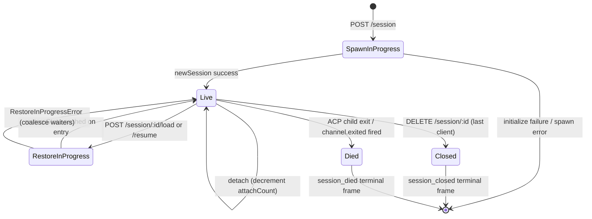

# Session Lifecycle & Identity

## Overview

A daemon **session** is one logical conversation pinned to one ACP `sessionId`. The bridge maintains a `SessionEntry` per session (see [`03-acp-bridge.md`](./03-acp-bridge.md)) which couples the ACP child connection with HTTP-side bookkeeping: prompt FIFO, model-change FIFO, event bus, pending permissions, attached clients, heartbeats, restore state, terminal-frame tombstones.

A daemon **client** is identified by `X-Qwen-Client-Id` — an opaque, daemon-validated string the HTTP caller stamps on its requests. The bridge tracks which clients are attached to which sessions, and uses the originator client id to drive the `designated` permission policy, audit trails, and event attribution.

This doc explains every session lifecycle transition (create / attach / load / resume / close / die / evict) and every identity surface the daemon exposes.

## Responsibilities

- Mint, attach, restore, and reap sessions.
- Validate `X-Qwen-Client-Id` and reject malformed ids.
- Track multiple attached clients per session (`clientIds: Map<string, count>`, `attachCount`).
- Stamp `originatorClientId` on outbound events.
- Run heartbeats so dashboards know which clients are still connected.
- Surface session metadata (`displayName`) that operators set via `PATCH /session/:id/metadata`.
- Drive terminal frame emission (`session_died`, `session_closed`, `client_evicted`, `stream_error`).

## Architecture

| Concern                   | Source                                                       | Notes                                                                                     |
| ------------------------- | ------------------------------------------------------------ | ----------------------------------------------------------------------------------------- |
| `SessionEntry`            | `packages/acp-bridge/src/bridge.ts`                          | Per-session struct; see [`03-acp-bridge.md`](./03-acp-bridge.md) for full field listing.  |
| `BridgeSession` (public)  | `packages/acp-bridge/src/bridgeTypes.ts`                     | `{ sessionId, workspaceCwd, attached, clientId?, createdAt? }` returned to HTTP handlers. |
| `BridgeSessionState`      | `packages/acp-bridge/src/bridgeTypes.ts`                     | `LoadSessionResponse \| ResumeSessionResponse` cached on the entry as `restoreState`.     |
| `DaemonSession` (SDK)     | `packages/sdk-typescript/src/daemon/types.ts`                | `{ sessionId, workspaceCwd, attached, clientId?, createdAt? }`.                           |
| Client-id validation      | `packages/acp-bridge/src/bridge.ts` (around `spawnOrAttach`) | Pattern `[A-Za-z0-9._:-]{1,128}`; `InvalidClientIdError` if malformed.                    |
| Session disconnect-reaper | `packages/cli/src/serve/server.ts`                           | Tracks spawn-owner disconnects with `attachCount` + `spawnOwnerWantedKill`.               |

### State machine



### Attach vs spawn

Under `sessionScope: 'single'` (default), the bridge's `defaultEntry` is shared by every connecting client. A `POST /session` that arrives while `defaultEntry` already exists returns `attached: true` without spawning a new ACP child. The bridge synchronously bumps `attachCount` and registers the caller's `X-Qwen-Client-Id` into `clientIds`.

Under `sessionScope: 'thread'`, each thread can mint a distinct session. The caller still respects `maxSessions`.

### Identity

`X-Qwen-Client-Id` is **optional** but **strongly recommended**. The daemon does not generate one on the caller's behalf — clients pick their own and reuse it across requests so the daemon can attribute votes, audit events, and detect reconnects.

Each independent controller should use a distinct, stable ID. Web Shell preserves the historical `webui_` prefix for compatibility. A host and an embedded Web Shell should share an ID only when they intentionally act as one logical controller; once shared, daemon logs cannot distinguish which one originated a request.

Validation rules:

- Charset: `[A-Za-z0-9._:-]`.
- Length: 1–128.
- Outside this set: `InvalidClientIdError` (`400`).

The daemon stamps `originatorClientId` on outbound SSE events when:

1. The request that triggered the event carried `X-Qwen-Client-Id`, AND
2. The id is currently registered in the session's `clientIds` set, AND
3. The session has an `activePromptOriginatorClientId` set (inline `sessionUpdate` and `permission_request` inherit the originator from the active prompt).

Anonymous callers (no `X-Qwen-Client-Id`) work fine for `first-responder` policy; `designated` rejects their votes with `permission_forbidden{ reason: 'designated_mismatch' }`; `consensus` rejects with the same `forbidden` reason because the voter is not in the issue-time `votersAtIssue` snapshot; `local-only` is the only policy that accepts anonymous loopback voters.

## Workflow

### Create or attach

```mermaid
sequenceDiagram
    autonumber
    participant C as Client
    participant R as POST /session
    participant B as Bridge.spawnOrAttach
    participant CH as ACP child

    C->>R: POST /session<br/>X-Qwen-Client-Id: alice<br/>{cwd, sessionScope?}
    R->>R: validate clientId pattern
    R->>B: spawnOrAttach({cwd, sessionScope, clientId})
    alt single scope + defaultEntry exists
        B->>B: bump attachCount; register clientId
        B-->>R: {sessionId, attached: true, restoreState?}
    else cold
        B->>CH: spawn + ACP initialize + newSession
        CH-->>B: sessionId
        B->>B: build SessionEntry; register in byId
        B-->>R: {sessionId, attached: false}
    end
    R-->>C: 200 { sessionId, attached, ... }
```

### Load / resume

`POST /session/:id/load` — restores a persisted session and returns the current bounded replay snapshot window (`session/load` notifications or response-mode replay are seeded before the response returns).
`POST /session/:id/resume` — restores without replay (`connection.unstable_resumeSession`, exposed under the stable `session_resume` daemon capability; `unstable_session_resume` remains a deprecated alias).

Both:

1. Use a per-session `pendingRestoreIds` set on the channel so concurrent restore calls coalesce (`RestoreInProgressError`).
2. Cache `restoreState` on the entry so a late attacher gets the same payload the original restorer did.

For a persisted Part 4A worktree session, restore is an integrity-gated extension of this lifecycle. The sidecar identifies the requested workspace root explicitly, the checkout must be canonically contained below the corresponding `.qwen/worktrees/` directory, and its marker must be a single-link regular file containing the exact restored session ID. The daemon relocates an idle restored child only after those checks; an active child is accepted only when its reported cwd already equals the worktree. Those responses return canonical worktree metadata with `worktreeState: "persisted-v1"`. A cold restore that reports an active prompt without a current cwd returns unverified worktree metadata without that attestation, so isolation-aware clients reject it and may retry after the prompt settles. Invalid Part 4A state detaches an existing attachment or kills a cold restore with `requireZeroAttaches`; a missing sidecar likewise yields no attestation. Whenever the effective restore source is Channel-owned, the route suppresses the ACP agent's best-effort cleanup for Part 4A or unclassifiable sidecar state, so validation failure preserves the uncertain checkout evidence. Persisted source metadata takes precedence; when it is absent, the load/resume request supplies the effective source. A structurally valid legacy sidecar without `workspaceCwd` instead retains the existing best-effort agent restore: it must identify either the requested workspace root or its Git repository top-level, is containment-checked without marker attestation, may be cleaned up by the agent, and may return `worktree` without `worktreeState`. Apart from that explicit legacy compatibility case, only sessions whose effective restore source is not Channel-owned retain the existing best-effort cleanup before route validation.

### Heartbeat

`POST /session/:id/heartbeat` updates `sessionLastSeenAt` regardless of `clientId`. If the request carries a registered `X-Qwen-Client-Id`, `clientLastSeenAt.set(clientId, Date.now())` also updates. Per-client eviction is **not** implemented in v1; revocation is planned for F-series Wave 5. Today, heartbeats provide observability for dashboards and for the upcoming revocation policy in PR 24.

### Metadata

`PATCH /session/:id/metadata` accepts `{displayName?}`. Validation:

- Max length: `MAX_DISPLAY_NAME_LENGTH = 256`.
- Must not contain control characters (`hasControlCharacter` rejects code points ≤ 0x1f or == 0x7f).
- `InvalidSessionMetadataError` (`400`) on violation.

A successful update fans `session_metadata_updated` to every subscriber.

### Termination

| Terminal frame   | Trigger                                                                                                                                                       |
| ---------------- | ------------------------------------------------------------------------------------------------------------------------------------------------------------- |
| `session_closed` | `DELETE /session/:id` (client_close) or programmatic close.                                                                                                   |
| `session_died`   | `channel.exited` fires for any reason (crash, child kill). Carries `exitCode?` + `signalCode?` when the OS exit path was used.                                |
| `client_evicted` | Per-subscriber queue overflow on the EventBus (see [`10-event-bus.md`](./10-event-bus.md)). NOT a session-level termination — only this subscriber is closed. |
| `stream_error`   | SubscriberLimitExceededError or other route-level stream failure.                                                                                             |

Pending permissions are resolved as `{kind:'cancelled', reason:'session_closed'}` via `mediator.forgetSession(sessionId)` at every termination path.

### Disconnect-reaper guard

When the spawn-owning client's HTTP response cannot be written (TCP reset mid-handshake), the route calls `killSession({ requireZeroAttaches: true })`. If another client has already attached (`attachCount > 0`), the guard short-circuits and the session lives on. Setting `spawnOwnerWantedKill = true` remembers the intent so a later `detachClient()` that brings `attachCount` back to 0 completes the deferred reap. Without this, a fast-disconnecting spawn owner would tear down a healthy session every other reconnect.

## State & Lifecycle

`SessionEntry` fields critical to lifecycle:

| Field                            | Type                  | Meaning                                                                          |
| -------------------------------- | --------------------- | -------------------------------------------------------------------------------- |
| `clientIds`                      | `Map<string, number>` | Registered client ids → registration ref count.                                  |
| `attachCount`                    | `number`              | Times `spawnOrAttach` returned `attached: true` for this entry.                  |
| `activePromptOriginatorClientId` | `string?`             | Originator for the prompt currently running.                                     |
| `restoreState`                   | `BridgeSessionState?` | Cached load/resume response so late attachers see consistent payloads.           |
| `spawnOwnerWantedKill`           | `boolean`             | Deferred-reap tombstone (see disconnect-reaper above).                           |
| `sessionLastSeenAt`              | `number?`             | Most recent heartbeat across any client (epoch ms).                              |
| `clientLastSeenAt`               | `Map<string, number>` | Per-client heartbeat.                                                            |
| `pendingPermissionIds`           | `Set<string>`         | ACP requestIds currently pending — used on cancel/close to resolve as cancelled. |

## Dependencies

- ACP layer: `connection.newSession`, `connection.unstable_resumeSession`, `connection.loadSession`.
- [`03-acp-bridge.md`](./03-acp-bridge.md) for the surrounding bridge architecture.
- [`04-permission-mediation.md`](./04-permission-mediation.md) for how originator + identity drive policy decisions.
- [`10-event-bus.md`](./10-event-bus.md) for terminal-frame delivery.

## Additional session endpoints

These endpoints extend the base lifecycle surface:

### Non-blocking Prompt (`non_blocking_prompt` capability tag)

`POST /session/:id/prompt` now returns HTTP **202** with
`{ promptId, lastEventId }` instead of blocking until the prompt completes. The
actual result arrives on SSE as `turn_complete` / `turn_error`, and the
`promptId` field correlates those events with the 202 response.
`DaemonSessionClient.prompt()` automatically uses the non-blocking path when it
has an active event subscription and transparently matches the result from the
SSE stream.

### Session Recap (`session_recap` capability tag)

`POST /session/:id/recap` asks the fast model for a one-line "where did I leave
off" summary. It returns `{ sessionId, recap: string | null }`; `null` means the
history was too short or the model failed temporarily. This endpoint is
best-effort.

### Session BTW / Side Question (`session_btw` capability tag)

`POST /session/:id/btw` asks a one-off question against the session context
without interrupting the main conversation flow. It uses `runForkedAgent` on the
cache path for a single-turn, no-tool LLM call and returns
`{ sessionId, answer: string | null }`. The implementation enforces
`BTW_MAX_INPUT_LENGTH`, cross-session leakage guards, and timeout handling.

### Shell Command Execution

`POST /session/:id/shell` executes a shell command directly on the daemon host,
without routing through the LLM. It streams output on the session SSE bus via
`user_shell_command` / `user_shell_result` events and injects the command plus
result into the LLM conversation history. The response is
`{ exitCode, output, aborted }`. For a live secondary-workspace session, the
singular REST route resolves the session owner and executes on that runtime's
bridge, so the command starts in the owning workspace cwd. The route does not
provide a path sandbox. Workspace-qualified ACP clients may continue to use
`_qwen/session/shell` on the owning workspace connection.

### Session Rewind

`GET /session/:id/rewind/snapshots` and `POST /session/:id/rewind` resolve the
owning live workspace runtime. Persisted sessions must be loaded or resumed
before rewind. Rewind truncates conversation history and optionally restores
files tracked by `edit` and `write_file`; it does not undo shell commands, Git,
scripts, or manual changes. File restoration is best-effort, so a response may
report `rewound: false` and `filesFailed[]` after the conversation history has
already moved. SDK rewind calls always use owner-aware REST, including when the
client otherwise uses ACP transport, because the mutation must retain strict
REST authentication.

### Session Detach

`POST /session/:id/detach` explicitly detaches a client from a session by
decrementing `attachCount`; it does not close the session by itself. If no other
attach or subscriber remains, the session is reaped. The endpoint returns 204.

### Batch Session Delete

`POST /sessions/delete` accepts `{ sessionIds: string[] }` (up to 100 ids),
closes bridge sessions, and deletes active or archived transcript files. If both
active and archived JSONL files exist for the same id, hard delete removes both
so operators can clear the conflict. It cleans active and archived worktree
sidecars, but leaves file-history snapshots, subagent transcripts, and runtime
sidecars intact. It uses `Promise.allSettled` for resilience and returns
`{ removed, notFound, errors }`.

### Session Archive

`POST /sessions/archive` moves inactive session JSONL files from `chats/` into
`chats/archive/`. If the target session is live, the daemon first enters a
per-session archive gate and performs a strict close that requires the ACP child
to flush `ChatRecordingService`; archive leaves the JSONL in place if close or
flush fails.

`POST /sessions/unarchive` moves archived JSONL files back to `chats/`. This is
only a storage-state transition; clients must call `session/load` or
`session/resume` afterward. Archived sessions return `409 session_archived` for
load/resume, and mutations racing an archive transition return
`409 session_archiving`.

Empty, damaged, and orphaned regular transcript files remain eligible for these
lifecycle operations even when they cannot be loaded as conversations.
Ownership-safety checks can intentionally fail closed and require operator
intervention. A file changed after a writer sealed its certified handoff proof
fails with `SessionTranscriptChangedError` until the operator resolves the
sealed lock and changed bytes. A JSON-shaped first physical record that exceeds
the bounded ownership-read window fails with
`SessionTranscriptIdentityUnavailableError` until the record is repaired or
reduced; oversized damaged records with a non-object prefix remain eligible. A
parseable recovered record must contain string `sessionId` and `cwd` ownership
fields, and mixed local/foreign archive states also fail closed. When
`session_storage_conflict_repair` is advertised, archive and unarchive accept
`resolveConflicts: true`: archive keeps the archived copy, while unarchive keeps
the active copy. Without that option, active/archive conflicts do not move,
remove, or overwrite either persisted copy and are returned in the batch
`errors` array. Archive still strictly closes a live session before classifying
the conflict, which may flush queued records to the active transcript.
Workspace-qualified lifecycle routes now use that HTTP `200` batch envelope
instead of their earlier HTTP `409 session_conflict` response.

### Context Usage (`session_context_usage` capability tag)

`GET /session/:id/context-usage` returns structured context-window usage.
`?detail=true` includes finer-grained usage grouped by tool, memory, and skill.

### Session Stats (`session_stats` capability tag)

`GET /session/:id/stats` returns usage statistics: model metrics
(input/output tokens, cache reads/writes, total cost), per-tool call counts and
latencies, file edit counts, and per-skill invocation counts for the live
session. The `skills` block reflects skill body loads and skill slash commands
within this session only; it is not a cross-session activity aggregate.

### Session Tasks (`session_tasks` capability tag)

`GET /session/:id/tasks` returns a background-task snapshot for agent tasks,
shell tasks, monitor tasks, and their lifecycle states. Agent entries spawned
by another sub-agent carry optional lineage fields (`parentAgentId`,
`parentName`, `depth`) so clients can render nested sub-agents as a tree; see
the payload example in `qwen-serve-protocol.md`.

The `session_monitor_tool_correlation` capability additionally guarantees that
monitor entries carry `toolUseId`, allowing clients to correlate a transcript
tool call with its task details.

### Session LSP Status (`session_lsp` capability tag)

`GET /session/:id/lsp` returns sanitized per-session LSP status for daemon
clients: enablement, aggregate server counts, unavailable/initialization state,
and per-server `name`, `status`, `languages`, `transport`, `command`, and
`error`. Disabled or unavailable LSP is represented as HTTP 200 status data,
not as a transport error.

### Compacted Replay

`POST /session/:id/load` now returns a `BridgeRestoredSession` that can include
`compactedReplay?: BridgeEvent[]`, `liveJournal?: BridgeEvent[]`, and
`lastEventId?: number`. These fields are the daemon's bounded in-memory replay
window for a live session, not a full transcript API. The default window cap is
4 MiB per live session (`--compacted-replay-max-bytes`), and boot rejects
invalid caps; the hard ceiling is 256 MiB. `compactedReplay` is produced by
`TurnBoundaryCompactionEngine`: at turn boundaries it folds consecutive text /
thought blocks, collapses tool-call sequences to their final state, discards
transient signals, and produces O(turns) replay logs instead of O(tokens) logs
(typically a 25-30x reduction). When older replay entries have been dropped
from that byte window, `compactedReplay[0]` is a synthetic id-less
`history_truncated` marker with `{reason: 'replay_window_exceeded',
truncatedEvents, retainedEvents, maxBytes, truncatedTurns?,
fullTranscriptAvailable: boolean}`. `fullTranscriptAvailable` is a capability
flag: `true` means the client can page the full persisted transcript with
`GET /session/:id/transcript`, while `false` means only the bounded replay is
available. Clients should render it as status and apply the retained replay
normally; it must not trigger a resync loop.

### ACP Child Preheat

`bridge.preheat()` remains available to explicit embedders, but `qwen serve`
also attempts to preheat the trusted primary child after startup for
compatibility. A failed preheat is non-fatal and the next runtime command or
Session retries; trusted secondaries start on first use. The Workspace Runtime
owns the child while work is active. After all Session and management leases
drain, an omitted or zero `channelIdleTimeoutMs` reaps the child immediately;
plain preheat itself is preserved for first use and does not arm that reaper.
A positive configured delay or active keepalive keeps the child reusable for
the longer remaining window. The public Workspace Runtime `ensure`
command adds a renewable ten-minute workspace lease; each successful call
resets that window, including when the channel was already live.

## Configuration

- `BridgeOptions.maxSessions` (default 32) — cap.
- `BridgeOptions.sessionScope` (default `'single'`; optional `'thread'`).
- `BridgeOptions.initializeTimeoutMs` (default 10s) — ACP child startup
  deadline (Channel factory + `initialize` handshake) and default request
  timeout.
- `BridgeOptions.sessionRestoreTimeoutMs` (default 60s) — ACP `loadSession` / `unstable_resumeSession` deadline. Defaults to 60s; an explicitly configured initialize timeout can raise it, but never lower it.
- `BridgeOptions.channelIdleTimeoutMs` (unset or `0` reaps after runtime work drains, except that plain preheat is preserved for first use; a positive value or active keepalive delays reaping, and the longer delay wins).
- Capability tags: `session_create`, `session_id_override`, `session_scope_override`, `session_load`, `session_resume`, `unstable_session_resume` (deprecated alias), `session_list`, `session_info`, `session_close`, `session_metadata`, `session_set_model`, `client_identity`, `client_heartbeat`, `session_recap`, `session_generation`, `session_btw`, `session_context_usage`, `session_tasks`, `session_monitor_tool_correlation`, `session_stats`, `session_lsp`, `session_resources`, `session_status`, `non_blocking_prompt`.

### Stateless generation (`session_generation` capability tag)

`POST /session/:id/generate` accepts `{ "prompt": string }` and returns a
request-scoped SSE stream with `started`, optional `thinking`, `delta`, `done`,
or `error` events. The request reads no conversation history, records no turn,
and exposes no tools. The ACP child uses a valid configured fast model when
available and otherwise uses the session's main model.

## Caveats & Known Limits

- `connection.unstable_resumeSession` may still be unstable at the ACP layer, but the daemon advertises the committed v1 route contract with `session_resume`. `unstable_session_resume` is kept only as a deprecated compatibility alias.
- v1 has **no per-client eviction**; only per-session and per-subscriber termination. Revocation policy is F-series Wave 5 / PR 24.
- `client_evicted` is per-subscriber, not per-session. A client whose SSE subscriber was evicted can reconnect.
- Anonymous clients (no `X-Qwen-Client-Id`) cannot vote under `designated` or `consensus` policies.

## References

- `packages/acp-bridge/src/bridge.ts` (SessionEntry definition)
- `packages/acp-bridge/src/bridgeTypes.ts` (`HttpAcpBridge`, `BridgeSession`, `BridgeSessionState`)
- `packages/sdk-typescript/src/daemon/types.ts` (`DaemonSession`)
- `packages/sdk-typescript/src/daemon/DaemonSessionClient.ts`
- Wire reference: [`../qwen-serve-protocol.md`](../qwen-serve-protocol.md) (route catalogue).
